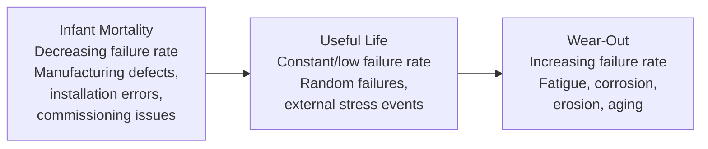
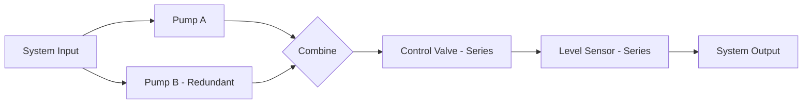

## Reliability, Availability, and Maintainability

### Overview

Reliability, Availability, and Maintainability (RAM) is a formal engineering discipline used to quantify, predict, and improve how consistently a power plant and its components perform their intended function. Reliability addresses the probability of failure-free operation over a given period; availability addresses the fraction of time a system is capable of performing its function, accounting for both failures and the time needed to restore service; maintainability addresses how quickly and easily a failed system can be repaired. Together these form the quantitative basis for equipment specification, spare parts strategy, maintenance planning, and plant-level financial risk assessment covered in adjacent operational and economic topics.

### Reliability Fundamentals

**Definition**

Reliability is the probability that a system or component performs its required function without failure for a specified period under stated operating conditions.

$$R(t) = P(T > t)$$

where $T$ is the random variable representing time to failure, and $R(t)$ is the probability that failure occurs after time $t$.

**Failure Rate and the Bathtub Curve**

The failure rate $\lambda(t)$ describes the instantaneous rate of failure at time $t$, given survival to that point. Across many engineered populations, failure rate follows a characteristic three-phase pattern known as the bathtub curve:

- **Infant mortality phase:** elevated failure rate from manufacturing defects, installation errors, or inadequate commissioning — this is a direct link to the commissioning-quality discussion covered in the operations/maintenance topic, since thorough commissioning specifically targets reducing infant mortality failures before commercial operation
- **Useful life phase:** approximately constant failure rate, dominated by random external stress events rather than systematic aging — during this phase, failures are well-modeled by the exponential distribution
- **Wear-out phase:** increasing failure rate as cumulative fatigue, corrosion, erosion, and material degradation accumulate — this is the phase targeted by preventive/predictive maintenance and component replacement/overhaul planning

**Exponential Distribution (Constant Failure Rate)**

For the useful-life phase, where failure rate $\lambda$ is approximately constant:

$$R(t) = e^{-\lambda t}$$

$$MTBF = \frac{1}{\lambda}$$

Mean Time Between Failures (MTBF) is the expected time between successive failures for a repairable system experiencing constant failure rate — a widely used and easily communicated reliability figure, though its applicability is limited to the constant-failure-rate (useful life) regime; using it to characterize infant-mortality or wear-out behavior can be misleading since $\lambda$ is not actually constant in those phases.

**Weibull Distribution (Time-Varying Failure Rate)**

A more general and widely used reliability model, capable of representing all three bathtub curve phases depending on its shape parameter:

$$R(t) = e^{-(t/\eta)^\beta}$$

where $\eta$ is the scale parameter (characteristic life) and $\beta$ is the shape parameter:

- $\beta < 1$: decreasing failure rate (infant mortality behavior)
- $\beta = 1$: constant failure rate (reduces to the exponential distribution)
- $\beta > 1$: increasing failure rate (wear-out behavior)

Weibull analysis of failure data (fitting $\beta$ and $\eta$ to observed failure times) is standard practice in reliability engineering for characterizing which bathtub phase a component population is in and for predicting future failure rates.

**System Reliability: Series and Parallel Configurations**

- **Series configuration** (all components must function for the system to function): $R_{system} = R_1 \times R_2 \times \cdots \times R_n$ — system reliability is always less than or equal to the least reliable component, and adding components in series always reduces overall reliability
- **Parallel/redundant configuration** (system functions if at least one component functions): $R_{system} = 1 - (1-R_1)(1-R_2)\cdots(1-R_n)$ — redundancy improves system reliability above any individual component's reliability, which is the fundamental rationale for redundant design in safety-critical and high-consequence-of-failure systems (e.g., redundant sensors in Safety Instrumented Systems, redundant cooling trains in nuclear plants)

**Worked Example — Series/Parallel Reliability**

**Problem:** A feedwater system has two identical pumps, each with 92% reliability over the mission period. Compare system reliability if the pumps are configured (a) in series (both required) versus (b) in parallel (either sufficient, 1-out-of-2 redundancy).

**Solution:**

**(a) Series:** $R_{series} = 0.92 \times 0.92 = 0.8464 = 84.6\%$

**(b) Parallel:** $R_{parallel} = 1 - (1-0.92)(1-0.92) = 1 - (0.08)(0.08) = 1 - 0.0064 = 0.9936 = 99.4\%$

**Interpretation:** moving from a series (both-required) to a parallel (either-sufficient) configuration raises system reliability from 84.6% to 99.4% using the identical components — a direct numerical illustration of why redundant equipment architecture is standard practice for critical power plant systems, even though it roughly doubles capital cost for that system.

### Availability

**Definition and Core Formula**

Availability is the probability that a system is operational (capable of performing its function) at a given point in time, accounting for both failure frequency (reliability) and repair speed (maintainability):

$$A = \frac{MTBF}{MTBF + MTTR}$$

where MTTR (Mean Time To Repair) is the average time required to restore the system to operation after a failure.

**Types of Availability**

- **Inherent availability:** considers only corrective maintenance (repair) time, excluding logistics delays, administrative time, and preventive maintenance — represents the theoretical best-case availability determined by equipment design alone
- **Achieved availability:** includes both corrective and preventive maintenance downtime, excluding external logistics/administrative delay
- **Operational availability:** the most comprehensive and realistic measure, including corrective maintenance, preventive maintenance, and all logistics/administrative delays (waiting for spare parts, permit approval, personnel availability) — this is generally the most relevant figure for actual plant financial performance since it reflects real-world downtime causes, not just idealized repair time

$$A_{operational} = \frac{MTBM}{MTBM + MDT}$$

where MTBM is Mean Time Between Maintenance (corrective and preventive combined) and MDT is Mean Downtime (including all logistics delay, not just active repair time).

**Power Plant-Specific Availability Metrics**

As introduced in the operations/maintenance topic:

$$EAF = \frac{\text{Period hours} - \text{full outage hours} - \text{equivalent derated hours}}{\text{Period hours}} \times 100\%$$

Equivalent Availability Factor (EAF) refines simple availability by converting partial-capacity derates into "equivalent" full-outage-hour terms, since a plant running at 50% capacity for 10 hours represents a different reliability impact than a full outage for 5 hours despite potentially similar lost-generation magnitude — EAF captures this nuance where a simple time-based availability factor would not.

$$FOR = \frac{\text{Forced outage hours}}{\text{Forced outage hours} + \text{Service hours}} \times 100\%$$

Forced Outage Rate specifically isolates unplanned reliability performance from planned maintenance downtime, making it a cleaner indicator of underlying equipment reliability (as opposed to overall availability, which conflates reliability with maintenance scheduling choices).

### Maintainability

**Definition**

Maintainability is the probability that a failed system can be restored to operational condition within a specified time period, using specified procedures and resources — essentially, how quickly and easily a system can be repaired.

**Design for Maintainability**

Maintainability is substantially determined at the design stage, not just through maintenance practice:

- **Accessibility:** equipment layout (as covered in site selection/plant layout topics) that provides adequate clearance for tool access, component removal paths, and crane reach directly affects repair time
- **Modularity and standardization:** modular component design (e.g., plug-in instrument modules, standardized valve actuators) reduces repair complexity and time versus fully integrated, custom designs
- **Built-in diagnostics:** self-diagnostic capability (increasingly common via smart instrumentation and HART/fieldbus diagnostics, as covered in the control and instrumentation topic) reduces fault-isolation time, often the largest component of total repair time for complex systems
- **Spare parts commonality:** using common component types/models across the plant (or fleet, for multi-unit operators) reduces the spare parts inventory needed to achieve a given availability target and shortens logistics delay

**Mean Time To Repair (MTTR) Components**

$$MTTR = t_{detection} + t_{diagnosis} + t_{logistics} + t_{repair} + t_{verification/restart}$$

- **Detection time:** time from failure occurrence to failure recognition — minimized by effective alarm/monitoring systems
- **Diagnosis time:** time to identify root cause and required repair action — minimized by built-in diagnostics, clear procedures, and technician training/experience
- **Logistics delay:** time to obtain necessary spare parts, tools, or specialized personnel — often the largest MTTR component for major equipment, and the primary rationale for critical spare parts inventory strategy
- **Active repair time:** hands-on time to physically execute the repair — minimized by accessibility and modularity
- **Verification/restart time:** post-repair testing and controlled restart before returning to normal service, particularly extended for safety-critical systems requiring formal re-commissioning-style verification

### Reliability Block Diagrams and Failure Analysis

**Reliability Block Diagram (RBD)**

A visual modeling technique representing how component reliability combines to determine system reliability, using series/parallel/combination logic blocks:

In this example, the redundant pump pair (parallel logic) feeds into a series chain of non-redundant components (valve, sensor) — meaning overall system reliability is limited by the weakest series-configured (non-redundant) link, regardless of how reliable the redundant pump section is made.

**Failure Mode and Effects Analysis (FMEA)**

A structured, bottom-up analytical method that systematically identifies potential failure modes for each component, their causes, and their effects on system function, typically scored using a Risk Priority Number:

$$RPN = Severity \times Occurrence \times Detection$$

where each factor is typically rated on a scale (commonly 1–10), with higher RPN indicating failure modes warranting priority attention for design improvement or maintenance strategy focus. FMEA forms a key analytical input to the Reliability-Centered Maintenance process introduced in the operations/maintenance topic.

**Fault Tree Analysis (FTA)**

A top-down deductive method starting from an undesired top event (e.g., "boiler explosion" or "total loss of feedwater") and working backward through Boolean logic (AND/OR gates) to identify the combinations of component failures that could cause it — commonly used in nuclear and high-hazard process safety analysis to quantify the probability of catastrophic events and to identify which failure combinations most need protective design or redundancy.

### Worked Example: Availability Calculation

**Problem:** Over a one-year period (8760 hours), a gas turbine unit experiences: 400 hours of planned maintenance outage, 120 hours of forced outage (3 separate failure events), and operates the remainder. Calculate MTBF, MTTR (for forced outages), Forced Outage Rate, and overall availability.

**Solution:**

**Service hours:** $8760 - 400 - 120 = 8{,}240\ \text{hours}$

**MTTR (forced outage average repair time):**

$$MTTR = \frac{120\ \text{hours}}{3\ \text{events}} = 40\ \text{hours/event}$$

**MTBF (between forced failures, using service time as the operating basis):**

$$MTBF = \frac{8{,}240\ \text{hours}}{3\ \text{events}} = 2{,}747\ \text{hours}$$

**Forced Outage Rate:**

$$FOR = \frac{120}{120 + 8{,}240} \times 100\% = \frac{120}{8{,}360} \times 100\% = 1.44\%$$

**Overall availability (including both planned and forced outage time):**

$$A = \frac{8{,}760 - 400 - 120}{8{,}760} \times 100\% = \frac{8{,}240}{8{,}760} \times 100\% = 94.1\%$$

**Reliability-only availability (excluding planned maintenance, i.e., availability during periods the unit was intended to be available):**

$$A_{reliability} = \frac{MTBF}{MTBF + MTTR} = \frac{2{,}747}{2{,}747 + 40} \times 100\% = \frac{2{,}747}{2{,}787} \times 100\% = 98.6\%$$

**Interpretation:** the low FOR (1.44%) and high reliability-based availability (98.6%) indicate strong underlying equipment reliability; the gap down to 94.1% overall availability is driven primarily by planned maintenance duration (400 hours) rather than unplanned failures — a distinction with direct relevance to maintenance strategy discussion, since it points toward opportunities to optimize planned outage duration/scope rather than pursuing further reliability improvement as the priority lever.

### RAM in Power Plant Economic Context

- **Capacity market/adequacy implications:** as covered in the LCOE/economic analysis topic, a plant's capacity value depends on its availability during high-demand periods specifically, not just average annual availability — RAM analysis increasingly focuses on conditional/seasonal availability rather than a single annual figure
- **Warranty and performance guarantee structuring:** EPC contracts and equipment supply agreements frequently include availability guarantees with financial penalties/bonuses tied to measured RAM performance during the warranty period, directly linking RAM engineering to commercial contract structure
- **Spare parts inventory optimization:** RAM analysis (particularly MTTR/logistics delay data) directly informs the economic trade-off between spare parts carrying cost and expected availability improvement, an application of the same annualized-cost comparison logic used in maintenance strategy economic analysis

### Key Challenges

- **Data quality and sample size for statistical validity:** meaningful Weibull or MTBF analysis requires a sufficient number of observed failure events; for high-reliability, low-failure-count equipment (e.g., a single plant's turbine generator), fleet-wide or industry-database failure data is often needed to supplement limited site-specific experience
- **Changing failure patterns under cycling duty:** as introduced in the maintenance strategy discussion, increased cycling operation shifts failure modes and accelerates wear-out-phase onset relative to the historical steady-baseload failure data many reliability models were originally built upon, requiring reliability models to be periodically re-validated against current operating patterns rather than assumed static
- **Common-cause failure risk in redundant systems:** the parallel-configuration reliability improvement shown in the worked example assumes independent failure probability between redundant components; shared causes (same manufacturing batch defect, common environmental exposure, common maintenance error) can violate this independence assumption and are a specific focus of rigorous FTA/FMEA analysis for safety-critical redundant systems
- **Balancing RAM investment against cost:** as with maintenance strategy generally, further reliability or maintainability improvement carries a cost, and RAM engineering ultimately requires an economic optimization (not simply maximization) of these metrics against their achievement cost

**Key Points**

- Reliability, availability, and maintainability are distinct but interdependent metrics: reliability addresses failure probability, maintainability addresses repair speed, and availability combines both into overall system readiness.
- The bathtub curve (infant mortality, useful life, wear-out) explains why failure rate is rarely constant over equipment life, motivating Weibull analysis over simple exponential/MTBF models for full lifecycle characterization.
- Redundant (parallel) system configuration meaningfully improves reliability above any individual component's reliability, while series configuration always reduces it below the weakest link — a foundational principle for critical system design.
- FMEA (bottom-up) and Fault Tree Analysis (top-down) are complementary structured methods for identifying and prioritizing failure risks, feeding directly into Reliability-Centered Maintenance strategy.

**Related Topics**

- Commissioning, Operation, and Maintenance
- Reliability-Centered Maintenance Methodology
- Power Plant Control and Instrumentation
- Economic Analysis and the Levelized Cost of Electricity
- Safety Instrumented Systems and Functional Safety (IEC 61508/61511)
- Spare Parts Logistics and Inventory Optimization
- EPC Contract Performance Guarantees and Warranty Structures
- Capacity Markets and Resource Adequacy