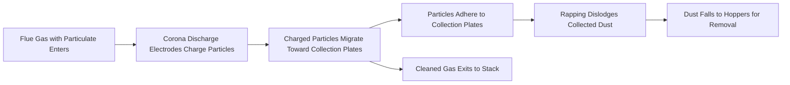
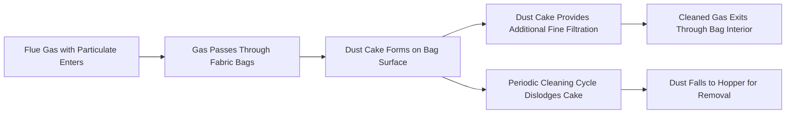

## Particulate Control: Electrostatic Precipitators and Baghouses

### Overview

Particulate matter (PM) control is a mandatory emissions control function for any combustion-based power plant burning solid or liquid fuel, removing fly ash, soot, and other suspended solid/liquid particles from flue gas before stack discharge. Electrostatic precipitators (ESPs) and fabric filter baghouses are the two dominant technologies used at utility scale, both capable of achieving very high collection efficiencies (commonly >99%) but operating on fundamentally different physical principles with distinct performance characteristics, sensitivities, and cost trade-offs.

### Particulate Matter Characteristics

**Size Classification**

- **PM10:** particles with aerodynamic diameter ≤10 micrometers
- **PM2.5:** particles with aerodynamic diameter ≤2.5 micrometers ("fine" particulate), of particular regulatory and health concern due to deeper lung penetration
- Coal combustion fly ash spans a wide size distribution, with collection efficiency for both ESPs and baghouses generally being more challenging for the finest particle fractions

**Particle Properties Relevant to Collection**

- **Resistivity (for ESP):** the electrical resistance of the particle material, critically affecting ESP performance (discussed in detail below)
- **Particle size distribution:** affects both collection mechanism efficiency and pressure drop across the control device
- **Cohesivity/adhesion:** affects how particles behave once collected — whether they form a stable layer for removal (rapping/shaking) or tend to re-entrain into the gas stream

### Electrostatic Precipitators (ESP)

**Operating Principle**

ESPs remove particles by charging them electrically and then attracting them to oppositely charged collection surfaces using an electric field, operating in four sequential steps:

**Corona Discharge and Particle Charging**

High-voltage electrodes (discharge electrodes, typically wires or rigid frames operating at 30–75 kV DC) generate a corona discharge — a localized ionization of gas molecules near the electrode surface. This creates free electrons and ions that attach to passing particles, imparting a net electrical charge (predominantly negative charge in most utility ESP designs).

**Electric Field and Particle Migration**

The charged particles experience an electrostatic force toward the grounded (or oppositely charged) collection plates, described by particle migration velocity:

$$w = \frac{q E}{3 \pi \mu d}$$

where $q$ is particle charge, $E$ is electric field strength, $\mu$ is gas viscosity, and $d$ is particle diameter. This relationship (derived from balancing electrostatic force against Stokes drag) shows why finer particles, which acquire proportionally less charge relative to their drag, are inherently more difficult to collect than coarser particles — a key reason ESP efficiency typically declines for the PM2.5 and finer size fractions.

**Deutsch-Anderson Equation**

The classical design equation relating ESP collection efficiency to key design parameters:

$$\eta = 1 - e^{-wA/Q}$$

where $w$ is particle migration velocity, $A$ is total collection plate area, and $Q$ is gas volumetric flow rate. This equation shows that collection efficiency improves with increased plate area (more collection surface) and decreased gas flow rate (more residence time), and that achieving very high efficiency (>99%) requires the exponent $wA/Q$ to be large — explaining why utility ESPs are physically large structures with extensive plate area (specific collection area, SCA, is a standard ESP sizing parameter expressed in ft²/1000 acfm or m²/(m³/s)).

**[Unverified]** The Deutsch-Anderson equation is a simplified idealized model; actual ESP performance deviates from it due to factors including non-uniform gas flow distribution, particle re-entrainment during rapping, and sneakage (gas bypassing the active treatment zone), so real-world design incorporates empirical correction factors beyond the basic equation.

**Particle Resistivity — The Critical ESP Performance Factor**

Resistivity, measured in ohm-cm, critically determines ESP performance and represents the single most important particle property for ESP design and troubleshooting:

- **Low resistivity (<10⁴ ohm-cm):** particles lose their charge too readily upon contact with the collection plate, allowing re-entrainment back into the gas stream before removal — reduces effective collection efficiency
- **Optimal resistivity range (approximately 10⁴–10¹⁰ ohm-cm):** particles retain sufficient charge to adhere to the collection plate while still losing charge slowly enough to avoid problematic effects — this range generally provides the best ESP performance
- **High resistivity (>10¹⁰ ohm-cm):** particles do not readily discharge upon reaching the collection plate, allowing charge to accumulate and creating a phenomenon called "back corona" (or "back ionization"), where the accumulated charge on the particle layer creates local electrical breakdown that generates ions of the wrong polarity, effectively short-circuiting the collection field and severely degrading efficiency

**Factors Affecting Resistivity**

- **Fuel sulfur content:** higher sulfur content generally lowers fly ash resistivity (SO₃ in flue gas provides a conductive surface film mechanism), which is why switching to lower-sulfur coal for SO2 emissions compliance can sometimes create an unintended ESP performance challenge from increased resistivity
- **Flue gas temperature:** resistivity varies non-monotonically with temperature, generally showing a peak (worst-case) resistivity in an intermediate temperature range, with lower resistivity at both higher temperatures (increased surface/volume conductivity mechanisms) and, for many ash types, at lower temperatures
- **Flue gas moisture content:** higher moisture content generally reduces resistivity by promoting a conductive surface moisture film on particles

**Conditioning Agents**

Where high resistivity is a problem (e.g., following a switch to low-sulfur coal), flue gas conditioning — typically injecting a small amount of SO3 (or occasionally ammonia or other agents) upstream of the ESP — can be used to lower effective ash resistivity and restore collection performance without requiring a full ESP redesign.

**ESP Configuration Types**

- **Cold-side ESP:** positioned downstream of the air preheater, operating at lower flue gas temperature (typically 300–400°F / 150–200°C) — the most common configuration for utility coal plants
- **Hot-side ESP:** positioned upstream of the air preheater at higher temperature (typically 600–750°F / 315–400°C), historically used to exploit generally lower resistivity at higher temperature for certain coal types, though less common in modern installations due to increased structural/thermal design complexity and mixed performance results across different ash chemistries
- **Wet ESP:** uses a water film (continuous or intermittent) on collection surfaces instead of mechanical rapping, avoiding re-entrainment issues and effective for fine particulate, condensable PM, and acid mist — increasingly used as a polishing device downstream of wet flue gas desulfurization (FGD) systems

**Rapping and Ash Removal**

Collected dust layers are periodically dislodged from collection plates via mechanical rapping (impact hammers or vibrators), allowing the dust to fall into hoppers below for removal. Rapping intensity and frequency require careful optimization — insufficient rapping allows excessive dust layer buildup (reducing effective collection area and increasing back corona risk for high-resistivity ash), while excessive rapping increases particle re-entrainment into the gas stream as dislodged dust briefly becomes airborne before settling into hoppers.

### Fabric Filter Baghouses

**Operating Principle**

Baghouses remove particulate by physically filtering flue gas through fabric (bag) filter media, relying primarily on mechanical filtration mechanisms rather than electrical attraction:

**Filtration Mechanisms**

Multiple physical mechanisms contribute to particle capture on and within the fabric and dust cake:

- **Sieving/interception:** particles larger than the pore openings are physically blocked, becoming increasingly effective as the dust cake builds and reduces effective pore size
- **Inertial impaction:** larger particles with sufficient momentum fail to follow the gas streamlines around fabric fibers and impact the fiber surface
- **Diffusion:** very fine particles undergo Brownian motion causing them to contact fiber surfaces even when following gas streamlines — this mechanism is particularly important for the finest particle fractions
- **Dust cake filtration:** as particulate accumulates on the bag surface, the developing dust cake itself becomes the primary filtration medium (often more effective than the underlying fabric alone), which is why baghouse efficiency can actually improve somewhat as a filtration cycle progresses, up to the point of excessive pressure drop requiring cleaning

**Baghouse Cleaning Methods**

| Method | Mechanism | Typical Application |
| --- | --- | --- |
| Pulse-jet | Short compressed air pulse blown backward through bag, causing rapid flexing that dislodges cake | Most common for coal-fired utility applications; allows online cleaning without isolating compartment |
| Reverse-air | Sustained reverse gas flow collapses bag gently, dislodging cake | Requires compartment isolation during cleaning; gentler on bags, historically common on older installations |
| Shaker | Mechanical shaking mechanism physically vibrates bags to dislodge cake | Older technology, largely superseded by pulse-jet in modern utility applications |

**Bag Fabric Materials**

Fabric selection depends primarily on flue gas temperature and chemical composition (acid gas content):

- **Fiberglass:** common for high-temperature applications (up to ~500°F/260°C), often with specialized coatings for chemical resistance
- **PTFE (Teflon) and PTFE-coated fabrics:** excellent chemical resistance and temperature tolerance, higher cost
- **Polyimide (e.g., P84):** good high-temperature performance, used in demanding applications
- **Aramid (e.g., Nomex):** moderate temperature tolerance with good mechanical durability

**[Unverified]** Specific fabric temperature and chemical resistance ratings vary by manufacturer and product formulation; bag material selection for a given application should be confirmed against current manufacturer specifications and the specific flue gas chemistry (acid dew point, particulate abrasiveness) involved.

**Air-to-Cloth Ratio**

A key baghouse design/sizing parameter, analogous to specific collection area for ESPs:

$$A/C = \frac{Q}{A_{fabric}}$$

expressed in units such as ft/min (actual cubic feet per minute of gas flow per square foot of fabric area) or equivalently cm/s. Lower air-to-cloth ratio (more fabric area relative to gas flow) generally provides better collection efficiency and lower pressure drop but requires a physically larger baghouse structure and more bags, representing a direct capital cost versus performance trade-off in baghouse sizing, similar in character to the specific-collection-area trade-off for ESPs.

### Comparison: ESP vs. Baghouse

| Factor | Electrostatic Precipitator | Fabric Filter Baghouse |
| --- | --- | --- |
| Collection mechanism | Electrical charging and field migration | Mechanical filtration through fabric/dust cake |
| Typical efficiency | 99–99.9%+ (sensitive to resistivity) | 99.5–99.9%+ (less sensitive to particle chemistry) |
| Sensitivity to fuel/ash chemistry | High (resistivity-dependent) | Lower (mechanical filtration less chemistry-sensitive) |
| Fine particle (PM2.5) performance | Can be less effective than baghouse for finest fractions | Generally strong, especially with mature dust cake |
| Pressure drop | Low (typically <1 inch w.c.) | Higher (typically 4–8 inches w.c.), representing greater fan power/parasitic load |
| Capital cost | Generally lower for large-scale installations | Generally higher, though gap has narrowed with modern designs |
| Maintenance | Electrode/plate maintenance, rapper system upkeep | Bag replacement (periodic, a recurring consumable cost), cleaning system maintenance |
| Sensitivity to load/gas flow changes | Relatively robust | Can be sensitive to air-to-cloth ratio changes at off-design flow |
| Fire/explosion risk considerations | Generally lower for most coal ash | Requires attention for fuels/ash prone to smoldering combustion within accumulated dust cake |

**[Inference]** The relative advantages summarized above represent commonly cited general tendencies from industry practice; actual comparative performance for a specific plant depends heavily on site-specific fuel characteristics, required emission limits, and specific equipment design/vintage, making a formal technology selection study (rather than generic comparison) the appropriate basis for an actual plant decision.

### Hybrid and Emerging Configurations

- **COHPAC (Compact Hybrid Particulate Collector):** a pulse-jet baghouse installed downstream of an existing ESP, adding a polishing filtration stage — used to achieve tighter emission limits or improve mercury/fine particulate capture (activated carbon injection for mercury control, covered in related mercury/trace metals control topics, is often paired with this configuration since the baghouse also effectively captures injected sorbent particles) without full ESP replacement
- **Wet ESP as FGD polishing stage:** as noted above, increasingly deployed downstream of wet FGD scrubbers to capture fine particulate, acid mist, and condensable PM that the primary particulate control device and scrubber may not fully address, particularly relevant for meeting increasingly stringent PM2.5 and condensable PM emission standards

### Worked Example: ESP Sizing via Deutsch-Anderson Equation

**Problem:** A coal plant's flue gas flow is 1,200,000 acfm (actual cubic feet per minute). The fly ash has a particle migration velocity of 0.35 ft/s under the ESP's operating field strength. Determine the required collection plate area to achieve 99.5% collection efficiency.

**Solution:**

Convert flow to consistent units (ft³/s): $Q = 1{,}200{,}000\ \text{acfm} \div 60 = 20{,}000\ \text{ft}^3/\text{s}$

Using the Deutsch-Anderson equation, solve for required area:

$$\eta = 1 - e^{-wA/Q}$$

$$0.995 = 1 - e^{-(0.35)(A)/20{,}000}$$

$$e^{-0.0000175A} = 0.005$$

$$-0.0000175A = \ln(0.005) = -5.298$$

$$A = \frac{5.298}{0.0000175} = 302{,}743\ \text{ft}^2$$

**Interpretation:** approximately 303,000 ft² of collection plate area is required — illustrating why utility-scale ESPs are physically massive structures (this is comparable in area to roughly 7 acres of collection plate surface), and demonstrating the strong sensitivity of required area to target efficiency, since the natural logarithm term grows rapidly as efficiency approaches 100% (achieving 99.9% instead of 99.5% would require substantially more area than a linear extrapolation might suggest, since $\ln(0.001)$ versus $\ln(0.005)$ reflects this nonlinear relationship directly).

### Regulatory Context

- Particulate emission limits are typically expressed as mass per unit heat input (e.g., lb/MMBtu) or mass per unit volume of flue gas (e.g., mg/Nm³), with limits set by applicable national/regional air quality regulations (e.g., New Source Performance Standards and Mercury and Air Toxics Standards frameworks in the US, or equivalent regulatory frameworks in other jurisdictions)
- Continuous Opacity Monitors (COMs) and increasingly PM continuous emissions monitoring provide real-time compliance verification, with opacity serving as a widely used proxy/indicator for particulate emission trends between formal stack testing events
- **[Unverified]** Specific numerical emission limits vary significantly by jurisdiction, plant vintage (new source vs. existing source requirements often differ substantially), and fuel type; current applicable limits should be verified against the specific regulatory framework governing the plant in question rather than assumed from general figures

### Key Challenges

- **Resistivity management with fuel switching:** as covered above, switching to lower-sulfur coal (common for SO2 compliance) can inadvertently degrade ESP performance via increased ash resistivity, requiring conditioning agent injection or, in more severe cases, ESP upgrade/rebuild — a recurring real-world example of how emissions control systems interact rather than operating independently
- **Fine particulate (PM2.5) and condensable PM compliance:** as regulatory limits have tightened toward finer particle size fractions and condensable (rather than only filterable) PM, both ESP and baghouse technologies face increased performance demands beyond their traditional design basis, motivating hybrid configurations like COHPAC and wet ESP polishing stages
- **Bag life and replacement economics:** baghouse bags degrade over time from thermal stress, chemical attack, and mechanical fatigue from repeated cleaning cycles; bag replacement represents a significant recurring operating cost that must be factored into baghouse lifecycle economics versus ESP's comparatively lower recurring consumable cost
- **Integration with other emissions control systems:** as particulate control increasingly operates alongside FGD, SCR (NOx control), and mercury/trace metal sorbent injection systems, interactions between these systems (e.g., sorbent particles captured by the particulate control device, ammonia slip from SCR affecting downstream particulate chemistry) require integrated rather than isolated system design

**Key Points**

- ESPs remove particulate via electrical charging and field-driven migration to collection plates, with performance critically dependent on particle resistivity — the single most important design/troubleshooting variable for ESP systems.
- Baghouses remove particulate via mechanical filtration through fabric and an accumulating dust cake, generally less sensitive to particle chemistry than ESPs but with higher pressure drop and recurring bag replacement cost.
- The Deutsch-Anderson equation (ESP) and air-to-cloth ratio (baghouse) are the respective key sizing relationships, both showing that achieving very high collection efficiency requires proportionally larger equipment.
- Hybrid configurations (COHPAC, wet ESP polishing) are increasingly used to meet tightening fine-particulate and condensable PM standards without full replacement of existing primary particulate control equipment.

**Related Topics**

- Flue Gas Desulfurization (FGD) Systems for SO2 Control
- Selective Catalytic Reduction (SCR) for NOx Control
- Mercury and Trace Metal Emissions Control
- Continuous Emissions Monitoring Systems (CEMS)
- Combustion Control and Emissions Optimization
- Air Quality Regulatory Frameworks for Power Generation
- Coal Ash Handling and Disposal
- Power Plant Control and Instrumentation