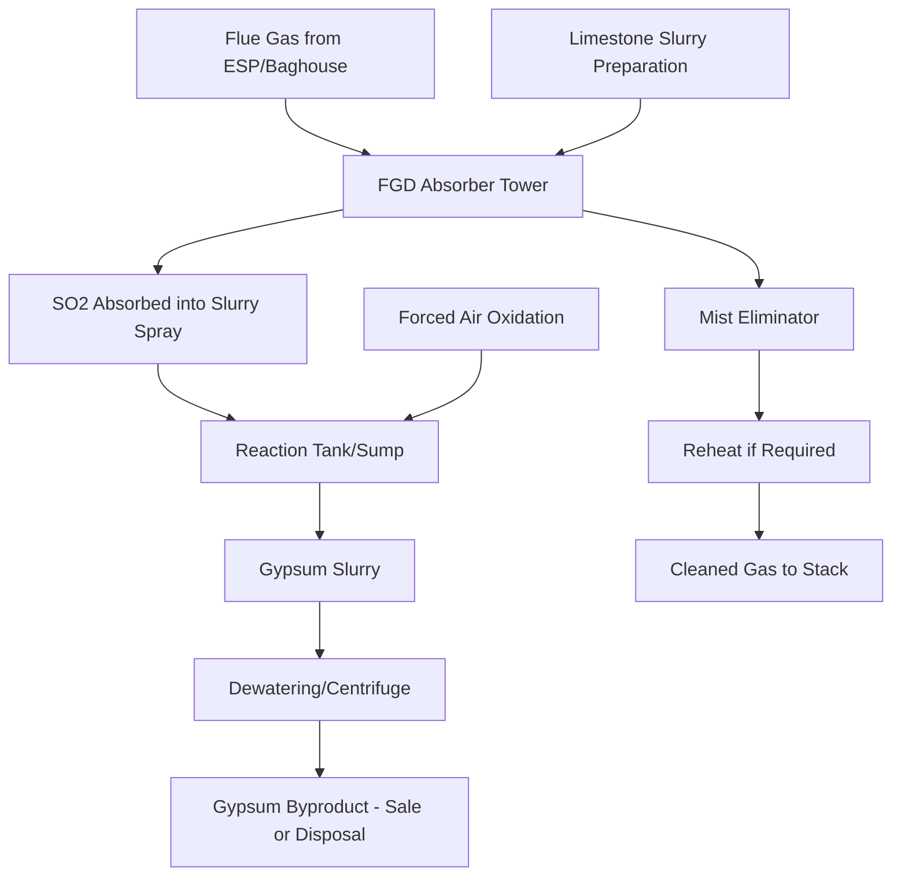
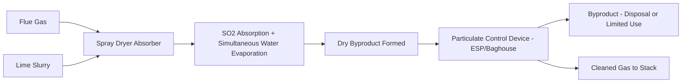

## Flue Gas Desulfurization Systems

### Overview

Flue Gas Desulfurization (FGD) systems remove sulfur dioxide (SO2) from combustion flue gas before it is released to atmosphere, addressing the SO2 formed when sulfur-bearing fuels (primarily coal, and to a lesser extent heavy fuel oil) are combusted. SO2 is a regulated criteria pollutant linked to acid rain formation and respiratory health impacts, and FGD represents one of the major categories of post-combustion emissions control alongside particulate control (ESP/baghouse) and NOx control (SCR/SNCR). FGD technologies span wet, dry, and semi-dry approaches, each with distinct chemistry, byproduct characteristics, and capital/operating cost trade-offs.

### SO2 Formation Chemistry

Sulfur present in fuel oxidizes during combustion:

$$S + O_2 \rightarrow SO_2$$

A small fraction of SO2 further oxidizes to SO3:

$$SO_2 + \frac{1}{2}O_2 \rightarrow SO_3$$

SO3 is of particular concern because it combines with moisture to form sulfuric acid mist ($SO_3 + H_2O \rightarrow H_2SO_4$), contributing to acid dew point corrosion in downstream equipment (air preheaters, ductwork) and to the fine particulate/condensable PM emissions covered in the particulate control topic — meaning SO3 control is often addressed jointly with both SO2 and particulate control strategy rather than treated as an entirely separate problem.

### Wet FGD (Limestone/Lime Scrubbing)

**Overview and Dominance**

Wet FGD, particularly limestone forced-oxidation (LSFO) scrubbing, is the most widely deployed FGD technology at utility scale, generally offering the highest SO2 removal efficiency (commonly 95–99%+) among available technologies.

**Core Chemistry**

$$CaCO_3 + SO_2 + \frac{1}{2}H_2O \rightarrow CaSO_3 \cdot \frac{1}{2}H_2O + CO_2$$

Limestone (calcium carbonate) slurry reacts with SO2 in the flue gas to form calcium sulfite hemihydrate. In forced-oxidation systems, air is actively injected into the reaction tank to oxidize this intermediate product to gypsum:

$$CaSO_3 \cdot \frac{1}{2}H_2O + \frac{1}{2}O_2 + \frac{3}{2}H_2O \rightarrow CaSO_4 \cdot 2H_2O$$

The resulting calcium sulfate dihydrate (gypsum) is chemically identical to natural gypsum and, when produced at sufficient purity, has commercial value as a byproduct — most commonly sold to wallboard/drywall manufacturers, making forced oxidation both an environmental and (in the right market conditions) a revenue-generating design choice over natural (unforced) oxidation, which produces calcium sulfite requiring landfill disposal.

**Process Flow**

**Absorber Design**

- **Spray tower absorbers:** flue gas flows upward (or in cross-flow configuration) through multiple levels of slurry spray, providing gas-liquid contact for SO2 absorption — the dominant absorber design for modern large-scale wet FGD
- **Liquid-to-gas ratio (L/G):** a key design parameter (typically expressed in gal/1000 acf) governing the amount of scrubbing slurry contacted per unit of flue gas; higher L/G generally improves removal efficiency at the cost of increased pumping power and reagent circulation
- **Mist eliminators:** chevron-style baffles positioned downstream of the spray zone remove entrained liquid droplets from the treated gas before stack discharge, preventing excessive liquid carryover and associated downstream corrosion/deposition

**Reagent Preparation and Handling**

- Limestone is ground (typically in a ball mill or similar wet grinding system) to a fine particle size to maximize reactive surface area, then mixed with water to form the scrubbing slurry
- Reagent stoichiometry (moles of calcium supplied per mole of SO2 removed) above the theoretical 1:1 ratio is typically used in practice to achieve high removal efficiency, since not all limestone particles fully react before settling or being removed with the byproduct stream
- Limestone reactivity (affected by mineral source, grinding fineness, and impurity content) directly affects required reagent stoichiometry and system performance, making limestone quality control/sourcing a meaningful operational consideration

**Byproduct Quality and Management**

- High-purity gypsum (low residual limestone/fly ash contamination) commands better commercial value; achieving marketable gypsum purity often requires effective upstream particulate removal (reinforcing the interaction between particulate and SO2 control systems noted in the particulate control topic) and well-controlled oxidation/dewatering process steps
- Wastewater blowdown from the FGD system (to control dissolved solids buildup in the recirculating slurry) requires treatment before discharge, addressing trace metals and other contaminants concentrated through the scrubbing process — FGD wastewater treatment is itself a specialized environmental engineering subdiscipline

### Dry Sorbent Injection (DSI)

**Overview**

Dry sorbent injection involves injecting a dry alkaline reagent (typically hydrated lime, sodium bicarbonate, or trona) directly into the flue gas duct, where it reacts with SO2 (and, depending on reagent, SO3, HCl, and other acid gases) without requiring a wet scrubbing tower.

**Core Chemistry (Hydrated Lime Example)**

$$Ca(OH)_2 + SO_2 \rightarrow CaSO_3 \cdot \frac{1}{2}H_2O + \frac{1}{2}H_2O$$

**Process Characteristics**

- Reagent is injected as a fine dry powder into the flue gas duct, typically upstream of the particulate control device (ESP or baghouse), which then collects both the reacted and unreacted sorbent particles along with fly ash
- Generally achieves lower SO2 removal efficiency than wet FGD (commonly cited ranges of roughly 50–90% depending on reagent type, injection rate, and duct residence time/mixing) but at substantially lower capital cost and footprint
- Byproduct (a mixture of spent sorbent, fly ash, and unreacted reagent) is generally not suitable for the same commercial byproduct markets as wet FGD gypsum, and typically requires landfill disposal
- Particularly suited to smaller units, plants with limited space for a full wet FGD installation, or as a supplementary/peaking control measure to help meet intermittent stricter compliance requirements without full wet FGD capital investment

**Reagent Selection Trade-offs**

- **Hydrated lime:** commonly used, moderate cost, moderate reactivity
- **Sodium bicarbonate/trona:** generally higher reactivity and SO2 removal efficiency than lime-based DSI at comparable injection rates, but typically at higher reagent unit cost — creating a reagent cost versus performance trade-off in DSI system selection
- **[Inference]** Specific removal efficiency and reagent consumption figures are strongly dependent on injection system design (nozzle configuration, duct mixing, residence time) and site-specific flue gas conditions; DSI system performance for a specific application should be established through vendor testing/pilot data rather than assumed from generic reagent comparisons

### Spray Dry Absorption (SDA) / Semi-Dry FGD

**Overview**

Spray dry absorption represents an intermediate approach between wet and dry FGD, using a lime slurry sprayed into a reaction vessel where it simultaneously reacts with SO2 and evaporates (using the flue gas's own sensible heat), producing a dry byproduct rather than a wet slurry requiring dewatering.

**Process Characteristics**

- Typical SO2 removal efficiency (commonly cited ranges roughly 85–95%) generally falls between DSI and full wet FGD
- Capital cost and complexity generally fall between DSI and wet FGD as well, making SDA a common choice for coal types/plant sizes where full wet FGD is not economically justified but higher removal than DSI is required
- Dry byproduct handling avoids the wastewater treatment requirements associated with wet FGD, representing a meaningful operational simplification, though the byproduct itself is generally not commercially marketable in the way high-purity wet FGD gypsum can be

### Regenerable FGD Processes

Less commonly deployed but notable for producing a concentrated, reusable SO2 stream rather than a disposal/landfill byproduct:

- **Wellman-Lord process:** uses sodium sulfite solution to absorb SO2, which is subsequently regenerated (releasing concentrated SO2 gas suitable for conversion to sulfuric acid or elemental sulfur) while the sodium sulfite solution is recycled back to the absorber
- **[Unverified]** Regenerable processes represent a small fraction of installed utility FGD capacity relative to limestone-based wet FGD; current deployment extent and applicability should be verified against current industry data if being evaluated for a specific project, as adoption patterns are highly market- and region-specific

### FGD Technology Comparison

| Factor | Wet FGD (Limestone) | Spray Dry Absorption | Dry Sorbent Injection |
| --- | --- | --- | --- |
| Typical SO2 removal | 95–99%+ | 85–95% | 50–90% |
| Capital cost | Highest | Moderate | Lowest |
| Footprint | Largest | Moderate | Smallest |
| Byproduct | Gypsum (marketable if high purity) or calcium sulfite | Dry mixed byproduct (generally disposal) | Dry mixed byproduct (generally disposal) |
| Wastewater generation | Yes (requires treatment) | Minimal/none | None |
| Best-suited application | Large baseload units, especially higher-sulfur fuel | Mid-size units, moderate compliance targets | Smaller units, supplementary control, retrofit-constrained sites |

**[Inference]** These are representative general tendencies; the appropriate FGD technology selection for a specific plant depends on unit size, coal sulfur content, target removal efficiency driven by applicable regulatory limits, available site footprint, and water availability (wet FGD's water consumption can itself be a site-constraining factor, connecting directly to the water availability criteria covered in the site selection topic), and should be determined through a formal technology selection study rather than general comparison alone.

### Worked Example: Wet FGD Reagent Consumption and SO2 Removal

**Problem:** A 600 MW coal plant burns coal with 2.5% sulfur content (by weight) at a consumption rate of 250 tons/hour. The wet FGD system achieves 98% SO2 removal using limestone at 1.05 times the theoretical stoichiometric ratio. Calculate the SO2 generation rate, SO2 removed, and limestone consumption rate.

**Solution:**

**Step 1 — Sulfur input rate:**

$$\dot{m}_S = 250\ \text{tons/hr} \times 0.025 = 6.25\ \text{tons S/hr}$$

**Step 2 — SO2 generation rate:**

Molecular weight ratio: $SO_2/S = 64/32 = 2.0$

$$\dot{m}_{SO_2} = 6.25\ \text{tons S/hr} \times 2.0 = 12.5\ \text{tons SO}_2/\text{hr}$$

**Step 3 — SO2 removed:**

$$\dot{m}_{SO_2,removed} = 12.5 \times 0.98 = 12.25\ \text{tons SO}_2/\text{hr}$$

**Step 4 — Theoretical limestone (CaCO3) requirement:**

From the reaction stoichiometry, 1 mole CaCO3 (MW = 100) reacts per mole SO2 (MW = 64):

$$\dot{m}_{CaCO_3,theoretical} = 12.25\ \text{tons SO}_2/\text{hr} \times \frac{100}{64} = 19.14\ \text{tons CaCO}_3/\text{hr}$$

**Step 5 — Actual limestone consumption at 1.05 stoichiometric ratio:**

$$\dot{m}_{CaCO_3,actual} = 19.14 \times 1.05 = 20.10\ \text{tons CaCO}_3/\text{hr}$$

**Interpretation:** this plant requires roughly 20.1 tons of limestone per hour (about 176,000 tons/year at continuous operation) to remove 12.25 tons/hour of SO2 at 98% efficiency — the resulting gypsum byproduct mass can be estimated using the forced-oxidation reaction stoichiometry (gypsum MW = 172 per mole SO2 = 64 reacted), giving a sense of the substantial byproduct handling/marketing volume a large wet FGD system generates continuously.

### System Interactions with Other Emissions Controls

- **Particulate control interaction:** as noted, particulate control device performance upstream of wet FGD affects achievable gypsum purity; conversely, FGD reagent/byproduct carryover can affect downstream particulate control loading in some configurations
- **SCR interaction:** ammonia slip from upstream SCR systems (NOx control) can interact with FGD chemistry and, in some cases, contribute to visible plume or particulate formation issues downstream, making integrated system design and tuning important rather than treating each control technology in isolation
- **Mercury co-benefit:** wet FGD systems provide a co-benefit reduction of oxidized (water-soluble) mercury species, though elemental mercury is not effectively captured by FGD alone, which is why dedicated mercury control (typically activated carbon injection) is often still required to meet mercury-specific emission limits even with wet FGD installed

### Key Challenges

- **Water consumption:** wet FGD systems consume significant process water (through evaporation and slurry moisture retention), which can be a substantial constraint in water-limited siting locations, directly connecting to the site selection water availability discussion
- **Reagent quality and supply chain:** limestone reactivity variability and supply logistics (a large wet FGD system consumes very large tonnages annually, as the worked example illustrates at plant scale) require reliable sourcing and quality control programs
- **Byproduct market dependency:** the economic benefit of forced-oxidation gypsum production depends on continued wallboard/construction industry demand; market downturns can shift the byproduct from a revenue source back toward a disposal cost, affecting overall FGD system economics
- **Retrofit space and structural constraints:** adding wet FGD to an existing plant not originally designed with space allocated for it can be a significant engineering and cost challenge, sometimes favoring DSI or SDA retrofit solutions specifically because of their smaller footprint despite lower removal efficiency
- **Corrosion management:** the combination of acidic flue gas condensate (particularly where SO3/sulfuric acid mist is present) and wet chemical environments within FGD systems requires careful materials selection (specialized alloys, rubber lining, or other corrosion-resistant construction) to achieve acceptable equipment service life

**Key Points**

- Wet limestone forced-oxidation FGD is the dominant utility-scale technology, achieving the highest removal efficiency (95–99%+) while producing marketable gypsum byproduct, at the cost of highest capital investment, footprint, and water consumption.
- Dry sorbent injection and spray dry absorption offer progressively lower capital cost and footprint at the trade-off of lower SO2 removal efficiency, making technology selection a direct function of required removal efficiency, site constraints, and unit economics.
- FGD system design and performance are chemically and operationally interconnected with particulate control, SCR, and mercury control systems rather than functioning as an isolated technology.
- Reagent stoichiometry above theoretical (commonly 1.02–1.10x for wet FGD) is standard practice to account for incomplete reagent utilization and achieve target removal efficiency reliably.

**Related Topics**

- Particulate Control: Electrostatic Precipitators and Baghouses
- Selective Catalytic Reduction (SCR) for NOx Control
- Mercury and Trace Metal Emissions Control
- Site Selection and Plant Layout
- FGD Wastewater Treatment
- Continuous Emissions Monitoring Systems (CEMS)
- Coal Combustion Byproduct Management and Beneficial Reuse
- Air Quality Regulatory Frameworks for Power Generation