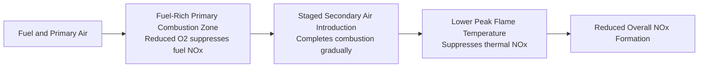
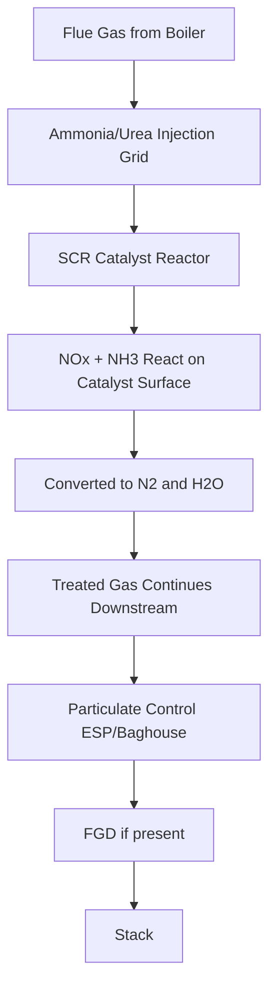
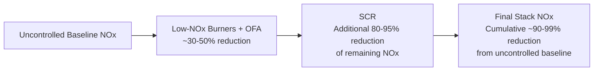

## NOx Control Technologies

### Overview

Nitrogen oxide (NOx) control technologies address the formation and emission of nitric oxide (NO) and nitrogen dioxide (NO2), collectively termed NOx, from combustion processes in power generation. NOx contributes to ground-level ozone formation, acid rain, and respiratory health effects, making it one of the primary regulated pollutant categories alongside particulate matter and SO2 (covered in the adjacent particulate control and FGD topics). NOx control strategies divide into two fundamental categories: combustion modifications that reduce NOx formation during the combustion process itself, and post-combustion treatments that remove NOx already formed from the flue gas stream — with modern compliance strategies typically combining both approaches.

### NOx Formation Mechanisms

**Thermal NOx**

Formed by the high-temperature oxidation of atmospheric nitrogen (N2) in combustion air, following the Zeldovich mechanism:

$$N_2 + O \rightarrow NO + N$$

$$N + O_2 \rightarrow NO + O$$

Thermal NOx formation rate increases exponentially with flame temperature above approximately 1,300°C (2,370°F), making it highly sensitive to peak combustion temperature — this exponential temperature dependence is the fundamental basis for most combustion-modification NOx control strategies, which work primarily by reducing peak flame temperature.

**Fuel NOx**

Formed from oxidation of nitrogen chemically bound within the fuel itself (relevant primarily for coal and, to a lesser extent, heavy fuel oil, which contain organically bound nitrogen; natural gas contains negligible fuel-bound nitrogen). Fuel NOx formation is less temperature-sensitive than thermal NOx and depends more strongly on local oxygen availability during the devolatilization/combustion process — for coal-fired boilers, fuel NOx can represent a substantial fraction (commonly cited as roughly half or more, depending on coal nitrogen content and firing conditions) of total NOx formed.

**Prompt NOx**

Formed via a distinct fast-reaction pathway involving hydrocarbon radicals reacting with atmospheric nitrogen in the early, fuel-rich flame zone. Generally a smaller contributor to total NOx than thermal or fuel NOx in typical utility boiler conditions, but relevant in certain low-temperature, fuel-rich combustion regimes.

### Combustion Modification Technologies

**Low-NOx Burners (LNB)**

Redesigned burner geometry that controls the mixing pattern of fuel and air to reduce peak flame temperature and limit oxygen availability in the initial combustion zone (where fuel NOx formation is most active), while completing combustion in a staged, more gradual manner:

- Achieves NOx reduction (commonly cited ranges of roughly 30–50% versus uncontrolled conventional burners) through internal air/fuel staging within the burner itself, without requiring external reagent injection
- Represents a relatively low-cost, first-tier NOx control measure, often implemented before or alongside more advanced staging or post-combustion technologies
- **[Unverified]** Specific NOx reduction percentages vary considerably by original (uncontrolled) burner design, coal type, and boiler configuration; actual achievable reduction for a specific retrofit should be established through vendor engineering study rather than assumed from generic percentage ranges

**Overfire Air (OFA)**

Introduces a portion of total combustion air above the main burner zone (rather than through the burners themselves), creating a fuel-rich (understoichiometric) primary combustion zone followed by a secondary, more oxygen-rich zone where combustion is completed at lower temperature:

- Reduces both thermal NOx (via lower peak temperature) and fuel NOx (via reduced oxygen availability during the fuel-nitrogen-release phase in the primary zone)
- Often combined with low-NOx burners as a complementary staging strategy (sometimes referred to jointly as "low-NOx burner with overfire air" systems), since OFA extends the staging concept beyond what burner geometry alone can achieve
- Requires careful design to avoid increased carbon-in-ash (incomplete combustion) or localized corrosion from the fuel-rich primary zone, representing a combustion-completeness versus NOx-reduction trade-off that combustion engineers must balance

**Flue Gas Recirculation (FGR)**

Recirculates a portion of relatively cool flue gas back into the combustion air stream (or directly into the flame zone), diluting the oxygen concentration and absorbing heat, thereby lowering peak flame temperature:

- Primarily effective against thermal NOx (less impact on fuel NOx mechanism) due to its temperature-focused mechanism
- More commonly applied to natural gas and oil-fired units (where thermal NOx dominates, given the absence or low level of fuel-bound nitrogen) than to coal-fired units where fuel NOx is often the larger contributor

**Reburning (Fuel Staging)**

A three-zone combustion strategy: primary combustion zone (normal fuel/air), reburn zone (injection of additional fuel, often natural gas, creating a fuel-rich zone that chemically reduces already-formed NOx back to N2 via hydrocarbon radical reactions), and burnout zone (additional air completes combustion):

$$NO + \text{hydrocarbon radicals} \rightarrow \text{intermediate N species} \rightarrow N_2$$

Reburning is distinct from staged-air approaches in that it actively chemically reduces NOx already formed in the primary zone, rather than solely preventing its formation — making it a complementary rather than purely redundant strategy for particularly nitrogen-rich fuels or where primary-zone staging alone cannot achieve target reduction.

**Low Excess Air Operation**

Operating combustion with excess air held closer to the minimum required for complete combustion reduces both available oxygen for NOx formation and, secondarily, flue gas volume/heat loss (an efficiency co-benefit). This is often the simplest, lowest-cost initial NOx reduction measure, though it is constrained by the need to maintain adequate excess air for complete combustion and to avoid excessive carbon monoxide formation or unburned carbon in ash.

### Post-Combustion NOx Control Technologies

**Selective Catalytic Reduction (SCR)**

The most effective post-combustion NOx control technology, using a catalyst to promote reaction between injected ammonia (or urea, which decomposes to ammonia) and NOx in the flue gas:

$$4NO + 4NH_3 + O_2 \xrightarrow{\text{catalyst}} 4N_2 + 6H_2O$$

$$2NO_2 + 4NH_3 + O_2 \xrightarrow{\text{catalyst}} 3N_2 + 6H_2O$$

- Achieves the highest NOx removal efficiency among available technologies (commonly cited ranges of roughly 80–95%+)
- Operates in a specific optimal temperature window (typically around 570–750°F / 300–400°C depending on catalyst formulation), which drives its typical placement in the flue gas path — usually positioned between the economizer (boiler heat recovery section) and air preheater, where flue gas naturally falls within this temperature range ("high-dust" configuration, upstream of particulate control) or occasionally in a "tail-end" position after particulate/FGD control (requiring flue gas reheat, at additional energy cost)
- **Catalyst materials:** typically vanadium pentoxide/titanium dioxide (V2O5/TiO2) based formulations, sometimes with tungsten trioxide addition for extended catalyst life and activity, formed into honeycomb or plate structures to maximize surface area for gas-catalyst contact while managing flue gas pressure drop and particulate fouling/erosion resistance
- **Catalyst degradation:** SCR catalysts lose activity over time due to fouling (fly ash deposition, particularly relevant in high-dust configuration), poisoning (certain trace metals and compounds in flue gas can chemically deactivate catalyst sites), and erosion — requiring periodic catalyst layer replacement (SCR reactors are typically designed with multiple catalyst layers, replaced sequentially over the catalyst's multi-year service life rather than all at once)
- **Ammonia slip:** unreacted ammonia passing through the SCR system ("slip") represents both a regulatory concern (ammonia is itself a pollutant of interest) and an operational concern (as noted in the FGD topic, ammonia slip can interact with downstream SO3 to form ammonium bisulfate, a sticky compound that fouls and corrodes downstream equipment, particularly the air preheater) — ammonia injection rate control is therefore carefully tuned to balance NOx removal against slip minimization rather than simply maximized

**Selective Non-Catalytic Reduction (SNCR)**

Similar chemistry to SCR (ammonia or urea reacting with NOx to form N2 and water) but without a catalyst, instead relying on injecting reagent directly into a specific high-temperature zone of the furnace/boiler (typically 1,600–2,000°F / 870–1,090°C) where the reaction proceeds thermally:

$$4NO + 4NH_3 + O_2 \rightarrow 4N_2 + 6H_2O \quad (\text{without catalyst, at higher temperature})$$

- Achieves lower NOx removal efficiency than SCR (commonly cited ranges of roughly 25–50%), reflecting the narrower effective temperature window and shorter residence time available without catalytic assistance
- Substantially lower capital cost than SCR (no catalyst reactor structure required), making it attractive where SCR-level removal is not required by applicable regulatory limits or where retrofit space/economics do not support full SCR installation
- Requires precise reagent injection into the correct temperature zone within the furnace, which can shift with boiler load — a control challenge distinct from SCR's more stable downstream flue gas temperature environment
- Generally exhibits higher ammonia slip per unit of NOx removed compared to SCR, given the less controlled reaction environment

### Technology Comparison

| Factor | Combustion Modifications (LNB/OFA) | SNCR | SCR |
| --- | --- | --- | --- |
| Typical NOx reduction | 30–50% | 25–50% | 80–95%+ |
| Capital cost | Lowest | Moderate | Highest |
| Reagent required | None (LNB/OFA/FGR) or fuel (reburning) | Ammonia/urea | Ammonia/urea |
| Operating temperature dependency | N/A (combustion-integrated) | Narrow furnace zone (~1,600-2,000°F) | Catalyst-dependent window (~570-750°F) |
| Ammonia slip concern | None | Moderate-to-higher | Lower (well-controlled) but still relevant |
| Typical application | Universal first-tier measure | Smaller units, moderate targets, retrofit-constrained sites | Large units, stringent regulatory limits |

**[Inference]** As with other emissions control technology comparisons in this reference, these figures represent commonly cited general industry ranges; specific achievable performance depends on unit-specific design, fuel characteristics, and control system integration, and should be confirmed through vendor engineering data or performance testing for any actual project decision.

### Combined Strategy Approach

Modern coal-fired units targeting stringent NOx limits typically layer multiple technologies rather than relying on any single measure:

This layered approach reflects a general cost-optimization principle common across emissions control system design: combustion modifications provide the least expensive initial reduction increment, with progressively more capital-intensive post-combustion technology applied to close the remaining gap to the required regulatory limit — directly analogous to how FGD technology selection (wet vs. dry) is driven by the target removal efficiency versus cost trade-off covered in the adjacent FGD topic.

### Worked Example: SCR Ammonia Consumption and Removal Calculation

**Problem:** A 600 MW coal unit has uncontrolled NOx (post-combustion-modification) of 0.25 lb/MMBtu at a heat input rate of 5,500 MMBtu/hr. An SCR system is designed for 90% NOx removal. Calculate the NOx removed (lb/hr) and the theoretical stoichiometric ammonia consumption rate, assuming NOx is entirely NO for simplicity.

**Solution:**

**Step 1 — Uncontrolled NOx mass rate:**

$$\dot{m}_{NOx} = 0.25\ \text{lb/MMBtu} \times 5{,}500\ \text{MMBtu/hr} = 1{,}375\ \text{lb NOx/hr}$$

**Step 2 — NOx removed at 90% efficiency:**

$$\dot{m}_{NOx,removed} = 1{,}375 \times 0.90 = 1{,}237.5\ \text{lb NOx/hr}$$

**Step 3 — Stoichiometric ammonia requirement:**

From the reaction $4NO + 4NH_3 + O_2 \rightarrow 4N_2 + 6H_2O$, the molar ratio of NH3 to NO is 1:1. Molecular weights: NO = 30, NH3 = 17.

$$\dot{m}_{NH_3} = 1{,}237.5\ \text{lb NOx/hr} \times \frac{17}{30} = 701.3\ \text{lb NH}_3/\text{hr}$$

**Interpretation:** this SCR system requires a theoretical minimum of roughly 701 lb/hr of ammonia to achieve 90% NOx removal at the stated conditions; actual reagent consumption in practice is typically somewhat higher than this stoichiometric minimum to reliably achieve target removal efficiency across varying load and flue gas conditions, with the excess representing (and being carefully limited by) the ammonia slip consideration discussed above — an operational balance conceptually parallel to the above-stoichiometric limestone ratio used in wet FGD systems covered in the adjacent topic.

### Regulatory and Monitoring Context

- NOx emission limits are typically expressed as mass per unit heat input (e.g., lb/MMBtu) or mass per unit volume, similar in structural format to the particulate and SO2 limit conventions covered in adjacent topics, set under applicable regulatory frameworks (e.g., New Source Performance Standards or equivalent regional frameworks)
- Continuous Emissions Monitoring Systems (CEMS) for NOx typically use techniques such as chemiluminescence or, increasingly, tunable diode laser or FTIR-based analyzers to provide continuous real-time compliance data
- Cap-and-trade or emissions averaging/banking programs exist in some jurisdictions specifically for NOx (as well as SO2), allowing some operational and economic flexibility in how a multi-unit fleet achieves aggregate compliance — a market-based regulatory mechanism distinct from the unit-specific technology limits more commonly associated with new source construction requirements

### Key Challenges

- **NOx-N2O trade-off in SNCR/SCR chemistry:** incomplete or side reactions in ammonia-based NOx reduction processes can, under certain conditions, form nitrous oxide (N2O) — itself a potent greenhouse gas — representing a secondary emissions consideration in reagent injection optimization that is increasingly scrutinized alongside primary NOx removal performance
- **Catalyst degradation and replacement economics:** as noted, SCR catalyst activity declines over time from fouling, poisoning, and erosion; balancing catalyst replacement timing/cost against maintaining target NOx removal efficiency (as catalyst activity declines, ammonia injection must increase to compensate, up to a point where slip becomes limiting) is an ongoing operational optimization
- **Ammonia slip downstream effects:** as discussed, ammonia slip interacts with SO3 to form ammonium bisulfate fouling/corrosion in air preheaters and can affect ESP/FGD byproduct quality — reinforcing that NOx control cannot be optimized in isolation from the particulate and SO2 control systems it operates alongside
- **Combustion modification limits on flexible/cycling units:** as covered in the load curves/dispatch and part-load operation topics, units increasingly required to cycle and load-follow for renewable integration may find that combustion-based NOx control measures (tuned for specific load/temperature conditions) perform less consistently across a wider operating range than they were originally optimized for, sometimes requiring re-tuning or supplementary post-combustion control to maintain compliance across the full operating envelope

**Key Points**

- NOx forms via three distinct mechanisms (thermal, fuel, prompt) with different temperature and fuel-chemistry sensitivities, and control strategy selection depends on which mechanism dominates for a given fuel and combustion system.
- Combustion modifications (low-NOx burners, overfire air, flue gas recirculation, reburning) reduce NOx formation during combustion and are generally the lowest-cost first-tier control measures.
- SCR provides the highest achievable NOx removal efficiency (80–95%+) via catalytic ammonia injection within a specific temperature window, while SNCR offers a lower-cost, lower-efficiency (25–50%) non-catalytic alternative.
- Modern compliance strategies typically layer combustion modifications with post-combustion SCR/SNCR, and NOx control system design/operation is chemically and operationally interconnected with particulate and SO2 control systems rather than independent.

**Related Topics**

- Particulate Control: Electrostatic Precipitators and Baghouses
- Flue Gas Desulfurization Systems
- Mercury and Trace Metal Emissions Control
- Combustion Control and Emissions Optimization
- Continuous Emissions Monitoring Systems (CEMS)
- Air Quality Regulatory Frameworks for Power Generation
- Power Plant Control and Instrumentation
- Load Curves, Dispatch, and Part-Load Operation