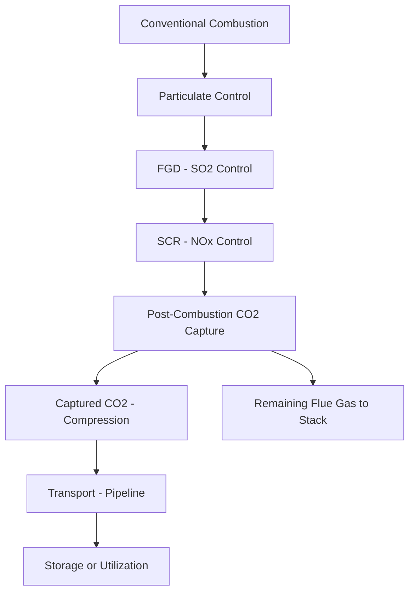
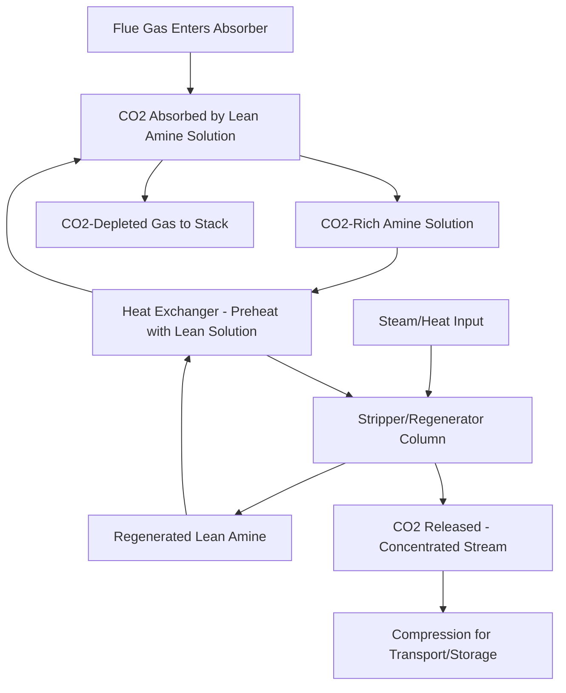

## Carbon Capture, Utilization, and Storage

### Overview

Carbon Capture, Utilization, and Storage (CCUS) encompasses technologies that capture carbon dioxide (CO2) from combustion or industrial process streams, then either permanently store it in geological formations or utilize it as a feedstock for other products, preventing its release to atmosphere. Unlike particulate, SO2, and NOx control (covered in adjacent topics), which target pollutants present in relatively small concentrations, CCUS must handle CO2 as a major flue gas constituent (commonly 4–14% by volume depending on fuel and combustion technology), making the scale of material handling and the associated energy penalty fundamentally larger challenges than conventional emissions control.

### CO2 Capture Approaches

**Post-Combustion Capture**

Captures CO2 from flue gas after conventional combustion, downstream of existing particulate, SO2, and NOx control systems — making it the approach most readily retrofittable to existing power plants since it does not require fundamental redesign of the combustion process itself.

**Pre-Combustion Capture**

Converts fuel to a hydrogen-rich syngas before combustion, separating CO2 from the fuel gas stream prior to combustion, most commonly associated with Integrated Gasification Combined Cycle (IGCC) plant configurations:

$$\text{Fuel} \rightarrow \text{Gasification} \rightarrow CO + H_2\ (\text{syngas})$$

$$CO + H_2O \rightarrow CO_2 + H_2 \quad (\text{water-gas shift, as covered in the hydrogen production topic})$$

The resulting CO2-hydrogen mixture allows CO2 separation at higher pressure and concentration than typical post-combustion flue gas, which can offer thermodynamic capture efficiency advantages, while the remaining hydrogen-rich fuel is combusted for power generation. This approach requires an IGCC-type plant architecture rather than being retrofittable to a conventional pulverized coal or gas plant.

**Oxy-Fuel Combustion**

Combusts fuel in a stream of nearly pure oxygen (separated from air via an air separation unit) rather than ordinary air, producing a flue gas stream consisting primarily of CO2 and water vapor rather than being diluted by atmospheric nitrogen:

$$\text{Fuel} + O_2 \rightarrow CO_2 + H_2O \quad (\text{minimal N}_2 \text{ dilution})$$

The resulting flue gas, after water condensation/removal, is a highly concentrated CO2 stream requiring comparatively simple purification before compression for storage/transport, though this approach requires substantial upfront investment in air separation unit capacity and involves boiler/combustion system modifications to accommodate the different flame characteristics of oxy-fuel combustion compared to air-fired combustion.

### Post-Combustion Capture Technology Detail

**Amine-Based Chemical Absorption**

The most technologically mature and widely deployed post-combustion capture approach, using an aqueous amine solution (commonly monoethanolamine, MEA, or various proprietary blended amine formulations) to chemically absorb CO2:

$$CO_2 + 2R\text{-}NH_2 \rightarrow R\text{-}NH_3^+ + R\text{-}NHCOO^-$$

**Process Steps**

- **Absorption:** flue gas contacts amine solution in an absorber column (typically a packed column providing high gas-liquid contact surface area), where CO2 chemically reacts with and is absorbed into the amine
- **Regeneration/stripping:** the CO2-rich ("rich") amine solution is heated in a stripper column (using steam, typically extracted from the plant's own steam cycle) to reverse the chemical reaction and release concentrated CO2 gas, regenerating "lean" amine solution for recirculation to the absorber
- **Heat integration:** rich/lean solution heat exchange (preheating rich solution entering the stripper using heat from the hot lean solution leaving it) is a standard energy-efficiency measure, reducing but not eliminating the substantial steam demand of the regeneration step

**The Energy Penalty**

The regeneration step's steam demand represents the dominant cost and performance driver for amine-based capture — steam extracted from the plant's turbine cycle for CO2 stripping is steam that would otherwise generate electricity, directly reducing net plant output and efficiency.

**[Inference]** Commonly cited estimates suggest capture-equipped coal plants can experience efficiency reductions on the order of 8–12 percentage points (e.g., a 40% efficiency plant dropping to roughly 30–32%) when retrofitted with amine-based post-combustion capture at high capture rates, though the precise energy penalty depends heavily on capture rate target, amine formulation, heat integration design, and baseline plant configuration — actual figures for any specific technology/project should be obtained from current vendor and demonstration project performance data rather than treated as a fixed universal value.

**Amine Degradation and Makeup**

Amine solutions degrade over time through oxidative degradation (reaction with oxygen present in flue gas) and thermal degradation (from repeated heating in the regeneration cycle), as well as through reaction with SO2, NOx, and other flue gas contaminants not fully removed by upstream control systems — reinforcing why effective upstream particulate, SOx, and NOx control (covered in adjacent topics) is a practical prerequisite for reliable and cost-effective amine-based CO2 capture, rather than an independent consideration. Degraded amine requires periodic makeup/replacement and generates a waste stream requiring management.

### Emerging and Alternative Capture Technologies

**Solid Sorbents**

Solid materials (including certain metal-organic frameworks, amine-functionalized solid supports, and other engineered materials) that adsorb CO2 and can be regenerated via pressure or temperature swing, potentially offering lower regeneration energy demand than liquid amine systems in some configurations.

**[Unverified]** Solid sorbent CO2 capture technology maturity and deployment scale varies considerably across specific material/process combinations; given the pace of ongoing development in this area, current commercial readiness and performance data for any specific solid sorbent technology should be verified against up-to-date technical literature or vendor documentation rather than assumed from general characterization.

**Membrane Separation**

Uses selectively permeable membranes to separate CO2 from other flue gas constituents based on differential permeation rates, potentially offering a more compact, lower-energy alternative to chemical absorption for certain applications, though membrane performance for dilute post-combustion flue gas streams (as opposed to higher-pressure, higher-CO2-concentration streams such as natural gas processing or pre-combustion applications) remains an active area of technology development.

**Chilled Ammonia Process**

Uses ammonia-based solvent at low temperature to absorb CO2, with regeneration at elevated pressure/temperature — proposed as potentially offering lower regeneration energy than amine-based processes in some analyses, though with distinct challenges around ammonia volatility/slip management.

**Direct Air Capture (DAC)**

Distinct from point-source capture (removing CO2 directly from a plant's flue gas), DAC extracts CO2 directly from ambient atmosphere at much lower concentration (~420 ppm versus percent-level flue gas concentrations), requiring substantially more energy per ton of CO2 captured than point-source capture due to the dilute source concentration, but offering the ability to address emissions from diffuse or already-emitted sources rather than requiring capture equipment at each individual point source. **[Unverified]** DAC technology cost and deployment scale is evolving rapidly; current cost-per-ton figures should be verified against current technology provider data given the pace of development in this specific area.

### CO2 Transport

Following capture, CO2 must typically be compressed (often to supercritical or dense-phase conditions, above roughly 73 atm and 31°C, where CO2 exhibits liquid-like density while retaining gas-like viscosity, improving transport efficiency) and transported to a storage or utilization site:

- **Pipeline transport:** the primary transport method for large-scale CCUS, requiring dedicated CO2 pipeline infrastructure (distinct from natural gas pipelines due to different pressure, material compatibility, and water-content specification requirements to avoid internal corrosion from any residual moisture forming carbonic acid)
- **Shipping:** for locations without pipeline access or connecting to offshore storage sites, CO2 can be transported as a liquefied cargo (analogous in concept to LNG shipping, though at different temperature/pressure conditions), though at present a comparatively smaller-scale transport mode than pipeline for point-source capture applications

### Geological Storage

**Storage Formation Types**

- **Depleted oil and gas reservoirs:** geological formations with proven long-term fluid containment (having held hydrocarbons for geological timescales) and often existing characterization data and some infrastructure from prior oil/gas operations
- **Deep saline aquifers:** porous rock formations saturated with brine (not usable for drinking water or agriculture), offering potentially very large storage capacity but generally requiring more extensive site characterization than depleted reservoirs given typically less pre-existing geological data
- **Unmineable coal seams:** CO2 can adsorb onto coal surfaces (in some cases displacing methane, offering a potential enhanced coalbed methane recovery co-benefit), though this pathway is generally considered to have more limited storage capacity potential than saline aquifers or depleted reservoirs

**Trapping Mechanisms**

Multiple physical and chemical mechanisms contribute to long-term CO2 containment, generally increasing in security over time:

- **Structural/stratigraphic trapping:** an impermeable caprock layer physically prevents upward CO2 migration, the primary containment mechanism immediately after injection
- **Residual trapping:** CO2 becomes trapped in pore spaces as isolated droplets/bubbles as it migrates through the formation, immobilizing a portion of the injected CO2 independent of caprock integrity
- **Solubility trapping:** CO2 gradually dissolves into formation brine over time, after which it can no longer migrate as a separate buoyant phase
- **Mineral trapping:** over longer geological timescales, dissolved CO2 can react with formation minerals to form stable solid carbonate minerals, representing the most permanent trapping mechanism but occurring over the longest timescale (a process generally understood to occur over centuries to millennia depending on formation mineralogy)

**Site Characterization and Monitoring**

- Storage site selection requires detailed geological characterization (similar in principle to the geotechnical/seismic assessment covered in the site selection topic, though focused on subsurface formation properties, caprock integrity, and injection capacity rather than surface foundation conditions)
- Monitoring, Reporting, and Verification (MRV) programs track injected CO2 plume behavior over time using techniques including seismic surveys, pressure monitoring, and groundwater monitoring, providing assurance of continued containment and early detection of any unexpected migration
- **[Unverified]** Specific regulatory MRV requirements and site characterization standards vary considerably by jurisdiction; applicable requirements for a specific project should be verified against the relevant national/regional regulatory framework rather than assumed universal

### Enhanced Oil Recovery (EOR) — A Utilization Pathway

Historically, the most commercially established CO2 utilization pathway involves injecting captured CO2 into mature oil reservoirs, where it improves oil recovery efficiency (partly through the same mechanisms as effective geological storage) while generating revenue from the additional oil produced:

$$\text{CO}_2\ \text{injection} \rightarrow \text{oil viscosity reduction + pressure maintenance} \rightarrow \text{increased oil recovery}$$

**[Unverified]** The extent to which CO2-EOR should be characterized as genuine long-term "storage" (as opposed to primarily an oil-production technique with a partial storage co-benefit) involves both technical accounting questions (how much injected CO2 remains permanently stored versus is produced back with the oil and potentially re-injected or vented) and policy/definitional debates that continue to evolve; readers evaluating a specific EOR-CCUS project should consult current technical and regulatory guidance on this accounting question rather than assume a single settled treatment.

### Other Utilization Pathways

- **Mineralization:** reacting CO2 with certain minerals (e.g., magnesium or calcium silicates) to form stable solid carbonates, which can potentially be used in construction materials — offering permanent CO2 fixation, though generally at smaller scale and higher cost per ton than geological storage at present
- **Chemical feedstock:** CO2 as a feedstock for producing fuels (e.g., combined with hydrogen to produce methanol, as noted in the hydrogen production and storage topic), plastics, or other chemicals — though the climate benefit of this pathway depends on the eventual fate of the CO2 in the resulting product (permanently fixed versus eventually re-released, e.g., if used to produce a fuel that is subsequently combusted)
- **Concrete curing:** injecting CO2 into concrete during the curing process, where it reacts to form stable carbonate minerals within the concrete matrix, offering a permanent fixation pathway with a potential co-benefit of improved concrete properties in some applications

### Worked Example: Post-Combustion Capture Energy Penalty and Net Output Impact

**Problem:** A 600 MW (net, pre-capture) coal plant with 38% net efficiency (LHV) is retrofitted with amine-based post-combustion capture targeting 90% CO2 capture, with an estimated efficiency penalty of 9 percentage points. Calculate the new net efficiency, the resulting change in net output at constant fuel input, and the percentage output derating.

**Solution:**

**Step 1 — New net efficiency:**

$$\eta_{new} = 38\% - 9\% = 29\%$$

**Step 2 — Original fuel heat input (holding heat input constant, consistent with unchanged boiler/combustion operation):**

$$Q_{in} = \frac{W_{original}}{\eta_{original}} = \frac{600\ \text{MW}}{0.38} = 1{,}578.9\ \text{MW}_{th}$$

**Step 3 — New net output at the same heat input:**

$$W_{new} = Q_{in} \times \eta_{new} = 1{,}578.9\ \text{MW}_{th} \times 0.29 = 457.9\ \text{MW}$$

**Step 4 — Output derating:**

$$\text{Derating} = \frac{600 - 457.9}{600} \times 100\% = 23.7\%$$

**Interpretation:** despite the efficiency penalty being expressed as "only" 9 percentage points, the resulting net output derating (23.7%) is substantially larger in relative terms — illustrating why the energy penalty of post-combustion capture represents such a significant economic and grid-capacity consideration: for the same fuel consumption and boiler operation, the plant delivers roughly a quarter less usable electrical output to the grid, directly affecting both the plant's LCOE (as covered in the economic analysis topic, since capital and fixed costs are now spread over meaningfully less net generation) and its contribution to system capacity.

### Key Challenges

- **Energy penalty and economic viability:** as the worked example demonstrates, the parasitic energy demand of capture (primarily regeneration steam for amine systems) substantially reduces net plant output and materially worsens LCOE, representing the central economic barrier to widespread CCUS deployment absent a sufficient carbon price, regulatory mandate, or utilization revenue stream (e.g., EOR) to offset this cost
- **Storage site availability and characterization cost:** suitable, well-characterized geological storage capacity is not uniformly available near all emission sources, potentially requiring long-distance CO2 pipeline transport (itself a substantial infrastructure investment) to connect capture facilities with viable storage sites
- **Long-term liability and monitoring:** the multi-century to millennial timescale implied by the trapping mechanisms described above raises long-term liability, monitoring responsibility, and regulatory framework questions that differ in character from most other emissions control technologies' more immediate compliance/operational focus
- **Scale-up from demonstration to widespread deployment:** while post-combustion amine capture technology is reasonably mature at the process-chemistry level, translating that maturity into cost-competitive, widespread deployment across the existing power plant fleet remains an ongoing techno-economic challenge, with actual deployed capacity and cost trends evolving over time — current status should be checked against up-to-date industry tracking given the pace of change in this area
- **Interaction with upstream emissions control:** as noted, amine degradation from flue gas contaminants means CCUS system performance and economics are directly affected by the effectiveness of upstream particulate, SO2, and NOx control — reinforcing the theme across this emissions control chapter that these systems must be considered as an integrated whole rather than independently optimized

**Key Points**

- Post-combustion capture (retrofittable, using amine absorption/stripping), pre-combustion capture (requires IGCC-type architecture), and oxy-fuel combustion (requires air separation and combustion modification) represent three fundamentally different capture approaches with different retrofit implications.
- The regeneration energy penalty for amine-based post-combustion capture is the dominant cost and performance driver, causing output derating substantially larger in relative terms than the underlying efficiency-point reduction might suggest.
- Geological CO2 storage relies on multiple trapping mechanisms (structural, residual, solubility, mineral) that increase in permanence over time, from immediate caprock containment to eventual (centuries-to-millennia-scale) mineral fixation.
- CCUS technology and economic performance are tightly interconnected with upstream particulate, SO2, and NOx control system performance, consistent with the integrated-systems theme running throughout emissions control engineering.

**Related Topics**

- Hydrogen Production and Storage for Power Applications
- Particulate Control: Electrostatic Precipitators and Baghouses
- Flue Gas Desulfurization Systems
- NOx Control Technologies
- Economic Analysis and the Levelized Cost of Electricity
- Integrated Gasification Combined Cycle (IGCC) Plant Design
- Geological Site Characterization for Subsurface Storage
- Carbon Pricing and Climate Policy Mechanisms