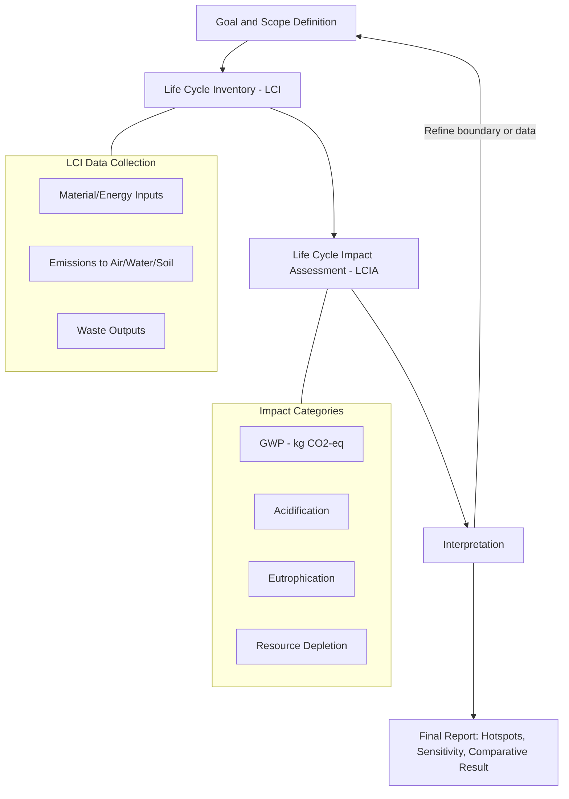

## Life-Cycle Assessment of Power Generation

### Definition and Scope

Life-Cycle Assessment (LCA) is a standardized methodology for quantifying the environmental burdens associated with a power generation technology across its entire existence — from raw material extraction through manufacturing, construction, operation, and decommissioning/disposal. Applied to power generation, LCA answers the question: "What is the true environmental cost per unit of electricity delivered, accounting for everything upstream and downstream of the power plant fence line?"

The methodology is codified in **ISO 14040** and **ISO 14044**, which define the four-phase structure used industry-wide:

1. Goal and Scope Definition
2. Life Cycle Inventory (LCI)
3. Life Cycle Impact Assessment (LCIA)
4. Interpretation

LCA distinguishes itself from simple "smokestack" emissions accounting (which only captures operational combustion emissions) by capturing embodied impacts — the emissions and resource consumption locked into a technology before it ever generates a kilowatt-hour.

---

### System Boundaries

The choice of system boundary fundamentally determines what an LCA result means. Three conventions dominate power sector LCA:

| Boundary Type | Stages Included | Typical Use Case |
| --- | --- | --- |
| Cradle-to-Gate | Raw material extraction → component manufacturing | Comparing embodied carbon of components (e.g., PV panels, wind turbine blades) |
| Cradle-to-Grave | Extraction → manufacturing → construction → operation → decommissioning/disposal | Full technology comparison (standard for power sector) |
| Cradle-to-Cradle | Cradle-to-grave + recycling/reuse loop back into new production | Circular economy analysis, end-of-life recyclable materials (e.g., steel, aluminum, rare earths) |

For power generation specifically, the functional unit is almost universally **1 kWh** or **1 MWh** of electricity delivered to the grid, normalizing across technologies with very different capacities, capacity factors, and lifespans.

---

### The Four ISO 14040/14044 Phases Applied to Power

**1. Goal and Scope Definition**

- Defines the functional unit (e.g., "1 kWh of AC electricity delivered at the grid connection point")
- Establishes system boundary (cradle-to-grave is standard)
- Specifies allocation method for co-products (relevant for CHP plants, where heat and power are co-produced)

**2. Life Cycle Inventory (LCI)**

Compiles a quantitative inventory of all inputs (materials, energy, land, water) and outputs (emissions to air/water/soil, waste) across every life-cycle stage. For a power plant this includes:

- Raw material extraction (ore mining for steel/copper/rare earths, uranium mining for nuclear, coal/gas extraction for fossil plants)
- Manufacturing of plant components (turbines, generators, PV cells, wind blades, reactor vessels)
- Transportation of materials and fuel
- Construction/installation emissions (concrete curing, heavy machinery)
- Operational fuel combustion and fugitive emissions
- Maintenance/replacement of components over the plant lifetime
- Decommissioning, demolition, and waste disposal/recycling

**3. Life Cycle Impact Assessment (LCIA)**

Translates the raw inventory into impact category scores using characterization factors. Common impact categories for power generation LCA:

- **Global Warming Potential (GWP)** — kg CO₂-eq per kWh (the most commonly reported metric)
- Acidification Potential (SO₂-eq)
- Eutrophication Potential (PO₄-eq)
- Particulate Matter Formation
- Human Toxicity / Ecotoxicity
- Land Use / Land Transformation
- Water Depletion
- Abiotic Resource Depletion (mineral/metal ores)

**4. Interpretation**

Sensitivity analysis, identification of dominant contributing stages (hotspot analysis), and consistency checks against the stated goal and scope.

---

### Life-Cycle GHG Emissions by Technology

The single most cited LCA output in the power sector is life-cycle GWP, typically expressed in gCO₂-eq/kWh. Representative ranges (median values commonly cited from IPCC AR5/AR6 and NREL harmonization studies):

| Technology | Life-Cycle GHG (gCO₂-eq/kWh, median) | Dominant Life-Cycle Stage |
| --- | --- | --- |
| Coal (pulverized, no CCS) | ~820–1000 | Operation (combustion) |
| Natural Gas (combined cycle) | ~450–490 | Operation (combustion) + upstream fugitive methane |
| Solar PV (utility-scale) | ~40–50 | Manufacturing (panel/wafer production, embodied energy) |
| Wind (onshore) | ~11–12 | Manufacturing (steel tower, blade composites) |
| Wind (offshore) | ~12–15 | Manufacturing + foundation/installation |
| Hydropower (reservoir) | ~24 (highly variable, 4–200+) | Construction (concrete) + reservoir CH₄ from biomass decay |
| Nuclear | ~12 | Front-end fuel cycle (uranium mining/enrichment) + construction |
| Geothermal | ~38 (variable by resource) | Operation (non-condensable gas release) + drilling |
| Biomass (dedicated) | ~230 (highly dependent on feedstock/land-use assumptions) | Feedstock cultivation/transport |

[Inference] Exact figures vary substantially by study methodology, regional grid mix used for manufacturing energy, capacity factor assumptions, and whether biogenic carbon accounting is included — cross-study comparison requires checking that functional units and boundaries match.

**Key Point:** For fossil fuel plants, operation (combustion) dominates the life-cycle footprint (often >85% of total). For renewables and nuclear, manufacturing/construction and front-end fuel cycle dominate, since there is little or no operational combustion. This inversion is the central insight LCA provides that operational-only accounting misses.

---

### Energy Payback Time (EPBT) and Energy Return on Investment (EROI)

Two derived metrics frequently paired with LCA for power technologies:

$$EPBT = \frac{E_{embodied}}{E_{annual\ output}}$$

Where $E_{embodied}$ is the cumulative energy consumed across the life cycle (manufacturing + construction + decommissioning) and $E_{annual\ output}$ is the annual energy generated.

$$EROI = \frac{E_{output,\ lifetime}}{E_{input,\ lifetime}}$$

Typical EPBT ranges:

- Solar PV (crystalline silicon): 1–2.5 years (against a 25–30 year lifespan)
- Wind (onshore): 3–7 months
- Nuclear: ~1 year (front-end enrichment dominated)
- Coal/Gas: EPBT concept less relevant since fuel input is continuous, not embodied

A low EPBT relative to operational lifetime indicates favorable net energy return — the technology produces many multiples of the energy invested to build it.

---

### Allocation Methods for Co-Products

LCA allocation becomes complex for plants with multiple outputs:

- **Combined Heat and Power (CHP):** Total emissions must be split between electricity and useful heat output. Common methods:
  - Energy allocation (split by energy content of each output)
  - Exergy allocation (split by thermodynamic quality/work potential — more rigorous, based on the Second Law)
  - Avoided-burden method (credit the plant for heat that displaces a separate boiler)
- **Nuclear fuel cycle:** Enrichment tails assay affects allocation of separative work units (SWU) between enriched product and depleted uranium tails.
- **Biomass co-firing:** Allocation between biogenic and fossil carbon streams, and whether biogenic CO₂ is counted as net-zero (contested assumption — see Uncertainty section below).

Exergy allocation is generally preferred in thermodynamically rigorous LCA because it reflects the actual "useful work" content of heat versus electricity, whereas pure energy allocation can understate electricity's environmental burden (since electricity has higher exergy/unit energy than low-grade heat).

---

### Uncertainty, Contested Assumptions, and Methodological Sensitivity

[Inference/Unverified — flagged because these are genuinely contested modeling choices, not settled facts]

- **Biogenic carbon neutrality assumption:** Whether combusted biomass CO₂ is treated as carbon-neutral (assuming regrowth recaptures the carbon) materially changes biomass LCA results. This assumption is actively debated in policy and scientific literature (particularly regarding forest biomass harvest rotation timescales).
- **Reservoir hydropower methane emissions:** Flooded biomass decomposition in reservoirs can release significant CH₄, and estimates vary enormously by climate, reservoir depth, and flooded biomass density — tropical shallow reservoirs show far higher emissions than temperate deep reservoirs.
- **Grid mix used for manufacturing energy:** A solar panel manufactured using a coal-heavy grid (e.g., certain manufacturing regions) carries a higher embodied-carbon footprint than one manufactured using a low-carbon grid — this can shift PV LCA results by 30–50% between studies.
- **End-of-life credit allocation:** Whether recycling credits (e.g., for steel, aluminum, silicon) are allocated to the current product or the next product life cycle affects cradle-to-cradle results.
- **Capacity factor assumptions:** Since the functional unit is per-kWh, assumed capacity factor (e.g., 25% vs 35% for wind) directly scales the per-kWh embodied impact — lower capacity factor assumptions inflate all embodied-impact metrics proportionally.

Because of this sensitivity, credible LCA studies always report a sensitivity analysis and disclose their key parametric assumptions; single-point estimates without stated boundaries should be treated cautiously.

---

### LCA Software and Databases

Standard tools used in professional/academic power sector LCA:

- **Ecoinvent** — the most widely used LCI database, covering thousands of processes including power generation technologies
- **GaBi** (Sphera) — commercial LCA software with power-sector-specific modules
- **SimaPro** — commercial LCA software, widely used in academia and industry
- **openLCA** — free, open-source LCA software supporting ecoinvent and other databases
- **NREL LCA Harmonization Project** — a meta-analysis dataset reconciling methodological differences across published power-sector LCA studies, useful for obtaining harmonized comparative GWP values

---

### Diagram: LCA Stages for a Power Plant (svg_diagram)

<svg xmlns="http://www.w3.org/2000/svg" viewBox="0 0 900 340">
\<style\>
.box { fill: #eef3f8; stroke: #2c5f7c; stroke-width: 2; }
.arrow { stroke: #2c5f7c; stroke-width: 2; marker-end: url(#arrowhead); fill: none; }
.label { font-family: sans-serif; font-size: 13px; fill: #1a1a1a; text-anchor: middle; }
.title { font-family: sans-serif; font-size: 16px; fill: #1a1a1a; text-anchor: middle; font-weight: bold; }
\</style\>
<text x="450" y="25" class="title">Cradle-to-Grave LCA Stages — Power Generation (svg_diagram)</text>
<rect x="20" y="60" width="130" height="70" rx="6" class="box" />
<text x="85" y="90" class="label">Raw Material</text>
<text x="85" y="107" class="label">Extraction</text>
<rect x="180" y="60" width="130" height="70" rx="6" class="box" />
<text x="245" y="90" class="label">Component</text>
<text x="245" y="107" class="label">Manufacturing</text>
<rect x="340" y="60" width="130" height="70" rx="6" class="box" />
<text x="405" y="90" class="label">Transport &amp;</text>
<text x="405" y="107" class="label">Construction</text>
<rect x="500" y="60" width="130" height="70" rx="6" class="box" />
<text x="565" y="90" class="label">Operation</text>
<text x="565" y="107" class="label">(Fuel + O&amp;M)</text>
<rect x="660" y="60" width="130" height="70" rx="6" class="box" />
<text x="725" y="90" class="label">Decommissioning</text>
<text x="725" y="107" class="label">&amp; Disposal</text>
<path d="M150 95 L180 95" class="arrow" />
<path d="M310 95 L340 95" class="arrow" />
<path d="M470 95 L500 95" class="arrow" />
<path d="M630 95 L660 95" class="arrow" />
<rect x="340" y="200" width="220" height="60" rx="6" class="box" fill="#f8f0e3" stroke="#a67c2e" />
<text x="450" y="225" class="label">Recycling / Material</text>
<text x="450" y="242" class="label">Recovery Loop</text>
<path d="M725 130 L725 180 L560 180 L560 200" class="arrow" fill="none" />
<path d="M340 230 L85 230 L85 130" class="arrow" fill="none" />

<text x="450" y="300" class="label">Functional Unit: 1 kWh delivered to grid | Boundary: Cradle-to-Cradle (with recycling loop)</text>

</svg>

---

### Diagram: LCA Assessment Workflow (ISO 14040/14044)

---

### Comparative Example Calculation

**Example:** Estimate simple embodied-carbon comparison for a 1 MW onshore wind turbine vs. equivalent natural gas generation over a 20-year lifetime.

Given:

- Wind turbine life-cycle GWP: 12 gCO₂-eq/kWh
- Natural gas CCGT life-cycle GWP: 470 gCO₂-eq/kWh
- Capacity factor: Wind = 35%, Gas = 55%
- Lifetime: 20 years

Annual energy output:

$$E_{wind} = 1\ MW \times 0.35 \times 8760\ h = 3066\ MWh/yr$$

$$E_{gas} = 1\ MW \times 0.55 \times 8760\ h = 4818\ MWh/yr$$

Lifetime emissions:

$$CO_{2,wind} = 3066\ MWh/yr \times 20\ yr \times 12\ gCO_2\text{-eq}/kWh \times 1000\ kWh/MWh = 735.8\ tCO_2\text{-eq}$$

$$CO_{2,gas} = 4818\ MWh/yr \times 20\ yr \times 470\ gCO_2\text{-eq}/kWh \times 1000\ kWh/MWh = 45,289\ tCO_2\text{-eq}$$

**Result:** Despite lower capacity factor, the wind turbine's lifetime life-cycle emissions are roughly 61x lower than the equivalent gas plant over 20 years — illustrating why embodied-only comparisons at equal capacity would understate the disparity if capacity factor differences aren't normalized per kWh delivered.

---

### Relationship to Thermodynamics and Power Engineering Curriculum

LCA connects directly to core thermodynamics concepts:

- **Exergy analysis** underlies proper allocation in CHP/cogeneration LCA, since exergy (not raw energy) captures the true thermodynamic value of heat vs. electricity outputs
- **Second Law efficiency** losses in fuel cycles (e.g., uranium enrichment separative work, coal beneficiation) contribute embodied energy captured in LCI
- **Heat rate and thermal efficiency** of the operational stage directly scale the operational-phase LCA contribution for combustion technologies — a plant with higher thermal efficiency (lower heat rate) shows proportionally lower operational-phase GWP per kWh

---

### Related Topics

- Carbon Capture, Utilization, and Storage (CCUS) — Life-Cycle Impact
- Exergy Analysis and Second Law Efficiency in Power Cycles
- Environmental Impact Assessment (EIA) vs. LCA — Regulatory Distinctions
- Grid Carbon Intensity and Marginal Emissions Factors
- Circular Economy Principles in Renewable Energy Component Manufacturing
- Water-Energy Nexus in Thermoelectric Power Generation
- Rare Earth Element Supply Chains for Wind Turbine Permanent Magnets
- Fuel Cycle Analysis for Nuclear Power (Front-End vs. Back-End)
- Emissions Trading Schemes and Carbon Pricing Mechanisms
- IPCC AR6 Working Group III Mitigation Pathways — Power Sector