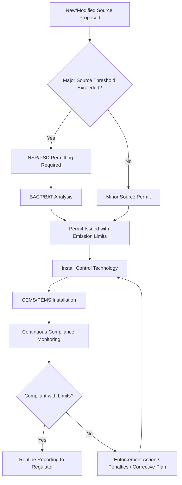

## Environmental Regulations and Emission Standards

### Purpose and Regulatory Framework Overview

Environmental regulations and emission standards for power generation establish legally binding limits on pollutants released to air, water, and land from electricity-generating facilities. These frameworks translate environmental policy goals (public health protection, ecosystem preservation, climate mitigation) into enforceable numerical limits, monitoring requirements, and compliance mechanisms that power plant operators must meet.

Regulatory frameworks operate at multiple jurisdictional levels simultaneously:

- **International** — treaties and protocols (e.g., Paris Agreement, Kyoto Protocol legacy mechanisms)
- **National/Federal** — country-wide statutes (e.g., US Clean Air Act, EU Industrial Emissions Directive)
- **Regional/State** — sub-national standards that may be more stringent than federal floors
- **Local/Permit-Level** — facility-specific operating permits with site-specific limits

---

### Key Regulated Pollutants from Power Generation

| Pollutant | Primary Source | Health/Environmental Concern |
| --- | --- | --- |
| Sulfur Dioxide (SO₂) | Coal/oil combustion (sulfur content in fuel) | Acid rain, respiratory disease, particulate formation |
| Nitrogen Oxides (NOₓ) | High-temperature combustion (thermal NOₓ) | Smog, acid rain, respiratory disease |
| Particulate Matter (PM₁₀, PM₂.₅) | Incomplete combustion, ash | Cardiovascular/respiratory disease, reduced visibility |
| Mercury (Hg) | Coal combustion (trace fuel content) | Neurotoxin, bioaccumulation in aquatic food chains |
| Carbon Dioxide (CO₂) | All fossil fuel combustion | Greenhouse gas, climate change |
| Carbon Monoxide (CO) | Incomplete combustion | Toxic gas, precursor to ground-level ozone |
| Volatile Organic Compounds (VOCs) | Incomplete combustion, fuel handling | Ozone precursor, some carcinogenic |
| Hydrochloric Acid (HCl) | Coal combustion (chlorine content) | Acid gas, respiratory irritant |

---

### United States Regulatory Framework

**Clean Air Act (CAA) — Core Statute**

The CAA (1970, major amendments 1977 and 1990) is the foundational US air quality statute, implemented primarily by the EPA.

- **National Ambient Air Quality Standards (NAAQS):** Set maximum ambient concentrations for six "criteria pollutants" — SO₂, NOₓ, PM, CO, ozone, and lead. States must develop **State Implementation Plans (SIPs)** demonstrating how they will meet NAAQS.
- **New Source Performance Standards (NSPS):** Technology-based emission limits applied to newly constructed or substantially modified sources, codified under 40 CFR Part 60. Subpart Da covers electric utility steam generating units.
- **National Emission Standards for Hazardous Air Pollutants (NESHAP):** Covers toxic pollutants including mercury, under the **Mercury and Air Toxics Standards (MATS)** rule specifically for coal- and oil-fired power plants.
- **New Source Review (NSR) / Prevention of Significant Deterioration (PSD):** Pre-construction permitting requiring Best Available Control Technology (BACT) analysis for new or modified major sources in attainment areas.
- **Title IV Acid Rain Program:** Established the first large-scale cap-and-trade system for SO₂ emissions from power plants (1990 amendments), later supplemented by NOₓ trading programs.

**Key EPA Power Sector Rules:**

- **MATS (Mercury and Air Toxics Standards, 2011/2012):** Limits mercury, acid gases, and non-mercury metals from coal/oil steam units
- **Cross-State Air Pollution Rule (CSAPR):** Addresses interstate transport of SO₂/NOₓ contributing to downwind nonattainment
- **Clean Power Plan (2015) → repealed → Affordable Clean Energy Rule (2019) → vacated → subsequent CO₂ rulemaking:** [Unverified — this area has seen repeated legal and administrative reversal across US administrations; current CO₂ standards for existing power plants should be verified against the EPA's current regulatory status rather than treated as settled, since this list may not reflect actions after this material's reference point]
- **Effluent Limitations Guidelines (ELG):** Under the Clean Water Act, regulates wastewater discharge (e.g., flue gas desulfurization wastewater, bottom ash transport water) from steam electric power plants
- **Coal Combustion Residuals (CCR) Rule:** Regulates disposal of coal ash under RCRA Subtitle D

**Clean Water Act (CWA):** Regulates discharges to surface waters via the **National Pollutant Discharge Elimination System (NPDES)** permitting program, including thermal discharge limits (Section 316(a)) and cooling water intake structure requirements (Section 316(b)) to minimize impingement/entrainment of aquatic organisms.

---

### European Union Regulatory Framework

**Industrial Emissions Directive (IED, 2010/75/EU)**

The IED is the primary EU instrument governing industrial and power plant emissions, built on the concept of **Best Available Techniques (BAT)**.

- **BAT Reference Documents (BREFs)** — sector-specific technical documents defining BAT, with the **Large Combustion Plants BREF (LCP BREF)** directly applicable to power generation
- **BAT-Associated Emission Levels (BAT-AELs)** — legally binding emission range limits derived from BREFs, covering SO₂, NOₓ, dust/PM, and mercury for combustion plants
- Permits issued by member state authorities must incorporate BAT-AELs; deviations require justification

**EU Emissions Trading System (EU ETS)**

- The world's largest cap-and-trade carbon market, covering power generation and industrial sectors since 2005
- Operates in phases (currently Phase 4, 2021–2030) with a declining emissions cap
- Power generators must surrender EU Allowances (EUAs) equal to verified CO₂ emissions annually
- **Carbon Border Adjustment Mechanism (CBAM)** — extends carbon cost considerations to imports of certain carbon-intensive goods

**National Emission Ceilings Directive (NECD):** Sets member-state-level caps on total national emissions of SO₂, NOₓ, VOCs, ammonia, and PM₂.₅.

---

### International and Other Major Frameworks

- **Paris Agreement (2015):** Nationally Determined Contributions (NDCs) drive national policy that cascades into power sector emission standards, though the Agreement itself does not set plant-level technical limits
- **Kyoto Protocol legacy:** Clean Development Mechanism (CDM) and Joint Implementation frameworks historically influenced power sector carbon accounting
- **China's Ultra-Low Emissions (ULE) Standard:** Requires coal power plants to meet gas-turbine-comparable emission limits for SO₂, NOₓ, and PM through retrofit programs
- **China National ETS:** Launched 2021, initially covering the power sector, using carbon intensity (emissions per unit output) rather than absolute cap allocation
- **India's Ministry of Environment, Forest and Climate Change (MoEFCC) 2015 norms:** Set SO₂, NOₓ, PM, and mercury limits for thermal power plants, with phased implementation timelines that have seen multiple extensions [Unverified — implementation timeline specifics should be checked against current status]

---

### Regulatory Approaches: Technology-Based vs. Health-Based Standards

| Approach | Basis | Example |
| --- | --- | --- |
| Technology-Based (BACT/BAT) | Best demonstrated control technology, regardless of ambient conditions | US NSPS, EU BAT-AELs |
| Health/Ambient-Based (NAAQS-style) | Maximum ambient concentration to protect public health | US NAAQS, WHO Air Quality Guidelines |
| Market-Based (Cap-and-Trade) | Aggregate emissions cap with tradeable allowances | US Acid Rain Program, EU ETS, RGGI, China ETS |
| Output-Based / Intensity Standards | Emissions per unit of output (e.g., gCO₂/kWh) | China ETS baseline method, various renewable portfolio-adjacent rules |

**Key Point:** Technology-based standards guarantee a minimum control floor regardless of local air quality, while market-based mechanisms allow flexibility in where/how reductions occur but require robust monitoring, reporting, and verification (MRV) infrastructure to function credibly.

---

### Compliance Technologies Mapped to Standards

| Pollutant | Standard Driver | Common Compliance Technology |
| --- | --- | --- |
| SO₂ | MATS, LCP BREF, Acid Rain Program | Flue Gas Desulfurization (wet/dry scrubbers) |
| NOₓ | NSPS, LCP BREF | Selective Catalytic Reduction (SCR), Selective Non-Catalytic Reduction (SNCR), Low-NOₓ burners |
| PM | NSPS, MATS | Electrostatic Precipitators (ESP), Fabric Filters (baghouses) |
| Mercury | MATS | Activated Carbon Injection (ACI), co-benefit capture via existing SO₂/PM controls |
| CO₂ | EU ETS, evolving US rules, national NDCs | Efficiency improvement, fuel switching, Carbon Capture and Storage (CCS) |

---

### Monitoring, Reporting, and Verification (MRV)

Regulatory compliance depends on robust measurement infrastructure:

- **Continuous Emissions Monitoring Systems (CEMS):** Real-time measurement of SO₂, NOₓ, CO₂, opacity, and flow rate directly in the stack, required for most major US and EU sources
- **Predictive Emissions Monitoring Systems (PEMS):** Model-based estimation used where CEMS is impractical, validated periodically against reference method testing
- **Reference Method (RM) stack testing:** Periodic manual sampling per standardized EPA/ISO methods to validate CEMS/PEMS accuracy
- **Annual compliance reporting:** Facilities submit emissions data to regulators (e.g., EPA's Acid Rain Program database, EU ETS registry) for public disclosure and enforcement

---

### Diagram: Regulatory Compliance Pathway for a Power Plant

---

### Diagram: Overlapping Jurisdictional Layers (svg_diagram)

<svg xmlns="http://www.w3.org/2000/svg" viewBox="0 0 700 400">
\<style\>
.ring { fill: none; stroke-width: 2; }
.label { font-family: sans-serif; font-size: 13px; fill: #1a1a1a; text-anchor: middle; }
.title { font-family: sans-serif; font-size: 16px; fill: #1a1a1a; text-anchor: middle; font-weight: bold; }
\</style\>
<text x="350" y="25" class="title">Jurisdictional Layers of Emission Regulation (svg_diagram)</text>
<circle cx="350" cy="220" r="170" class="ring" stroke="#8ba888" />
<text x="350" y="70" class="label">International (Paris Agreement, NDCs)</text>
<circle cx="350" cy="220" r="130" class="ring" stroke="#5f89a8" />
<text x="350" y="110" class="label">National/Federal (CAA, IED)</text>
<circle cx="350" cy="220" r="90" class="ring" stroke="#c98a4b" />
<text x="350" y="150" class="label">State/Regional (SIPs, BAT-AELs)</text>
<circle cx="350" cy="220" r="50" class="ring" stroke="#a85f5f" />
<text x="350" y="220" class="label">Facility Permit</text>
<text x="350" y="238" class="label">(Site-Specific Limits)</text>
</svg>

---

### Worked Example: SO₂ Compliance Check

**Example:** A coal plant burns 2% sulfur coal at 500 tonnes/hr. Uncontrolled SO₂ generation rate and required scrubber removal efficiency to meet an emission limit of 0.15 lb SO₂/MMBtu.

Sulfur mass balance (approximate, assuming full oxidation to SO₂):

$$SO_2\ generated = Coal\ rate \times \%S \times \frac{64}{32}$$

$$SO_2 = 500{,}000\ kg/hr \times 0.02 \times 2 = 20{,}000\ kg/hr\ SO_2\ (uncontrolled)$$

If the plant's heat input is 5,000 MMBtu/hr, uncontrolled emission rate:

$$\frac{20{,}000\ kg/hr \times 2.2046\ lb/kg}{5000\ MMBtu/hr} = 8.82\ lb\ SO_2/MMBtu$$

Required removal efficiency to reach the 0.15 lb/MMBtu limit:

$$\eta_{removal} = \left(1 - \frac{0.15}{8.82}\right) \times 100\% = 98.3\%$$

**Result:** A high-efficiency wet FGD scrubber (typically capable of 95–99% removal) would be required; this level of sulfur content and limit stringency is representative of why wet limestone scrubbers are the dominant technology choice for high-sulfur coal compliance under MATS-equivalent limits.

---

### Enforcement Mechanisms and Penalties

- **Notice of Violation (NOV):** Formal regulatory finding of non-compliance
- **Consent Decrees:** Negotiated settlements often requiring capital investment in controls plus civil penalties
- **Citizen Suits:** Many statutes (e.g., US CAA) allow private parties to sue for enforcement
- **Allowance Forfeiture/Market Penalties:** Under cap-and-trade systems, excess emissions may require surrendering additional allowances at a punitive ratio
- **Operating Permit Revocation:** Extreme non-compliance can result in loss of authorization to operate

---

### Emerging and Evolving Areas

[Inference/Unverified — regulatory landscape evolves frequently; treat as directional context requiring verification against current rule status]

- Expansion of CO₂-specific standards for existing (not just new) fossil generation in multiple jurisdictions
- Methane leakage regulation extending upstream into the natural gas supply chain feeding power plants
- Increasing integration of LCA-based (see Life-Cycle Assessment) embodied-carbon accounting into procurement and disclosure requirements
- Carbon border adjustment mechanisms creating trade-linked incentives for cleaner power-sector supply chains

---

### Related Topics

- Flue Gas Desulfurization (FGD) System Design
- Selective Catalytic Reduction (SCR) for NOₓ Control
- Continuous Emissions Monitoring Systems (CEMS) — Instrumentation and Calibration
- Carbon Capture, Utilization, and Storage (CCUS)
- Cap-and-Trade Market Mechanisms and Carbon Pricing
- Coal Combustion Residuals (CCR) Management and Disposal
- Best Available Techniques (BAT) Reference Documents (BREFs)
- Life-Cycle Assessment of Power Generation
- National Ambient Air Quality Standards (NAAQS) — Criteria Pollutants
- Environmental Impact Assessment (EIA) for New Power Projects