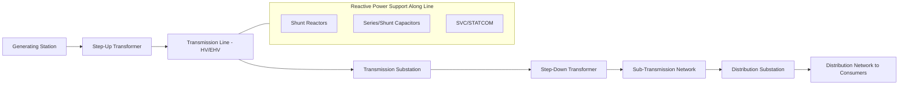

## Fundamentals of Electric Power Transmission

### Definition and Role in the Power System

Electric power transmission is the bulk transfer of electrical energy from generation sources to distribution substations over high-voltage networks, typically spanning long distances. It sits between generation and distribution in the power delivery chain:

**Generation → Step-Up Transformation → Transmission → Step-Down Transformation → Distribution → End Consumers**

Transmission systems operate at high voltage specifically to minimize $I^2R$ losses over long distances, since for a fixed power transfer, raising voltage proportionally reduces current, and losses scale with the square of current.

---

### Why High Voltage? The Core Physical Justification

Power transferred is:

$$P = V \times I$$

For fixed power $P$, current $I$ is inversely proportional to voltage $V$. Since resistive line losses are:

$$P_{loss} = I^2 R$$

Doubling voltage (halving current) reduces line losses to one-quarter for the same power delivered:

$$P_{loss} \propto \frac{1}{V^2}$$

**Example:** Transmitting 100 MW at 100 kV requires 1000 A; transmitting the same 100 MW at 500 kV requires only 200 A. If line resistance is $R = 5\ \Omega$:

At 100 kV: $P_{loss} = (1000)^2 \times 5 = 5{,}000{,}000\ W = 5\ MW$ (5% loss)

At 500 kV: $P_{loss} = (200)^2 \times 5 = 200{,}000\ W = 0.2\ MW$ (0.2% loss)

This 25x reduction in losses (matching the $V^2$ relationship, since voltage increased 5x) is the fundamental economic driver behind high-voltage transmission.

---

### Standard Transmission Voltage Classes

| Classification | Typical Voltage Range | Use Case |
| --- | --- | --- |
| Sub-transmission | 33–132 kV | Regional interconnection, feeding large industrial loads |
| High Voltage (HV) | 110–230 kV | Primary transmission backbone |
| Extra High Voltage (EHV) | 345–765 kV | Long-distance bulk transfer |
| Ultra High Voltage (UHV) | ≥800 kV (AC), ≥800 kV (DC) | Very long distance bulk transfer (e.g., China's 1100 kV UHVDC lines) |

[Inference] Exact voltage class boundaries vary by country/utility convention — the ranges above reflect commonly cited industry groupings rather than a single universal standard.

---

### AC vs. DC Transmission

**High Voltage AC (HVAC) Transmission**

- Dominant mode for most transmission networks
- Enables straightforward voltage transformation via transformers
- Subject to reactive power flow, phase synchronization requirements, and the "War of Currents"-era infrastructure legacy
- Line capacity limited by thermal limits, voltage stability limits, and stability (angle) limits depending on line length

**High Voltage DC (HVDC) Transmission**

- Preferred for very long distances, submarine/underground cables, and asynchronous interconnections (linking grids operating at different frequencies or without synchronized phase)
- No reactive power (charging current) losses over the line — advantageous for long cable runs where capacitive charging current would otherwise be prohibitive
- Requires converter stations (AC↔DC) at each end using either:
  - **Line-Commutated Converters (LCC)** — thyristor-based, mature technology, requires strong AC grid for commutation
  - **Voltage-Source Converters (VSC)** — IGBT-based, enables connection to weak grids, black-start capability, independent active/reactive power control
- Break-even distance analysis: HVDC becomes economically favorable beyond a certain distance because converter station costs are higher than AC substation costs, but line/cable costs and losses are lower, crossing over at roughly 500–800 km for overhead lines (shorter for submarine cables, often 50 km+)

---

### Transmission Line Parameters (Per-Unit-Length)

A transmission line is characterized by four distributed parameters, typically modeled using the **equivalent π-model** for medium-length lines:

- **Resistance (R)** — conductor material resistivity, causes $I^2R$ losses and voltage drop
- **Inductance (L)** — from magnetic flux linkage around conductors, dominant reactance component
- **Capacitance (C)** — from electric field between conductors and ground/other phases, causes charging current
- **Conductance (G)** — leakage current through insulators, usually negligible except in analysis of corona/insulator leakage

Line classification by length:

| Line Length | Model | Approximation |
| --- | --- | --- |
| Short (<80 km) | Series impedance only | Shunt capacitance neglected |
| Medium (80–250 km) | Nominal π or T model | Lumped shunt capacitance at midpoint/ends |
| Long (>250 km) | Distributed parameter model | Requires hyperbolic (ABCD) equations |

---

### The ABCD Parameter Model

For a transmission line represented as a two-port network, sending-end voltage/current relate to receiving-end voltage/current via:

$$\begin{bmatrix} V_S \\ I_S \end{bmatrix} = \begin{bmatrix} A & B \\ C & D \end{bmatrix} \begin{bmatrix} V_R \\ I_R \end{bmatrix}$$

Where:

- $A, D$ (dimensionless) relate to voltage/current ratios
- $B$ (ohms) relates to series impedance
- $C$ (siemens) relates to shunt admittance

For a nominal π-model medium line with series impedance $Z$ and shunt admittance $Y$:

$$A = D = 1 + \frac{ZY}{2}, \quad B = Z, \quad C = Y\left(1 + \frac{ZY}{4}\right)$$

---

### Power Transfer Equation and Stability Limit

For a lossless short line connecting two buses with voltage magnitudes $V_S$, $V_R$ and angle difference $\delta$:

$$P = \frac{V_S V_R}{X} \sin\delta$$

Where $X$ is the line reactance. This equation reveals the **steady-state stability limit**: maximum power transfer occurs at $\delta = 90°$, giving:

$$P_{max} = \frac{V_S V_R}{X}$$

Operating near this limit risks loss of synchronism between connected generators; utilities maintain substantial margin (typically operating well below $P_{max}$) for dynamic stability reserve.

**Key Point:** This equation is the foundation for understanding why long transmission lines (high $X$) have lower power transfer capability than short ones for the same voltage, and why series compensation (capacitor banks reducing effective $X$) is used to increase transfer capacity on long lines.

---

### Reactive Power and Voltage Support

Transmission lines both consume and generate reactive power depending on loading:

- **Light loading (below Surge Impedance Loading):** Line capacitance dominates, line acts as a net reactive power source (voltage rise — the "Ferranti effect" on long lightly-loaded lines)
- **Heavy loading (above Surge Impedance Loading):** Line inductance dominates, line consumes reactive power (voltage drop)

**Surge Impedance Loading (SIL)** is the loading level at which reactive power generation equals consumption:

$$SIL = \frac{V_{LL}^2}{Z_0}$$

Where $Z_0 = \sqrt{L/C}$ is the surge (characteristic) impedance of the line.

Reactive power compensation devices maintain voltage stability:

- **Shunt capacitor banks** — supply reactive power, boost voltage under heavy load
- **Shunt reactors** — absorb reactive power, limit voltage rise under light load (especially on long EHV lines)
- **Static VAR Compensators (SVC)** and **STATCOMs** — fast, continuously variable reactive power devices
- **Series capacitors** — reduce effective line reactance, increasing power transfer capability and improving stability margin

---

### Transmission Line Losses and Efficiency

Total losses comprise:

- **Resistive (I²R) losses** — dominant component, temperature-dependent (conductor resistance increases with temperature)
- **Corona losses** — from partial ionization of air around high-voltage conductors, more significant at EHV/UHV levels and in humid/rainy conditions
- **Dielectric losses** — primarily relevant in cables, negligible in overhead lines

Typical transmission losses across a system range from 2–8% of generated energy depending on network length, voltage level, and loading — though [Inference] specific figures vary significantly by country, grid topology, and load density.

---

### Transmission Network Topology

- **Radial systems** — single path from source to load, simplest but least reliable (single point of failure)
- **Ring/Loop systems** — closed loop providing two paths to any load point, improved reliability
- **Interconnected (Meshed) networks** — multiple parallel paths, standard for modern transmission grids, provides redundancy and enables economic dispatch across wide areas but requires more complex protection coordination and power flow analysis

**Interconnections** between regional grids or national systems enable:

- Economic energy trading/exchange
- Mutual reserve sharing for reliability
- Renewable energy integration across wider geographic diversity (smoothing variability)

---

### Diagram: Transmission System Overview

---

### Diagram: Equivalent π-Model of a Transmission Line (svg_diagram)

<svg xmlns="http://www.w3.org/2000/svg" viewBox="0 0 600 260">
\<style\>
.wire { stroke: #2c5f7c; stroke-width: 2.5; fill: none; }
.comp { fill: #eef3f8; stroke: #2c5f7c; stroke-width: 2; }
.label { font-family: sans-serif; font-size: 13px; fill: #1a1a1a; text-anchor: middle; }
.title { font-family: sans-serif; font-size: 16px; fill: #1a1a1a; text-anchor: middle; font-weight: bold; }
\</style\>
<text x="300" y="25" class="title">Nominal π-Model — Medium Transmission Line (svg_diagram)</text>
<line x1="60" y1="80" x2="220" y2="80" class="wire" />
<rect x="220" y="60" width="160" height="40" class="comp" />
<text x="300" y="85" class="label">Z (Series R + jX)</text>
<line x1="380" y1="80" x2="540" y2="80" class="wire" />

<text x="60" y="70" class="label">Sending End (S)</text>

<text x="540" y="70" class="label">Receiving End (R)</text>

<line x1="60" y1="80" x2="60" y2="200" class="wire" />
<rect x="40" y="150" width="40" height="50" class="comp" />
<text x="60" y="220" class="label">Y/2</text>
<line x1="60" y1="200" x2="60" y2="220" class="wire" opacity="0" />
<line x1="540" y1="80" x2="540" y2="200" class="wire" />
<rect x="520" y="150" width="40" height="50" class="comp" />
<text x="540" y="220" class="label">Y/2</text>
<line x1="60" y1="200" x2="60" y2="230" class="wire" />
<line x1="540" y1="200" x2="540" y2="230" class="wire" />
<line x1="30" y1="230" x2="90" y2="230" class="wire" />
<line x1="510" y1="230" x2="570" y2="230" class="wire" />
<text x="300" y="250" class="label">Ground / Neutral Reference</text>
</svg>

---

### Worked Example: Line Loss Comparison

**Example:** A 200 km line delivers 300 MW at 0.95 power factor lagging, at 230 kV, with resistance 0.05 Ω/km.

Total line resistance:

$$R_{total} = 0.05\ \Omega/km \times 200\ km = 10\ \Omega$$

Line current:

$$I = \frac{P}{\sqrt{3} \times V_{LL} \times pf} = \frac{300 \times 10^6}{\sqrt{3} \times 230{,}000 \times 0.95} = 793.6\ A$$

Three-phase line losses:

$$P_{loss} = 3 I^2 R = 3 \times (793.6)^2 \times 10 = 18.9\ MW$$

Percentage loss:

$$\frac{18.9}{300} \times 100\% = 6.3\%$$

**Result:** A 6.3% loss at this voltage/loading level illustrates why utilities either upgrade to a higher voltage class or apply reactive compensation (raising power factor toward unity) to reduce current and associated losses for the same real power delivery.

---

### Connection to Thermodynamics and Power Cycle Curriculum

While transmission itself is an electrical (not thermodynamic) discipline, it connects to the broader power generation curriculum:

- Transmission losses directly reduce the net delivered output relative to gross plant generation, affecting overall system heat rate and effective plant efficiency as seen by end consumers
- Generator terminal voltage and reactive power output (governed by excitation control) must be coordinated with transmission voltage support requirements
- Long-distance transmission enables siting thermal/renewable generation far from load centers based on fuel/resource availability rather than proximity constraints, a key driver in plant location economics

---

### Related Topics

- HVDC Converter Station Design (LCC vs. VSC)
- Power Flow Analysis and the Newton-Raphson Method
- Transient and Steady-State Stability Analysis
- FACTS Devices (SVC, STATCOM, TCSC, UPFC)
- Transformer Fundamentals and Tap-Changing Control
- Grid Frequency Regulation and Load-Frequency Control
- Renewable Energy Integration and Grid Interconnection Standards
- Corona Discharge and EHV/UHV Line Design Considerations
- Protection Coordination in Meshed Transmission Networks
- Economic Dispatch and Optimal Power Flow