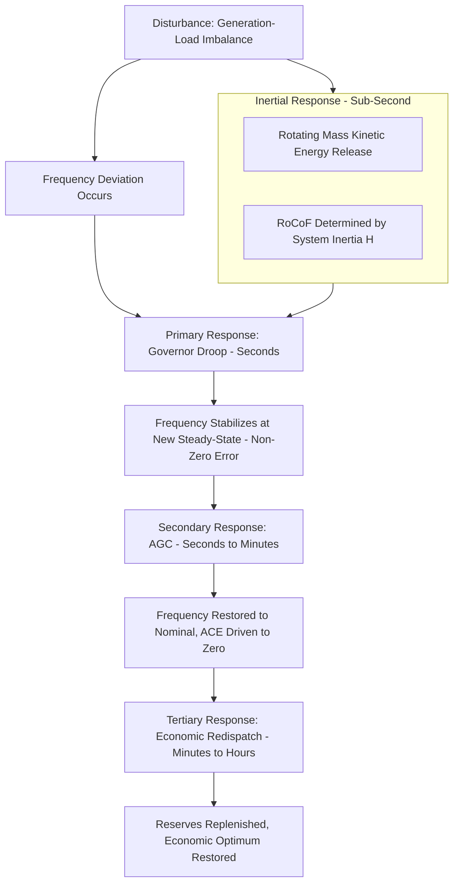

## Grid Stability, Frequency, and Voltage Regulation

### Definition and Scope

Grid stability refers to the power system's ability to maintain a steady operating state (nominal frequency, acceptable voltage levels, synchronized generator operation) under normal conditions and to return to an acceptable state following a disturbance. It is conventionally divided into three interrelated stability categories: **frequency stability**, **voltage stability**, and **rotor angle (synchronous) stability**.

Maintaining stability requires continuous, real-time balancing of two fundamental equalities:

- **Active power balance:** Generation = Load + Losses (governs frequency)
- **Reactive power balance:** Reactive generation/absorption matched locally (governs voltage)

---

### Frequency Stability and Regulation

**Physical Basis**

Grid frequency is directly tied to the rotational speed of synchronous generators. Any imbalance between generation and load manifests as a frequency deviation, governed by the system's **swing equation**:

$$2H \frac{d^2\delta}{dt^2} = P_m - P_e$$

Where $H$ is the per-unit inertia constant, $\delta$ is rotor angle, $P_m$ is mechanical input power, and $P_e$ is electrical output power. When $P_m \neq P_e$ (a mismatch between generation and load), the rotor accelerates or decelerates, directly changing frequency since $f$ is proportional to rotor speed for synchronous machines.

**Frequency Control Hierarchy**

Frequency regulation operates across three timescales:

| Control Layer | Timescale | Mechanism |
| --- | --- | --- |
| Primary (Governor) Response | Seconds (0–30s) | Automatic governor droop response, proportional to frequency deviation |
| Secondary (AGC / Regulation) | Seconds to minutes (30s–15min) | Automatic Generation Control adjusts setpoints to restore frequency to nominal and correct area control error |
| Tertiary (Economic Redispatch) | Minutes to hours | Manual/scheduled redispatch to restore primary/secondary reserves and optimize economics |

**Primary Frequency Response — Governor Droop**

Governors respond to frequency deviation via a droop characteristic:

$$\Delta P = -\frac{1}{R}\Delta f$$

Where $R$ is the droop (regulation) constant, typically expressed as a percentage (e.g., 5% droop means a 5% frequency deviation would produce 100% output change if unconstrained). Multiple generators sharing load proportional to their droop settings provide inherent stabilizing negative feedback without communication — a foundational "self-regulating" property of interconnected synchronous grids.

**System Frequency Response and Inertia**

Immediately following a generation-load imbalance (e.g., sudden generator trip), system frequency decline rate before governor action engages is:

$$\frac{df}{dt} = \frac{\Delta P}{2H \times S_{base}} \times f_0$$

This is the **Rate of Change of Frequency (RoCoF)**. Systems with high synchronous generator inertia (large rotating mass) exhibit slower RoCoF, giving governors and protection systems more time to respond before frequency reaches dangerous thresholds triggering under-frequency load shedding (UFLS).

**Key Point:** As grids integrate more inverter-based renewable generation (wind, solar) that displaces synchronous machines, system inertia declines, RoCoF increases for the same disturbance size, and frequency stability margins shrink — a central grid integration challenge motivating synthetic inertia and grid-forming inverter technologies.

**Automatic Generation Control (AGC) and Area Control Error (ACE)**

$$ACE = (P_{actual} - P_{scheduled}) - 10B(f_{actual} - f_{scheduled})$$

Where $B$ is the frequency bias factor (MW/0.1 Hz). AGC continuously adjusts generator setpoints within a balancing area to drive ACE toward zero, correcting both tie-line power deviations and frequency deviations simultaneously.

---

### Voltage Stability and Regulation

**Physical Basis**

Voltage stability concerns the system's ability to maintain acceptable voltages at all buses under normal operation and after disturbances, without uncontrolled voltage decline (voltage collapse). Unlike frequency (a system-wide quantity), voltage is a local phenomenon strongly tied to reactive power balance at each bus.

**The P-V Curve (Nose Curve)**

For a load supplied through a transmission line, plotting received voltage against transferred power produces a characteristic "nose curve":

- As load power increases, voltage initially declines gradually
- Beyond a critical point (the "nose"), further load increase causes voltage to collapse rapidly regardless of reactive support
- The nose point represents the **maximum power transfer limit / voltage stability limit** for that network configuration

Operating margin is defined as distance from the current operating point to the nose point; utilities maintain planning criteria requiring adequate margin under contingency conditions (e.g., N-1 line outage).

**Reactive Power Compensation Devices**

| Device | Function | Response Speed |
| --- | --- | --- |
| Shunt Capacitor Banks | Supply reactive power, raise voltage | Switched (discrete steps), slow |
| Shunt Reactors | Absorb reactive power, limit overvoltage | Switched, slow |
| Synchronous Condensers | Continuously variable reactive power + inertia contribution | Fast, continuous |
| Static VAR Compensator (SVC) | Continuously variable reactive power via thyristor control | Fast (cycles) |
| STATCOM | Continuously variable reactive power via voltage-source converter | Very fast, superior at low voltage |
| Automatic Voltage Regulators (AVR) on generators | Adjust field excitation to control terminal voltage | Fast, continuous |

**Voltage Collapse Mechanism**

Voltage collapse typically progresses as: initial disturbance (e.g., line trip) → increased reactive losses on remaining lines → voltage decline → load restoration dynamics (e.g., tap-changers, thermostatic loads) attempting to restore power consumption despite lower voltage → further increased current draw → cascading reactive power deficit → progressive voltage decline potentially leading to blackout.

---

### Rotor Angle (Synchronous) Stability

Closely coupled with frequency stability, rotor angle stability concerns whether interconnected synchronous generators remain in synchronism following a disturbance.

- **Small-signal (steady-state) stability:** Ability to maintain synchronism under small, continuous disturbances (e.g., normal load fluctuations) — analyzed via linearized swing equation and eigenvalue/damping analysis
- **Transient (large-disturbance) stability:** Ability to maintain synchronism following a large disturbance (e.g., fault, line trip) — analyzed via **equal area criterion** for simplified single-machine-infinite-bus systems, or full time-domain simulation for multi-machine systems

**Equal Area Criterion (conceptual):** For a generator subjected to a fault and subsequent clearing, the accelerating area (kinetic energy gained during fault) must be less than or equal to the available decelerating area (energy that can be absorbed as the rotor swings back) for the system to remain stable. This directly informs **critical clearing time** — the maximum fault duration before instability results.

---

### Diagram: Frequency Control Hierarchy and Timescales

---

### Diagram: Voltage Stability Nose Curve (svg_diagram)

<svg xmlns="http://www.w3.org/2000/svg" viewBox="0 0 600 400">
\<style\>
.axis { stroke: #1a1a1a; stroke-width: 1.5; }
.curve { stroke: #a85f5f; stroke-width: 2.5; fill: none; }
.label { font-family: sans-serif; font-size: 13px; fill: #1a1a1a; text-anchor: middle; }
.title { font-family: sans-serif; font-size: 16px; fill: #1a1a1a; text-anchor: middle; font-weight: bold; }
.point { fill: #2c5f7c; }
\</style\>
<text x="300" y="25" class="title">P-V Nose Curve — Voltage Stability Limit (svg_diagram)</text>
<line x1="80" y1="350" x2="80" y2="60" class="axis" />
<line x1="80" y1="350" x2="540" y2="350" class="axis" />
<text x="40" y="200" class="label" transform="rotate(-90 40 200)">Voltage (V)</text>
<text x="310" y="380" class="label">Power Transferred (P)</text>
<path d="M 80 100 Q 300 130 400 220 Q 460 280 480 340" class="curve" />
<circle cx="380" cy="200" r="5" class="point" />
<text x="380" y="185" class="label">Normal Operating Point</text>
<circle cx="450" cy="255" r="5" class="point" fill="#a85f5f" />
<text x="470" y="245" class="label">Nose Point</text>
<text x="470" y="262" class="label">(Max Transfer /</text>
<text x="470" y="279" class="label">Collapse Point)</text>
<line x1="450" y1="255" x2="450" y2="350" stroke="#888" stroke-dasharray="4,4" />
<text x="450" y="365" class="label">P_max</text>
<path d="M 480 340 Q 500 280 450 255" class="curve" stroke-dasharray="5,3" opacity="0.6" />
<text x="500" y="330" class="label">Unstable branch</text>
</svg>

---

### Worked Example: RoCoF Calculation

**Example:** A power system with total inertia constant $H = 5\ s$ (system base 10,000 MVA) experiences a sudden loss of 500 MW of generation at nominal frequency 50 Hz.

$$\Delta P_{pu} = \frac{500\ MW}{10{,}000\ MVA} = 0.05\ pu$$

$$\frac{df}{dt} = \frac{\Delta P_{pu}}{2H} \times f_0 = \frac{0.05}{2 \times 5} \times 50 = 0.25\ Hz/s$$

**Result:** Initial frequency decline rate is 0.25 Hz/s. If governor primary response begins engaging within 2–4 seconds, frequency nadir would reach roughly 49.5–49.0 Hz before stabilizing (exact nadir depends on governor response curve shape and any additional load damping effect) — within typical UFLS relay thresholds but illustrating why fast-responding reserves (e.g., battery storage, synthetic inertia) are increasingly valued as system inertia declines with renewable penetration. [Inference — nadir estimate is illustrative; actual nadir requires full governor dynamic response modeling, not just the initial RoCoF]

---

### Emerging Challenges: Low-Inertia Grid Operation

As synchronous generation is displaced by inverter-based renewable resources:

- **Reduced system inertia** increases RoCoF for a given disturbance, potentially triggering protection systems (RoCoF relays) or UFLS before governors can respond
- **Synthetic/virtual inertia** — control algorithms in wind turbine converters or battery storage inverters that emulate inertial response by rapidly adjusting active power output in proportion to RoCoF
- **Grid-forming inverters** — a newer control paradigm (as opposed to conventional "grid-following" inverters) that can establish voltage/frequency reference independently, enabling stable operation even in grids with very high inverter-based resource penetration
- **Fast Frequency Response (FFR) markets** — emerging ancillary service products compensating resources (batteries, demand response) for sub-second frequency support, distinct from traditional primary reserve

[Unverified — specific market designs and technical standards for grid-forming inverters and FFR products are actively evolving across different grid operators; treat named implementations as illustrative rather than universally standardized]

---

### Related Topics

- Swing Equation and Multi-Machine Transient Stability Simulation
- Automatic Generation Control (AGC) and Tie-Line Bias Control
- Grid-Forming vs. Grid-Following Inverter Control
- Under-Frequency and Under-Voltage Load Shedding Schemes
- Synchronous Condensers and Inertia Provision from Non-Generating Sources
- FACTS Devices for Dynamic Voltage Support
- Wide-Area Monitoring Systems (WAMS) and Phasor Measurement Units (PMUs)
- Ancillary Services Markets for Frequency and Voltage Support
- Cascading Failure Analysis and Blackout Case Studies
- Renewable Energy Integration and Grid Code Compliance