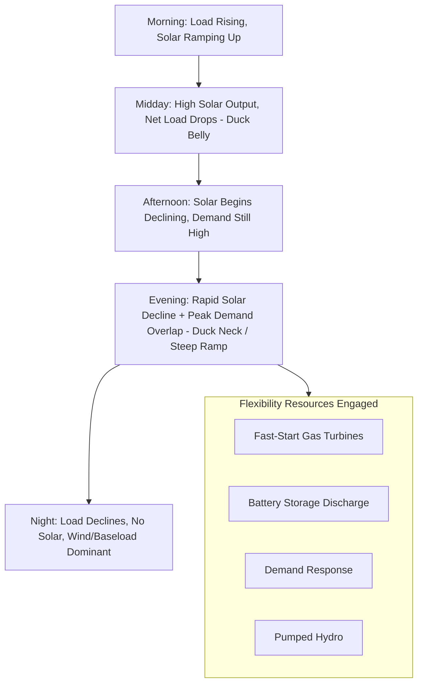

## Integration of Variable Renewable Energy Sources

### Definition and Scope

Variable Renewable Energy (VRE) integration refers to the technical, operational, and market challenges and solutions associated with incorporating weather-dependent generation sources — primarily wind and solar photovoltaic — into power systems historically designed around dispatchable, synchronous thermal and hydro generation. Unlike conventional generation, VRE output is driven by natural resource availability (wind speed, solar irradiance) rather than operator dispatch commands, introducing variability and uncertainty that must be managed at multiple timescales.

The core integration challenge is often summarized as managing three characteristics simultaneously:

- **Variability** — output changes continuously due to weather patterns (minutes to seasons)
- **Uncertainty** — imperfect forecastability of future output
- **Locational constraints** — resource-rich areas often distant from load centers, and non-dispatchable in the traditional sense (limited but not zero curtailment/curtailability)

---

### Timescales of Variability

| Timescale | Phenomenon | Primary Mitigation |
| --- | --- | --- |
| Sub-second to seconds | Cloud transients (solar), turbulence (wind) | Fast-responding reserves, inverter control, local storage |
| Minutes | Ramping events, cloud fronts | Regulation reserves, flexible generation ramping |
| Hours (intraday) | Solar diurnal cycle ("duck curve"), diurnal wind patterns | Load-following generation, storage, demand response |
| Days | Weather system passage, multi-day wind lulls | Unit commitment planning, interconnection imports |
| Seasonal | Solar insolation seasonality, seasonal wind patterns | Seasonal generation mix planning, long-duration storage |
| Interannual | Year-to-year resource variability | Capacity adequacy planning with resource diversity |

---

### The "Duck Curve" Phenomenon

The duck curve describes the characteristic net load shape (load minus VRE generation) that emerges with high solar PV penetration:

- Midday: Solar generation peaks, net load drops sharply (the "belly" of the duck)
- Late afternoon/evening: Solar output declines rapidly as demand simultaneously rises (evening peak), creating a steep upward ramp (the "neck")
- This steep ramp requires large quantities of fast-ramping dispatchable capacity to come online quickly

**Key Point:** The duck curve's steep evening ramp — not the midday minimum — is typically the more operationally challenging feature, since it requires significant generation capacity to ramp up within a short window (often 3–4 hours), straining conventional thermal plant ramp-rate capabilities and increasing cycling wear.

---

### Grid Flexibility Resources

Flexibility — the power system's ability to respond to variability and uncertainty across all timescales — is provided by a portfolio of resources:

**Supply-Side Flexibility**

- Flexible thermal generation (fast-start gas turbines, combined-cycle plants with wide turndown ratios)
- Pumped-storage hydro (fast ramping, both directions)
- Hydro with reservoir storage (dispatchable, fast response)

**Storage-Based Flexibility**

- Battery Energy Storage Systems (BESS) — increasingly dominant for short-duration (1–4 hour) flexibility, fast response (sub-second)
- Pumped hydro — dominant historical long-duration storage technology
- Emerging long-duration storage (compressed air, flow batteries, thermal storage, hydrogen) — [Unverified — commercial maturity and cost-competitiveness vary significantly by technology and are evolving rapidly; treat specific technology readiness claims as requiring current verification]

**Demand-Side Flexibility**

- Demand response programs (price signals, direct load control)
- Electric vehicle managed charging (potential vehicle-to-grid, V2G)
- Smart thermostats and flexible industrial loads

**Network/Market Flexibility**

- Transmission interconnection expansion (geographic diversity smooths aggregate VRE variability)
- Wider balancing area consolidation (larger footprint reduces relative variability and forecast error)
- Sub-hourly/5-minute market dispatch (reduces forecast error exposure window compared to hourly dispatch)

---

### Forecasting

Accurate VRE forecasting is central to integration, feeding unit commitment and dispatch decisions:

- **Wind forecasting:** Numerical Weather Prediction (NWP) models combined with statistical/ML post-processing; accuracy degrades with forecast horizon
- **Solar forecasting:** Satellite-derived cloud motion vectors (short horizon, minutes-hours), NWP (day-ahead), sky-imager-based nowcasting (very short horizon, seconds-minutes)
- **Probabilistic forecasting:** Increasingly preferred over deterministic point forecasts, providing uncertainty bands (e.g., 10th/50th/90th percentile) that inform reserve requirement sizing
- Forecast error directly translates into required operating reserves — utilities/system operators size regulation and contingency reserves partly based on statistical VRE forecast error distributions

---

### Curtailment

Curtailment — deliberately reducing VRE output below its potential — occurs when:

- Transmission constraints prevent full delivery of available generation
- Minimum generation constraints on must-run thermal/nuclear units limit how much VRE can be accommodated while maintaining system stability
- Oversupply relative to demand at a given moment (particularly midday solar oversupply)
- Insufficient flexible capacity to absorb rapid VRE ramps

Curtailment represents both an economic loss (foregone zero-marginal-cost generation) and a signal of insufficient flexibility/transmission capacity; persistent high curtailment rates typically motivate transmission expansion, storage deployment, or demand-side flexibility investment.

---

### Capacity Value and Adequacy

Because VRE output is not fully dispatchable, its contribution to resource adequacy (ability to meet peak demand reliably) is assessed differently than for conventional firm capacity:

**Effective Load Carrying Capability (ELCC)** — the standard metric quantifying VRE's capacity value, defined as the amount of additional firm (100% available) capacity that could be removed from the system while maintaining the same reliability level (typically measured via Loss of Load Expectation, LOLE) when the VRE resource is added.

- Solar ELCC tends to be high when system peak coincides with solar availability (summer afternoon peaking systems) but declines as solar penetration increases (diminishing marginal capacity value — the "cannibalization effect," since additional solar increasingly overlaps with existing solar output rather than covering new hours)
- Wind ELCC varies by resource correlation with peak demand periods and diversity of wind resource sites
- ELCC generally declines with increasing penetration of the same resource type due to diminishing marginal reliability contribution — a key planning consideration for long-term capacity expansion studies

---

### Grid Code Requirements for VRE Interconnection

Modern grid codes impose technical requirements on VRE plants to ensure system stability contribution:

- **Low Voltage Ride-Through (LVRT) / Fault Ride-Through (FRT):** Requirement to remain connected and continue operating through transient voltage dips rather than tripping offline, preventing cascading generation loss during faults
- **Reactive power capability:** Requirement to provide reactive power support (via inverter control) across a specified power factor range
- **Frequency response capability:** Requirement to provide primary frequency response (droop-based curtailment/reserve) and increasingly, synthetic inertia
- **Ramp rate limits:** Requirement to limit output ramp rate (both up and down) to reduce stress on system balancing
- **Power quality:** Harmonic distortion and flicker limits for inverter-based output

---

### System-Level Integration Strategies

| Strategy | Mechanism | Effectiveness Driver |
| --- | --- | --- |
| Geographic diversification | Spread VRE across wider area | Reduces correlated variability (weather systems affect limited geographic extent) |
| Technology diversification | Mix wind + solar + other renewables | Complementary generation profiles (e.g., wind often stronger at night/winter, solar daytime/summer) |
| Transmission expansion | Move power from resource-rich to load-rich regions | Enables access to better resource sites and aggregation benefits |
| Storage deployment | Time-shift generation to match demand | Directly addresses temporal mismatch |
| Sector coupling | Power-to-X (hydrogen, heat, EV charging) | Provides flexible demand-side sink for surplus VRE |
| Market design reform | Sub-hourly settlement, locational pricing | Improves price signals for flexibility investment |

---

### Diagram: Duck Curve Illustration

---

### Diagram: VRE Integration — Timescale to Flexibility Resource Mapping (svg_diagram)

<svg xmlns="http://www.w3.org/2000/svg" viewBox="0 0 700 380">
\<style\>
.box { fill: #eef3f8; stroke: #2c5f7c; stroke-width: 2; }
.arrow { stroke: #666; stroke-width: 1.5; marker-end: url(#arrow2); }
.label { font-family: sans-serif; font-size: 12px; fill: #1a1a1a; text-anchor: middle; }
.title { font-family: sans-serif; font-size: 16px; fill: #1a1a1a; text-anchor: middle; font-weight: bold; }
.axislabel { font-family: sans-serif; font-size: 13px; fill: #1a1a1a; font-weight: bold; }
\</style\>
<text x="350" y="25" class="title">Variability Timescale vs. Flexibility Resource (svg_diagram)</text>
<line x1="60" y1="340" x2="660" y2="340" stroke="#1a1a1a" stroke-width="1.5" />
<text x="360" y="365" class="axislabel">Timescale: Seconds → Minutes → Hours → Days → Seasons</text>
<rect x="60" y="280" width="90" height="50" class="box" />
<text x="105" y="308" class="label">Inverter Fast</text>
<text x="105" y="322" class="label">Response</text>
<rect x="170" y="250" width="90" height="50" class="box" />
<text x="215" y="278" class="label">Battery</text>
<text x="215" y="292" class="label">Storage</text>
<rect x="280" y="220" width="90" height="50" class="box" />
<text x="325" y="248" class="label">Fast-Start</text>
<text x="325" y="262" class="label">Gas / Hydro</text>
<rect x="390" y="190" width="90" height="50" class="box" />
<text x="435" y="218" class="label">Demand</text>
<text x="435" y="232" class="label">Response</text>
<rect x="500" y="160" width="90" height="50" class="box" />
<text x="545" y="188" class="label">Unit</text>
<text x="545" y="202" class="label">Commitment</text>
<rect x="580" y="80" width="90" height="50" class="box" />
<text x="625" y="108" class="label">Interconnection</text>
<text x="625" y="122" class="label">/ Diversity</text>
<line x1="150" y1="305" x2="170" y2="275" class="arrow" />
<line x1="260" y1="275" x2="280" y2="245" class="arrow" />
<line x1="370" y1="245" x2="390" y2="215" class="arrow" />
<line x1="480" y1="215" x2="500" y2="185" class="arrow" />
<line x1="590" y1="185" x2="600" y2="130" class="arrow" />
</svg>

---

### Worked Example: Simplified ELCC Illustration

**Example:** A system has 1000 MW of firm thermal capacity meeting a 950 MW peak with acceptable reliability (LOLE target met). 300 MW (nameplate) of solar PV is added. System studies determine that only 60 MW of firm thermal capacity could be retired while maintaining the same LOLE.

$$ELCC = \frac{60\ MW}{300\ MW} \times 100\% = 20\%$$

**Result:** The solar addition has an ELCC of 20% — meaning its "capacity value" toward resource adequacy is roughly one-fifth of its nameplate rating, reflecting that solar generates zero output during a substantial fraction of hours (including potentially some high-risk evening peak hours) despite averaging much higher capacity factor over the full year. [Inference — this is a simplified illustrative calculation; actual ELCC studies require detailed loss-of-load probability modeling across many weather years, not a single-scenario comparison]

---

### Related Topics

- Battery Energy Storage System (BESS) Sizing and Dispatch Strategy
- Effective Load Carrying Capability (ELCC) Methodology in Resource Adequacy Studies
- Grid-Forming Inverter Control for High-VRE Systems
- Demand Response Program Design and Dispatch
- Sector Coupling and Power-to-X Technologies
- Wind and Solar Forecasting Methods (NWP, ML-Based, Probabilistic)
- Transmission Planning for Renewable Energy Zones
- Capacity Markets and Resource Adequacy Mechanisms
- Grid Codes and Interconnection Standards for Inverter-Based Resources
- Pumped-Storage Hydro Design and Operation