## Energy Storage for Grid Support

### Definition and Role in Power Systems

Grid-connected energy storage systems absorb electrical energy during periods of surplus generation or low demand and discharge it during periods of deficit or high demand, providing temporal decoupling between generation and consumption. Storage serves multiple grid functions simultaneously across a wide range of discharge durations and response speeds, making it one of the most versatile flexibility resources in modern power systems.

Storage value stacking spans:

- **Energy arbitrage** — buy/charge at low price periods, sell/discharge at high price periods
- **Capacity/resource adequacy** — contribute to meeting peak demand reliability requirements
- **Ancillary services** — frequency regulation, spinning reserve, voltage support
- **Transmission/distribution deferral** — avoid or postpone network infrastructure upgrades
- **Renewable integration support** — smooth VRE variability, shift generation to match load

---

### Storage Technology Classification by Duration

| Category | Discharge Duration | Representative Technologies |
| --- | --- | --- |
| Power-focused (short duration) | Seconds to minutes | Flywheels, supercapacitors, some Li-ion configurations |
| Short-duration energy storage | 1–4 hours | Lithium-ion batteries (dominant current deployment) |
| Medium-duration | 4–10 hours | Advanced batteries, some flow battery configurations |
| Long-duration energy storage (LDES) | 10+ hours to multi-day | Pumped hydro, compressed air, flow batteries, thermal storage, hydrogen |
| Seasonal storage | Weeks to months | Hydrogen, large-scale thermal storage, seasonal pumped hydro |

[Inference] The categorization boundaries and technology-duration mapping are illustrative industry conventions rather than fixed universal definitions — specific deployments vary by manufacturer and configuration.

---

### Core Storage Technologies

**Pumped-Storage Hydro (PSH)**

- Mature, dominant technology by installed global capacity for decades
- Pumps water to an elevated reservoir during surplus periods; releases through turbines during deficit periods
- Round-trip efficiency: typically 70–85%
- Response time: seconds to minutes depending on unit type (fixed-speed vs. variable-speed)
- Long asset life (50+ years), high capital cost, significant siting/topographic and environmental constraints

Energy storage capacity:

$$E = \rho g h V \eta$$

Where $\rho$ is water density, $g$ is gravitational acceleration, $h$ is head (elevation difference), $V$ is water volume, and $\eta$ is round-trip efficiency.

**Battery Energy Storage Systems (BESS)**

- Lithium-ion (various chemistries: NMC, LFP) dominant for current grid-scale deployment
- Round-trip efficiency: typically 85–95%
- Response time: milliseconds to seconds — well suited to fast frequency response and regulation services
- Degradation considerations: cycle life, calendar aging, depth-of-discharge sensitivity, thermal management requirements
- Modular and scalable, rapid deployment timelines relative to PSH or thermal alternatives

**Compressed Air Energy Storage (CAES)**

- Compresses air into underground caverns (salt formations typically) or above-ground vessels during charging; expands through a turbine during discharge
- Diabatic CAES requires natural gas combustion during expansion (partial round-trip efficiency, historically 40–55%)
- Adiabatic/isothermal variants aim to capture and reuse compression heat, improving round-trip efficiency [Unverified — commercial-scale adiabatic CAES efficiency claims vary by developer and should be checked against demonstrated project performance rather than theoretical potential]

**Flow Batteries**

- Energy stored in liquid electrolyte tanks (e.g., vanadium redox), with power and energy capacity independently scalable (larger tanks = more energy, without needing more stack capacity)
- Well suited to longer-duration applications due to this decoupling
- Lower energy density than Li-ion, generally longer cycle life with minimal capacity degradation

**Thermal Energy Storage (TES)**

- Stores energy as heat (molten salt, phase-change materials) or cold, often paired with concentrated solar power (CSP) plants or used for grid-scale heat/cooling load shifting
- Can enable dispatchable operation of otherwise variable renewable sources (e.g., CSP with molten salt storage providing power after sunset)

**Hydrogen-Based Storage**

- Electrolysis converts surplus electricity to hydrogen; stored and later reconverted via fuel cells or combustion turbines
- Round-trip efficiency generally low (30–45%) [Unverified — efficiency figures depend heavily on electrolyzer/fuel-cell technology and system configuration, and continue to evolve with technology development] due to double energy conversion losses
- Primary value proposition is very long duration/seasonal storage and sector coupling (hydrogen use beyond power sector), not round-trip efficiency competitiveness with batteries for short-duration cycling

**Flywheels**

- Kinetic energy storage via high-speed rotating mass
- Extremely fast response (milliseconds), high cycle life, low energy density
- Well suited to frequency regulation, poorly suited to energy arbitrage (short duration, minutes at most)

---

### Grid Services Provided by Storage

| Service | Typical Storage Fit | Value Driver |
| --- | --- | --- |
| Frequency regulation | Batteries, flywheels | Fast, precise, bidirectional response |
| Spinning/contingency reserve | Batteries, pumped hydro | Fast full-output availability |
| Energy arbitrage | Batteries, pumped hydro, LDES | Price spread between charge/discharge periods |
| Capacity/resource adequacy | Batteries (duration-dependent ELCC), pumped hydro | Contribution to peak reliability |
| Voltage support | Batteries (via inverter reactive power control), synchronous condensers (non-storage but related) | Fast reactive power injection/absorption |
| Black start | Batteries, pumped hydro | Ability to energize grid without external power |
| Transmission/distribution deferral | Distributed batteries at constrained nodes | Avoided/delayed network capital expenditure |
| Renewable smoothing | Batteries co-located with VRE | Reduces ramp rate, firms output |

---

### Storage Sizing Considerations

Key parameters for grid storage system design:

- **Power rating (MW)** — maximum instantaneous charge/discharge rate
- **Energy capacity (MWh)** — total stored energy at full charge
- **Duration (hours) = Energy Capacity / Power Rating** — determines which grid services the asset can economically provide
- **Round-trip efficiency** — determines arbitrage economics (energy lost must be covered by price spread)
- **Depth of discharge (DoD) and cycling limits** — affects usable capacity and degradation-driven economic life, particularly for batteries

**Example — Duration and Service Matching:**

A 100 MW / 100 MWh battery (1-hour duration) is well suited to frequency regulation and short arbitrage but poorly suited to multi-hour peak shaving during an extended demand peak. A 100 MW / 400 MWh battery (4-hour duration) can shift the bulk of a typical evening demand peak but at substantially higher capital cost per MW.

---

### Worked Example: Storage Arbitrage Economics

**Example:** A 50 MW / 200 MWh battery (4-hour duration, round-trip efficiency 88%) charges during an off-peak period at $20/MWh and discharges during a peak period at $80/MWh.

Energy purchased to charge fully:

$$E_{charge} = 200\ MWh$$

Cost to charge:

$$C_{charge} = 200\ MWh \times \$20/MWh = \$4{,}000$$

Usable energy delivered on discharge (accounting for round-trip losses):

$$E_{discharge} = 200\ MWh \times 0.88 = 176\ MWh$$

Revenue from discharge:

$$R_{discharge} = 176\ MWh \times \$80/MWh = \$14{,}080$$

Gross margin per cycle:

$$Margin = \$14{,}080 - \$4{,}000 = \$10{,}080$$

**Result:** This single-cycle gross margin of $10,080 (before accounting for capital cost amortization, degradation cost per cycle, and O&M) illustrates the basic arbitrage mechanics; real-world dispatch optimization accounts for degradation cost per cycle against expected price spread to determine whether cycling is economically justified on any given day. [Inference — actual dispatch decisions also depend on ancillary service opportunity costs, which are excluded from this simplified single-service illustration]

---

### Diagram: Storage Technology Landscape by Duration and Power Rating

```mermaid
flowchart LR
    subgraph Short_Duration[Seconds to Minutes]
    A1[Flywheels]
    A2[Supercapacitors]
    end

    subgraph Hours_1to4[1 to 4 Hours]
    B1[Lithium-Ion Batteries]
    B2[Some Flow Batteries]
    end

    subgraph Hours_4to10[4 to 10 Hours]
    C1[Advanced Batteries]
    C2[Flow Batteries]
    end

    subgraph Long_Duration[10+ Hours to Multi-Day]
    D1[Pumped Hydro]
    D2[Compressed Air CAES]
    D3[Thermal Storage]
    end

    subgraph Seasonal[Weeks to Months]
    E1[Hydrogen]
    E2[Large-Scale Thermal]
    end

    Short_Duration --> Hours_1to4 --> Hours_4to10 --> Long_Duration --> Seasonal
```

---

### Diagram: Pumped-Storage Hydro Schematic (svg_diagram)

<svg xmlns="http://www.w3.org/2000/svg" viewBox="0 0 600 400">
\<style\>
.water { fill: #a8c8d8; stroke: #2c5f7c; stroke-width: 2; }
.ground { fill: #d8cba8; stroke: #8a7550; stroke-width: 1.5; }
.pipe { fill: none; stroke: #555; stroke-width: 4; }
.comp { fill: #eef3f8; stroke: #2c5f7c; stroke-width: 2; }
.label { font-family: sans-serif; font-size: 13px; fill: #1a1a1a; text-anchor: middle; }
.title { font-family: sans-serif; font-size: 16px; fill: #1a1a1a; text-anchor: middle; font-weight: bold; }
\</style\>
<text x="300" y="25" class="title">Pumped-Storage Hydro Schematic (svg_diagram)</text>
<rect x="50" y="60" width="200" height="60" class="water" />
<text x="150" y="95" class="label">Upper Reservoir</text>
<path d="M100 250 L500 250 L500 380 L100 380 Z" class="ground" />
<rect x="400" y="290" width="150" height="60" class="water" />
<text x="475" y="325" class="label">Lower Reservoir</text>
<path d="M150 120 Q150 200 300 250" class="pipe" />
<text x="200" y="180" class="label">Penstock</text>
<rect x="270" y="240" width="80" height="40" class="comp" />
<text x="310" y="265" class="label">Turbine/Pump</text>
<path d="M350 260 L400 300" class="pipe" />

<text x="150" y="150" class="label">Charging: Pump water up</text>

<text x="150" y="165" class="label">(using surplus electricity)</text>

<text x="450" y="230" class="label">Discharging: Release water down</text>

<text x="450" y="245" class="label">(generating electricity)</text>

</svg>

---

### Emerging Trends

[Unverified — this area evolves rapidly; treat as directional context]

- Continued Li-ion cost declines driving rapid short-duration storage deployment growth globally
- Increasing commercial interest in iron-air, sodium-ion, and other alternative battery chemistries targeting lower cost per MWh for longer-duration applications
- Hybrid storage-generation co-location (e.g., solar+storage, wind+storage) becoming a standard project configuration in many markets
- Growing regulatory/market attention to "long-duration storage" as a distinct procurement category, reflecting recognition that Li-ion economics degrade for durations beyond roughly 4–8 hours

---

### Related Topics

- Battery Degradation Mechanisms and State-of-Health Estimation
- Pumped-Storage Hydro Site Selection and Design
- Ancillary Services Market Participation for Storage Assets
- Effective Load Carrying Capability (ELCC) for Storage Resources
- Hydrogen Production via Electrolysis and Power-to-Gas Systems
- Battery Management Systems (BMS) and Thermal Management
- Storage Co-Location Strategies with Variable Renewable Energy
- Levelized Cost of Storage (LCOS) Methodology
- Grid Codes for Inverter-Based Storage Interconnection
- Second-Life Battery Applications for Grid Storage