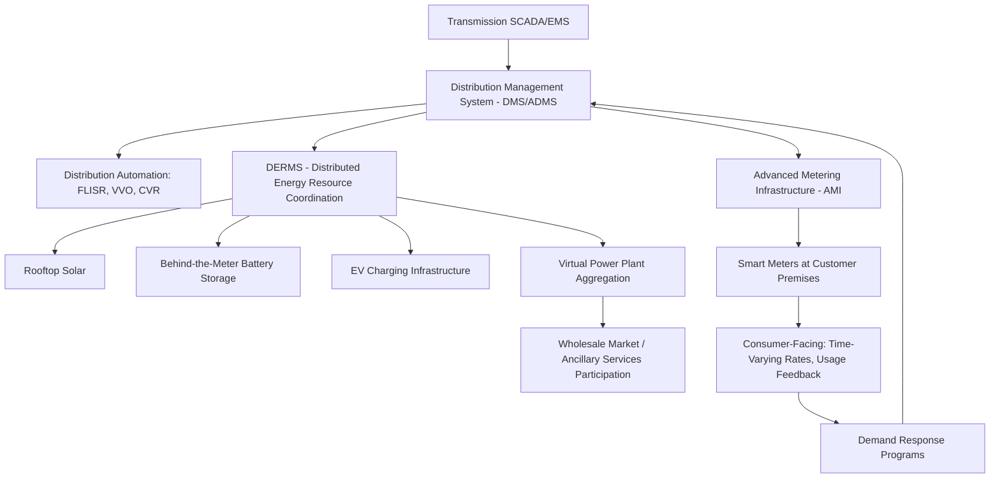

## Smart Grids and Demand-Side Management

### Definition and Scope

A smart grid is an electricity network that integrates digital communication, sensing, automation, and control technologies with traditional power delivery infrastructure to enable bidirectional flow of electricity and information between utilities and consumers. Demand-Side Management (DSM) encompasses the set of programs and technologies that actively shape when and how electricity is consumed, shifting the traditional paradigm from "generation follows load" toward a more flexible, two-way interaction between supply and demand.

Smart grids and DSM are closely coupled: the digital infrastructure of a smart grid (advanced metering, communication networks, automation) is what makes sophisticated, granular, and responsive demand-side management technically feasible at scale.

---

### Core Smart Grid Components

**Advanced Metering Infrastructure (AMI)**

- Smart meters replacing traditional electromechanical meters, providing interval-level (typically 15-minute to hourly) consumption data
- Two-way communication enabling remote meter reading, outage detection/notification, remote connect/disconnect, and time-varying rate implementation
- Communication technologies: Power Line Carrier (PLC), RF mesh networks, cellular (LTE/5G), and increasingly hybrid architectures

**Distribution Automation (DA)**

- Automated switches, reclosers, and sectionalizers enabling **Fault Location, Isolation, and Service Restoration (FLISR)** — automatically detecting a fault, isolating the affected segment, and restoring service to unaffected sections without manual dispatch
- **Volt/VAR Optimization (VVO)** — automated coordination of voltage regulators, capacitor banks, and tap-changers to minimize losses and maintain voltage within limits across the distribution feeder
- **Conservation Voltage Reduction (CVR)** — deliberately operating distribution voltage toward the lower end of the acceptable band, exploiting the relationship between voltage and power consumption for many load types to reduce aggregate energy consumption

**Communication and Data Infrastructure**

- **Supervisory Control and Data Acquisition (SCADA)** — long-standing utility control system architecture, now extended with smart grid data
- **Distribution Management System (DMS)** — software platform integrating real-time distribution network monitoring, control, and optimization
- **Advanced Distribution Management System (ADMS)** — next-generation DMS incorporating DERMS (Distributed Energy Resource Management System) functionality for coordinating rooftop solar, storage, and other distributed resources
- Communication standards: IEC 61850 (substation automation), DNP3 (utility SCADA protocol), OpenADR (demand response signaling)

**Sensing and Situational Awareness**

- **Phasor Measurement Units (PMUs)** — high-speed, GPS-synchronized measurement devices providing wide-area visibility into grid dynamic behavior at sub-second resolution, feeding **Wide-Area Monitoring Systems (WAMS)**
- Distribution-level sensors for real-time loading, fault current, and power quality monitoring

---

### Demand-Side Management Categories

**Energy Efficiency**

- Permanent reduction in energy consumption through improved equipment/building efficiency (not a timing shift, a genuine reduction)
- Distinguished from demand response, which shifts timing rather than reducing total consumption

**Demand Response (DR)**

| DR Type | Mechanism | Typical Participant |
| --- | --- | --- |
| Price-based (implicit) DR | Consumers respond voluntarily to time-varying prices (Time-of-Use, Critical Peak Pricing, Real-Time Pricing) | Residential, commercial |
| Incentive-based (explicit) DR | Utility/aggregator directly dispatches enrolled load reduction in exchange for payment | Commercial, industrial, aggregated residential |
| Direct Load Control (DLC) | Utility remotely cycles specific end-use loads (e.g., AC compressors, water heaters) during peak events | Residential |
| Emergency Demand Response | Activated only during system emergency/reliability events, typically compensated at premium rates | Large industrial/commercial |

**Time-Varying Rate Structures**

- **Time-of-Use (TOU) rates** — fixed price blocks by time period (e.g., peak/off-peak), known in advance
- **Critical Peak Pricing (CPP)** — substantially higher price during a limited number of utility-called critical events per year/season
- **Real-Time Pricing (RTP)** — price varies continuously (often hourly or sub-hourly) reflecting wholesale market conditions

---

### Distributed Energy Resources (DER) Integration

Smart grids increasingly must manage a proliferation of customer-sited resources:

- Rooftop/behind-the-meter solar PV
- Residential and commercial battery storage
- Electric vehicle charging infrastructure
- Smart thermostats and building automation systems
- Backup generators participating in virtual power plant arrangements

**Distributed Energy Resource Management Systems (DERMS)** coordinate visibility and, where authorized, control over these resources — aggregating them for grid services (e.g., virtual power plants providing capacity or ancillary services) while managing distribution-level constraints (voltage, thermal limits) that DER proliferation can create on feeders not originally designed for significant reverse power flow.

**Virtual Power Plants (VPPs)**

- Aggregations of distributed resources (solar, storage, flexible loads, EVs) controlled collectively to behave as a single dispatchable resource from the system operator's perspective
- Enable smaller distributed assets to participate meaningfully in wholesale markets or provide grid services that would be impractical for any single small resource individually

---

### Electric Vehicle Integration

EV charging represents both a demand-side management challenge and opportunity:

- **Uncoordinated charging risk:** Simultaneous evening charging (coinciding with residential peak) can exacerbate distribution transformer loading and system peak demand
- **Managed/smart charging:** Shifting charging timing based on price signals, grid conditions, or direct utility/aggregator control, typically shifting toward overnight off-peak periods or periods of high renewable output
- **Vehicle-to-Grid (V2G):** Bidirectional charging enabling EVs to discharge stored energy back to the grid during high-demand periods, effectively functioning as mobile, distributed storage — [Unverified — V2G commercial deployment scale, standards maturity (e.g., ISO 15118 bidirectional support), and battery warranty implications continue to evolve and vary significantly by manufacturer and market]

---

### Cybersecurity Considerations

The bidirectional, IP-connected nature of smart grid infrastructure introduces cybersecurity considerations absent from traditional one-way analog grid architecture:

- Expanded attack surface from millions of connected smart meters and distributed automation devices
- Critical infrastructure protection standards (e.g., NERC CIP in North America) impose cybersecurity requirements on bulk power system assets
- Defense-in-depth approaches: network segmentation, encrypted communication protocols, intrusion detection systems, and secure firmware update mechanisms for field devices
- [Inference] This is a rapidly evolving regulatory and technical area; specific compliance frameworks should be verified against current standards for the relevant jurisdiction rather than treated as fixed

---

### Diagram: Smart Grid Architecture Layers

---

### Diagram: Demand Response Event Sequence (svg_diagram)

<svg xmlns="http://www.w3.org/2000/svg" viewBox="0 0 700 350">
\<style\>
.box { fill: #eef3f8; stroke: #2c5f7c; stroke-width: 2; }
.arrow { stroke: #2c5f7c; stroke-width: 2; marker-end: url(#arrow3); fill: none; }
.label { font-family: sans-serif; font-size: 13px; fill: #1a1a1a; text-anchor: middle; }
.title { font-family: sans-serif; font-size: 16px; fill: #1a1a1a; text-anchor: middle; font-weight: bold; }
\</style\>
<text x="350" y="25" class="title">Demand Response Event Sequence (svg_diagram)</text>
<rect x="30" y="60" width="140" height="60" rx="6" class="box" />
<text x="100" y="85" class="label">System Operator</text>
<text x="100" y="102" class="label">Forecasts Peak Stress</text>
<rect x="220" y="60" width="140" height="60" rx="6" class="box" />
<text x="290" y="85" class="label">DR Event Signal</text>
<text x="290" y="102" class="label">Sent (OpenADR)</text>
<rect x="410" y="60" width="140" height="60" rx="6" class="box" />
<text x="480" y="85" class="label">Aggregator/DERMS</text>
<text x="480" y="102" class="label">Dispatches Resources</text>
<rect x="600" y="60" width="80" height="60" rx="6" class="box" />
<text x="640" y="85" class="label">Load</text>
<text x="640" y="102" class="label">Reduced</text>
<path d="M170 90 L220 90" class="arrow" />
<path d="M360 90 L410 90" class="arrow" />
<path d="M550 90 L600 90" class="arrow" />
<rect x="220" y="180" width="140" height="60" rx="6" class="box" fill="#f8f0e3" stroke="#a67c2e" />
<text x="290" y="205" class="label">Verification/</text>
<text x="290" y="222" class="label">Measurement (M&amp;V)</text>
<rect x="410" y="180" width="140" height="60" rx="6" class="box" fill="#f8f0e3" stroke="#a67c2e" />
<text x="480" y="205" class="label">Settlement/</text>
<text x="480" y="222" class="label">Payment to Participant</text>
<path d="M640 120 L640 210 L360 210" class="arrow" />
<path d="M360 210 L410 210" class="arrow" />
</svg>

---

### Worked Example: Conservation Voltage Reduction Impact

**Example:** A feeder serves 5 MW average load at nominal voltage. The feeder's aggregate load exhibits a voltage-sensitivity coefficient where power consumption scales approximately as $P \propto V^{0.8}$ (a blended coefficient reflecting the load mix). CVR reduces average feeder voltage by 2% (e.g., from 122V to 119.6V on a 120V base).

$$\frac{P_{new}}{P_{old}} = \left(\frac{V_{new}}{V_{old}}\right)^{0.8} = (0.98)^{0.8} = 0.9839$$

$$P_{new} = 5\ MW \times 0.9839 = 4.92\ MW$$

**Result:** A 2% voltage reduction yields approximately 1.6% energy consumption reduction under this load mix assumption — commonly summarized via a "CVR factor" (ratio of % load reduction to % voltage reduction), here approximately 0.8. [Inference — the CVR factor is highly load-mix dependent and varies by feeder, season, and time of day; this example uses an illustrative coefficient rather than a universal constant]

---

### Related Topics

- Advanced Metering Infrastructure (AMI) Communication Architectures
- Distributed Energy Resource Management Systems (DERMS) Design
- Virtual Power Plant (VPP) Aggregation and Market Participation
- Vehicle-to-Grid (V2G) Standards and Technical Requirements
- Volt/VAR Optimization and Conservation Voltage Reduction
- NERC CIP and Smart Grid Cybersecurity Standards
- Time-Varying Electricity Rate Design (TOU, CPP, RTP)
- Fault Location, Isolation, and Service Restoration (FLISR) Systems
- Phasor Measurement Units and Wide-Area Monitoring Systems
- Grid Stability, Frequency, and Voltage Regulation