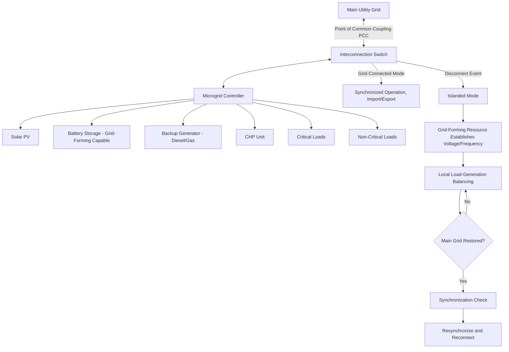

## Microgrids and Distributed Generation

### Definitions

**Distributed Generation (DG)** refers to small-scale electricity generation located at or near the point of consumption, as opposed to large centralized power plants delivering power over long transmission distances. Common DG technologies include rooftop/community solar PV, small wind, combined heat and power (CHP) units, small hydro, backup diesel/gas generators, and fuel cells.

**Microgrids** are localized groups of interconnected loads and distributed energy resources within clearly defined electrical boundaries, capable of operating either connected to the main grid ("grid-tied" or "grid-connected" mode) or independently ("island mode" or "islanded operation"), with the defining characteristic being the ability to intentionally disconnect and reconnect at a **Point of Common Coupling (PCC)**.

**Key Point:** Not all distributed generation constitutes a microgrid — a rooftop solar installation is DG but not a microgrid unless it is part of a system with defined boundaries, its own control scheme, and island-capable operation. The islanding capability with autonomous control is the definitional feature distinguishing a microgrid from simple DG.

---

### Microgrid Architecture Components

**Generation Assets**

- Diesel/natural gas generators (dispatchable, often used for reliability backbone)
- Solar PV, small wind (variable renewable)
- CHP units (dual heat/power output, often high overall efficiency)
- Fuel cells

**Energy Storage**

- Battery storage — critical for smoothing variable DG output and enabling stable islanded operation
- Provides the fast-responding balancing capability that a small isolated system needs, since it lacks the large synchronous inertia and reserve margin of a bulk power grid

**Microgrid Controller**

- Central intelligence coordinating generation dispatch, storage charge/discharge, and load management
- Manages the critical **transition sequence** between grid-connected and islanded modes
- Implements local frequency/voltage regulation during island mode (functions the bulk grid would otherwise provide)

**Point of Common Coupling (PCC) and Interconnection Switch**

- The electrical boundary point where the microgrid connects to the main utility grid
- Static or mechanical switches enabling controlled disconnection (planned or automatic upon detecting upstream grid disturbance)

---

### Operating Modes

**Grid-Connected Mode**

- Microgrid operates synchronized with the main grid, may import or export power
- Main grid provides frequency/voltage reference; microgrid generation typically operates in "grid-following" mode
- DG within the microgrid can participate in wholesale/retail energy transactions, arbitrage, or grid services depending on market rules

**Islanded (Autonomous) Mode**

- Microgrid disconnects from the main grid, either intentionally (e.g., utility-requested for maintenance, or triggered by detected upstream fault) or unintentionally (unplanned outage)
- At least one resource within the microgrid must establish voltage/frequency reference (**grid-forming** control), since no external reference exists
- Requires careful generation-load balance management given typically limited reserve margin relative to a bulk grid
- **Black start capability** — some microgrid configurations can energize from a fully de-energized state without external grid support, valuable for resilience applications

**Transition Management**

- **Planned islanding:** Controlled transition with advance notice, allowing generation/load balancing preparation
- **Unplanned islanding:** Must be detected rapidly (anti-islanding protection is actually a standard *requirement* for grid-tied DG inverters to prevent unintentional islanding for safety — see below) and managed by the microgrid controller to avoid instability or unsafe conditions
- **Resynchronization:** Reconnecting to the main grid requires matching voltage magnitude, frequency, and phase angle before closing the interconnection switch — synchronization check relays verify these conditions

---

### Anti-Islanding Protection (Important Distinction)

For grid-tied DG *not* designed as an intentional microgrid, **anti-islanding protection is a mandatory safety requirement** — inverters must detect loss of grid connection and cease energizing the local circuit within a specified time (per standards such as IEEE 1547) to protect utility line workers from unexpected energized lines during outage restoration.

This creates an important technical distinction: a microgrid is specifically engineered to island safely and intentionally (with proper isolation, grounding, and controlled transition), whereas ordinary grid-tied DG (e.g., typical residential rooftop solar) is engineered to prevent islanding entirely as a default safety posture. Converting simple grid-tied DG into true microgrid capability requires additional switchgear, controls, and safety systems beyond standard interconnection equipment.

---

### Control Hierarchy in Microgrids

Analogous to bulk power system control hierarchy, but implemented at a much smaller scale and faster timescale:

| Control Level | Function | Timescale |
| --- | --- | --- |
| Primary Control | Local droop control at each DG/storage unit for immediate power sharing | Milliseconds to seconds |
| Secondary Control | Restores frequency/voltage to nominal setpoints, corrects primary control steady-state deviation | Seconds |
| Tertiary Control | Optimizes economic dispatch, coordinates with main grid (in grid-connected mode) or long-term resource management (in island mode) | Minutes to hours |

**Droop Control in Microgrids:** Since islanded microgrids often lack a single dominant synchronous reference, multiple inverter-based DG/storage units share load via droop characteristics analogous to bulk-system governor droop:

$$f = f_0 - m_p(P - P_0)$$

$$V = V_0 - m_q(Q - Q_0)$$

Where $m_p$, $m_q$ are droop coefficients governing active/reactive power sharing among parallel-operating inverters.

---

### Grid-Forming vs. Grid-Following Inverters in Microgrid Context

- **Grid-following inverters:** Synchronize to an existing voltage/frequency reference (provided by the bulk grid or another grid-forming source); cannot independently establish system voltage/frequency — most conventional solar/wind inverters operate this way
- **Grid-forming inverters:** Actively establish voltage magnitude and frequency reference, essential for at least one resource in an islanded microgrid to provide this function; increasingly implemented in battery storage inverters specifically to enable microgrid islanding capability

---

### DC Microgrids

An emerging/parallel architecture avoids AC synchronization complexity entirely:

- Native DC generation sources (solar PV, batteries) and DC loads (LED lighting, electronics, some motor drives via variable frequency drives) connect via a DC bus
- Eliminates multiple DC-AC-DC conversion stages present in AC microgrids feeding DC loads, potentially improving overall efficiency
- Simpler control (no frequency/phase synchronization requirement — only voltage regulation)
- [Unverified — DC microgrid standardization (voltage levels, protection schemes) is less mature than AC equivalents and continues to evolve; treat specific voltage standards as context-dependent rather than universally fixed]

---

### Use Cases and Value Propositions

| Use Case | Primary Driver |
| --- | --- |
| Critical facility resilience (hospitals, data centers, military bases) | Reliability during main grid outages |
| Remote/island communities | No practical bulk grid interconnection; microgrid may be the primary power system |
| Campus/institutional (universities, corporate campuses) | Reliability + potential economic optimization via on-site generation |
| Community resilience microgrids | Serve critical community loads (shelters, emergency services) during extended outages |
| Industrial facilities with CHP | Economic optimization (efficient co-generation) with resilience as secondary benefit |

---

### Diagram: Microgrid Architecture and Operating Modes

---

### Diagram: Grid-Connected vs. Islanded Mode Power Flow (svg_diagram)

<svg xmlns="http://www.w3.org/2000/svg" viewBox="0 0 700 380">
\<style\>
.box { fill: #eef3f8; stroke: #2c5f7c; stroke-width: 2; }
.island { fill: #f8f0e3; stroke: #a67c2e; stroke-width: 2; }
.wire { stroke: #2c5f7c; stroke-width: 2.5; fill: none; }
.wirebroken { stroke: #a85f5f; stroke-width: 2.5; fill: none; stroke-dasharray: 6,4; }
.label { font-family: sans-serif; font-size: 12px; fill: #1a1a1a; text-anchor: middle; }
.title { font-family: sans-serif; font-size: 15px; fill: #1a1a1a; text-anchor: middle; font-weight: bold; }
\</style\>
<text x="350" y="22" class="title">Grid-Connected (left) vs. Islanded (right) Mode (svg_diagram)</text>

<text x="150" y="45" class="label" font-weight="bold">Grid-Connected Mode</text>

<rect x="60" y="60" width="100" height="40" class="box" />

<text x="110" y="85" class="label">Main Grid</text>

<line x1="160" y1="80" x2="220" y2="80" class="wire" />

<circle cx="220" cy="80" r="6" fill="`#2c5f7c`" />

<text x="220" y="65" class="label">PCC (Closed)</text>

<line x1="220" y1="80" x2="280" y2="80" class="wire" />

<rect x="280" y="60" width="100" height="40" class="box" />

<text x="330" y="85" class="label">Microgrid</text>

<text x="550" y="45" class="label" font-weight="bold">Islanded Mode</text>

<rect x="460" y="60" width="100" height="40" class="box" opacity="0.4" />

<text x="510" y="85" class="label">Main Grid</text>

<line x1="560" y1="80" x2="620" y2="80" class="wirebroken" />

<circle cx="620" cy="80" r="6" fill="`#a85f5f`" />

<text x="620" y="65" class="label">PCC (Open)</text>

<rect x="440" y="150" width="220" height="180" class="island" />
<text x="550" y="175" class="label" font-weight="bold">Islanded Microgrid</text>
<rect x="460" y="195" width="70" height="35" class="box" />
<text x="495" y="217" class="label">Solar PV</text>
<rect x="550" y="195" width="90" height="35" class="box" />
<text x="595" y="217" class="label">Battery (Grid-Forming)</text>
<rect x="460" y="245" width="70" height="35" class="box" />
<text x="495" y="267" class="label">Generator</text>
<rect x="550" y="245" width="90" height="35" class="box" />
<text x="595" y="267" class="label">Critical Loads</text>
<text x="550" y="305" class="label">Local frequency/voltage</text>
<text x="550" y="320" class="label">reference established internally</text>
</svg>

---

### Worked Example: Microgrid Sizing for Critical Load

**Example:** A hospital microgrid must sustain 800 kW of critical load for a minimum 8-hour outage using solar PV (average 300 kW output during daylight availability window) plus battery storage, with a backup generator sized for full critical load coverage as the reliability backstop.

Battery energy required if solar unavailable (e.g., nighttime outage, worst case):

$$E_{battery} = 800\ kW \times 8\ hr = 6{,}400\ kWh$$

If solar is available for 4 of the 8 hours at 300 kW average output:

$$E_{solar\ contribution} = 300\ kW \times 4\ hr = 1{,}200\ kWh$$

$$E_{battery,\ reduced} = 6{,}400\ kWh - 1{,}200\ kWh = 5{,}200\ kWh$$

**Result:** Under the daylight-availability scenario, required battery capacity drops from 6,400 kWh to 5,200 kWh, illustrating why solar+storage sizing studies must evaluate worst-case (nighttime/no-sun) outage scenarios separately from best-case scenarios, since a hospital's life-safety systems cannot rely on an assumption that an outage coincides with favorable solar conditions — the generator backstop and full battery sizing must cover the worst-case scenario, not the average. [Inference — actual critical-facility sizing standards typically apply additional safety margins and N+1 redundancy considerations beyond this simplified energy balance]

---

### Related Topics

- Grid-Forming Inverter Control and Droop-Based Power Sharing
- Anti-Islanding Protection Standards (IEEE 1547)
- Combined Heat and Power (CHP) System Design and Efficiency
- DC Microgrid Architecture and Voltage Standards
- Black Start Capability and System Restoration Procedures
- Synchronization and Resynchronization Relay Logic
- Resilience Planning for Critical Facility Power Systems
- Energy Storage for Grid Support
- Integration of Variable Renewable Energy Sources
- Distributed Energy Resource Management Systems (DERMS)