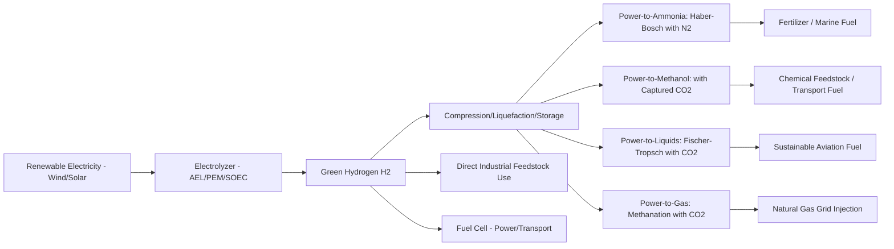

## Green Hydrogen Production and Power-to-X

### Definitions

**Green hydrogen** is hydrogen produced via electrolysis of water using electricity sourced entirely from renewable/zero-carbon generation, distinguishing it from "grey hydrogen" (produced via steam methane reforming without carbon capture) and "blue hydrogen" (steam methane reforming with carbon capture and storage). The color taxonomy is a widely used industry shorthand rather than a rigorously standardized regulatory classification, and additional terms (pink/purple for nuclear-sourced, turquoise for methane pyrolysis) appear in some literature.

**Power-to-X (P2X)** is the broader concept of converting surplus or dedicated renewable electricity into alternative energy carriers or feedstocks — hydrogen being the foundational building block for most P2X pathways, subsequently convertible into synthetic fuels, ammonia, methanol, or other chemical products.

---

### Electrolysis Technologies

**Alkaline Electrolysis (AEL)**

- Mature, commercially established technology (decades of industrial deployment)
- Uses liquid alkaline electrolyte (typically KOH solution) between electrodes
- Lower capital cost per unit capacity relative to newer technologies
- Slower response to variable power input, less suited to highly dynamic renewable-following operation without design modification
- Typical efficiency: 60–70% (higher heating value basis) [Inference — efficiency figures vary by specific system design, operating conditions, and reporting basis (HHV vs LHV); treat as representative range]

**Proton Exchange Membrane (PEM) Electrolysis**

- Uses a solid polymer membrane electrolyte
- Faster response and wider turndown range, better suited to variable renewable power input
- Higher capital cost, requires precious metal catalysts (platinum, iridium) raising material cost/supply chain considerations
- Compact footprint relative to AEL

**Solid Oxide Electrolysis Cells (SOEC)**

- Operates at high temperature (typically 700–850°C), can achieve higher electrical efficiency by utilizing external heat input to supply part of the reaction energy requirement (relevant where waste heat is available, e.g., co-located with nuclear or industrial processes)
- Less commercially mature than AEL/PEM at grid scale
- [Unverified — SOEC durability/degradation under cycling and commercial-scale cost trajectories are still maturing; treat specific performance claims as requiring current verification against demonstrated projects]

**Anion Exchange Membrane (AEM) Electrolysis**

- Emerging technology aiming to combine PEM-like dynamic response with AEL-like reduced reliance on precious metal catalysts
- [Unverified — commercial maturity is behind AEL and PEM; specific manufacturer performance claims should be verified against independent testing]

---

### Electrolysis Fundamentals

The overall water splitting reaction:

$$2H_2O \rightarrow 2H_2 + O_2$$

Theoretical minimum energy requirement (thermoneutral voltage basis, accounting for both electrical and thermal energy input):

$$\Delta H = 285.8\ kJ/mol\ (HHV basis)$$

In practice, electrolyzers operate above the thermodynamic minimum voltage due to overpotentials (activation, ohmic, concentration losses), meaning actual specific energy consumption exceeds theoretical minimum:

$$Specific\ Energy\ Consumption\ (kWh/kg\ H_2) = \frac{Electrical\ Energy\ Input}{Mass\ of\ H_2\ Produced}$$

Representative current commercial specific energy consumption ranges from roughly 50–55 kWh/kg H₂ for efficient systems, though [Inference] this varies by technology, operating point, and system boundary (including or excluding balance-of-plant auxiliary loads such as compression and purification).

---

### Green Hydrogen Production System Architecture

A complete green hydrogen production facility typically comprises:

1. **Renewable power source** — dedicated solar/wind, or grid connection with renewable certificate/matching requirements
2. **Power electronics** — AC-DC rectification and power conditioning to match electrolyzer DC input requirements
3. **Electrolyzer stack(s)** — the core conversion unit
4. **Water treatment/deionization** — feedwater must meet electrolyzer purity specifications
5. **Gas separation and purification** — removing residual moisture and trace oxygen from hydrogen stream
6. **Compression and/or liquefaction** — for storage/transport, since hydrogen's low volumetric energy density at ambient pressure necessitates compression (typically 350–700 bar for gaseous storage) or cryogenic liquefaction (-253°C)
7. **Storage** — pressurized vessels, underground salt cavern storage (large-scale), or liquid hydrogen tanks
8. **End-use conversion or delivery** — fuel cells, combustion turbines, industrial feedstock use, or pipeline/truck/ship transport

---

### Power-to-X Downstream Pathways

| Pathway | Product | Primary Use Case |
| --- | --- | --- |
| Power-to-Hydrogen | Green H₂ | Direct industrial feedstock, fuel cell vehicles, blending |
| Power-to-Ammonia | Green NH₃ (via Haber-Bosch using green H₂) | Fertilizer feedstock, potential marine fuel, hydrogen carrier for transport |
| Power-to-Methanol | Green methanol (H₂ + captured CO₂) | Chemical feedstock, marine/transport fuel |
| Power-to-Liquids (PtL) | Synthetic hydrocarbon fuels (via Fischer-Tropsch) | Aviation fuel (Sustainable Aviation Fuel pathways), drop-in replacement fuels |
| Power-to-Gas (PtG) | Synthetic methane (H₂ + CO₂ via methanation) | Natural gas grid injection/blending, existing gas infrastructure utilization |
| Power-to-Heat | Thermal energy (via resistive heating or heat pumps) | Industrial process heat, district heating |

**Key Point:** Each additional conversion step (H₂ → NH₃ → further downstream product, or H₂ → synthetic fuel) introduces further round-trip energy losses. This "efficiency cascade" means P2X pathways are generally most competitive where direct electrification is technically infeasible (e.g., aviation, shipping, high-temperature industrial heat, chemical feedstock uses) rather than as a general substitute for direct electricity use.

---

### Efficiency Considerations Across the Value Chain

Approximate cumulative efficiency losses through a representative pathway (renewable electricity → green hydrogen → ammonia → end use), illustrating the cascading loss principle:

$$\eta_{overall} = \eta_{electrolysis} \times \eta_{compression/storage} \times \eta_{synthesis} \times \eta_{end\ use}$$

[Inference] Exact overall efficiency figures for full pathways (e.g., power-to-ammonia-to-power round trip) are highly configuration-dependent and reported figures vary substantially across sources depending on system boundary and technology assumptions — general directional statements (multi-step P2X pathways carry meaningfully higher cumulative losses than direct electrification or direct hydrogen use) are more reliable than specific point-efficiency claims without a stated source.

---

### Economic Drivers: Levelized Cost of Hydrogen (LCOH)

$$LCOH = \frac{CAPEX_{annualized} + OPEX_{fixed} + (Electricity\ Price \times Specific\ Energy\ Consumption)}{Annual\ H_2\ Production}$$

Key cost drivers:

- **Electrolyzer capital cost** ($/kW) — declining with manufacturing scale-up, though [Unverified — specific cost trajectory projections vary significantly across analyst sources and should be checked against current data]
- **Electricity price and capacity factor** — the dominant operating cost driver; low-cost, high-capacity-factor renewable power access is central to project economics
- **Capacity factor trade-off:** Running an electrolyzer at higher capacity factor improves capital cost amortization per unit of hydrogen but may require accepting higher-cost electricity (grid power or curtailment-avoidance periods) rather than only the lowest-cost renewable hours, creating an optimization problem between capital utilization and marginal electricity cost

---

### Policy and Incentive Mechanisms

[Unverified — specific policy mechanisms, credit values, and eligibility criteria are subject to frequent legislative/regulatory change across jurisdictions; treat named programs as illustrative examples requiring verification against current status]

- Production tax credits tied to carbon intensity of the hydrogen produced (incentivizing genuinely low-carbon pathways over the full lifecycle)
- Renewable Energy Certificate (REC) matching requirements and "additionality" rules governing whether grid-connected electrolysis can be credibly termed "green" (time-matching and geographic-matching requirements are actively debated policy design questions)
- Carbon border adjustment mechanisms potentially affecting the competitiveness of hydrogen-derived products in international trade
- Blending mandates for green hydrogen/synthetic fuels in specific sectors (e.g., aviation SAF mandates)

---

### Diagram: Power-to-X Value Chain

---

### Diagram: Electrolyzer Cell Schematic (PEM Type) (svg_diagram)

<svg xmlns="http://www.w3.org/2000/svg" viewBox="0 0 600 350">
\<style\>
.cell { fill: #eef3f8; stroke: #2c5f7c; stroke-width: 2; }
.membrane { fill: #d8cba8; stroke: #8a7550; stroke-width: 1.5; }
.gas { fill: #a8d8c8; stroke: #2c7c5f; stroke-width: 1.5; }
.label { font-family: sans-serif; font-size: 13px; fill: #1a1a1a; text-anchor: middle; }
.title { font-family: sans-serif; font-size: 16px; fill: #1a1a1a; text-anchor: middle; font-weight: bold; }
.arrow { stroke: #555; stroke-width: 2; marker-end: url(#arrow4); fill: none; }
\</style\>
<text x="300" y="25" class="title">PEM Electrolyzer Cell Schematic (svg_diagram)</text>
<rect x="200" y="60" width="200" height="220" class="cell" />
<rect x="290" y="60" width="20" height="220" class="membrane" />
<text x="300" y="300" class="label">PEM (Proton Exchange Membrane)</text>

<text x="245" y="80" class="label">Anode (+)</text>

<text x="355" y="80" class="label">Cathode (-)</text>

<rect x="120" y="140" width="60" height="50" class="gas" />
<text x="150" y="170" class="label">O2 out</text>
<line x1="200" y1="165" x2="180" y2="165" class="arrow" />
<rect x="420" y="140" width="60" height="50" class="gas" />
<text x="450" y="170" class="label">H2 out</text>
<line x1="400" y1="165" x2="420" y2="165" class="arrow" />

<text x="300" y="330" class="label">H2O in (both sides) — DC Power Applied Across Electrodes</text>

</svg>

---

### Worked Example: LCOH Simplified Calculation

**Example:** A PEM electrolyzer plant has capital cost $800/kW, annualized capital recovery factor of 0.10 (10% of CAPEX charged annually), fixed O&M of $20/kW-year, operates at 50% capacity factor, specific energy consumption of 52 kWh/kg H₂, and electricity price of $0.03/kWh.

Per kW of electrolyzer capacity, annual hydrogen production:

$$H_2\ produced = \frac{1\ kW \times 8760\ hr/yr \times 0.50}{52\ kWh/kg} = \frac{4380\ kWh}{52\ kWh/kg} = 84.2\ kg$$

Annualized capital cost per kW:

$$CAPEX_{annual} = \$800 \times 0.10 = \$80$$

Total annual cost per kW:

$$Total\ Cost = \$80\ (capital) + \$20\ (O\&M) + (4380\ kWh \times \$0.03/kWh) = \$80 + \$20 + \$131.40 = \$231.40$$

$$LCOH = \frac{\$231.40}{84.2\ kg} = \$2.75/kg\ H_2$$

**Result:** This simplified LCOH of approximately $2.75/kg illustrates the calculation structure; real project economics require more detailed treatment of stack replacement costs (electrolyzer stacks degrade and require periodic replacement within the project lifetime), balance-of-plant costs beyond the stack, and financing structure, all of which are excluded from this illustrative simplified calculation. [Inference — actual reported LCOH figures in industry studies vary substantially based on region-specific electricity costs, capacity factor assumptions, and whether stack replacement/degradation costs are included]

---

### Related Topics

- Haber-Bosch Ammonia Synthesis and Green Ammonia Production
- Fischer-Tropsch Synthesis for Sustainable Aviation Fuel
- Direct Air Capture and Point-Source CO2 Capture for P2X Feedstock
- Hydrogen Storage and Transport Infrastructure (Pipelines, Salt Caverns, Shipping)
- Fuel Cell Technology and Applications (PEMFC, SOFC)
- Carbon Intensity Accounting and Additionality Rules for Green Hydrogen
- Electrolyzer Stack Degradation and Replacement Economics
- Sector Coupling Strategies for Hard-to-Abate Industries
- Energy Storage for Grid Support
- Integration of Variable Renewable Energy Sources