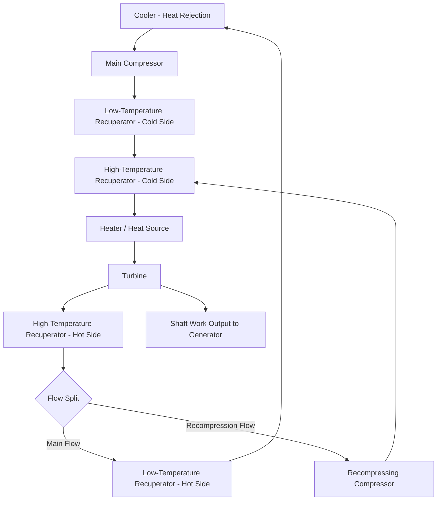

## Supercritical CO2 Power Cycles

### Definition and Fundamental Concept

Supercritical CO2 (sCO2) power cycles are closed-loop thermodynamic power cycles that use carbon dioxide as the working fluid, operated above its critical point (31.1°C, 7.39 MPa) throughout the compression process. Above the critical point, CO2 exists as a supercritical fluid — exhibiting liquid-like density with gas-like viscosity and diffusivity — eliminating the phase-change (two-phase) region that complicates conventional steam Rankine cycle compression.

The core motivation for sCO2 cycles is compression work reduction: compressing a fluid near its critical point, where density is high and compressibility behavior is favorable, requires substantially less work than compressing an ideal gas across the same pressure ratio, directly improving cycle efficiency.

---

### Why CO2 as Working Fluid

- **Moderate critical point (31.1°C, 7.39 MPa):** Achievable with practical cooling (ambient air or water cooling near typical heat rejection temperatures), unlike fluids with much higher or lower critical points
- **High density near critical point:** Enables dramatically smaller turbomachinery for equivalent power output compared to steam Rankine cycle equipment — a frequently cited advantage is turbine/compressor size reduction on the order of a magnitude smaller than comparable steam turbines for the same power rating, since sCO2's high density near the critical point allows much higher mass flow through much smaller flow passages
- **Chemical stability:** Non-flammable, non-toxic, well-characterized thermophysical properties, abundant and low-cost
- **Thermal stability at high temperature:** Suitable for high-temperature heat source integration (concentrated solar, advanced nuclear, waste heat recovery) without the fluid degradation concerns of some organic working fluids

---

### Basic Cycle Architecture: Recompression Brayton Cycle

The most commonly studied and highest-efficiency sCO2 cycle configuration is the **recompression closed Brayton cycle**, which addresses a key thermodynamic challenge specific to sCO2: the fluid's specific heat capacity varies dramatically near the critical point, creating a mismatch in the recuperator (heat exchanger recovering turbine exhaust heat to preheat compressor discharge) that a simple recuperated cycle handles poorly.

**Recompression cycle components:**

1. **Main compressor** — compresses CO2 from near-critical conditions to cycle high pressure
2. **Recompressing compressor** — a second compressor handling a split fraction of the flow, addressing the specific heat mismatch problem
3. **Low-Temperature Recuperator (LTR)** and **High-Temperature Recuperator (HTR)** — split recuperation across two heat exchangers to better match the varying specific heat profile
4. **Heater/heat source** — external heat addition (combustor, nuclear reactor heat exchanger, concentrated solar receiver, or waste heat source)
5. **Turbine** — expansion through the turbine produces shaft work
6. **Cooler** — rejects heat to ambient, returning CO2 to near-critical conditions before compression

**Flow split rationale:** A fraction of the turbine exhaust flow bypasses the low-temperature recuperator's cold side and is compressed separately (recompression), then rejoins the main flow before the high-temperature recuperator — this flow-splitting strategy balances the thermal capacity (mass flow × specific heat) between hot and cold recuperator streams across the temperature range where CO2's specific heat varies most sharply, improving recuperator effectiveness and overall cycle efficiency relative to a simple recuperated configuration.

---

### Cycle Configurations Compared

| Configuration | Description | Relative Efficiency | Complexity |
| --- | --- | --- | --- |
| Simple recuperated Brayton | Single compressor, single recuperator | Lower (recuperator pinch limitations) | Lowest |
| Recompression Brayton | Split compression, dual recuperators | Higher | Moderate |
| Partial cooling cycle | Intermediate cooling/compression stage added | Higher still (for certain temperature ranges) | Higher |
| Cascaded/multi-reheat cycle | Multiple heating and expansion stages | Highest (approaches theoretical limits) | Highest |

[Inference] Relative efficiency rankings depend significantly on the specific heat source temperature, heat rejection temperature, and pressure ratio assumptions used in any given study — the ordering above reflects general literature consensus but specific efficiency percentage claims are configuration- and assumption-dependent.

---

### Thermodynamic Cycle Analysis

The ideal Brayton cycle thermal efficiency (as a baseline reference, before accounting for sCO2-specific recuperation benefits):

$$\eta_{Brayton} = 1 - \frac{1}{r_p^{(\gamma-1)/\gamma}}$$

Where $r_p$ is the pressure ratio and $\gamma$ is the specific heat ratio. However, this ideal-gas relation does not capture sCO2's real-fluid behavior near the critical point, where compressibility factor deviates significantly from unity — actual sCO2 cycle analysis requires real-fluid property tables (e.g., NIST REFPROP data) rather than ideal gas assumptions, since the compression work reduction benefit specifically arises from real-fluid density behavior that ideal gas equations do not represent.

**Compressor work reduction (conceptual basis):**

$$w_{compression} = \int v \, dP$$

Since specific volume $v$ is much lower for a dense supercritical fluid near the critical point compared to an ideal gas at the same conditions, the compression work integral is correspondingly smaller for the same pressure rise — this is the fundamental physical basis for sCO2's compression work advantage over steam or air-based cycles operating with less favorable density conditions during compression.

---

### Turbomachinery Design Implications

- **High density → smaller flow passages:** For a given mass flow rate, sCO2's high density near critical conditions allows much smaller turbine/compressor flow areas than equivalent steam or gas turbine equipment
- **High rotational speeds:** Small turbomachinery scale typically necessitates high rotational speeds (often requiring specialized bearings — e.g., gas foil bearings — and potentially integrated motor/generator designs)
- **Compressor operation near critical point:** Operating the main compressor inlet very close to the critical point maximizes the density/compression-work benefit but introduces sensitivity to small temperature/pressure fluctuations, since fluid properties change rapidly in this region — a key control system design challenge
- **Sealing challenges:** High operating pressures (typically 20+ MPa cycle high pressure) require robust sealing solutions to limit CO2 leakage

---

### Application Domains

**Concentrated Solar Power (CSP)**

- sCO2 cycles are actively researched as next-generation CSP power blocks, potentially replacing steam Rankine cycles to reduce power block footprint and potentially improve efficiency at the high receiver outlet temperatures achievable with advanced CSP receiver designs

**Advanced Nuclear Reactors**

- Compatible with several advanced reactor concepts (sodium-cooled fast reactors, some Generation IV concepts) where compact power conversion equipment and potentially higher cycle efficiency at achievable reactor coolant temperatures offer advantages over traditional steam cycles

**Waste Heat Recovery**

- Industrial waste heat recovery applications benefit from sCO2's compact footprint and applicability across a range of heat source temperatures

**Fossil Fuel Power Generation with Inherent Carbon Capture**

- Certain sCO2 cycle variants (notably oxy-fuel combustion sCO2 cycles, sometimes associated with specific commercial development efforts) integrate combustion directly with the CO2 working fluid loop, producing a high-purity CO2 exhaust stream stream that simplifies carbon capture compared to conventional air-combustion flue gas — [Unverified — specific commercial project status, scale-up progress, and demonstrated performance for oxy-fuel sCO2 combustion cycles should be verified via current sources, as this is an actively developing area with project status subject to change]

---

### Technology Readiness and Current Status

[Unverified — sCO2 cycle technology readiness level varies significantly by application and specific project; the field has seen substantial pilot/demonstration-scale activity but broad commercial deployment status should be checked against current sources rather than assumed]

- Multiple pilot and demonstration-scale test loops have been constructed and operated by national laboratories, universities, and private developers to validate turbomachinery performance and cycle control strategies
- Key remaining technical challenges commonly cited in the literature include: high-temperature materials for heat exchangers and turbine components, long-duration turbomachinery reliability validation, and recuperator cost/effectiveness optimization
- The technology occupies a pre-commercial to early-commercial maturity range depending on specific application, with waste heat recovery applications generally considered closer to commercial deployment than utility-scale nuclear or CSP integration

---

### Diagram: Recompression sCO2 Brayton Cycle

---

### Diagram: sCO2 Cycle Pressure-Enthalpy Context Near Critical Point (svg_diagram)

<svg xmlns="http://www.w3.org/2000/svg" viewBox="0 0 600 380">
\<style\>
.axis { stroke: #1a1a1a; stroke-width: 1.5; }
.dome { stroke: #a85f5f; stroke-width: 2; fill: rgba(168,95,95,0.1); }
.cyclepath { stroke: #2c5f7c; stroke-width: 2.5; fill: none; }
.label { font-family: sans-serif; font-size: 12px; fill: #1a1a1a; text-anchor: middle; }
.title { font-family: sans-serif; font-size: 15px; fill: #1a1a1a; text-anchor: middle; font-weight: bold; }
.point { fill: #2c5f7c; }
\</style\>
<text x="300" y="22" class="title">sCO2 Cycle Relative to Critical Point (P-h Diagram, Conceptual) (svg_diagram)</text>
<line x1="70" y1="340" x2="70" y2="50" class="axis" />
<line x1="70" y1="340" x2="560" y2="340" class="axis" />
<text x="35" y="200" class="label" transform="rotate(-90 35 200)">Pressure</text>
<text x="310" y="365" class="label">Enthalpy</text>
<path d="M 150 340 Q 200 150 280 140 Q 360 150 410 340" class="dome" />
<circle cx="280" cy="140" r="5" fill="#a85f5f" />
<text x="280" y="120" class="label">Critical Point (31.1°C, 7.39 MPa)</text>
<circle cx="230" cy="280" r="5" class="point" />
<text x="200" y="300" class="label">1: Compressor Inlet</text>
<text x="200" y="313" class="label">(near-critical, dense)</text>
<line x1="230" y1="280" x2="230" y2="90" class="cyclepath" />
<circle cx="230" cy="90" r="5" class="point" />
<text x="230" y="75" class="label">2: Compressor Outlet</text>
<line x1="230" y1="90" x2="450" y2="90" class="cyclepath" />
<circle cx="450" cy="90" r="5" class="point" />
<text x="470" y="80" class="label">3: Turbine Inlet</text>
<text x="470" y="93" class="label">(after heating)</text>
<line x1="450" y1="90" x2="450" y2="280" class="cyclepath" />
<circle cx="450" cy="280" r="5" class="point" />
<text x="470" y="300" class="label">4: Turbine Exit</text>
<line x1="450" y1="280" x2="230" y2="280" class="cyclepath" stroke-dasharray="4,4" />
<text x="340" y="330" class="label">Heat Rejection (via recuperator + cooler)</text>
</svg>

---

### Worked Example: Compression Work Comparison (Conceptual)

**Example:** Illustrating why compression near the critical point reduces work, using the simplified relation $w = \int v\,dP$ approximated as $w \approx v_{avg} \Delta P$ for a small pressure step.

Case A — sCO2 near critical point: average specific volume $v \approx 0.0025\ m^3/kg$ (dense supercritical fluid)

Case B — ideal-gas-like CO2 well above critical temperature at low pressure: average specific volume $v \approx 0.02\ m^3/kg$ (roughly 8x less dense)

For the same pressure rise $\Delta P = 5\ MPa = 5{,}000{,}000\ Pa$:

$$w_A \approx 0.0025 \times 5{,}000{,}000 = 12{,}500\ J/kg$$

$$w_B \approx 0.02 \times 5{,}000{,}000 = 100{,}000\ J/kg$$

**Result:** This simplified illustration shows roughly an 8x compression work reduction for the denser near-critical case, directly reflecting the specific volume ratio — this is the conceptual basis (not a rigorous cycle calculation) for why sCO2 cycles compressing near the critical point achieve favorable compression work compared to compressing a lower-density fluid across the same pressure rise. [Inference — this is a simplified illustrative approximation using average specific volume; a rigorous analysis requires integrating real-fluid property data across the actual compression path, since specific volume changes continuously and non-linearly near the critical point]

---

### Related Topics

- Real-Fluid Thermodynamic Property Modeling (NIST REFPROP, Equations of State)
- Concentrated Solar Power (CSP) Receiver and Power Block Design
- Advanced Nuclear Reactor Power Conversion Systems
- Oxy-Fuel Combustion and Direct CO2 Cycle Carbon Capture
- Turbomachinery Design for High-Density Working Fluids
- Recuperator/Heat Exchanger Design for Variable Specific Heat Fluids
- Waste Heat Recovery Power Cycle Selection
- Organic Rankine Cycle (ORC) Comparison for Low-Grade Heat
- Gas Foil Bearings and High-Speed Turbomachinery
- Life-Cycle Assessment of Power Generation