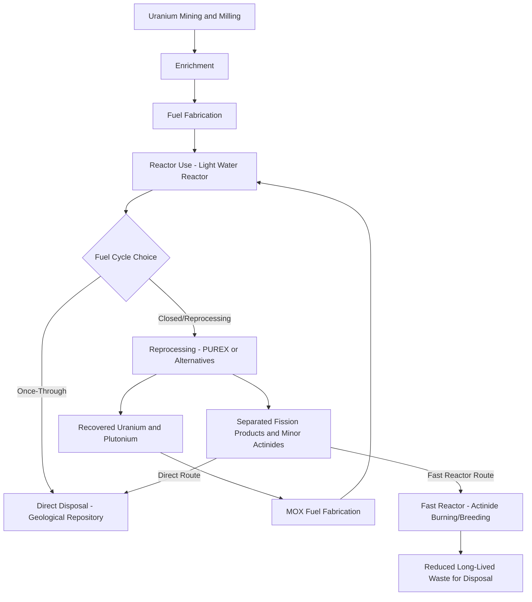

## Advanced Nuclear Fuel Cycles and Fusion Energy Prospects

### Part A: Advanced Nuclear Fuel Cycles

#### Definition and Scope

The nuclear fuel cycle encompasses all processes involved in producing, using, and managing nuclear fuel — from uranium mining through enrichment, fuel fabrication, reactor use, and back-end management (reprocessing, storage, or disposal). "Advanced" fuel cycles refer to configurations beyond the conventional **once-through (open) cycle** dominant in most current commercial light water reactors, aiming to improve resource utilization, reduce waste volume/longevity, or enhance proliferation resistance.

#### Once-Through vs. Closed Fuel Cycles

**Once-Through (Open) Cycle**

- Uranium is mined, enriched (typically to 3–5% U-235 for light water reactors), fabricated into fuel, used once in a reactor, then treated as waste for direct disposal
- Simplest cycle from a proliferation-resistance and infrastructure standpoint
- Utilizes only a small fraction (roughly 0.5–0.7%) of the energy content in the original mined uranium, since only the fissile U-235 (and some in-situ generated plutonium) is consumed before the fuel is discharged
- Dominant approach in the United States and many other countries

**Closed (Reprocessing) Cycle**

- Spent fuel is chemically reprocessed to separate usable fissile/fertile material (plutonium, unused uranium) from fission product waste
- Recovered plutonium can be fabricated into **Mixed Oxide (MOX) fuel** (uranium-plutonium oxide) for reuse in reactors
- Significantly improves uranium resource utilization and can reduce long-term waste volume, though total waste management complexity increases due to separated material streams requiring their own security/handling
- **PUREX (Plutonium-Uranium Redox Extraction)** is the dominant historical reprocessing technology
- Countries including France have operated commercial-scale reprocessing for decades; [Unverified — specific current national reprocessing program status and MOX fuel utilization rates should be verified against current sources, as policy and program scale vary and change over time]

#### Fast Reactor Fuel Cycles

Fast neutron reactors (using unmoderated, high-energy neutrons rather than the thermal/moderated neutrons of conventional light water reactors) enable a fundamentally different fuel cycle approach:

- **Breeding capability:** Fast reactors can be configured to produce more fissile material (via neutron capture in fertile U-238, converting it to fissile Pu-239) than they consume, in principle enabling dramatically improved uranium resource utilization (potentially 60x+ improvement in resource utilization compared to once-through light water reactor cycles, according to commonly cited theoretical estimates) — [Inference] actual achievable improvement factors depend heavily on specific reactor design, breeding ratio achieved, and fuel cycle losses, so this figure should be understood as a theoretical upper-bound reference rather than a universally achieved result
- **Minor actinide burning:** Fast reactor neutron spectra can also be used to fission (rather than merely transmute) long-lived minor actinides (neptunium, americium, curium) present in spent fuel, potentially reducing the long-term radiotoxicity and heat load of waste requiring geological disposal
- **Sodium-cooled fast reactors (SFR)** are the most technologically mature fast reactor coolant approach, with multiple historical and ongoing demonstration programs internationally
- **Lead and lead-bismuth cooled fast reactors** offer alternative coolant chemistry with different corrosion/safety tradeoffs, less commercially mature than sodium-cooled designs

#### Thorium Fuel Cycle

- Thorium-232 is fertile (not directly fissile) but converts to fissile U-233 upon neutron capture, analogous to the U-238 → Pu-239 breeding pathway
- Thorium is roughly 3–4x more abundant in the Earth's crust than uranium [Inference — specific abundance ratio estimates vary somewhat by geological survey source]
- Potential advantages cited in the literature: reduced long-lived transuranic waste generation (since thorium cycles do not require processing through the uranium-plutonium actinide chain in the same way), and some proliferation-resistance arguments related to U-233/U-232 isotopic mixture characteristics
- Significant remaining technical challenges include fuel fabrication complexity, reprocessing chemistry differences from the well-established uranium-plutonium cycle, and limited commercial-scale operating experience
- India has pursued thorium fuel cycle research as part of a long-term strategy motivated partly by domestic thorium resource abundance relative to domestic uranium reserves — [Unverified — current program status and timeline should be verified against current sources]

#### Advanced Reactor Designs and Fuel Cycle Implications (Generation IV Concepts)

| Reactor Type | Coolant/Moderator | Fuel Cycle Relevance |
| --- | --- | --- |
| Sodium-Cooled Fast Reactor (SFR) | Liquid sodium | Breeding, minor actinide burning |
| Molten Salt Reactor (MSR) | Molten fluoride/chloride salt (fuel dissolved in coolant in some variants) | Potential continuous online reprocessing, thorium cycle compatibility in some designs |
| High-Temperature Gas-Cooled Reactor (HTGR) | Helium gas | TRISO fuel particles offer high burnup and inherent containment; typically once-through |
| Lead-Cooled Fast Reactor (LFR) | Liquid lead or lead-bismuth | Breeding capability, passive safety characteristics cited for lead coolant |
| Supercritical Water-Cooled Reactor (SCWR) | Supercritical water | Efficiency improvement via higher thermodynamic cycle temperatures |

[Unverified — Generation IV reactor development timelines and specific deployment status are actively evolving across multiple national and private programs; treat specific project schedules as requiring current verification]

#### Waste Management Implications

Advanced fuel cycles are frequently motivated by back-end waste management benefits:

- **Volume reduction:** Reprocessing/recycling can reduce the volume of material requiring geological disposal compared to direct once-through disposal of all spent fuel
- **Radiotoxicity reduction:** Actinide burning in fast reactor spectra can reduce the timescale over which repository waste radiotoxicity exceeds that of the original mined uranium ore, from roughly hundreds of thousands of years (once-through) to potentially a few hundred to a few thousand years in some proposed advanced cycle configurations [Inference — specific timescale reduction claims are design-dependent and appear across the literature with varying figures depending on assumptions about actinide separation efficiency]
- **Proliferation resistance tradeoffs:** Separated plutonium streams in conventional reprocessing raise proliferation concerns; some advanced cycle concepts (e.g., certain pyroprocessing approaches, or designs that avoid ever isolating pure plutonium) are specifically motivated by improving proliferation resistance relative to conventional PUREX reprocessing

---

### Part B: Fusion Energy Prospects

#### Fundamental Physics

Nuclear fusion releases energy by combining light atomic nuclei into heavier ones, the inverse process of fission. The most experimentally accessible fusion reaction (lowest required temperature/confinement conditions) is deuterium-tritium (D-T) fusion:

$$^2_1D + \,^3_1T \rightarrow \,^4_2He + n + 17.6\ MeV$$

Achieving net energy fusion requires satisfying the **Lawson criterion** — a combined requirement on plasma density, confinement time, and temperature (the "triple product") sufficient for fusion energy output to exceed the energy required to sustain the plasma conditions.

$$n \tau_E T \geq \text{threshold value (approximate, condition-dependent)}$$

Where $n$ is plasma density, $\tau_E$ is energy confinement time, and $T$ is plasma temperature (typically requiring on the order of 100 million °C for D-T fusion, far exceeding the temperature at which matter exists as a fully ionized plasma).

#### Confinement Approaches

**Magnetic Confinement Fusion (MCF)**

- Uses strong magnetic fields to confine hot plasma away from vessel walls, since no physical material can withstand direct contact with fusion-relevant plasma temperatures
- **Tokamak** — the dominant magnetic confinement architecture, using a toroidal (donut-shaped) vessel with combined toroidal and poloidal magnetic fields (poloidal field typically induced partly by plasma current) to create the necessary confining field geometry
- **Stellarator** — an alternative toroidal confinement geometry using externally generated complex 3D magnetic fields rather than relying on plasma current for confinement, offering potential steady-state operation advantages at the cost of significantly more complex magnet/coil engineering
- **High-Temperature Superconducting (HTS) magnets** — a significant recent technology development enabling much stronger magnetic fields in more compact devices than previous low-temperature superconducting magnet technology, a key driver behind several current private tokamak development efforts pursuing smaller, higher-field designs relative to earlier large-scale devices like ITER

**Inertial Confinement Fusion (ICF)**

- Uses high-powered lasers (or other energy drivers) to rapidly compress and heat a small fuel pellet, achieving fusion conditions for an extremely brief duration through inertial compression rather than sustained magnetic confinement
- Lawrence Livermore National Laboratory's National Ignition Facility (NIF) achieved a scientific ignition milestone (fusion energy output exceeding laser input energy delivered to the target) in December 2022, subsequently repeated — this demonstrated that net energy fusion is physically achievable, though this net-gain accounting is typically measured relative to energy delivered to the target rather than total facility input energy (including laser system inefficiencies), which remains a distinct metric relevant to overall plant-level energy balance
- ICF-based commercial power plant concepts face distinct engineering challenges around repetition rate (NIF-style single-shot systems operate far below the shot rate a commercial power plant would require) and target fabrication cost at scale

**Alternative/Novel Confinement Approaches**

- Pulsed magnetic compression concepts, sheared-flow Z-pinch approaches, and other alternative confinement geometries are being pursued by various private developers, generally aiming for reduced engineering complexity or cost relative to large-scale tokamak designs, though [Unverified — technical maturity and validated performance data for these alternative approaches vary substantially and specific claims should be checked against independently verified results rather than developer statements alone]

#### Current State of the Field (as of recent search-verified information)

[Note: the following reflects information gathered via web search, since fusion energy development has moved substantially since general pre-training knowledge, and the field is evolving rapidly]

As of 2026, no fusion device — public or private — has generated net electricity delivered to the grid, and the field is broadly characterized as having moved past the fundamental physics question (which the 2022 NIF ignition result addressed) into an engineering and cost-scaling phase. Key developments reported include:

- ITER has experienced significant delays and is now estimated to begin operations in 2034, a substantial slip from earlier projected timelines. [Gao](https://files.gao.gov/reports/GAO-25-107037/index.html)
- Commonwealth Fusion Systems' SPARC demonstration device, betting on high-temperature superconducting magnets, has seen its first-plasma target slip from 2025 to 2027, though the underlying HTS magnet engineering milestones from 2021 and 2024 have reportedly held up. The company's planned follow-on commercial plant is named ARC. [pdpspectra](https://pdpspectra.com/blog/fusion-energy-2026-commonwealth-helion/)
- Helion Energy has pursued a pulsed magnetic compression, non-ignition approach, targeting a 50 MW output demonstration and securing a power purchase agreement with a major technology company for the latter part of the decade. [sparkco ai](https://sparkco.ai/blog/fusion-energy-breakthrough-commercial-viability)
- Regulatory frameworks have begun adapting specifically for fusion, with the U.S. Nuclear Regulatory Commission publishing a proposed fusion-specific licensing framework in February 2026 that treats fusion's risk profile as fundamentally different from fission. [Grandpa's AI](https://grandpasai.com/research/state-of-fusion-energy-2026.html)
- The overall honest assessment as of 2026 is that no commercial fusion plant has produced grid electricity and no company is within twelve months of doing so, even as the underlying physics, engineering, and capital trajectory have all advanced meaningfully. [pdpspectra](https://pdpspectra.com/blog/fusion-energy-2026-commonwealth-helion/)

[Unverified — this is a fast-moving field with substantial variance in projections across different sources and developers; specific dates, company milestones, and funding figures should be re-verified against current sources for any application requiring up-to-date accuracy, since even the sources found during this search show some disagreement in specific projected dates]

#### Tritium Fuel Cycle Challenge

D-T fusion requires tritium, which does not occur naturally in useful quantities and is currently sourced primarily from fission reactor byproducts (CANDU reactor heavy water moderator, in particular) — a supply source widely recognized as insufficient to fuel a fleet of commercial fusion power plants. Fusion power plant designs must therefore incorporate **tritium breeding**, typically via lithium-containing blanket structures surrounding the plasma chamber that capture fusion neutrons to breed new tritium (via neutron capture on lithium-6), a technology that has not yet been demonstrated at the scale or reliability a commercial plant would require.

---

### Diagram: Nuclear Fuel Cycle Comparison

---

### Diagram: Fusion Confinement Approaches (svg_diagram)

<svg xmlns="http://www.w3.org/2000/svg" viewBox="0 0 700 380">
\<style\>
.box { fill: #eef3f8; stroke: #2c5f7c; stroke-width: 2; }
.torus { fill: none; stroke: #2c5f7c; stroke-width: 3; }
.label { font-family: sans-serif; font-size: 12px; fill: #1a1a1a; text-anchor: middle; }
.title { font-family: sans-serif; font-size: 15px; fill: #1a1a1a; text-anchor: middle; font-weight: bold; }
\</style\>
<text x="350" y="22" class="title">Fusion Confinement Approaches — Conceptual Comparison (svg_diagram)</text>

<text x="180" y="55" class="label" font-weight="bold">Magnetic Confinement (Tokamak)</text>

<ellipse cx="180" cy="150" rx="110" ry="50" class="torus" />

<ellipse cx="180" cy="150" rx="60" ry="27" class="torus" />

<text x="180" y="230" class="label">Toroidal plasma confined by</text>

<text x="180" y="245" class="label">magnetic field coils (sustained operation)</text>

<text x="520" y="55" class="label" font-weight="bold">Inertial Confinement (ICF)</text>

<circle cx="520" cy="150" r="15" fill="`#a85f5f`" />

<text x="520" y="180" class="label">Fuel Pellet</text>

<line x1="440" y1="100" x2="505" y2="140" stroke="`#c98a4b`" stroke-width="2" />

<line x1="600" y1="100" x2="535" y2="140" stroke="`#c98a4b`" stroke-width="2" />

<line x1="440" y1="200" x2="505" y2="160" stroke="`#c98a4b`" stroke-width="2" />

<line x1="600" y1="200" x2="535" y2="160" stroke="`#c98a4b`" stroke-width="2" />

<text x="520" y="230" class="label">Laser beams compress pellet</text>

<text x="520" y="245" class="label">(brief pulsed operation)</text>

<rect x="60" y="290" width="580" height="60" class="box" />
<text x="350" y="315" class="label">Both approaches must satisfy the Lawson criterion (density x confinement time x temperature)</text>
<text x="350" y="332" class="label">to achieve net energy output exceeding input energy required to create fusion conditions</text>
</svg>

---

### Worked Example: Lawson Criterion Conceptual Illustration

**Example:** Illustrating the triple-product relationship conceptually (not a rigorous physics derivation) — if a plasma achieves density $n = 10^{20}\ m^{-3}$ and temperature equivalent to 15 keV (roughly 150 million °C), the required confinement time to reach a representative D-T ignition threshold triple product is:

$$\tau_E \geq \frac{Threshold}{n \times T}$$

**Result:** [Inference — the actual numerical threshold value for the Lawson criterion depends on the specific fusion reaction, confinement scheme, and whether one is calculating for ignition versus a specific target Q value; this example illustrates the inverse relationship (higher density or temperature reduces the required confinement time for a given threshold) rather than providing a universally applicable threshold constant, since presenting a specific numerical threshold without full context risks conveying false precision] This inverse relationship is precisely why magnetic confinement approaches (moderate density, long confinement time) and inertial confinement approaches (extremely high density, extremely short confinement time) represent two fundamentally different strategies for satisfying the same underlying physical requirement.

---

### Related Topics

- PUREX and Advanced Reprocessing Chemistry (Pyroprocessing, UREX+)
- Molten Salt Reactor Design and Online Fuel Processing
- Geological Repository Design for High-Level Nuclear Waste
- Tokamak Plasma Physics and Magnetohydrodynamic Stability
- High-Temperature Superconducting Magnet Technology for Fusion
- Tritium Breeding Blanket Design and Lithium-6 Neutron Capture
- Generation IV Reactor Design Concepts
- Proliferation Resistance Assessment in Fuel Cycle Design
- Supercritical CO2 Power Cycles (relevant to advanced reactor power conversion)
- Life-Cycle Assessment of Power Generation (nuclear fuel cycle GHG comparison)