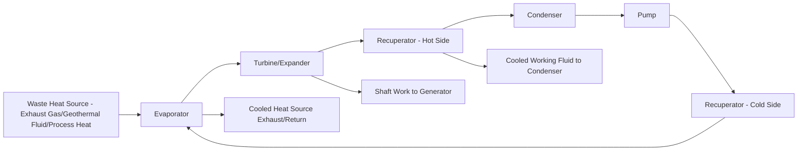

## Waste Heat Recovery and Organic Rankine Cycles

### Definition and Motivation

Waste heat recovery (WHR) refers to capturing thermal energy that would otherwise be rejected unused to the environment from industrial processes, engines, or power generation equipment, and converting a portion of it into useful work or additional heat. The **Organic Rankine Cycle (ORC)** is the dominant power-generation technology for converting low-to-medium grade waste heat into electricity, functioning thermodynamically identically to the conventional steam Rankine cycle but substituting an organic working fluid (rather than water/steam) selected to match the specific temperature range of the available heat source.

The core motivation is thermodynamic and economic: waste heat streams below roughly 400°C are generally too low-temperature for efficient conventional steam cycles (which require high superheat temperatures for good efficiency and practical turbine design), but represent a substantial energy resource across industrial, geothermal, and engine exhaust applications if a suitable conversion technology is available.

---

### Why Organic Working Fluids

Water/steam Rankine cycles are optimized for high-temperature heat sources (combustion, nuclear). For lower-temperature heat sources, organic fluids offer several advantages:

- **Lower boiling point:** Organic fluids can be selected to boil and generate meaningful vapor pressure at the specific low-to-medium temperature of the available waste heat source, where water would produce insufficient vapor pressure/quality for efficient turbine expansion
- **Favorable turbine expansion characteristics:** Many organic fluids exhibit a "dry" or "isentropic" expansion characteristic (the fluid remains superheated or dry through turbine expansion rather than forming liquid droplets), avoiding the moisture-related turbine blade erosion concerns that constrain steam turbine design at lower steam qualities
- **Lower latent heat of vaporization:** This can better match the sensible heat profile of many waste heat sources (e.g., cooling exhaust gas), reducing pinch-point temperature difference losses in the evaporator heat exchanger compared to water's high latent heat, which can create a poor match to a sensibly-cooling heat source

---

### Working Fluid Selection

Common ORC working fluid categories:

| Fluid Category | Examples | Typical Application Temperature Range |
| --- | --- | --- |
| Hydrofluorocarbons (HFCs) | R245fa, R134a | Low temperature (80–150°C) |
| Hydrocarbons | Pentane, isobutane, toluene | Medium temperature (150–300°C) |
| Siloxanes | MDM, MM | Higher temperature (250–400°C), common in biomass/geothermal ORC |
| Next-generation low-GWP fluids | HFOs (hydrofluoroolefins) | Increasingly favored replacements for high-GWP HFCs, [Unverified — specific fluid selection trends and regulatory phase-outs vary by jurisdiction and continue to evolve, particularly under Montreal Protocol Kigali Amendment HFC phase-down schedules] |

**Selection criteria** include: critical temperature/pressure matched to heat source temperature, thermal stability at operating conditions (avoiding fluid decomposition), environmental properties (Global Warming Potential, Ozone Depletion Potential — increasingly weighted heavily given regulatory phase-outs of high-GWP refrigerants), flammability/toxicity, and cost/availability.

---

### ORC System Architecture

**Basic Components** (analogous to steam Rankine cycle):

1. **Evaporator** — heat exchanger transferring waste heat to the organic working fluid, vaporizing it
2. **Turbine/Expander** — expands vaporized working fluid, producing shaft work
3. **Condenser** — rejects heat to ambient (air-cooled or water-cooled), condensing working fluid back to liquid
4. **Pump** — pressurizes liquid working fluid back to evaporator pressure

**Regenerative ORC Configuration**

- Adds an internal heat exchanger (recuperator) transferring residual heat from turbine exhaust (still superheated in "dry fluid" cycles) to preheat the liquid working fluid before the evaporator
- Improves cycle efficiency when the working fluid exhibits dry expansion characteristics, since without recuperation this residual superheat would otherwise be wasted in the condenser

**Expander Technology**

- **Turbo-expanders** — turbine-based, favored for larger-scale systems (typically hundreds of kW to several MW), higher efficiency at design point
- **Volumetric expanders** (screw, scroll, reciprocating piston) — favored for smaller-scale systems, better off-design/part-load performance, lower cost at small scale

---

### Application Domains

**Industrial Waste Heat Recovery**

- Cement kiln exhaust, steel/glass furnace exhaust, and other high-temperature industrial process exhaust streams
- Recovers a portion of otherwise-rejected process heat as electricity, improving overall plant energy utilization without requiring additional fuel input

**Geothermal Power Generation**

- ORC is the dominant technology for **binary cycle geothermal plants**, used specifically for lower-temperature geothermal resources (typically below ~180°C) where the geothermal fluid is not hot enough for direct flash-steam conversion
- The geothermal brine transfers heat to the organic working fluid via a heat exchanger (binary cycle — geothermal fluid and working fluid remain in separate closed loops), then the cooled geothermal fluid is reinjected

**Engine/Combustion Exhaust Heat Recovery**

- Marine engine exhaust, stationary reciprocating engine (gas engine/diesel generator) exhaust, and gas turbine exhaust (as a bottoming cycle alternative to steam-based combined cycle at smaller scales where steam infrastructure is impractical)

**Biomass and Solar Thermal**

- Biomass combustion combined with ORC for smaller-scale distributed combined heat and power applications where steam cycle infrastructure/scale is uneconomical
- Concentrated solar thermal collectors feeding ORC systems for smaller-scale solar power applications

**Concentrated Solar Power (small/medium scale)**

- ORC used in smaller CSP installations where the scale doesn't justify conventional steam turbine infrastructure

---

### Thermodynamic Cycle Analysis

The basic Rankine cycle thermal efficiency relationship applies identically to ORC (only the fluid properties differ):

$$\eta_{th} = \frac{W_{turbine} - W_{pump}}{Q_{in}}$$

Where:

$$W_{turbine} = \dot{m}(h_3 - h_4), \quad W_{pump} = \dot{m}(h_2 - h_1), \quad Q_{in} = \dot{m}(h_3 - h_2)$$

Using standard Rankine cycle state points (1: pump inlet/condenser exit, 2: pump exit/evaporator inlet, 3: turbine inlet/evaporator exit, 4: turbine exit/condenser inlet).

**Key Point:** ORC thermal efficiencies are inherently lower than conventional steam Rankine cycles operating at high-temperature heat sources, since thermal efficiency is fundamentally bounded by the Carnot efficiency limit set by the source and sink temperatures:

$$\eta_{Carnot} = 1 - \frac{T_{sink}}{T_{source}}$$

Low-grade waste heat sources have inherently lower $T_{source}$, mathematically limiting the maximum achievable efficiency regardless of working fluid selection — typical ORC systems recovering waste heat in the 150–300°C range achieve thermal efficiencies roughly in the 10–20% range [Inference — specific efficiency figures depend heavily on actual source/sink temperatures, working fluid selection, and cycle configuration; treat as a representative range rather than a fixed value], substantially lower than the 35–45%+ efficiencies typical of high-temperature steam Rankine cycles in conventional power plants, but this comparison should be understood in context: ORC is converting heat that would otherwise be entirely wasted (zero marginal fuel cost), so even a modest conversion efficiency represents pure additional energy recovery rather than a competing alternative to high-efficiency primary generation.

---

### Diagram: ORC System with Regeneration

---

### Diagram: ORC vs. Steam Rankine Temperature-Entropy Context (svg_diagram)

<svg xmlns="http://www.w3.org/2000/svg" viewBox="0 0 600 380">
\<style\>
.axis { stroke: #1a1a1a; stroke-width: 1.5; }
.orc { stroke: #2c5f7c; stroke-width: 2.5; fill: none; }
.steam { stroke: #a85f5f; stroke-width: 2.5; fill: none; stroke-dasharray: 5,3; }
.label { font-family: sans-serif; font-size: 12px; fill: #1a1a1a; text-anchor: middle; }
.title { font-family: sans-serif; font-size: 15px; fill: #1a1a1a; text-anchor: middle; font-weight: bold; }
\</style\>
<text x="300" y="22" class="title">ORC vs. Steam Rankine Cycle — T-s Diagram Comparison (svg_diagram)</text>
<line x1="70" y1="340" x2="70" y2="50" class="axis" />
<line x1="70" y1="340" x2="560" y2="340" class="axis" />
<text x="35" y="200" class="label" transform="rotate(-90 35 200)">Temperature</text>
<text x="310" y="365" class="label">Entropy</text>
<path d="M120 300 L120 220 L280 220 L320 300 Z" class="orc" />
<text x="200" y="200" class="label">ORC Cycle (organic fluid,</text>
<text x="200" y="213" class="label">lower source temp, ~150-300°C)</text>
<path d="M150 320 L150 100 L450 100 L500 320 Z" class="steam" />
<text x="450" y="80" class="label">Steam Rankine Cycle</text>
<text x="450" y="93" class="label">(higher source temp, 350-600°C+)</text>

<text x="300" y="335" class="label" font-weight="bold">Larger temperature span → higher Carnot-limited efficiency ceiling</text>

</svg>

---

### Worked Example: ORC Power Output Estimate

**Example:** A cement plant exhaust stream provides 5 MW of recoverable thermal energy at an effective source temperature of 300°C (573 K), rejecting to ambient at 30°C (303 K). Estimate theoretical Carnot-limited efficiency and a realistic achievable power output assuming the ORC system achieves 50% of the Carnot limit (a common rule-of-thumb approximation for real cycle performance relative to the theoretical maximum).

Carnot efficiency limit:

$$\eta_{Carnot} = 1 - \frac{303}{573} = 1 - 0.529 = 0.471\ (47.1\%)$$

Realistic ORC efficiency estimate (50% of Carnot, a common simplified approximation, not a rigorous cycle calculation):

$$\eta_{realistic} \approx 0.471 \times 0.50 = 0.236\ (23.6\%)$$

Estimated power output:

$$P_{output} = 5\ MW_{thermal} \times 0.236 = 1.18\ MW_{electric}$$

**Result:** This simplified estimate of approximately 1.18 MW of recoverable electrical power illustrates the general magnitude achievable from this waste heat stream; [Inference — the "50% of Carnot" approximation is a common rough industry rule-of-thumb rather than a rigorous thermodynamic result, and actual achievable efficiency depends on real working fluid properties, heat exchanger pinch-point constraints, and specific cycle configuration, so a detailed engineering cycle analysis using actual fluid property data would be required for an actual project feasibility assessment].

---

### Related Topics

- Combined Heat and Power (CHP) System Design and Allocation Methods
- Binary Cycle Geothermal Power Plant Design
- Refrigerant Selection and Montreal Protocol Kigali Amendment HFC Phase-Down
- Supercritical CO2 Power Cycles (alternative bottoming cycle technology)
- Heat Exchanger Pinch Point Analysis and Design
- Combined Cycle Gas Turbine (CCGT) Bottoming Cycle Design
- Exergy Analysis for Waste Heat Recovery System Optimization
- Marine and Industrial Engine Exhaust Heat Recovery Systems
- Life-Cycle Assessment of Power Generation
- Carnot Efficiency and Second Law Limits on Power Cycle Performance