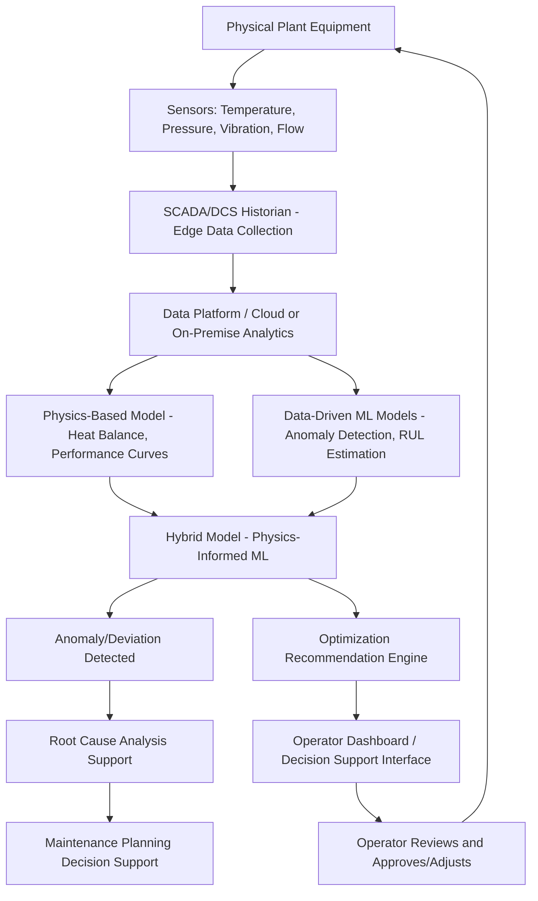

## Digital Twins and AI for Power Plant Optimization

### Definition and Scope

A digital twin, in the power generation context, is a dynamic virtual representation of a physical plant, system, or component that is continuously synchronized with real-world operational data, enabling simulation, prediction, and optimization that would be impractical or unsafe to perform directly on the physical asset. Combined with artificial intelligence and machine learning techniques, digital twins enable a shift from reactive/scheduled maintenance and static operating procedures toward predictive, adaptive, and optimization-driven plant operation.

**Key distinction from simple simulation models:** A traditional simulation model represents design-basis behavior and is typically static once built. A true digital twin maintains a live data connection to its physical counterpart, updating its internal state and potentially its underlying model parameters continuously as the physical asset ages, degrades, or is modified — the "twin" relationship implies ongoing synchronization, not a one-time simulation exercise.

---

### Digital Twin Architecture Layers

**Physical Layer**

- The actual plant equipment (turbines, boilers, generators, balance-of-plant systems) instrumented with sensors

**Data Acquisition Layer**

- SCADA/DCS (Distributed Control System) historian data — temperatures, pressures, flows, vibration, electrical parameters
- Additional IoT sensors for parameters not captured by legacy control systems (e.g., additional vibration monitoring, thermal imaging)
- Typically requires an **edge computing** or **historian** layer to manage high-frequency sensor data volume before transmission to higher-level analytics platforms

**Model Layer**

- **Physics-based models:** First-principles thermodynamic, fluid dynamic, and mechanical models representing known engineering behavior (e.g., heat balance models, turbine performance curves)
- **Data-driven models:** Machine learning models trained on historical operational data to capture behavior not easily captured by physics-based models alone, or to correct/calibrate physics-based model predictions against observed reality
- **Hybrid models:** Increasingly common approach combining physics-based model structure with data-driven correction terms, aiming to retain physical interpretability while capturing real-world deviations from idealized physics-based predictions

**Analytics and AI Layer**

- Anomaly detection algorithms identifying deviations from expected behavior
- Predictive maintenance models forecasting remaining useful life or failure probability for specific components
- Optimization algorithms recommending operating setpoint adjustments

**Visualization and Decision Support Layer**

- Dashboards presenting digital twin outputs to plant operators and engineers
- Increasingly incorporating natural-language/AI-assistant interfaces for querying plant status and receiving recommendations

---

### Key Application Areas

**Predictive Maintenance**

- Machine learning models trained on historical sensor data (vibration, temperature, acoustic signatures) to detect early-stage degradation patterns preceding equipment failure
- Common approaches: anomaly detection (identifying deviation from normal operating envelope without necessarily requiring labeled failure data), and remaining-useful-life (RUL) estimation models trained where historical failure data exists
- Primary value proposition: shifting from time-based preventive maintenance (fixed schedule regardless of actual equipment condition) or purely reactive maintenance (repair after failure) toward condition-based maintenance triggered by actual detected degradation, reducing both unnecessary maintenance costs and unplanned outage risk

**Heat Rate and Efficiency Optimization**

- Digital twins of thermal plant heat balance can identify combinations of operating parameters (e.g., excess air ratio, feedwater heater configuration, condenser vacuum) that minimize heat rate for given load and ambient conditions
- Particularly valuable for identifying gradual efficiency degradation (fouling, component wear) that might not be obvious from any single sensor reading but becomes apparent through digital twin comparison against expected physics-based performance

**Combustion Optimization**

- AI-based combustion control systems (a mature application area predating current "AI" terminology, historically implemented via neural network-based control) optimize fuel-air ratio and burner configuration in real-time to minimize NOx formation and unburned carbon while maintaining combustion stability — a genuine multi-objective optimization problem since NOx reduction and complete combustion can trade off against each other depending on approach
- Digital twin-based approaches extend this with more comprehensive plant-wide modeling incorporating combustion effects on downstream equipment (e.g., SCR catalyst life, ash characteristics)

**Renewable Generation Forecasting Integration**

- Plant-level and portfolio-level digital twins increasingly incorporate weather-driven generation forecasting models for wind/solar assets, feeding into broader grid operator and market participation decision support

**Virtual Sensors / Soft Sensors**

- Machine learning models trained to estimate parameters that are difficult, expensive, or impossible to measure directly (e.g., internal component temperatures, specific emissions constituents between calibration intervals) from correlated measurable parameters, effectively creating "virtual" sensor readings validated periodically against available direct measurements

**Operator Training and Scenario Simulation**

- Digital twins enable safe simulation of abnormal or emergency scenarios (trip events, equipment failures) for operator training without risk to actual plant equipment
- Also used for "what-if" analysis when evaluating proposed operational changes or capital upgrades before physical implementation

---

### Machine Learning Techniques Commonly Applied

| Technique | Application |
| --- | --- |
| Time-series forecasting (LSTM, transformer-based models, classical statistical methods) | Load forecasting, renewable generation forecasting, degradation trend prediction |
| Anomaly detection (autoencoders, isolation forests, statistical process control) | Early fault detection, sensor fault identification |
| Reinforcement learning | Emerging application for dynamic operational optimization under changing conditions, [Unverified — commercial deployment maturity for RL-based plant control remains limited relative to more established supervised learning approaches, and specific deployment claims should be verified against demonstrated results rather than research-stage proposals] |
| Physics-informed neural networks (PINNs) | Emerging hybrid approach embedding known physical constraints/equations directly into neural network training, aiming to improve data efficiency and physical plausibility of predictions relative to purely data-driven models |
| Classification models (random forests, gradient boosting, neural networks) | Fault classification, root-cause analysis support |

---

### Data Infrastructure Considerations

- **Data quality and sensor calibration:** Digital twin and AI model accuracy is fundamentally bounded by underlying sensor data quality — miscalibrated sensors or missing data periods can significantly degrade model reliability, making data quality management a foundational (if less visible) prerequisite to advanced analytics value
- **Legacy system integration:** Many operating power plants have control systems and historians that were not originally designed for the data volume/access patterns modern AI/ML platforms require, often necessitating middleware or historian upgrade investment as a precondition for digital twin implementation
- **Cybersecurity:** Connecting operational technology (OT) systems (traditionally air-gapped or minimally networked for safety/security reasons) to broader IT/cloud analytics infrastructure introduces cybersecurity considerations requiring careful architecture (e.g., unidirectional data diodes, DMZ network segmentation) to avoid creating new attack vectors into safety-critical control systems
- **Model validation and trust:** Particularly for safety-critical or high-consequence decisions, operators and regulators generally require model predictions to be validated against physics-based understanding and historical performance before granting significant autonomous control authority to AI-driven recommendations

---

### Implementation Approach (Standard Pattern)

Since this is an evolving cross-disciplinary application area rather than a single standardized product, implementations typically follow a phased pattern:

1. **Data infrastructure assessment and historian/sensor upgrade** — establish reliable, sufficiently granular data collection as the foundation
2. **Baseline physics-based model development** — establish expected performance benchmarks against which anomalies/deviations can be measured
3. **Pilot analytics deployment** (often starting with predictive maintenance on a limited set of critical, high-value equipment) — demonstrate value on a contained scope before broader rollout
4. **Model validation and operator trust-building** — running AI/digital twin recommendations in an advisory (non-automated) capacity initially, comparing recommendations against operator judgment and actual outcomes
5. **Progressive scope expansion and automation** — extending to additional equipment/systems and potentially increasing automation authority as validated track record accumulates
6. **Continuous model retraining/recalibration** — since physical assets degrade and operating conditions evolve, models require ongoing retraining against new data rather than one-time deployment

[Inference] This phased pattern reflects general industry practice and change-management principles for introducing AI-driven decision support into safety-critical industrial operations, rather than a single formally codified standard specific to power generation.

---

### Diagram: Digital Twin Architecture for a Power Plant

---

### Diagram: Predictive Maintenance Model Lifecycle (svg_diagram)

<svg xmlns="http://www.w3.org/2000/svg" viewBox="0 0 700 300">
\<style\>
.box { fill: #eef3f8; stroke: #2c5f7c; stroke-width: 2; }
.arrow { stroke: #2c5f7c; stroke-width: 2; marker-end: url(#arrow5); fill: none; }
.label { font-family: sans-serif; font-size: 12px; fill: #1a1a1a; text-anchor: middle; }
.title { font-family: sans-serif; font-size: 15px; fill: #1a1a1a; text-anchor: middle; font-weight: bold; }
\</style\>
<text x="350" y="22" class="title">Predictive Maintenance Model Lifecycle (svg_diagram)</text>
<rect x="30" y="60" width="120" height="55" rx="6" class="box" />
<text x="90" y="85" class="label">Historical Sensor</text>
<text x="90" y="100" class="label">Data Collection</text>
<rect x="190" y="60" width="120" height="55" rx="6" class="box" />
<text x="250" y="85" class="label">Feature Engineering</text>
<text x="250" y="100" class="label">and Labeling</text>
<rect x="350" y="60" width="120" height="55" rx="6" class="box" />
<text x="410" y="85" class="label">Model Training</text>
<text x="410" y="100" class="label">(Anomaly/RUL)</text>
<rect x="510" y="60" width="140" height="55" rx="6" class="box" />
<text x="580" y="85" class="label">Deployment as</text>
<text x="580" y="100" class="label">Live Monitoring</text>
<path d="M150 87 L190 87" class="arrow" />
<path d="M310 87 L350 87" class="arrow" />
<path d="M470 87 L510 87" class="arrow" />
<rect x="190" y="180" width="280" height="55" rx="6" class="box" fill="#f8f0e3" stroke="#a67c2e" />
<text x="330" y="205" class="label">New Operating Data + Actual Outcomes</text>
<text x="330" y="220" class="label">(Failures, False Alarms, Confirmed Detections)</text>
<path d="M580 115 L580 150 L470 150 L470 190" class="arrow" />
<path d="M190 207 L150 207 L150 115" class="arrow" />
<text x="150" y="150" class="label">Periodic Retraining</text>
</svg>

---

### Worked Example: Simplified Anomaly Detection Threshold Illustration

**Example:** A turbine bearing vibration sensor has historically operated with mean reading $\mu = 2.0\ mm/s$ RMS and standard deviation $\sigma = 0.3\ mm/s$ under normal operation. A statistical process control approach flags anomalies beyond 3 standard deviations.

$$Threshold_{upper} = \mu + 3\sigma = 2.0 + (3 \times 0.3) = 2.9\ mm/s$$

If a sustained reading trend shows vibration gradually increasing from 2.0 to 2.7 mm/s over several weeks (still below the 3σ threshold but showing a clear upward trend rather than random noise around the mean):

**Result:** A simple static threshold approach would not yet flag this reading as anomalous, since 2.7 mm/s remains below the 2.9 mm/s threshold — illustrating why more sophisticated approaches (trend detection, rate-of-change monitoring, or machine learning models trained to recognize gradual degradation signatures rather than only absolute threshold breaches) provide meaningfully earlier warning than simple static threshold alerting, which is a key value proposition distinguishing genuine predictive maintenance analytics from basic alarm/threshold systems already standard in conventional DCS configurations. [Inference — this is a simplified single-variable illustration; real predictive maintenance models typically incorporate multiple correlated sensor inputs and more sophisticated trend/pattern recognition than a single-variable threshold example can fully represent]

---

### Related Topics

- SCADA and Distributed Control System (DCS) Architecture
- Physics-Informed Machine Learning for Industrial Systems
- Remaining Useful Life (RUL) Estimation Methods
- Cybersecurity for Operational Technology (OT) in Power Plants
- Combustion Optimization and NOx Control via Neural Network Control
- Time-Series Forecasting Methods for Load and Renewable Generation
- Condition-Based Maintenance Program Design
- Heat Rate Optimization and Thermal Performance Monitoring
- Smart Grids and Demand-Side Management
- Data Storage and Management Architectures for Industrial AI