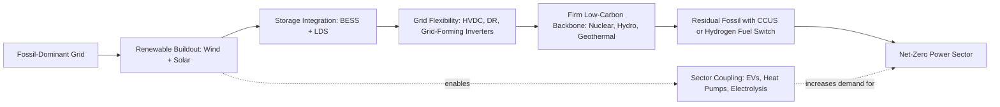

## Decarbonization Pathways for the Power Sector

### Overview

Decarbonization of the power sector refers to the systematic reduction of carbon dioxide (CO₂) and other greenhouse gas (GHG) emissions per unit of electricity generated and delivered, with the long-term goal of achieving net-zero emissions from electricity supply. Since power generation is one of the largest single contributors to global anthropogenic CO₂ emissions, decarbonizing this sector is foundational to broader climate mitigation strategies, and it also enables downstream decarbonization of other sectors (transport, heating, industry) through electrification.

The power sector's decarbonization is distinct from other sectors because electricity is both a final energy carrier and an enabling infrastructure — cleaning the grid multiplies the climate benefit of every electrified end-use.

### Key Drivers for Decarbonization

- **Climate policy commitments**: National and international agreements (e.g., Paris Agreement Nationally Determined Contributions, net-zero pledges) set legally or politically binding targets for emissions reduction.
- **Cost trajectories of renewables**: Levelized Cost of Electricity (LCOE) for solar photovoltaics (PV) and onshore/offshore wind has declined substantially over the past decade, making them cost-competitive with, or cheaper than, new fossil generation in many markets. [Inference: exact regional cost crossover points vary by market, resource quality, and financing conditions.]
- **Energy security concerns**: Diversifying away from imported fossil fuels toward domestically available renewable resources.
- **Corporate and investor pressure**: ESG (Environmental, Social, Governance) mandates and Science Based Targets initiative (SBTi) commitments from large electricity consumers.
- **Technology maturation**: Battery storage, green hydrogen, and grid-scale power electronics have matured to commercially deployable stages.

### Core Decarbonization Pathways

#### 1. Renewable Energy Deployment

The dominant near-term pathway is direct substitution of fossil-fueled generation (coal, natural gas, oil) with renewable sources.

**Key Points**

- **Solar PV**: Utility-scale and distributed (rooftop) solar; zero direct emissions during operation; variable and non-dispatchable without storage.
- **Wind (onshore/offshore)**: Higher capacity factors than solar in many locations; offshore wind offers larger turbine scale and steadier resource but higher capital cost per MW.
- **Hydropower**: Mature, dispatchable, provides both energy and grid services (frequency regulation, black start); constrained by geography and, in some cases, environmental/social concerns.
- **Geothermal**: Baseload-capable renewable resource, geographically constrained to areas with adequate subsurface heat gradients.
- **Bioenergy**: Can be dispatchable and carbon-neutral if sustainably sourced, but lifecycle emissions accounting (land use change, combustion emissions) is contested. [Unverified: net carbon neutrality of bioenergy depends heavily on feedstock sourcing and accounting methodology, which varies by jurisdiction.]

**Technical Challenge — Variability and Intermittency**

Solar and wind output fluctuates with weather and time of day, introducing variability that must be managed through:

- Grid balancing (dispatchable backup generation)
- Energy storage
- Demand response
- Geographic diversification (smoothing via interconnection)

#### 2. Energy Storage Integration

Storage decouples the timing of generation from consumption, enabling higher renewable penetration.

- **Lithium-ion battery energy storage systems (BESS)**: Dominant technology for short-duration (minutes to ~4 hours) grid-scale storage; used for frequency regulation, peak shaving, and renewable firming.
- **Pumped hydro storage**: Mature, high-capacity, long-duration storage; geographically constrained; round-trip efficiency typically 70–85%. [Inference: efficiency figures vary by specific plant design and head height.]
- **Long-duration storage (LDS)**: Emerging technologies (flow batteries, compressed air energy storage (CAES), liquid air energy storage (LAES), thermal storage) targeting 8+ hour to multi-day storage durations needed for deep renewable penetration.
- **Green hydrogen storage**: Electrolysis-produced hydrogen stored and later reconverted to electricity (via fuel cells or hydrogen-fired turbines), or used directly in industry — addresses seasonal storage needs beyond battery economics.

$$\text{Round-trip efficiency} = \frac{E_{\text{discharge}}}{E_{\text{charge}}} \times 100\%$$

#### 3. Grid Modernization and Flexibility

- **Smart grid infrastructure**: Advanced metering infrastructure (AMI), sensors, and digital control systems enabling real-time monitoring and dynamic response.
- **Demand-side management (DSM) and demand response (DR)**: Shifting or reducing load during peak periods or periods of low renewable output.
- **High-Voltage Direct Current (HVDC) transmission**: Enables efficient long-distance transmission with lower losses than AC over comparable distances, facilitating access to remote renewable resources (e.g., offshore wind, remote solar).
- **Interconnection expansion**: Larger balancing areas reduce the effective variability of renewables by aggregating diverse weather patterns.
- **Grid-forming inverters**: Power electronics that can provide synthetic inertia and voltage/frequency support historically provided by synchronous generators, critical as the share of inverter-based resources (IBR) increases.

#### 4. Nuclear Power

- Provides firm, dispatchable, low-carbon baseload generation with high capacity factors (typically >90%).
- **Small Modular Reactors (SMRs)**: Emerging technology offering factory-fabricated, smaller-footprint reactors intended to reduce capital cost risk and construction timelines relative to large conventional plants. [Speculation: cost and schedule performance of SMRs at commercial scale remains largely unproven as of early 2026, since few units have reached full commercial operation.]
- Faces challenges of high upfront capital cost, long construction lead times, waste management, and public acceptance in some regions.

#### 5. Carbon Capture, Utilization, and Storage (CCUS)

Applied to existing or new fossil-fueled plants to capture CO₂ before atmospheric release.

- **Post-combustion capture**: Chemical solvents (e.g., amine-based) scrub CO₂ from flue gas after combustion; retrofittable to existing plants.
- **Pre-combustion capture**: Fuel is converted to syngas (H₂ + CO), CO₂ is separated before combustion; associated with Integrated Gasification Combined Cycle (IGCC) plants.
- **Oxy-fuel combustion**: Combustion in pure oxygen (rather than air) produces a flue gas stream that is predominantly CO₂ and water vapor, simplifying capture.
- Captured CO₂ is transported (typically via pipeline) and either sequestered in geological formations or utilized (e.g., enhanced oil recovery, industrial feedstock).
- **Efficiency penalty**: Capture processes are energy-intensive, reducing net plant efficiency and output. [Inference: typical parasitic load estimates from literature range roughly 15–30% of gross output depending on capture technology and plant type; exact figures are plant-specific.]

#### 6. Fuel Switching

- **Coal-to-gas switching**: Natural gas combustion emits roughly half the CO₂ per unit energy compared to coal, providing an interim emissions reduction pathway, though it does not achieve net-zero on its own and carries methane leakage risks upstream.
- **Co-firing with biomass or hydrogen**: Blending low-carbon fuels into existing fossil plants to incrementally reduce net emissions intensity.
- **Hydrogen-ready turbines**: Gas turbines designed or retrofitted to combust hydrogen blends (or eventually pure hydrogen), positioning gas infrastructure for eventual full decarbonization.

#### 7. Electrification of Demand (Sector Coupling)

Decarbonizing the grid multiplies impact when combined with electrification of transport (electric vehicles), heating (heat pumps), and industrial processes, since each converted end-use inherits the grid's emissions intensity — declining over time as the grid decarbonizes.

### Emissions Accounting Framework

**Key Points**

- **Carbon intensity** of electricity is typically expressed as:

$$CI = \frac{\text{Total CO}_2 \text{ emissions (kg)}}{\text{Total electricity generated (kWh)}}$$

- Measured in gCO₂/kWh or tCO₂/MWh; used to benchmark grids, technologies, and progress over time.
- **Scope boundaries** matter: direct combustion emissions (Scope 1) versus lifecycle emissions (including manufacturing, fuel extraction, and end-of-life) give different pictures of a technology's true climate impact.

### System-Level Decarbonization Strategy — Illustrative Pathway

### Comparative Overview of Pathways

| Pathway | Dispatchability | Maturity | Typical Role in Grid |
| --- | --- | --- | --- |
| Solar PV | Non-dispatchable | Commercial, mature | Bulk energy, daytime |
| Wind | Non-dispatchable | Commercial, mature | Bulk energy, variable |
| Battery storage (Li-ion) | Dispatchable (short duration) | Commercial | Balancing, firming |
| Pumped hydro | Dispatchable | Mature | Long-duration balancing |
| Nuclear | Dispatchable (baseload) | Mature | Firm low-carbon baseload |
| Green hydrogen | Dispatchable (via reconversion) | Emerging/early commercial | Seasonal storage, hard-to-abate sectors |
| CCUS | Dispatchable (retrofits existing) | Early commercial, limited scale | Emissions reduction on residual fossil fleet |
| Geothermal | Dispatchable (baseload) | Mature where geologically viable | Firm renewable baseload |

### Grid-Level Renewable Integration Curve (svg_diagram)

<svg xmlns="http://www.w3.org/2000/svg" viewBox="0 0 700 420">
<text x="350" y="25" font-size="16" font-weight="bold" text-anchor="middle" fill="#1a1a1a">Renewable Penetration vs. Flexibility Requirement (svg_diagram)</text>
<line x1="70" y1="360" x2="650" y2="360" stroke="#333" stroke-width="2" />
<line x1="70" y1="360" x2="70" y2="60" stroke="#333" stroke-width="2" />
<text x="360" y="400" font-size="13" text-anchor="middle" fill="#333">Renewable Penetration (% of annual generation)</text>
<text x="30" y="210" font-size="13" text-anchor="middle" fill="#333" transform="rotate(-90 30 210)">System Flexibility Need</text>
<path d="M 90 350 Q 300 340 420 260 Q 550 180 630 80" fill="none" stroke="#2166ac" stroke-width="3" />
<text x="150" y="345" font-size="11" fill="#333">0-20%: Minimal</text>
<text x="330" y="290" font-size="11" fill="#333">20-50%: Storage +</text>
<text x="330" y="305" font-size="11" fill="#333">DR needed</text>
<text x="480" y="150" font-size="11" fill="#333">50-80%: LDS, grid-</text>
<text x="480" y="165" font-size="11" fill="#333">forming inverters</text>
<text x="500" y="100" font-size="11" fill="#333">80%+: Seasonal storage,</text>
<text x="500" y="115" font-size="11" fill="#333">sector coupling critical</text>
<circle cx="150" cy="352" r="4" fill="#b2182b" />
<circle cx="350" cy="300" r="4" fill="#b2182b" />
<circle cx="500" cy="200" r="4" fill="#b2182b" />
<circle cx="610" cy="95" r="4" fill="#b2182b" />
</svg>

### Policy and Market Mechanisms

- **Carbon pricing**: Carbon taxes or cap-and-trade (emissions trading systems, ETS) internalize the cost of CO₂ emissions, shifting dispatch economics toward lower-carbon sources.
- **Renewable Portfolio Standards (RPS) / Clean Energy Standards**: Mandate a minimum share of renewable or clean generation.
- **Feed-in tariffs and Contracts for Difference (CfDs)**: Provide revenue certainty for renewable project developers, de-risking investment.
- **Capacity markets**: Compensate dispatchable/firm capacity to maintain reliability as variable renewable share increases.
- **Renewable Energy Certificates (RECs) / Guarantees of Origin**: Tradable instruments certifying renewable generation, supporting corporate procurement.

### Technical Challenges to Deep Decarbonization

- **Frequency and inertia management**: Synchronous generators (coal, gas, nuclear, hydro) inherently provide rotational inertia that stabilizes grid frequency; high inverter-based resource (IBR) penetration requires synthetic inertia or grid-forming inverter controls to maintain stability.
- **Curtailment**: Excess renewable generation beyond what the grid can absorb or store must be curtailed, representing an economic and utilization inefficiency.
- **Transmission bottlenecks**: Best renewable resources are often geographically remote from load centers, requiring substantial new transmission buildout — frequently a longer-lead-time constraint than generation itself. [Inference: permitting and siting timelines for new transmission are widely reported as a leading bottleneck in multiple markets, though exact durations vary by jurisdiction.]
- **Critical mineral supply chains**: Batteries, wind turbines, and solar panels depend on lithium, cobalt, rare earth elements, and silver, raising supply chain and geopolitical considerations.
- **Seasonal mismatch**: In some climates, solar generation peaks in summer while heating demand peaks in winter, requiring either long-duration storage or complementary generation sources.
- **Stranded asset risk**: Existing fossil infrastructure may become economically stranded before the end of its technical lifetime, creating financial and regulatory complications.

### Worked Example — Carbon Intensity Reduction Calculation

**Example**

A regional grid currently generates 10,000 GWh/year with the following mix:

- Coal: 6,000 GWh at 900 gCO₂/kWh
- Natural gas: 3,000 GWh at 450 gCO₂/kWh
- Hydro: 1,000 GWh at 0 gCO₂/kWh

**Current total emissions:**

$$E_{\text{current}} = (6{,}000 \times 900) + (3{,}000 \times 450) + (1{,}000 \times 0)$$

$$E_{\text{current}} = 5{,}400{,}000 + 1{,}350{,}000 + 0 = 6{,}750{,}000 \text{ tCO}_2$$

**Current carbon intensity:**

$$CI_{\text{current}} = \frac{6{,}750{,}000 \text{ tCO}_2}{10{,}000{,}000 \text{ MWh}} = 675 \text{ kgCO}_2/\text{MWh}$$

**Proposed pathway**: Replace all coal with a mix of 4,000 GWh wind/solar and 2,000 GWh natural gas.

New mix: Wind/solar 4,000 GWh (0 gCO₂/kWh), Natural gas 5,000 GWh (450 gCO₂/kWh), Hydro 1,000 GWh (0 gCO₂/kWh)

$$E_{\text{new}} = (4{,}000 \times 0) + (5{,}000 \times 450) + (1{,}000 \times 0) = 2{,}250{,}000 \text{ tCO}_2$$

$$CI_{\text{new}} = \frac{2{,}250{,}000}{10{,}000{,}000} = 225 \text{ kgCO}_2/\text{MWh}$$

**Result**: A 66.7% reduction in grid carbon intensity, achieved primarily through coal-to-renewable substitution, with natural gas retained as dispatchable backup. Full decarbonization would require further displacement of the remaining natural gas via storage, additional renewables, or CCUS/hydrogen fuel switching.

### Regional Pathway Archetypes

- **Renewable-rich, low-population-density regions** (e.g., areas with strong wind/solar resource and modest demand): High direct renewable penetration achievable with moderate storage.
- **Nuclear-legacy regions**: Retain/extend existing nuclear fleets as a firm low-carbon backbone while adding renewables.
- **Hydro-rich regions**: Use existing hydro reservoirs as de facto long-duration storage to firm variable renewables.
- **Fossil-fuel-dependent, high-growth-demand regions**: Face the dual challenge of rapidly growing electricity demand and legacy fossil infrastructure; often rely on a combination of renewables, gas-to-coal switching, and international climate finance.

### Conclusion

Decarbonizing the power sector requires a portfolio approach rather than a single technology solution: renewable generation provides the bulk of new low-carbon energy, storage and grid flexibility manage variability, firm low-carbon sources (nuclear, hydro, geothermal) provide baseload stability, and CCUS or fuel switching address residual or hard-to-abate fossil generation. The relative weighting of these pathways is highly dependent on regional resource availability, existing infrastructure, policy environment, and cost trajectories, meaning no single decarbonization roadmap applies universally across all power systems.

**Related Topics**

- Grid-Scale Energy Storage Technologies and Economics
- Power System Inertia and Frequency Stability with High Renewable Penetration
- Green Hydrogen Production via Electrolysis
- HVDC Transmission Systems for Renewable Integration
- Carbon Capture, Utilization, and Storage (CCUS) Technologies
- Small Modular Reactors (SMRs) and Advanced Nuclear Designs
- Demand Response and Smart Grid Architectures
- Levelized Cost of Electricity (LCOE) Analysis for Generation Technologies
- Sector Coupling: Electrification of Transport and Heating
- Capacity Markets and Resource Adequacy Planning