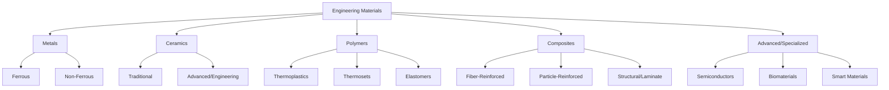

## Classification of Engineering Materials

### Overview

Engineering materials are systematically classified to guide selection, predict behavior, and organize the vast landscape of available substances into tractable categories. The primary classification scheme divides materials into four fundamental classes based on atomic bonding and structure — metals, ceramics, polymers, and composites — with electronic/biomaterials often treated as auxiliary or specialized categories. Each class exhibits characteristic property signatures that trace directly back to its underlying atomic bonding type, per the Structure-Property linkage central to materials science.

### Primary Classification Scheme

### Metals

Metals are characterized by metallic bonding — a lattice of positive ion cores immersed in a delocalized "sea" of valence electrons.

**Key Points**

- Delocalized electrons confer high electrical and thermal conductivity, opacity, and characteristic metallic luster.
- Non-directional metallic bonding permits dislocation motion, giving metals high ductility and the ability to be plastically deformed (rolled, forged, drawn) without fracture.
- Generally high density and moderate-to-high melting points relative to polymers.
- Susceptible to corrosion via electrochemical oxidation.

#### Ferrous Metals

Iron-based alloys, the most widely used engineering metals by tonnage.

- **Cast irons**: >2.0% carbon; gray iron, ductile (nodular) iron, white iron — used for engine blocks, pipe fittings, machine bases.
- **Carbon steels**: <2.0% carbon; classified as low-carbon (<0.3% C, high ductility, structural sections), medium-carbon (0.3-0.6% C, gears, shafts), high-carbon (>0.6% C, springs, cutting tools).
- **Alloy steels**: Contain Cr, Ni, Mo, V, etc. for enhanced hardenability, corrosion resistance, or high-temperature strength (stainless steels, tool steels, HSLA steels).

#### Non-Ferrous Metals

- **Aluminum alloys**: Low density (~2.7 g/cm³), good corrosion resistance, moderate strength; used in aerospace, transportation, building facades.
- **Copper alloys**: High electrical/thermal conductivity; brass (Cu-Zn), bronze (Cu-Sn) for bearings, electrical wiring, plumbing.
- **Titanium alloys**: High strength-to-weight ratio, excellent corrosion resistance; aerospace and biomedical implants.
- **Nickel, zinc, magnesium alloys**: Specialized applications (superalloys for turbines, galvanizing, lightweight castings).

### Ceramics

Ceramics are compounds of metallic and nonmetallic elements bonded via ionic and/or covalent bonds, which are directional and strong.

**Key Points**

- Strong, localized ionic/covalent bonds produce high hardness, high compressive strength, high melting points, and excellent chemical/thermal stability.
- The same bonding rigidity prevents dislocation motion, making ceramics brittle with very low fracture toughness — they fail catastrophically rather than deforming plastically.
- Generally excellent electrical insulators (exceptions: certain oxide superconductors, semiconducting ceramics) and low thermal conductivity relative to metals.
- Compressive strength substantially exceeds tensile strength (often 10:1 ratio), governing how ceramics/concrete are used structurally.

#### Traditional Ceramics

Clay-based products, glasses, and cement-based materials.

- **Structural clay products**: brick, tile, sewer pipe.
- **Whitewares**: porcelain, china.
- **Glasses**: amorphous (non-crystalline) silicates; window glass, container glass, fiberglass.
- **Cement and concrete**: hydraulic cement binder plus aggregate — the dominant civil engineering ceramic-based material.

#### Advanced/Engineering Ceramics

Engineered for structural or functional performance beyond traditional applications.

- **Oxides**: alumina ($Al_2O_3$), zirconia ($ZrO_2$) — cutting tools, biomedical implants, thermal barrier coatings.
- **Non-oxides**: silicon carbide (SiC), silicon nitride ($Si_3N_4$) — high-temperature structural components, abrasives.
- **Functional ceramics**: piezoelectrics (PZT), ferrites, superconducting ceramics.

### Polymers

Polymers are long-chain macromolecules built from repeating covalently-bonded monomer units, with secondary (van der Waals, hydrogen) bonding between chains.

**Key Points**

- Strong covalent bonds along the backbone chain combined with weak intermolecular forces between chains give polymers low density, low strength/modulus relative to metals/ceramics, but high ductility/flexibility.
- Low melting/softening temperatures compared to metals and ceramics; most polymers are unsuitable for sustained high-temperature service.
- Generally excellent electrical insulators and corrosion-resistant (do not oxidize electrochemically like metals), though susceptible to UV degradation and solvent attack.
- Mechanical behavior is strongly time- and temperature-dependent (viscoelasticity) — unlike the largely time-independent elastic behavior of metals/ceramics at room temperature.

#### Thermoplastics

Linear or branched chains held together only by secondary bonds; soften/melt reversibly on heating, enabling recycling and reprocessing.

- Examples: polyethylene (PE), polypropylene (PP), polyvinyl chloride (PVC), polystyrene (PS), PET, nylon (PA), PMMA (acrylic).
- Applications: packaging, pipes (PVC), consumer products, engineering plastics (gears, bearings in nylon/acetal).

#### Thermosets

Chains are cross-linked via covalent bonds during a curing reaction, forming a rigid 3D network that cannot be re-melted.

- Examples: epoxy, phenolic (Bakelite), polyester resin, polyurethane (rigid forms).
- Applications: adhesives, composite matrices, electrical insulators, coatings.

#### Elastomers

Lightly cross-linked polymers with coiled chains capable of large reversible elastic strain (up to several hundred percent).

- Examples: natural rubber, styrene-butadiene rubber (SBR), silicone rubber, neoprene.
- Applications: tires, seals, gaskets, vibration isolation, bridge bearings.

### Composites

Composites combine two or more distinct material classes (typically a matrix and a reinforcement) to achieve a property combination unattainable by either constituent alone.

**Key Points**

- The matrix phase (continuous) binds and protects the reinforcement, and transfers load; the reinforcement phase (dispersed) typically carries the primary structural load.
- Properties can often be estimated bounding-wise using the rule of mixtures: $P_c = V_m P_m + V_r P_r$ (upper bound, iso-strain/Voigt) and its inverse (lower bound, iso-stress/Reuss), where $V$ is volume fraction and subscripts denote composite, matrix, and reinforcement.
- Anisotropic behavior is common — properties depend on fiber orientation relative to loading direction, unlike the more isotropic behavior of bulk metals/ceramics.

#### Fiber-Reinforced Composites

- **Fiberglass (GFRP)**: glass fibers in polymer matrix; corrosion-resistant, moderate strength; used in boat hulls, pipes, rebar substitutes.
- **Carbon-Fiber-Reinforced Polymer (CFRP)**: very high strength-to-weight ratio; aerospace structures, bridge strengthening/retrofit.
- **Aramid (Kevlar) composites**: high toughness, impact/ballistic resistance.

#### Particle-Reinforced Composites

- **Concrete**: cement paste matrix with sand/gravel aggregate — the archetypal civil engineering particle composite.
- **Metal matrix composites (MMCs)**: e.g., aluminum reinforced with SiC particles for wear resistance.

#### Structural Composites / Laminates

- **Reinforced concrete**: concrete (compression) + steel rebar (tension) — a composite at the structural, not material, scale.
- **Plywood, laminated veneer lumber (LVL), cross-laminated timber (CLT)**: layered wood composites with alternating grain orientation for dimensional stability and strength.
- **Sandwich structures**: stiff face sheets bonded to a lightweight core (honeycomb, foam) for high bending stiffness-to-weight.

### Comparative Property Summary

| Property | Metals | Ceramics | Polymers | Composites |
| --- | --- | --- | --- | --- |
| Density | Moderate-High | Moderate | Low | Low-Moderate |
| Strength | High | High (compressive) | Low-Moderate | High (tailorable) |
| Ductility | High | Very Low (brittle) | Moderate-High | Low-Moderate (matrix-dependent) |
| Stiffness (E) | High | High | Low | Tailorable (fiber-dependent) |
| Elec. Conductivity | High | Low (insulator) | Low (insulator) | Variable |
| Thermal stability | Moderate-High | Very High | Low | Moderate (matrix-limited) |
| Corrosion resistance | Variable (often poor) | Excellent | Excellent | Good (matrix-protected) |

[Inference] These are generalized trends across each class; specific alloys, formulations, or engineered variants can deviate significantly (e.g., certain engineering polymers exceed the stiffness of some soft metals, and certain metal alloys are engineered for exceptional corrosion resistance).

### Specialized/Advanced Material Categories

- **Semiconductors**: Electrical conductivity intermediate between conductors and insulators, highly sensitive to impurity doping (silicon, germanium, gallium arsenide) — foundational to electronics, not typically load-bearing structural materials.
- **Biomaterials**: Materials (metallic, ceramic, polymeric, or composite) engineered for compatibility with biological systems — titanium/cobalt-chrome implants, hydroxyapatite coatings, biodegradable polymer sutures.
- **Smart/Functional Materials**: Materials responding to external stimuli — shape-memory alloys (Nitinol), piezoelectric ceramics, magnetorheological fluids — used in sensors, actuators, and adaptive structural systems.

### Classification by Structural Order (Cross-Cutting Scheme)

Independent of chemical bonding class, materials are also classified by atomic/molecular arrangement:

- **Crystalline**: long-range periodic atomic arrangement (most metals, many ceramics).
- **Amorphous (non-crystalline)**: no long-range order (glasses, many thermoplastics in the glassy state).
- **Semi-crystalline**: coexisting crystalline and amorphous regions (common in thermoplastics like PE, PP, nylon).

This distinction matters because crystallinity strongly affects density, optical clarity (amorphous polymers/glasses tend to be transparent), and mechanical behavior (crystalline regions increase stiffness and strength; amorphous regions increase toughness/flexibility).

### Application to Civil Engineering Material Selection

**Example**

A civil engineer selecting a material for a highway bridge deck overlay must weigh classification-driven trade-offs:

- **Concrete (ceramic-based composite)**: excellent compressive strength and durability, low cost, but requires reinforcement for tensile/flexural loads and is vulnerable to freeze-thaw and chloride-induced rebar corrosion.
- **Steel (metal)**: high tensile strength and ductility (energy absorption under seismic/impact loads), but requires corrosion protection (coatings, cathodic protection) and has higher embodied energy/cost.
- **FRP composite decking**: corrosion-immune, lightweight (reduces dead load and seismic demand), but higher material cost, UV/fire performance concerns, and less design experience/code coverage than conventional materials.

The classification framework directly informs this decision: the engineer is trading off the characteristic bonding-derived weaknesses of each class (ceramic brittleness, metallic corrosion susceptibility, polymer/composite cost and long-term durability uncertainty).

### Common Pitfalls

- Treating "composite" as a single material class with uniform properties — composite behavior is highly dependent on constituent selection, volume fraction, and fiber/particle orientation, and cannot be generalized the way bulk metal or ceramic properties often can.
- Assuming higher strength materials are always the correct choice — brittleness (ceramics), cost, corrosion behavior, and manufacturability must all be weighed against raw strength/stiffness values.
- Conflating "ferrous" with "steel" — cast irons are also ferrous but have distinctly different processing routes and mechanical behavior (notably much lower ductility) than steels due to graphite morphology.

### Conclusion

The four-class classification of engineering materials — metals, ceramics, polymers, and composites — is fundamentally rooted in atomic bonding type, and this bonding directly explains each class's characteristic strengths and limitations. Metals offer ductility and conductivity via delocalized electron bonding; ceramics offer hardness and thermal stability but brittleness via strong directional bonds; polymers offer light weight and flexibility but limited thermal/mechanical performance via weak intermolecular forces; and composites are deliberately engineered to combine favorable traits across classes. Mastery of this classification is the prerequisite for informed materials selection in any subsequent engineering design decision.

**Related Topics**

- Atomic bonding types (metallic, ionic, covalent, van der Waals) and their property consequences
- Crystal structures of metals (FCC, BCC, HCP) and ceramics
- Polymer chain structure, molecular weight, and crystallinity
- Composite micromechanics and the rule of mixtures
- Phase diagrams for ferrous alloys (Fe-C system)
- Concrete mix design and hydration chemistry
- Corrosion mechanisms in metals and reinforced concrete
- Materials selection charts (Ashby diagrams) for engineering design
- Structure-Processing-Property-Performance relationships (prerequisite topic)
- Sustainable and recycled materials in civil construction