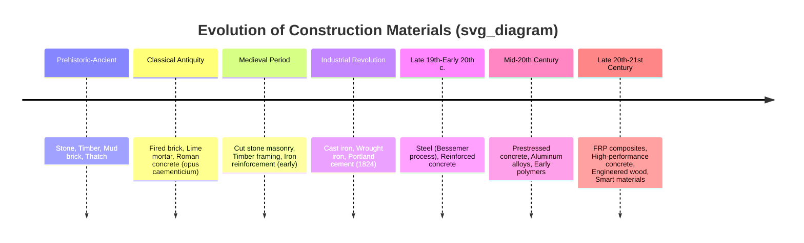

## Historical Evolution of Construction Materials

### Overview

The historical evolution of construction materials traces the progression of human civilization's ability to shape the built environment, driven by the discovery and refinement of natural materials, the development of processing techniques, and — increasingly — scientific understanding of the Structure-Processing-Property-Performance relationships underlying material behavior. This evolution is not merely chronological trivia; each era's material breakthroughs directly enabled architectural and structural achievements that were previously impossible, and understanding this progression illuminates why certain materials dominate specific applications today.

### Timeline of Major Eras

### Prehistoric and Ancient Materials (Pre-3000 BCE – 500 BCE)

**Key Points**

- **Stone**: The earliest durable structural material — used unprocessed (dry stone construction) or roughly shaped. High compressive strength and durability made it suitable for load-bearing walls and monumental structures (megaliths, early temples), but its brittleness and weight limited spanning capability without arch/vault geometry.
- **Timber**: Widely available, workable with primitive tools, and possessing useful tensile strength unlike stone — enabled early post-and-beam framing and roof structures.
- **Mud brick (adobe) and thatch**: Sun-dried clay/straw mixtures provided low-cost walling material in regions lacking abundant stone or timber (Mesopotamia, Egypt, Indus Valley); thatch provided lightweight roofing.
- **Early binding agents**: Natural bitumen (Mesopotamia) and gypsum plaster (Egypt) served as early mortars, predating lime-based binders.

These materials were used essentially as found in nature, with processing limited to simple shaping, drying, or firing — there was no engineered control over internal structure beyond empirical trial and observation.

### Classical Antiquity (500 BCE – 500 CE)

**Key Points**

- **Fired brick**: Kiln-firing clay at controlled temperatures produced a harder, more weather-resistant, and dimensionally consistent unit than sun-dried mud brick — an early example of processing (firing) transforming structure (ceramic bonding via vitrification) to improve properties (compressive strength, durability).
- **Lime mortar**: Calcining limestone ($CaCO_3 \rightarrow CaO + CO_2$) then slaking with water ($CaO + H_2O \rightarrow Ca(OH)_2$) produced a workable binder that hardened via carbonation, enabling more reliable masonry bonding than clay-based mortars.
- **Roman concrete (opus caementicium)**: The Romans combined lime, volcanic ash (pozzolana, rich in reactive silica/alumina), and aggregate to produce a hydraulic cement — one capable of hardening underwater and developing pozzolanic reactions that produced exceptional long-term durability. This innovation enabled unprecedented structures: the Pantheon's unreinforced concrete dome (completed 128 CE, still the world's largest unreinforced concrete dome) and extensive aqueduct/harbor infrastructure.
- [Inference] Modern materials science research (ongoing analysis of Roman concrete samples) suggests certain aluminous tobermorite crystal formations within the pozzolanic matrix may have contributed to unusual long-term strength gain and self-healing behavior, though the precise mechanisms are still an active area of study rather than settled historical fact.

### Medieval Period (500 – 1400 CE)

**Key Points**

- **Cut/dressed stone masonry**: Advances in quarrying and stone-cutting tools enabled precisely fitted ashlar masonry, supporting the pointed arch, ribbed vault, and flying buttress systems of Gothic cathedrals — structural innovations that redirected loads to permit taller, more open interior spaces despite stone's continued brittleness and lack of tensile capacity.
- **Timber framing**: Refined joinery techniques (mortise-and-tenon, pegged connections) advanced without metal fasteners, producing sophisticated timber-framed buildings across Europe and Asia.
- **Decline of Roman concrete knowledge**: The specific pozzolanic concrete technology was largely lost in Western Europe following the fall of Rome, not to be systematically rediscovered/reverse-engineered until centuries later — illustrating that materials knowledge, once processing-dependent and undocumented, can regress even after being empirically mastered.

### The Industrial Revolution and Ferrous Metal Age (1700s – late 1800s)

This era represents the first period where materials science began to intersect meaningfully with construction, as industrial-scale metal processing became viable.

**Key Points**

- **Cast iron** (widespread structural use from the 1770s): High compressive strength enabled the first metal bridges (Iron Bridge, Coalbrookdale, 1779) and columns, but brittleness (low tensile strength/ductility) limited use in tension/flexure and caused notable failures (e.g., collapses from brittle fracture under dynamic/impact loading).
- **Wrought iron**: Lower carbon content than cast iron gave superior ductility and tensile strength, enabling its use in tension members, chains, and early truss bridges; however, production (puddling process) was labor-intensive and limited in scale.
- **Portland cement** (patented by Joseph Aspdin, 1824): A manufactured hydraulic cement produced by calcining limestone and clay at high temperature — providing, for the first time, a reliably reproducible binder with consistent, controllable properties, independent of natural pozzolanic deposit availability. This standardization was a prerequisite for the later development of engineered reinforced concrete.
- **Steel via the Bessemer process** (Henry Bessemer, 1856) and later the open-hearth process: Enabled mass production of steel — combining the tensile ductility of wrought iron with substantially higher strength — at industrial scale and lower cost. This directly enabled the skyscraper (steel skeleton frame construction, from the 1880s, e.g., Home Insurance Building, Chicago, 1885) and long-span bridges (e.g., early steel truss and suspension bridges) that were structurally infeasible with iron alone.

### Reinforced and Prestressed Concrete Era (late 1800s – mid 1900s)

**Key Points**

- **Reinforced concrete** (patents by Joseph Monier, François Hennebique, and others, 1860s-1890s): Embedding steel reinforcement within concrete exploited a complementary property pairing — concrete's high compressive strength and steel's high tensile strength — solving concrete's fundamental weakness (near-negligible tensile capacity) and enabling monolithic, fire-resistant, moldable structural systems for slabs, beams, and frames.
- **Prestressed concrete** (Eugène Freyssinet, patented 1928; widely adopted post-WWII): Pre-tensioning or post-tensioning high-strength steel tendons induces a compressive stress in the concrete before service loading, counteracting tensile stresses under load and permitting longer spans, thinner sections, and improved crack control compared to conventionally reinforced concrete.
- **Aluminum alloys** (commercially viable from the Hall-Héroult electrolytic process, 1886; structural use expanding mid-20th century): Offered high strength-to-weight ratio and corrosion resistance, adopted for curtain walls, roofing, and specialized long-span structures where self-weight reduction was critical.

### Modern and Contemporary Era (mid 1900s – present)

**Key Points**

- **High-performance and high-strength concrete**: Development of chemical admixtures (superplasticizers, air-entraining agents) and supplementary cementitious materials (fly ash, silica fume, slag) allowed precise control over concrete's microstructure (reduced capillary porosity, refined pore structure), yielding compressive strengths exceeding 100 MPa and substantially improved durability compared to early 20th-century concrete — a direct, deliberate application of the Structure-Property linkage.
- **Fiber-reinforced polymer (FRP) composites**: Adopted from aerospace/marine origins into civil applications from the 1980s-1990s for corrosion-immune reinforcement, external strengthening (retrofit wrapping), and lightweight bridge decking.
- **Engineered wood products**: Glued laminated timber (glulam, developed early 1900s), laminated veneer lumber (LVL), and cross-laminated timber (CLT, developed 1990s Europe, widespread adoption 2010s onward) overcame natural timber's size and property variability limitations, enabling mass timber high-rise construction as a lower-embodied-carbon alternative to steel/concrete.
- **Smart and self-healing materials**: Ongoing research and early deployment of self-healing concrete (bacteria- or microcapsule-based), shape-memory alloy reinforcement, and structural health monitoring-integrated materials represent the current frontier. [Speculation] Widespread structural code adoption of these emerging material classes is likely to remain limited in the near term pending longer-term performance data and code committee validation, though the trajectory of adoption is inherently uncertain.
- **Sustainability-driven material innovation**: Low-carbon cement formulations (e.g., limestone calcined clay cement, geopolymer binders), recycled aggregate concrete, and mass timber adoption reflect a contemporary shift in material selection criteria toward embodied carbon reduction alongside traditional strength/durability requirements.

### Recurring Pattern: Processing Innovation as the Historical Driver

**Example**

Across every era in this timeline, the rate-limiting step for new structural capability was consistently a processing innovation, not the discovery of a new element or compound:

- Firing technique (not new clay) unlocked fired brick.
- Kiln temperature control and pozzolanic mixing (not new limestone) unlocked Roman concrete.
- The Bessemer process (not new iron ore) unlocked mass steel production.
- Admixture chemistry (not new cement compounds) unlocked high-performance concrete.

This recurring pattern reinforces the centrality of the Processing node in the Structure-Processing-Property-Performance framework: throughout history, engineering capability has advanced primarily through improved control over processing, which in turn enabled finer control over structure and therefore properties.

### Comparative Summary Table

| Era | Key Material | Enabling Process | Structural Capability Unlocked |
| --- | --- | --- | --- |
| Ancient | Fired brick, lime mortar | Kiln firing, calcination | Durable, weather-resistant masonry |
| Classical | Roman concrete | Pozzolanic mixing | Large-span unreinforced domes, underwater construction |
| Industrial | Cast/wrought iron | Blast furnace, puddling | Metal bridges, early iron-framed buildings |
| Late Industrial | Steel | Bessemer/open-hearth process | Skyscrapers, long-span steel bridges |
| Early Modern | Reinforced/prestressed concrete | Steel embedment, tensioning | Monolithic frames, long-span thin slabs |
| Contemporary | High-performance concrete, FRP, CLT | Admixture chemistry, composite layup, mass timber lamination | Ultra-high-rise, corrosion-immune structures, low-carbon tall timber |

### Conclusion

The historical evolution of construction materials demonstrates a consistent trajectory from empirically-discovered natural materials toward deliberately engineered materials with scientifically controlled structure and properties. Each major architectural and structural leap in human history — from the Pantheon's dome to the modern skyscraper to mass timber high-rises — was preceded and enabled by a specific processing breakthrough, illustrating that materials innovation, not merely material discovery, has been the primary driver of civil engineering capability throughout history. This historical lens directly reinforces why the Structure-Processing-Property-Performance framework remains the foundational organizing principle for understanding both past achievements and future materials development in civil and structural engineering.

**Related Topics**

- Structure-Processing-Property-Performance relationships
- Classification of engineering materials
- Roman concrete and pozzolanic reaction chemistry
- Portland cement manufacturing and hydration chemistry
- History and metallurgy of structural steel production
- Reinforced and prestressed concrete design principles
- Engineered wood products and mass timber construction
- Sustainable and low-carbon construction materials
- Fiber-reinforced polymer (FRP) composites in civil applications
- Materials selection in civil and structural design