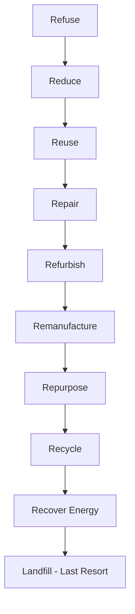

## Materials Science and Sustainability

### Overview

Materials Science and Sustainability examines how material selection, processing, use, and disposal affect environmental, economic, and social systems. As construction and manufacturing account for a large share of global resource consumption and emissions, sustainable materials engineering has become central to civil engineering practice, influencing codes, specifications, and design philosophy across the field.

### Core Concepts

#### Life Cycle Assessment (LCA)

Life Cycle Assessment quantifies environmental impacts across a material's full life cycle:

- **Raw material extraction** — mining, quarrying, harvesting
- **Processing/manufacturing** — refining, chemical transformation, energy input
- **Transportation** — embodied emissions from logistics
- **Construction/use phase** — installation impacts, in-service performance, maintenance
- **End-of-life** — demolition, recycling, landfill, reuse

LCA boundaries are typically classified using standardized stages:

| Stage | Description |
| --- | --- |
| A1–A3 | Product stage (raw material, transport, manufacturing) |
| A4–A5 | Construction process stage (transport, installation) |
| B1–B7 | Use stage (maintenance, repair, replacement, operational energy/water) |
| C1–C4 | End-of-life stage (demolition, transport, waste processing, disposal) |
| D | Benefits beyond system boundary (reuse, recycling, recovery) |

This framework follows EN 15804 and ISO 14040/14044 standards, widely referenced in Environmental Product Declarations (EPDs).

#### Embodied Carbon vs. Operational Carbon

$$E_{total} = E_{embodied} + E_{operational}$$

- **Embodied carbon**: greenhouse gas emissions from material extraction, manufacturing, transport, and construction (largely "locked in" at construction completion)
- **Operational carbon**: emissions from a structure's ongoing energy use during its service life

As building energy efficiency improves, embodied carbon represents a growing proportion of total lifecycle emissions — [Inference] some industry analyses project embodied carbon could account for nearly half of new construction emissions through 2050, though this depends heavily on regional grid decarbonization rates and building typology.

#### Embodied Energy

Embodied energy ($E_{emb}$) is the total energy consumed in producing a material, often expressed in MJ/kg:

$$E_{emb} = \sum_{i} (Q_i \times e_i)$$

where $Q_i$ is the quantity of process input $i$ and $e_i$ is its specific energy intensity.

**Typical embodied energy values (approximate, varies by source/process):**

| Material | Embodied Energy (MJ/kg) | Notes |
| --- | --- | --- |
| Aggregate | 0.1–0.5 | Low processing intensity |
| Concrete | 0.9–1.3 | Depends on cement content |
| Timber (sawn) | 2–7 | Varies with drying method |
| Steel (recycled) | 8–12 | Electric arc furnace route |
| Steel (virgin) | 20–35 | Basic oxygen furnace route |
| Aluminum (virgin) | 150–200 | Extremely energy-intensive |
| Aluminum (recycled) | 10–20 | ~90% energy savings vs. virgin |

[Unverified] — exact figures vary significantly by database (ICE, Ecoinvent), regional energy mix, and production route; treat these as order-of-magnitude references, not design values.

### Sustainable Material Strategies in Civil Engineering

#### Supplementary Cementitious Materials (SCMs)

Portland cement production is responsible for a substantial share of global CO₂ emissions, driven both by fuel combustion and the calcination reaction:

$$CaCO_3 \rightarrow CaO + CO_2$$

SCMs partially replace clinker in concrete mixes:

- **Fly ash** (coal combustion byproduct) — pozzolanic reaction with calcium hydroxide
- **Ground granulated blast-furnace slag (GGBS)** — steel industry byproduct
- **Silica fume** — extremely fine, improves density and strength
- **Natural pozzolans / calcined clays** — increasingly used as fly ash supply declines with coal plant retirements

Replacement levels commonly range from 20–50% by mass of cementitious material, though higher replacement generally slows early strength gain and requires curing adjustments.

#### Recycled and Reused Materials

- **Recycled concrete aggregate (RCA)** — crushed demolition concrete substituted for virgin aggregate
- **Recycled steel** — nearly 100% recyclable without property loss when processed via electric arc furnace
- **Reclaimed timber/masonry** — direct reuse in new construction, minimizing processing energy entirely
- **Recycled plastics** — used in composite lumber, pavement additives, and fiber reinforcement

#### Alternative Binders and Low-Carbon Concretes

- **Geopolymer concrete** — alkali-activated aluminosilicate binders (e.g., activated fly ash/slag) replacing Portland cement entirely
- **Carbon-cured concrete** — CO₂ injected during curing, mineralizing as calcium carbonate and sequestering carbon within the matrix
- **Limestone calcined clay cement (LC3)** — blend achieving substantial clinker reduction while maintaining performance

[Inference] These technologies show strong laboratory-scale promise, but widespread adoption is constrained by code acceptance, supply chain maturity, and regional material availability — actual field performance and cost-competitiveness vary by market.

#### Sustainable Timber Engineering

- **Mass timber** (CLT, glulam, LVL) as a renewable alternative to steel/concrete in mid-rise construction
- Carbon sequestration: wood stores carbon fixed during tree growth, though full lifecycle benefit depends on forest management, harvest cycles, and end-of-life fate
- Certification schemes (FSC, PEFC) verify sustainable forestry sourcing

### Design Frameworks and Standards

#### Green Building Rating Systems

| System | Region | Relevant Materials Criteria |
| --- | --- | --- |
| LEED | Global (US-based) | Recycled content, regional materials, EPDs |
| BREEAM | UK/Global | Responsible sourcing, embodied carbon |
| Green Star | Australia | Life cycle impact, material health |
| DGNB | Germany/Global | Full life cycle cost + environmental quality |

#### Environmental Product Declarations (EPDs)

Standardized, third-party-verified documents disclosing a product's environmental impact per ISO 14025, enabling comparison across manufacturers using consistent functional units (e.g., impact per m³ of concrete at a specified strength class).

#### Circular Economy Principles

Applied to materials engineering through the "R-hierarchy":

Strategies higher in the hierarchy generally preserve more embodied value and require less energy input than those lower down.

### Illustration: Material Life Cycle Flow (svg_diagram)

<svg xmlns="http://www.w3.org/2000/svg" viewBox="0 0 800 320" font-family="sans-serif">
<text x="400" y="25" text-anchor="middle" font-size="16" font-weight="bold">Material Life Cycle Flow (svg_diagram)</text>
<rect x="20" y="60" width="120" height="60" rx="8" fill="#e8f0fe" stroke="#4285f4" stroke-width="2" />
<text x="80" y="85" text-anchor="middle" font-size="12">Raw Material</text>
<text x="80" y="100" text-anchor="middle" font-size="12">Extraction (A1)</text>
<rect x="180" y="60" width="120" height="60" rx="8" fill="#e8f0fe" stroke="#4285f4" stroke-width="2" />
<text x="240" y="85" text-anchor="middle" font-size="12">Manufacturing</text>
<text x="240" y="100" text-anchor="middle" font-size="12">(A2–A3)</text>
<rect x="340" y="60" width="120" height="60" rx="8" fill="#e6f4ea" stroke="#34a853" stroke-width="2" />
<text x="400" y="85" text-anchor="middle" font-size="12">Construction</text>
<text x="400" y="100" text-anchor="middle" font-size="12">(A4–A5)</text>
<rect x="500" y="60" width="120" height="60" rx="8" fill="#fef7e0" stroke="#fbbc04" stroke-width="2" />
<text x="560" y="85" text-anchor="middle" font-size="12">Use / Maintenance</text>
<text x="560" y="100" text-anchor="middle" font-size="12">(B1–B7)</text>
<rect x="660" y="60" width="120" height="60" rx="8" fill="#fce8e6" stroke="#ea4335" stroke-width="2" />
<text x="720" y="85" text-anchor="middle" font-size="12">End of Life</text>
<text x="720" y="100" text-anchor="middle" font-size="12">(C1–C4)</text>
<line x1="140" y1="90" x2="180" y2="90" stroke="#555" stroke-width="2" marker-end="url(#arrow)" />
<line x1="300" y1="90" x2="340" y2="90" stroke="#555" stroke-width="2" marker-end="url(#arrow)" />
<line x1="460" y1="90" x2="500" y2="90" stroke="#555" stroke-width="2" marker-end="url(#arrow)" />
<line x1="620" y1="90" x2="660" y2="90" stroke="#555" stroke-width="2" marker-end="url(#arrow)" />
<path d="M 720 120 Q 720 220 400 220 Q 80 220 80 120" fill="none" stroke="#1a73e8" stroke-width="2" stroke-dasharray="6,3" marker-end="url(#arrow2)" />
<text x="400" y="240" text-anchor="middle" font-size="12" fill="#1a73e8">Module D: Reuse / Recycling Loop</text>
<text x="400" y="290" text-anchor="middle" font-size="11" fill="#666">Modules A1–A3: Product | A4–A5: Construction | B1–B7: Use | C1–C4: End-of-Life | D: Benefits Beyond Boundary</text>

</svg>

### Example: Comparative Embodied Carbon Calculation

**Scenario:** Compare embodied carbon of two 1 m³ concrete mixes for a footing element.

**Mix A (100% Ordinary Portland Cement):**

- Cement content: 350 kg/m³
- Emission factor: ≈0.90 kg CO₂e/kg cement
- Embodied carbon: $350 \times 0.90 = 315 \text{ kg CO}_2\text{e/m}^3$

**Mix B (40% GGBS replacement):**

- OPC: 210 kg/m³ × 0.90 = 189 kg CO₂e
- GGBS: 140 kg/m³ × 0.10 (much lower factor, byproduct allocation) = 14 kg CO₂e
- Embodied carbon: $189 + 14 = 203 \text{ kg CO}_2\text{e/m}^3$

**Result:** Approximately 36% reduction in embodied carbon per cubic meter by substituting GGBS for a portion of clinker, without necessarily requiring mix redesign beyond curing time adjustments.

[Inference] Actual reduction percentages vary with regional emission factors, SCM allocation methodology (some databases allocate zero burden to byproducts, others allocate partial burden), and required strength/durability performance.

### Challenges and Trade-offs

- **Performance trade-offs**: High-SCM or alternative binder mixes often show slower early strength development, requiring adjusted construction schedules
- **Supply chain limits**: Fly ash availability is declining as coal power plants retire in many regions, straining SCM supply
- **Durability vs. sustainability tension**: Some low-carbon materials require verification of long-term durability data before code bodies permit unrestricted structural use
- **Economic barriers**: Recycled/alternative materials may carry cost premiums or require specialized quality control, though this gap is narrowing in mature markets
- **Standardization lag**: [Inference] Code provisions for novel materials (geopolymers, high-volume SCM concretes) often lag behind laboratory research, slowing adoption in regulated structural applications

### Key Points

- Sustainability in materials science integrates environmental, economic, and performance criteria across a material's full life cycle
- Embodied carbon and embodied energy are quantifiable metrics guiding material selection decisions
- SCMs, recycled aggregates, alternative binders, and mass timber represent the primary current pathways to reducing construction-sector environmental impact
- LCA (ISO 14040/44) and EPDs (ISO 14025) provide standardized frameworks for comparing material impacts
- Circular economy principles prioritize reuse and repurposing over recycling and disposal
- Trade-offs between performance, cost, durability, and sustainability must be evaluated per project context

### Related Topics

- Cement Chemistry and Hydration Reactions
- Concrete Durability and Service Life Design
- Life Cycle Cost Analysis in Structural Design
- Steel Production Routes (BOF vs. EAF) and Recyclability
- Timber Engineering and Mass Timber Systems
- Environmental Product Declarations and Green Building Certification
- Circular Economy in Construction and Deconstruction Design
- Geopolymer and Alkali-Activated Binder Chemistry