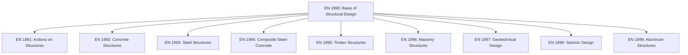
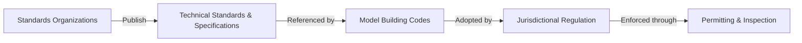

## Overview of Relevant Standards Organizations

### Purpose of Standards Organizations

Standards organizations develop, publish, and maintain codified specifications, test methods, and design criteria that ensure material and structural performance, safety, and interoperability across the construction and materials industries. In civil engineering and materials science, these bodies establish the technical basis for material qualification, structural design codes, testing protocols, and quality assurance.

### Classification of Standards Bodies

Standards organizations can be broadly categorized by scope and authority:

| Category | Description | Examples |
| --- | --- | --- |
| International | Global harmonization bodies | ISO, IEC |
| National (general) | Country-level standards across all sectors | ANSI (US), BSI (UK), DIN (Germany) |
| Material/testing-specific | Focused on test methods and material specs | ASTM International |
| Structural/design code bodies | Govern structural design provisions | ACI, AISC, Eurocode committees |
| Regional | Multi-country harmonized codes | CEN (Europe) |
| Government/regulatory | Legally enforceable regulations | Building departments, national building codes |

### Key International Organizations

#### ISO (International Organization for Standardization)

- Headquartered in Geneva, Switzerland; publishes standards across nearly all technical domains
- Relevant to materials science through standards such as ISO 6892 (tensile testing of metals), ISO 14040/44 (life cycle assessment), and ISO 14025 (environmental product declarations)
- Standards are developed by consensus among national member bodies via Technical Committees (TCs)
- ISO standards are voluntary unless adopted into national regulation

#### IEC (International Electrotechnical Commission)

- Companion body to ISO, focused on electrical, electronic, and related technologies
- Less directly relevant to structural materials but intersects in areas like smart infrastructure sensors and electrical conduit/material specifications

### Key Materials and Testing Standards Bodies

#### ASTM International

- Formerly the American Society for Testing and Materials, headquartered in the United States
- One of the most widely referenced bodies for material testing methods and specifications in civil/materials engineering
- Organized into subject-based committees (e.g., Committee C09 for concrete, A01 for steel)
- Publishes both **test methods** (procedures for measuring properties) and **specifications** (acceptance criteria for materials)

**Commonly referenced ASTM standards in civil/materials engineering:**

| Standard | Subject |
| --- | --- |
| ASTM C39 | Compressive strength testing of cylindrical concrete specimens |
| ASTM C150 | Standard specification for Portland cement |
| ASTM A615 | Standard specification for deformed/plain steel bars for concrete reinforcement |
| ASTM E8 | Standard test methods for tension testing of metallic materials |
| ASTM D638 | Tensile properties of plastics |
| ASTM C33 | Standard specification for concrete aggregates |

#### CEN (European Committee for Standardization)

- Coordinates the development of harmonized European Standards (EN)
- Produces the **Eurocodes**, a suite of structural design standards adopted across EU/EEA member states
- Eurocode structure: EN 1990 (basis of design) through EN 1999 (aluminum structures)

### Key Structural Design Code Bodies

#### ACI (American Concrete Institute)

- Develops design and construction standards for concrete structures
- **ACI 318**, "Building Code Requirements for Structural Concrete," is the primary US reference adopted into building codes
- Publishes guidance on topics including durability, seismic design, and specialized concretes

#### AISC (American Institute of Steel Construction)

- Develops specifications for structural steel design, fabrication, and erection in the US
- **AISC 360**, "Specification for Structural Steel Buildings," governs allowable stress and load/resistance factor design provisions

#### AASHTO (American Association of State Highway and Transportation Officials)

- Publishes design specifications for highway infrastructure, including the **AASHTO LRFD Bridge Design Specifications**
- Governs material and structural requirements specific to transportation infrastructure

#### Eurocode System (via CEN)

Structural design framework used across Europe, organized by material and load type:

### National Standards Bodies (Representative Examples)

| Country/Region | Body | Notes |
| --- | --- | --- |
| United States | ANSI | Coordinates/accredits US standards developers (including ASTM, ACI, AISC as SDOs) |
| United Kingdom | BSI (British Standards Institution) | Publishes BS and adopts EN standards |
| Germany | DIN (Deutsches Institut für Normung) | National standards body, active in ISO/CEN |
| Japan | JIS (Japanese Industrial Standards) | Governs material/testing standards domestically |
| India | BIS (Bureau of Indian Standards) | Publishes IS codes (e.g., IS 456 for concrete design) |
| Australia/NZ | Standards Australia / SNZ | Joint AS/NZS standards |
| Canada | CSA Group | Publishes CSA standards, including structural design codes |

### Relationship Between Standards and Building Codes

Standards organizations typically produce **technical standards** (test methods, material specs, design provisions), which are then **referenced or adopted** by legally enforceable **building codes** at national, regional, or municipal levels.

**Example (US context):**

- ASTM publishes material test methods and specifications
- ACI 318 references applicable ASTM standards for material qualification
- The International Building Code (IBC), published by the International Code Council (ICC), references ACI 318
- Local jurisdictions adopt the IBC (often with amendments) into enforceable law

[Inference] The exact chain of adoption varies by jurisdiction — some regions adopt model codes directly, others develop independent national codes referencing similar underlying standards.

### Illustration: Standards Hierarchy (svg_diagram)

<svg xmlns="http://www.w3.org/2000/svg" viewBox="0 0 700 380" font-family="sans-serif">
<text x="350" y="25" text-anchor="middle" font-size="16" font-weight="bold">Standards Hierarchy (svg_diagram)</text>
<rect x="250" y="50" width="200" height="50" rx="8" fill="#e8f0fe" stroke="#4285f4" stroke-width="2" />
<text x="350" y="80" text-anchor="middle" font-size="13">International (ISO, IEC)</text>
<rect x="250" y="130" width="200" height="50" rx="8" fill="#e6f4ea" stroke="#34a853" stroke-width="2" />
<text x="350" y="160" text-anchor="middle" font-size="13">Regional (CEN / Eurocode)</text>
<rect x="70" y="210" width="200" height="50" rx="8" fill="#fef7e0" stroke="#fbbc04" stroke-width="2" />
<text x="170" y="235" text-anchor="middle" font-size="12">National Testing Bodies</text>
<text x="170" y="250" text-anchor="middle" font-size="11">(ASTM, BSI, DIN, JIS)</text>
<rect x="430" y="210" width="200" height="50" rx="8" fill="#fef7e0" stroke="#fbbc04" stroke-width="2" />
<text x="530" y="235" text-anchor="middle" font-size="12">Design Code Bodies</text>
<text x="530" y="250" text-anchor="middle" font-size="11">(ACI, AISC, AASHTO)</text>
<rect x="250" y="290" width="200" height="50" rx="8" fill="#fce8e6" stroke="#ea4335" stroke-width="2" />
<text x="350" y="315" text-anchor="middle" font-size="12">Jurisdictional Building Codes</text>
<text x="350" y="330" text-anchor="middle" font-size="11">(IBC, local amendments)</text>
<line x1="350" y1="100" x2="350" y2="130" stroke="#555" stroke-width="2" marker-end="url(#a1)" />
<line x1="300" y1="180" x2="200" y2="210" stroke="#555" stroke-width="2" marker-end="url(#a1)" />
<line x1="400" y1="180" x2="500" y2="210" stroke="#555" stroke-width="2" marker-end="url(#a1)" />
<line x1="200" y1="260" x2="300" y2="290" stroke="#555" stroke-width="2" marker-end="url(#a1)" />
<line x1="500" y1="260" x2="400" y2="290" stroke="#555" stroke-width="2" marker-end="url(#a1)" />
</svg>

### Example: Tracing a Material Requirement Through the Standards Chain

**Scenario:** Specifying reinforcing steel for a reinforced concrete beam in the United States.

1. **Material specification**: ASTM A615 defines chemical composition, tensile strength, and yield strength requirements for deformed steel bars
2. **Design code reference**: ACI 318 cites ASTM A615 as an acceptable material specification and defines allowable design stresses using the material's yield strength ($f_y$)
3. **Building code adoption**: The IBC references ACI 318 for concrete design provisions
4. **Local enforcement**: The project's local jurisdiction, having adopted the IBC, requires construction documents to demonstrate compliance with ACI 318 provisions, verified through inspection and mill test certificates referencing ASTM A615

This chain illustrates how a single material property (yield strength) traces from a testing standard, through a design code, into legally enforceable construction requirements.

### Key Points

- Standards organizations operate at international (ISO), regional (CEN), and national (ASTM, BSI, DIN, JIS) levels, each with distinct scope and authority
- ASTM International is the dominant materials testing and specification body referenced throughout US civil/materials engineering practice
- Structural design provisions are typically issued by dedicated code bodies (ACI, AISC, AASHTO) rather than general testing organizations
- The Eurocode system, developed through CEN, provides a harmonized structural design framework across European countries
- Standards themselves are generally voluntary until referenced by an adopted building code, at which point compliance becomes legally enforceable
- Understanding the standards-to-code adoption chain is essential for correctly specifying and verifying materials in practice

### Related Topics

- ASTM Test Methods for Concrete and Steel Materials
- ACI 318 Structural Concrete Design Provisions
- Eurocode 2 (EN 1992): Design of Concrete Structures
- Quality Assurance and Mill Test Certificates
- International Building Code (IBC) Adoption and Amendments
- Material Certification and Third-Party Testing Laboratories