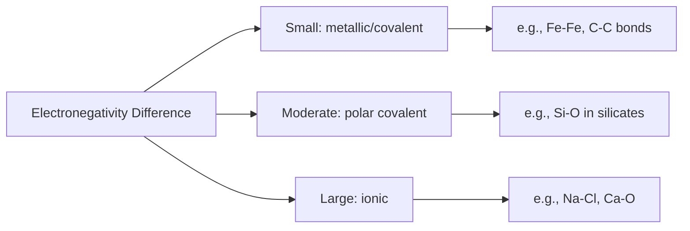

## Atomic Structure and Electron Configuration

### Overview

Atomic structure and electron configuration form the foundational basis for understanding material properties in materials science and civil engineering. The arrangement of electrons within an atom directly governs bonding behavior, which in turn determines mechanical, thermal, electrical, and chemical properties of engineering materials such as steel, concrete constituents, polymers, and ceramics.

### Basic Atomic Structure

An atom consists of three fundamental subatomic particles:

| Particle | Charge | Relative Mass (amu) | Location |
| --- | --- | --- | --- |
| Proton | +1 | 1.0073 | Nucleus |
| Neutron | 0 | 1.0087 | Nucleus |
| Electron | −1 | 0.00055 | Orbitals/electron cloud |

- The **atomic number** ($Z$) equals the number of protons and defines the element's identity
- The **mass number** ($A$) equals the sum of protons and neutrons: $A = Z + N$
- **Isotopes** are atoms of the same element with differing neutron counts, hence differing mass numbers

$$A = Z + N$$

### Atomic Mass and the Mole Concept

Atomic mass is expressed in atomic mass units (amu) or grams per mole (g/mol). One mole of any substance contains Avogadro's number of entities:

$$N_A = 6.022 \times 10^{23} \text{ mol}^{-1}$$

This relationship allows conversion between atomic-scale mass and macroscopic quantities used in engineering calculations, such as determining the number of atoms in a given mass of steel or aluminum.

### Electron Configuration Principles

Electron arrangement around the nucleus is governed by quantum mechanical principles, described through four quantum numbers:

| Quantum Number | Symbol | Describes | Possible Values |
| --- | --- | --- | --- |
| Principal | $n$ | Energy level/shell | 1, 2, 3, ... |
| Azimuthal (angular momentum) | $l$ | Subshell shape | 0 to $n-1$ (s, p, d, f) |
| Magnetic | $m_l$ | Orbital orientation | $-l$ to $+l$ |
| Spin | $m_s$ | Electron spin direction | $+\frac{1}{2}$ or $-\frac{1}{2}$ |

#### Subshell Notation and Capacity

| Subshell | $l$ value | Max electrons | Orbital shapes |
| --- | --- | --- | --- |
| s | 0 | 2 | Spherical |
| p | 1 | 6 | Dumbbell (3 orientations) |
| d | 2 | 10 | Complex (5 orientations) |
| f | 3 | 14 | Complex (7 orientations) |

### Rules Governing Electron Filling

#### Aufbau Principle

Electrons fill orbitals in order of increasing energy, following the general sequence:

$$1s < 2s < 2p < 3s < 3p < 4s < 3d < 4p < 5s < 4d < 5p < 6s < 4f < 5d < 6p < 7s$$

#### Pauli Exclusion Principle

No two electrons in the same atom can share identical values for all four quantum numbers — each orbital holds a maximum of two electrons with opposite spins.

#### Hund's Rule

Electrons occupy degenerate (equal-energy) orbitals singly before pairing, minimizing electron-electron repulsion and maximizing total spin.

### Example: Electron Configuration Derivation

**Iron (Fe), Z = 26**, a foundational element in structural steel:

Following the Aufbau filling order:

$$1s^2\, 2s^2\, 2p^6\, 3s^2\, 3p^6\, 4s^2\, 3d^6$$

Verification: $2+2+6+2+6+2+6 = 26$ electrons ✓

**Noble gas shorthand notation:**

$$[Ar]\, 4s^2\, 3d^6$$

The partially filled 3d subshell is significant: it explains iron's variable oxidation states (Fe²⁺, Fe³⁺), magnetic behavior (ferromagnetism), and participation in metallic bonding — all directly relevant to steel's mechanical and corrosion behavior.

**Aluminum (Al), Z = 13**, common in lightweight structural applications:

$$1s^2\, 2s^2\, 2p^6\, 3s^2\, 3p^1$$

Shorthand: $[Ne]\, 3s^2\, 3p^1$

Three valence electrons explain aluminum's typical +3 oxidation state and its tendency to form a protective oxide layer ($Al_2O_3$) responsible for its corrosion resistance.

### Valence Electrons and Engineering Relevance

**Valence electrons** — those in the outermost occupied shell — determine:

- **Bonding type** (metallic, ionic, covalent)
- **Reactivity** and oxidation behavior
- **Electrical conductivity**
- **Ductility and malleability** (in metals, via delocalized electron behavior)

| Material | Element | Valence Electrons | Engineering Relevance |
| --- | --- | --- | --- |
| Structural steel | Fe | 2 (4s) + partial d | Ferromagnetism, multiple oxidation states |
| Aluminum structures | Al | 3 | Lightweight, self-passivating oxide layer |
| Copper wiring | Cu | 1 (with filled 3d) | High electrical conductivity |
| Silicon (in cement/glass) | Si | 4 | Strong covalent network bonding |
| Carbon (in steel alloys) | C | 4 | Forms strong covalent bonds, controls steel hardness via interstitial placement |

### Periodic Trends Relevant to Materials Selection

#### Atomic Radius

Generally decreases across a period (left to right) due to increasing nuclear charge pulling electrons closer, and increases down a group as additional electron shells are added.

#### Ionization Energy

Energy required to remove an electron; generally increases across a period and decreases down a group. Elements with low ionization energy (alkali/alkaline earth metals) readily form cations and participate in ionic/metallic bonding.

#### Electronegativity

A measure of an atom's tendency to attract shared electrons; critical in predicting whether a bond will be metallic, covalent, or ionic based on electronegativity difference ($\Delta\chi$) between bonding atoms.

### Illustration: Bohr Model Representation of Iron (svg_diagram)

<svg xmlns="http://www.w3.org/2000/svg" viewBox="0 0 400 400" font-family="sans-serif">
<text x="200" y="25" text-anchor="middle" font-size="15" font-weight="bold">Bohr Model of Iron, Z=26 (svg_diagram)</text>
<circle cx="200" cy="210" r="12" fill="#ea4335" />
<text x="200" y="214" text-anchor="middle" font-size="9" fill="white">26p</text>
<circle cx="200" cy="210" r="40" fill="none" stroke="#4285f4" stroke-width="1.5" />
<circle cx="200" cy="170" r="4" fill="#4285f4" />
<circle cx="200" cy="250" r="4" fill="#4285f4" />
<circle cx="200" cy="210" r="75" fill="none" stroke="#34a853" stroke-width="1.5" />
<circle cx="200" cy="135" r="4" fill="#34a853" />
<circle cx="248" cy="160" r="4" fill="#34a853" />
<circle cx="260" cy="210" r="4" fill="#34a853" />
<circle cx="248" cy="260" r="4" fill="#34a853" />
<circle cx="200" cy="285" r="4" fill="#34a853" />
<circle cx="152" cy="260" r="4" fill="#34a853" />
<circle cx="140" cy="210" r="4" fill="#34a853" />
<circle cx="152" cy="160" r="4" fill="#34a853" />
<circle cx="200" cy="210" r="115" fill="none" stroke="#fbbc04" stroke-width="1.5" />
<circle cx="200" cy="95" r="4" fill="#fbbc04" />
<circle cx="238" cy="105" r="4" fill="#fbbc04" />
<circle cx="270" cy="130" r="4" fill="#fbbc04" />
<circle cx="292" cy="165" r="4" fill="#fbbc04" />
<circle cx="300" cy="210" r="4" fill="#fbbc04" />
<circle cx="292" cy="255" r="4" fill="#fbbc04" />
<circle cx="270" cy="290" r="4" fill="#fbbc04" />
<circle cx="238" cy="315" r="4" fill="#fbbc04" />
<circle cx="200" cy="325" r="4" fill="#fbbc04" />
<circle cx="162" cy="315" r="4" fill="#fbbc04" />
<circle cx="130" cy="290" r="4" fill="#fbbc04" />
<circle cx="108" cy="255" r="4" fill="#fbbc04" />
<circle cx="100" cy="210" r="4" fill="#fbbc04" />
<circle cx="108" cy="165" r="4" fill="#fbbc04" />
<circle cx="200" cy="210" r="150" fill="none" stroke="#a142f4" stroke-width="1.5" />
<circle cx="200" cy="60" r="4" fill="#a142f4" />
<circle cx="235" cy="70" r="4" fill="#a142f4" />

<text x="200" y="380" text-anchor="middle" font-size="11" fill="#555">Shells: 2, 8, 14, 2 (n=1,2,3,4) — configuration [Ar] 4s² 3d⁶</text>

</svg>

### Connection to Interatomic Bonding

Electron configuration directly predicts bonding behavior:

- **Metallic bonding**: Elements with few valence electrons (1–3) delocalize them into a shared "electron sea," explaining ductility, malleability, and conductivity in metals like steel, aluminum, and copper
- **Covalent bonding**: Elements with 4+ valence electrons and high electronegativity share electron pairs, forming strong directional bonds (e.g., Si–O networks in silicate minerals and cement hydration products)
- **Ionic bonding**: Large electronegativity differences drive electron transfer, forming charged ions held by electrostatic attraction (e.g., Ca²⁺ and O²⁻ in cementitious compounds)

This linkage between electron configuration and bonding type is the conceptual bridge connecting atomic-scale structure to macroscopic material properties such as strength, ductility, and thermal/electrical behavior — the focus of subsequent bonding topics in this chapter.

### Key Points

- Atomic structure comprises protons, neutrons, and electrons, with atomic number and mass number defining elemental identity and isotopic variation
- Electron configuration follows the Aufbau principle, Pauli exclusion principle, and Hund's rule
- Quantum numbers ($n$, $l$, $m_l$, $m_s$) fully describe each electron's state within an atom
- Valence electron count and configuration directly determine bonding type, reactivity, and key engineering properties
- Periodic trends (atomic radius, ionization energy, electronegativity) provide predictive tools for material behavior
- Transition metals like iron exhibit partially filled d-orbitals, explaining multiple oxidation states and magnetic properties relevant to steel metallurgy

### Related Topics

- Primary Interatomic Bonding: Ionic, Covalent, and Metallic Bonds
- Secondary (Van der Waals) Bonding and Its Role in Polymers
- Periodic Table Trends and Materials Selection
- Crystal Structures and Atomic Packing
- Bonding Energy and Its Relationship to Melting Point and Stiffness