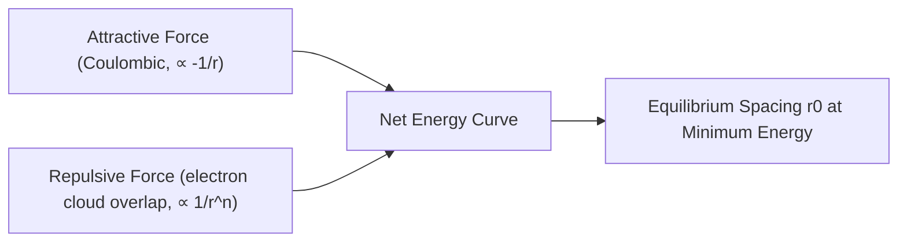
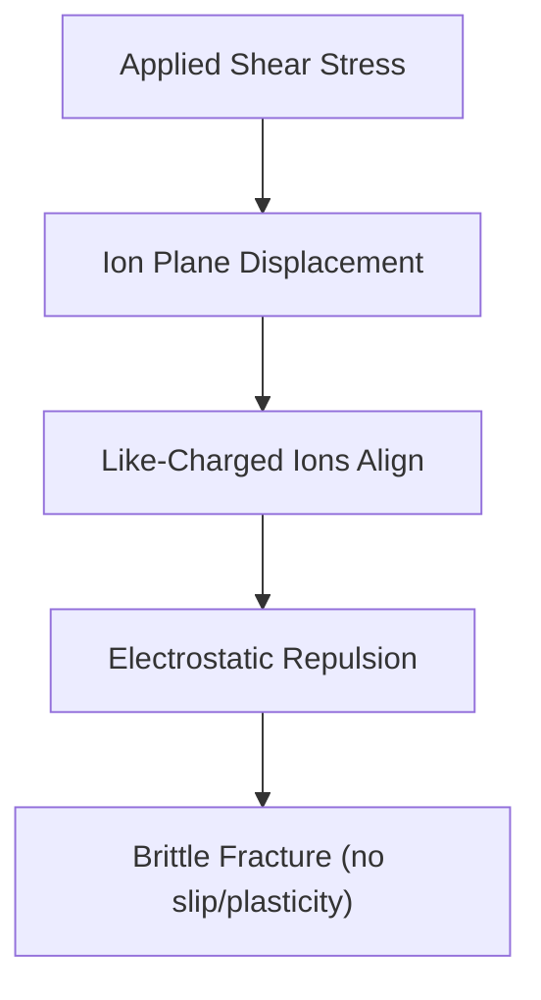

## Ionic Bonding

### Overview

Ionic bonding is a primary interatomic bond formed through the electrostatic attraction between oppositely charged ions, resulting from the transfer of one or more electrons from a metallic (electropositive) atom to a nonmetallic (electronegative) atom. This bonding mechanism underlies the behavior of many ceramic materials, mineral phases in cement and aggregates, and corrosion products relevant to civil engineering.

### Mechanism of Ionic Bond Formation

Ionic bonding occurs when the electronegativity difference between two atoms is large enough that electrons transfer completely rather than being shared. The process typically involves:

1. **Electron transfer**: A metal atom (low ionization energy) loses one or more valence electrons, becoming a positively charged **cation**
2. **Electron acceptance**: A nonmetal atom (high electron affinity) gains those electrons, becoming a negatively charged **anion**
3. **Electrostatic attraction**: The resulting oppositely charged ions attract each other via Coulombic force, forming a stable lattice

**Example — Sodium Chloride formation:**

$$Na \rightarrow Na^+ + e^-$$

$$Cl + e^- \rightarrow Cl^-$$

$$Na^+ + Cl^- \rightarrow NaCl$$

Both resulting ions achieve stable, filled-shell (noble gas) electron configurations: $Na^+$ mimics neon $[Ne]$, and $Cl^-$ mimics argon $[Ar]$.

### Electronegativity and Bond Character

The degree of ionic character in a bond depends on the electronegativity difference ($\Delta\chi$) between the two atoms:

| $\Delta\chi$ (Pauling scale) | Bond Character |
| --- | --- |
| 0 – 0.4 | Nonpolar covalent |
| 0.4 – 1.7 | Polar covalent |
| > 1.7 | Predominantly ionic |

[Inference] These ranges are commonly used pedagogical guidelines rather than sharp physical boundaries — bonding character exists on a continuum, and many engineering materials exhibit **mixed ionic-covalent bonding** rather than purely one type.

### Coulombic Attraction and Bond Energy

The attractive force between ions follows Coulomb's law:

$$F = \frac{k \, |q_1||q_2|}{r^2}$$

where $k$ is Coulomb's constant, $q_1$ and $q_2$ are the ion charges, and $r$ is the interionic distance.

The net potential energy of an ionic bond combines attractive and repulsive terms:

$$E_N = -\frac{A}{r} + \frac{B}{r^n}$$

where:

- $A$ relates to the attractive Coulombic term
- $B$ and $n$ relate to short-range repulsive forces (arising from overlapping electron clouds, per the Pauli exclusion principle)
- $r$ is the interatomic separation distance

The equilibrium bond distance $r_0$ occurs where net force is zero (minimum potential energy), representing the stable spacing between ions in the lattice.

### Illustration: Ionic Bond Energy Curve (svg_diagram)

<svg xmlns="http://www.w3.org/2000/svg" viewBox="0 0 500 350" font-family="sans-serif">
<text x="250" y="20" text-anchor="middle" font-size="14" font-weight="bold">Net Potential Energy vs. Interatomic Distance (svg_diagram)</text>
<line x1="60" y1="300" x2="460" y2="300" stroke="black" stroke-width="1.5" />
<line x1="60" y1="40" x2="60" y2="300" stroke="black" stroke-width="1.5" />
<text x="460" y="320" font-size="11">r (distance)</text>
<text x="20" y="40" font-size="11">E</text>
<path d="M 100 60 Q 130 150 180 220 Q 220 260 260 265 Q 300 260 340 220 Q 390 150 430 60" fill="none" stroke="#ea4335" stroke-width="2" />
<text x="380" y="70" font-size="10" fill="#ea4335">Repulsive (B/r^n)</text>
<path d="M 100 290 Q 180 270 260 265 Q 340 260 430 250" fill="none" stroke="#4285f4" stroke-width="2" stroke-dasharray="4,3" />
<text x="350" y="280" font-size="10" fill="#4285f4">Attractive (-A/r)</text>
<path d="M 100 200 Q 150 100 200 120 Q 240 150 260 265 Q 280 150 320 120 Q 370 100 420 200" fill="none" stroke="#34a853" stroke-width="2.5" />
<text x="330" y="130" font-size="10" fill="#34a853">Net Energy E_N</text>
<circle cx="260" cy="265" r="4" fill="black" />
<line x1="260" y1="265" x2="260" y2="300" stroke="black" stroke-width="1" stroke-dasharray="2,2" />
<text x="255" y="315" font-size="10">r₀</text>
<line x1="60" y1="300" x2="60" y2="40" stroke="black" stroke-width="0" />
<text x="30" y="200" font-size="10">0</text>
</svg>

### Ionic Bond Characteristics and Resulting Properties

The nature of ionic bonding directly determines characteristic macroscopic properties:

| Characteristic | Origin | Resulting Property |
| --- | --- | --- |
| Non-directional bonding | Electrostatic attraction acts equally in all directions | Ions arrange into ordered, dense crystal lattices |
| High bond energy | Strong Coulombic attraction | High melting/boiling points |
| Fixed ion positions | Rigid lattice structure | Hard but brittle behavior |
| No free electrons | Electrons are localized on ions, not delocalized | Poor electrical conductivity in solid state; conductive when molten or dissolved (mobile ions) |
| Charge balance requirement | Overall electrical neutrality | Stoichiometric ratios (e.g., $Ca^{2+}$ with $O^{2-}$ requires 1:1 ratio) |

#### Why Ionic Materials Are Brittle

Because ionic bonds are non-directional but charge-specific, any relative displacement of ion planes under stress can bring like-charged ions into close proximity, causing strong electrostatic repulsion. This leads to sudden fracture rather than plastic deformation:

### Coordination Number and Ionic Radius Ratio

The number of anions surrounding a central cation (**coordination number**) depends on the ratio of ionic radii, following the radius ratio rule:

$$\text{Radius Ratio} = \frac{r_{cation}}{r_{anion}}$$

| Radius Ratio Range | Coordination Number | Geometry |
| --- | --- | --- |
| 0.155 – 0.225 | 3 | Triangular |
| 0.225 – 0.414 | 4 | Tetrahedral |
| 0.414 – 0.732 | 6 | Octahedral |
| 0.732 – 1.000 | 8 | Cubic |

[Inference] The radius ratio rule provides a useful first-order prediction but has known exceptions where partial covalent character or polarization effects alter observed coordination — actual crystal structures should be verified against experimental/crystallographic data rather than radius ratio alone.

### Relevance to Civil Engineering and Materials Science

#### Ceramic and Mineral Materials

Many ceramic materials relevant to construction exhibit ionic (or mixed ionic-covalent) bonding:

- **Magnesium oxide (MgO)** — highly ionic, used in refractories
- **Calcium oxide (CaO)** — key clinker phase in Portland cement production
- **Silicate minerals** (feldspars, clays) — mixed ionic-covalent bonding between Si-O (covalent-dominant) and metal cations (ionic-dominant)

#### Cement Hydration Chemistry

Portland cement hydration products, such as calcium silicate hydrate (C-S-H) and calcium hydroxide (Ca(OH)₂), involve ionic bonding between $Ca^{2+}$ cations and oxide/hydroxide anions, contributing to the rigidity and compressive strength of hardened cement paste.

#### Corrosion Products

Iron oxidation in reinforcing steel produces ionic compounds such as iron oxides/hydroxides (rust), where $Fe^{2+}/Fe^{3+}$ cations bond ionically with $O^{2-}$ or $OH^-$ anions — directly relevant to reinforcement corrosion and concrete durability assessment.

### Example: Predicting Bond Character Using Electronegativity

**Problem**: Determine the likely bonding character between calcium (Ca) and oxygen (O), both present in Portland cement clinker phases.

**Given (Pauling electronegativity values):**

- Calcium: $\chi_{Ca} \approx 1.00$
- Oxygen: $\chi_{O} \approx 3.44$

**Calculation:**

$$\Delta\chi = |3.44 - 1.00| = 2.44$$

**Interpretation**: Since $\Delta\chi = 2.44 > 1.7$, the Ca–O bond is predominantly ionic, consistent with the ionic bonding observed in calcium oxide (CaO) and calcium silicate hydrate phases that govern the mechanical rigidity of hardened cement paste.

### Key Points

- Ionic bonding arises from complete electron transfer between atoms with a large electronegativity difference, forming oppositely charged ions held by Coulombic attraction
- Bond energy is described by a balance of attractive ($-A/r$) and repulsive ($B/r^n$) terms, with equilibrium spacing $r_0$ at minimum potential energy
- Ionic bonds are strong, non-directional, and produce hard, brittle materials with high melting points and low solid-state electrical conductivity
- Coordination number is influenced by the cation-to-anion radius ratio, though exceptions exist due to partial covalency
- Many construction materials — including cement clinker phases, ceramics, and corrosion products — rely fundamentally on ionic bonding to achieve their characteristic strength and brittleness

### Related Topics

- Covalent Bonding and Its Role in Silicate Networks
- Metallic Bonding and the Electron Sea Model
- Secondary (Van der Waals) Bonding
- Crystal Structures: Ionic Lattice Geometries (Rock Salt, Fluorite, etc.)
- Cement Chemistry and Hydration Product Formation
- Ceramic Materials: Structure-Property Relationships