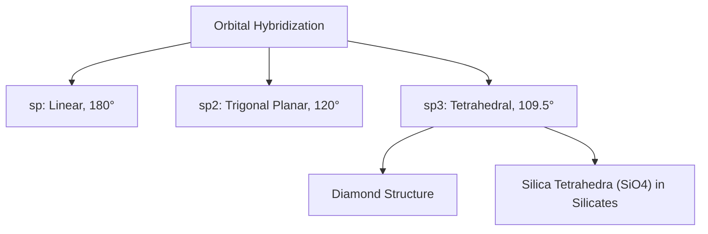
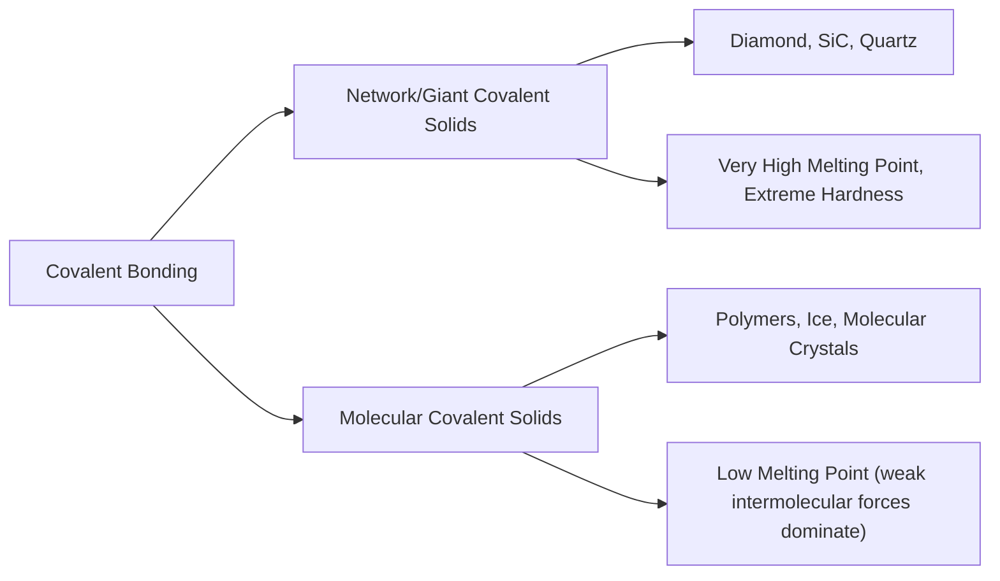

## Covalent Bonding

### Overview

Covalent bonding is a primary interatomic bond formed through the sharing of valence electron pairs between atoms, typically occurring between elements with similar (and often high) electronegativity. This bonding mechanism produces some of the strongest and most directional bonds in nature, underlying materials ranging from polymers and diamond to silicate networks found in aggregates, clays, and cementitious phases relevant to civil engineering.

### Mechanism of Covalent Bond Formation

Unlike ionic bonding, where electrons transfer completely, covalent bonding involves atoms **sharing** one or more electron pairs to achieve stable, filled-shell electron configurations (typically satisfying the octet rule for main-group elements).

**Example — Hydrogen molecule formation:**

$$H \cdot + \cdot H \rightarrow H:H \quad (H_2)$$

Each hydrogen atom contributes one electron to a shared pair occupying the bonding molecular orbital, achieving a stable configuration resembling helium.

**Example — Methane formation:**

Carbon (4 valence electrons) shares one electron pair with each of four hydrogen atoms, achieving a stable octet:

$$C + 4H \rightarrow CH_4$$

### Electronegativity and Covalent Character

As with ionic bonding, the electronegativity difference ($\Delta\chi$) between bonding atoms predicts bond character:

| $\Delta\chi$ (Pauling scale) | Bond Character |
| --- | --- |
| 0 | Pure (nonpolar) covalent |
| 0 – 0.4 | Nonpolar covalent |
| 0.4 – 1.7 | Polar covalent |
| > 1.7 | Predominantly ionic |

In **polar covalent** bonds, shared electrons are not distributed equally — they reside closer to the more electronegative atom, creating partial charges ($\delta^+$ and $\delta^-$) without complete electron transfer.

[Inference] As with ionic bonding thresholds, these ranges are instructive approximations rather than sharp physical cutoffs; bond character exists on a continuum and many engineering materials display mixed covalent-ionic bonding.

### Bond Order and Multiple Bonds

Covalent bonds can involve the sharing of more than one electron pair:

| Bond Type | Shared Electron Pairs | Relative Bond Strength | Relative Bond Length |
| --- | --- | --- | --- |
| Single bond | 1 | Lowest | Longest |
| Double bond | 2 | Higher | Shorter |
| Triple bond | 3 | Highest | Shortest |

Higher bond order generally correlates with greater bond energy and shorter equilibrium bond length, though exact values depend on the specific atoms involved.

### Directionality and Hybridization

Unlike ionic bonds, covalent bonds are **highly directional**, with specific bond angles determined by orbital hybridization:

| Hybridization | Geometry | Bond Angle | Example |
| --- | --- | --- | --- |
| $sp$ | Linear | 180° | $C_2H_2$ (acetylene) |
| $sp^2$ | Trigonal planar | 120° | Graphite sheets |
| $sp^3$ | Tetrahedral | 109.5° | Diamond, silica ($SiO_4$ tetrahedra) |

This directionality is critical in materials science: it explains why covalently bonded materials often form specific, rigid three-dimensional network structures rather than close-packed arrangements typical of metallic or ionic solids.

### Illustration: Tetrahedral SiO₄ Unit (svg_diagram)

<svg xmlns="http://www.w3.org/2000/svg" viewBox="0 0 400 380" font-family="sans-serif">
<text x="200" y="20" text-anchor="middle" font-size="14" font-weight="bold">Silicate Tetrahedron SiO4 (svg_diagram)</text>
<circle cx="200" cy="190" r="18" fill="#fbbc04" stroke="#333" stroke-width="1.5" />
<text x="200" y="195" text-anchor="middle" font-size="11" font-weight="bold">Si</text>
<circle cx="200" cy="80" r="14" fill="#ea4335" stroke="#333" stroke-width="1" />
<text x="200" y="84" text-anchor="middle" font-size="10" fill="white">O</text>
<circle cx="100" cy="240" r="14" fill="#ea4335" stroke="#333" stroke-width="1" />
<text x="100" y="244" text-anchor="middle" font-size="10" fill="white">O</text>
<circle cx="300" cy="240" r="14" fill="#ea4335" stroke="#333" stroke-width="1" />
<text x="300" y="244" text-anchor="middle" font-size="10" fill="white">O</text>
<circle cx="200" cy="320" r="14" fill="#ea4335" stroke="#333" stroke-width="1" />
<text x="200" y="324" text-anchor="middle" font-size="10" fill="white">O</text>
<line x1="200" y1="190" x2="200" y2="80" stroke="#555" stroke-width="2" />
<line x1="200" y1="190" x2="100" y2="240" stroke="#555" stroke-width="2" />
<line x1="200" y1="190" x2="300" y2="240" stroke="#555" stroke-width="2" />
<line x1="200" y1="190" x2="200" y2="320" stroke="#555" stroke-width="2" stroke-dasharray="4,3" />

<text x="200" y="360" text-anchor="middle" font-size="11" fill="#555">Bond angle ≈ 109.5° (sp³ hybridization)</text>

</svg>

### Covalent Bond Characteristics and Resulting Properties

| Characteristic | Origin | Resulting Property |
| --- | --- | --- |
| Directional bonding | Fixed hybrid orbital geometry | Specific, often open crystal structures |
| High bond energy | Strong orbital overlap | High melting points (network covalent solids) |
| Localized electrons | Electrons confined between bonded atoms | Generally poor electrical conductivity (exceptions: graphite) |
| Rigid bond angles | Hybridization constraints | Stiffness along network directions |
| Network vs. molecular structure | Extent of bonding continuity | Determines whether material is a hard solid (network) or a soft solid/gas (molecular) |

#### Network Covalent Solids vs. Molecular Covalent Solids

A key distinction in covalent materials is the scale of the bonded network:

- **Network (giant covalent) solids**: Continuous covalent bonding throughout the entire structure — e.g., diamond, silicon carbide, quartz ($SiO_2$). These exhibit extremely high hardness and melting points due to the need to break many strong bonds to cause failure.
- **Molecular covalent solids**: Strong covalent bonds within discrete molecules, but only weak secondary (Van der Waals) forces between molecules — e.g., many polymers, ice, sulfur. These exhibit much lower melting points because intermolecular forces (not intramolecular covalent bonds) govern bulk properties.

### Relevance to Civil Engineering and Materials Science

#### Silicate Minerals and Aggregates

The fundamental building block of most rock-forming silicate minerals is the $SiO_4^{4-}$ tetrahedron, in which silicon forms strong covalent (with partial ionic character) bonds to four oxygen atoms. These tetrahedra link in various configurations (chains, sheets, or three-dimensional frameworks), directly controlling the mechanical properties, cleavage behavior, and durability of aggregates used in concrete.

#### Polymers and Geosynthetics

Polymeric materials used in geosynthetics, sealants, and admixtures (e.g., polyethylene, polypropylene, PVC) rely on covalent carbon-carbon backbone bonding within molecular chains, with chain length, branching, and cross-linking governing mechanical behavior — while weaker secondary bonding between chains controls properties like melting temperature and flexibility.

#### Diamond and Silicon Carbide in Cutting/Abrasive Applications

Network covalent materials such as diamond and silicon carbide, used in cutting and grinding tools for concrete and stone, derive their extreme hardness directly from the strength and three-dimensional continuity of their covalent bond networks.

#### Carbon in Steel Alloys

While the iron matrix in steel is metallically bonded, interstitial carbon atoms can form localized covalent-character interactions with surrounding iron atoms, contributing to steel's hardening behavior — though the dominant bonding character in the bulk metal remains metallic.

### Example: Comparing Bond Character Across Common Materials

**Problem**: Rank the following bonds by ionic character using electronegativity differences: Si–O, C–C, Ca–O.

**Given (approximate Pauling values):** $\chi_{Si} = 1.90$, $\chi_O = 3.44$, $\chi_C = 2.55$, $\chi_{Ca} = 1.00$

**Calculations:**

$$\Delta\chi_{Si-O} = |3.44 - 1.90| = 1.54$$

$$\Delta\chi_{C-C} = |2.55 - 2.55| = 0.00$$

$$\Delta\chi_{Ca-O} = |3.44 - 1.00| = 2.44$$

**Interpretation**:

- **C–C** ($\Delta\chi = 0$): Purely (nonpolar) covalent — consistent with diamond and polymer backbones
- **Si–O** ($\Delta\chi = 1.54$): Polar covalent, near the ionic threshold — consistent with silicate tetrahedra exhibiting significant partial ionic character
- **Ca–O** ($\Delta\chi = 2.44$): Predominantly ionic — consistent with the ionic bonding in calcium-based cement phases

This progression illustrates why silicate minerals are often described as having "mixed ionic-covalent" bonding, while pure carbon networks (diamond, graphite) remain almost entirely covalent.

### Key Points

- Covalent bonding occurs through electron pair sharing between atoms, typically with small-to-moderate electronegativity differences
- Bond order (single, double, triple) affects bond strength and length, while orbital hybridization ($sp$, $sp^2$, $sp^3$) determines bond directionality and angle
- Covalent bonds are highly directional, contrasting with the non-directional nature of ionic and metallic bonds
- Network covalent solids (diamond, quartz) exhibit extreme hardness and high melting points, while molecular covalent solids (many polymers) have much lower melting points due to weak intermolecular forces
- Silicate minerals, central to aggregates and cementitious materials, exhibit mixed ionic-covalent bonding within their characteristic $SiO_4$ tetrahedral units
- Understanding covalent bond character explains the hardness of abrasive materials, the behavior of polymeric geosynthetics, and the structural stability of silicate-based aggregates

### Related Topics

- Ionic Bonding and Electrostatic Lattice Formation
- Metallic Bonding and the Electron Sea Model
- Secondary (Van der Waals) Bonding in Polymers
- Silicate Structures: Chains, Sheets, and Frameworks
- Polymer Chemistry: Chain Structure and Cross-Linking
- Crystal Structures of Network Covalent Solids (Diamond, Quartz)