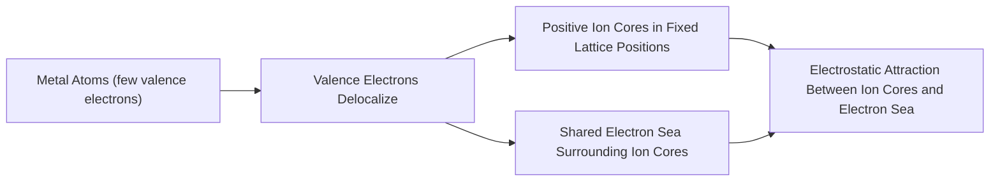
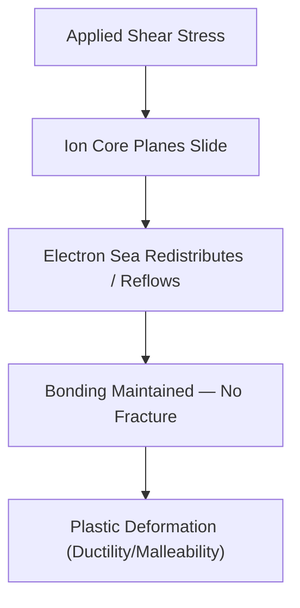

## Metallic Bonding

### Overview

Metallic bonding is the primary interatomic bond responsible for the characteristic properties of metals — ductility, malleability, high electrical and thermal conductivity, and metallic luster. This bonding mechanism is fundamental to understanding the behavior of structural steel, reinforcing bars, aluminum, and other metallic materials central to civil engineering practice.

### Mechanism of Metallic Bond Formation

Metallic bonding arises when atoms with few valence electrons (typically 1–3) and low ionization energies release those electrons into a shared, delocalized "electron cloud" or "electron sea" that surrounds a lattice of positively charged metal ion cores.

**Conceptual model (Electron Sea Model):**

$$M \rightarrow M^{n+} + n\,e^-_{(delocalized)}$$

Unlike covalent bonding (localized shared pairs) or ionic bonding (electron transfer to a specific partner atom), metallic bonding involves electrons that are **not associated with any single atom or bond** — instead, they move freely throughout the entire metallic lattice, held collectively by attraction to the surrounding array of positive ion cores.

### Illustration: Electron Sea Model (svg_diagram)

<svg xmlns="http://www.w3.org/2000/svg" viewBox="0 0 450 350" font-family="sans-serif">
<text x="225" y="20" text-anchor="middle" font-size="14" font-weight="bold">Electron Sea Model (svg_diagram)</text>
<rect x="30" y="40" width="390" height="270" fill="#f0f4f8" stroke="#ccc" stroke-width="1" />
<circle cx="100" cy="100" r="20" fill="#4285f4" stroke="#333" stroke-width="1" />
<text x="100" y="105" text-anchor="middle" font-size="10" fill="white">M+</text>
<circle cx="220" cy="100" r="20" fill="#4285f4" stroke="#333" stroke-width="1" />
<text x="220" y="105" text-anchor="middle" font-size="10" fill="white">M+</text>
<circle cx="340" cy="100" r="20" fill="#4285f4" stroke="#333" stroke-width="1" />
<text x="340" y="105" text-anchor="middle" font-size="10" fill="white">M+</text>
<circle cx="100" cy="200" r="20" fill="#4285f4" stroke="#333" stroke-width="1" />
<text x="100" y="205" text-anchor="middle" font-size="10" fill="white">M+</text>
<circle cx="220" cy="200" r="20" fill="#4285f4" stroke="#333" stroke-width="1" />
<text x="220" y="205" text-anchor="middle" font-size="10" fill="white">M+</text>
<circle cx="340" cy="200" r="20" fill="#4285f4" stroke="#333" stroke-width="1" />
<text x="340" y="205" text-anchor="middle" font-size="10" fill="white">M+</text>
<circle cx="100" cy="280" r="20" fill="#4285f4" stroke="#333" stroke-width="1" />
<text x="100" y="285" text-anchor="middle" font-size="10" fill="white">M+</text>
<circle cx="220" cy="280" r="20" fill="#4285f4" stroke="#333" stroke-width="1" />
<text x="220" y="285" text-anchor="middle" font-size="10" fill="white">M+</text>
<circle cx="340" cy="280" r="20" fill="#4285f4" stroke="#333" stroke-width="1" />
<text x="340" y="285" text-anchor="middle" font-size="10" fill="white">M+</text>
<circle cx="160" cy="140" r="4" fill="#fbbc04" />
<circle cx="280" cy="150" r="4" fill="#fbbc04" />
<circle cx="150" cy="230" r="4" fill="#fbbc04" />
<circle cx="270" cy="240" r="4" fill="#fbbc04" />
<circle cx="70" cy="150" r="4" fill="#fbbc04" />
<circle cx="380" cy="150" r="4" fill="#fbbc04" />
<circle cx="190" cy="170" r="4" fill="#fbbc04" />
<circle cx="310" cy="180" r="4" fill="#fbbc04" />
<circle cx="60" cy="240" r="4" fill="#fbbc04" />
<circle cx="380" cy="240" r="4" fill="#fbbc04" />
<circle cx="200" cy="250" r="4" fill="#fbbc04" />
<circle cx="330" cy="130" r="4" fill="#fbbc04" />

<text x="225" y="330" text-anchor="middle" font-size="11" fill="#555">Blue: positive ion cores (fixed lattice) | Yellow: delocalized valence electrons</text>

</svg>

### Why Metallic Bonding Produces Characteristic Metal Properties

#### Ductility and Malleability

Because the electron sea is non-directional and ion cores are not bonded to specific neighbors, layers of ion cores can slide past one another under applied stress without breaking bonds — the electron sea simply redistributes to maintain the attractive bond:

This contrasts directly with ionic bonding, where plane displacement brings like-charged ions into repulsive proximity, causing brittle fracture rather than plastic flow.

#### Electrical Conductivity

Delocalized electrons are free to move in response to an applied electric field, providing high electrical conductivity. Conductivity generally decreases with increasing temperature in metals, as increased thermal vibration of ion cores scatters conduction electrons, increasing resistivity.

#### Thermal Conductivity

The same mobile electron sea efficiently transfers kinetic energy (heat) throughout the lattice via electron collisions, giving metals characteristically high thermal conductivity compared to ionic or covalent solids.

#### Metallic Luster

Delocalized electrons readily absorb and re-emit photons across a broad range of visible wavelengths, producing the reflective, lustrous appearance characteristic of metallic surfaces.

### Comparison of Primary Bond Types

| Property | Ionic | Covalent | Metallic |
| --- | --- | --- | --- |
| Electron behavior | Transferred | Shared (localized) | Delocalized ("sea") |
| Directionality | Non-directional | Highly directional | Non-directional |
| Electrical conductivity (solid) | Low | Low (generally) | High |
| Ductility | Brittle | Brittle (network solids) | Ductile/malleable |
| Typical bond strength | High | Very high (network) | Moderate to high |
| Response to shear | Fracture | Fracture | Plastic slip |

### Bond Strength and Melting Point Trends

Metallic bond strength correlates with the number of delocalized valence electrons per atom and the strength of attraction between the electron sea and ion cores — generally increasing with higher valence electron count and smaller ionic radius:

| Metal | Valence Electrons | Melting Point (°C) | Relative Bond Strength |
| --- | --- | --- | --- |
| Sodium (Na) | 1 | 98 | Low |
| Magnesium (Mg) | 2 | 650 | Moderate |
| Aluminum (Al) | 3 | 660 | Moderate-High |
| Iron (Fe) | 2 (+ d-electrons) | 1538 | High |
| Tungsten (W) | 2 (+ d-electrons) | 3422 | Very High |

[Inference] Transition metals like iron and tungsten exhibit notably higher melting points than simple main-group metals with similar valence electron counts; this is generally attributed to additional bonding contributions from partially filled d-orbitals, though the precise quantitative relationship is more complex than valence electron count alone.

### Relevance to Civil Engineering and Materials Science

#### Structural Steel

Iron's metallic bonding, augmented by partially filled 3d orbitals, provides both ductility (critical for seismic energy dissipation and preventing brittle failure) and sufficient strength for load-bearing applications. Alloying elements (carbon, manganese, chromium) modify the electron sea and lattice structure, tuning strength, hardness, and ductility.

#### Aluminum Structures

Aluminum's three delocalized valence electrons and relatively weak metallic bonding (compared to transition metals) result in lower strength but excellent ductility and a favorable strength-to-weight ratio, making it suitable for lightweight structural applications, facades, and formwork systems.

#### Reinforcing Steel Ductility Requirements

Building codes (e.g., ASTM A615, ACI 318) specify minimum elongation and strain requirements for reinforcing steel, directly reflecting the importance of metallic bonding's inherent ductility in allowing reinforced concrete members to exhibit warning deformation before failure rather than sudden brittle rupture.

#### Corrosion Behavior

While metallic bonding governs bulk metal behavior, the transition of surface iron atoms from metallic to ionic bonding (via oxidation) represents the fundamental atomic-scale mechanism of corrosion — directly relevant to reinforcement durability design and cover requirements in reinforced concrete.

### Example: Explaining Ductility Difference Between Steel and Cast Iron

**Scenario**: Structural (mild) steel exhibits significant ductility, while gray cast iron is comparatively brittle, despite both being iron-based alloys.

**Explanation**:

- **Mild steel** has a low carbon content (~0.2–0.3%), with carbon atoms occupying interstitial sites within the metallic iron lattice without significantly disrupting the electron sea's ability to accommodate dislocation motion — allowing substantial plastic deformation before fracture
- **Gray cast iron** has a high carbon content (~2–4%), much of which precipitates as graphite flakes within the iron matrix. These graphite flakes act as stress concentrators and disrupt the continuous metallic lattice, promoting crack initiation and brittle fracture despite the underlying iron matrix still being metallically bonded

This illustrates that while metallic bonding provides the *potential* for ductility, microstructural features (phase distribution, inclusions, grain boundaries) — covered in later crystal structure and microstructure topics — determine whether that potential is realized in the bulk material.

### Key Points

- Metallic bonding arises from delocalized valence electrons forming a shared "electron sea" surrounding a lattice of positive ion cores
- Non-directional bonding allows ion core planes to slide under stress without fracture, explaining ductility and malleability
- Delocalized electrons provide high electrical and thermal conductivity, distinguishing metals from ionic and covalent solids
- Bond strength generally increases with valence electron count, with transition metals gaining additional strength from partially filled d-orbitals
- Metallic bonding is foundational to structural steel and aluminum behavior, directly influencing ductility requirements in seismic design and corrosion mechanisms in reinforced concrete durability

### Related Topics

- Ionic Bonding and Brittle Fracture Mechanisms
- Covalent Bonding and Network Solid Behavior
- Crystal Structures of Metals (BCC, FCC, HCP)
- Dislocation Theory and Plastic Deformation
- Alloying and Solid Solution Strengthening in Steel
- Corrosion Mechanisms in Reinforced Concrete