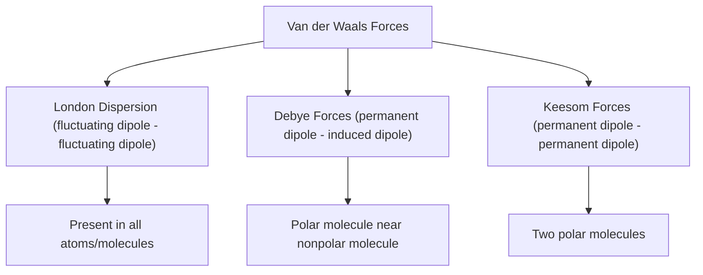
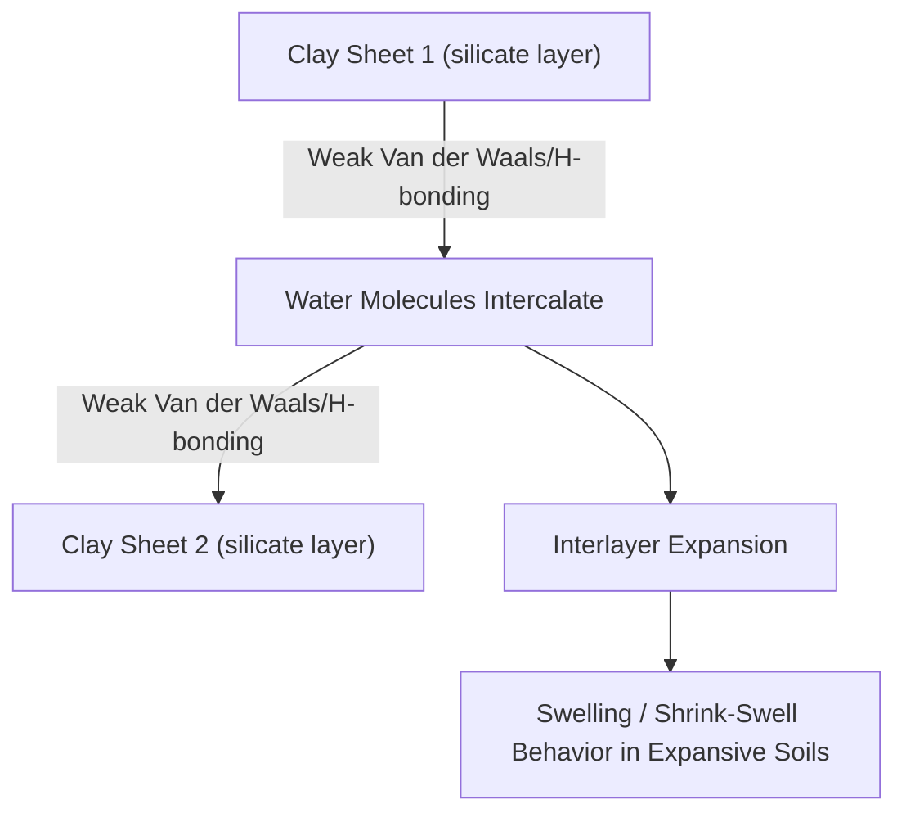

## Van der Waals and Hydrogen Bonding

### Overview

Van der Waals forces and hydrogen bonding constitute the principal **secondary bonding** mechanisms in materials science — considerably weaker than primary bonds (ionic, covalent, metallic) but critically important in determining the properties of polymers, clay minerals, water behavior in concrete, and layered materials relevant to civil engineering.

### Nature of Secondary Bonding

Unlike primary bonds, which involve electron transfer or sharing between valence electrons, secondary bonds arise from **electrostatic attraction between dipoles** — either permanent or induced — without involving direct electron exchange between the bonded atoms or molecules.

| Bond Type | Typical Bond Energy (kJ/mol) | Relative Strength |
| --- | --- | --- |
| Ionic | 600 – 1500 | Very high |
| Covalent | 200 – 1000 | Very high |
| Metallic | 100 – 800 | High |
| Hydrogen bond | 10 – 40 | Low-moderate |
| Van der Waals (dipole-dipole, London dispersion) | 0.1 – 10 | Very low |

[Unverified] — exact bond energy ranges vary across textbook sources and depend on the specific atoms/molecules involved; these figures represent commonly cited order-of-magnitude ranges rather than precise universal values.

### Types of Van der Waals Forces

#### Fluctuating (Induced) Dipole Bonds — London Dispersion Forces

Even in atoms or molecules with no permanent dipole (e.g., noble gases, nonpolar molecules), instantaneous fluctuations in electron distribution create temporary dipoles. These transient dipoles induce corresponding dipoles in neighboring atoms/molecules, producing weak, short-lived attractive forces.

- Present in **all** atoms and molecules, regardless of polarity
- Generally increase in strength with increasing atomic/molecular size (more electrons, greater polarizability)
- The only intermolecular force present between nonpolar molecules or noble gas atoms

#### Polar Molecule-Induced Dipole Bonds

A molecule with a permanent dipole moment can induce a temporary dipole in an adjacent nonpolar molecule, creating a weak attractive interaction between the permanent and induced dipoles.

#### Permanent Dipole Bonds (Keesom Forces)

Molecules with permanent dipole moments (due to asymmetric electronegativity distribution) attract neighboring polar molecules through direct dipole-dipole interaction, generally stronger than induced-dipole interactions due to the fixed (non-transient) nature of the dipoles.

### Hydrogen Bonding

Hydrogen bonding is a special, particularly strong case of permanent dipole bonding that occurs when hydrogen is covalently bonded to a small, highly electronegative atom — typically **nitrogen (N), oxygen (O), or fluorine (F)**.

**Mechanism:**

1. The covalent bond between H and the electronegative atom (N, O, F) is highly polarized, leaving hydrogen with a significant partial positive charge ($\delta^+$)
2. Because hydrogen has no inner electron shell (only its single electron participates in bonding), its exposed, nearly bare proton allows unusually close approach to a neighboring electronegative atom's lone pair
3. This produces an attractive interaction significantly stronger than typical dipole-dipole forces, though still much weaker than a covalent or ionic bond

**Example — Water molecules:**

$$\delta^{-}O-H^{\delta+} \cdots {}^{\delta-}O-H\delta^{+}$$

Each water molecule can form up to four hydrogen bonds (two through its hydrogen atoms, two through its oxygen lone pairs), giving rise to water's anomalously high boiling point, high surface tension, and the open hexagonal structure of ice.

### Illustration: Hydrogen Bonding Between Water Molecules (svg_diagram)

<svg xmlns="http://www.w3.org/2000/svg" viewBox="0 0 450 300" font-family="sans-serif">
<text x="225" y="20" text-anchor="middle" font-size="14" font-weight="bold">Hydrogen Bonding in Water (svg_diagram)</text>
<circle cx="100" cy="100" r="18" fill="#ea4335" />
<text x="100" y="105" text-anchor="middle" font-size="10" fill="white">O</text>
<circle cx="60" cy="70" r="10" fill="#ddd" stroke="#333" />
<text x="60" y="74" text-anchor="middle" font-size="9">H</text>
<circle cx="140" cy="70" r="10" fill="#ddd" stroke="#333" />
<text x="140" y="74" text-anchor="middle" font-size="9">H</text>
<line x1="100" y1="100" x2="60" y2="70" stroke="#333" stroke-width="2" />
<line x1="100" y1="100" x2="140" y2="70" stroke="#333" stroke-width="2" />
<circle cx="320" cy="180" r="18" fill="#ea4335" />
<text x="320" y="185" text-anchor="middle" font-size="10" fill="white">O</text>
<circle cx="280" cy="150" r="10" fill="#ddd" stroke="#333" />
<text x="280" y="154" text-anchor="middle" font-size="9">H</text>
<circle cx="360" cy="150" r="10" fill="#ddd" stroke="#333" />
<text x="360" y="154" text-anchor="middle" font-size="9">H</text>
<line x1="320" y1="180" x2="280" y2="150" stroke="#333" stroke-width="2" />
<line x1="320" y1="180" x2="360" y2="150" stroke="#333" stroke-width="2" />
<line x1="140" y1="70" x2="280" y2="150" stroke="#4285f4" stroke-width="1.5" stroke-dasharray="5,4" />
<text x="200" y="100" font-size="10" fill="#4285f4">H-bond (dashed)</text>

<text x="70" y="140" font-size="9" fill="#555">δ+</text>

<text x="290" y="185" font-size="9" fill="#555">δ-</text>

<text x="225" y="270" text-anchor="middle" font-size="11" fill="#555">Solid line: covalent O–H bond | Dashed line: hydrogen bond (secondary)</text>

</svg>

### Comparative Bond Energies and Property Effects

| Force Type | Directionality | Temperature Dependence | Typical Effect on Bulk Material |
| --- | --- | --- | --- |
| London dispersion | Non-directional | Weakens rapidly with distance ($\propto 1/r^6$) | Low melting/boiling points in nonpolar materials |
| Dipole-dipole (Keesom/Debye) | Weakly directional | Weakens with distance and temperature | Moderate boiling point elevation vs. nonpolar analogs |
| Hydrogen bonding | Strongly directional | Persists more strongly with temperature than dispersion forces | Anomalously high boiling/melting points, high viscosity, surface tension |

### Relevance to Civil Engineering and Materials Science

#### Polymers and Geosynthetics

Secondary bonding between polymer chains (Van der Waals forces, and hydrogen bonding in polymers like nylon) governs:

- **Melting/softening temperature**: weaker secondary bonds allow chains to slide past each other more easily at lower temperatures
- **Flexibility and impact resistance**: materials with only Van der Waals interchain forces (e.g., polyethylene) tend to be more flexible than those with hydrogen bonding between chains (e.g., nylon), which show higher stiffness and strength due to stronger interchain attraction

#### Clay Mineral Behavior and Soil Mechanics

Clay minerals consist of covalently/ionically bonded silicate sheets held together by weak Van der Waals forces and hydrogen bonding between sheet layers. This weak interlayer bonding:

- Allows water molecules to intercalate between clay sheets, driving **swelling behavior** in expansive clays (e.g., montmorillonite)
- Directly governs geotechnical properties such as plasticity, shrink-swell potential, and consolidation behavior — critical considerations in foundation design on clay soils

#### Water Behavior in Cementitious Materials

Hydrogen bonding governs water's high surface tension, viscosity, and specific heat — all relevant to concrete mixing, workability, capillary action within pore structures, and moisture movement (critical to freeze-thaw durability and drying shrinkage behavior).

#### Graphite Lubrication and Layered Materials

Graphite consists of strongly covalently bonded hexagonal carbon sheets held together only by weak Van der Waals forces between layers, allowing sheets to slide past one another easily — the basis for graphite's use as a solid lubricant and its relatively soft, flaky behavior despite strong in-plane covalent bonding.

### Example: Explaining Boiling Point Anomalies Using Hydrogen Bonding

**Problem**: Explain why water ($H_2O$, MW ≈ 18 g/mol) has a significantly higher boiling point (100°C) than hydrogen sulfide ($H_2S$, MW ≈ 34 g/mol), despite $H_2S$ having greater molecular mass (which would otherwise suggest stronger London dispersion forces).

**Explanation**:

- Oxygen is significantly more electronegative than sulfur, producing a much more polarized O–H bond capable of strong hydrogen bonding
- Sulfur's larger atomic radius and lower electronegativity result in a much less polarized S–H bond, incapable of significant hydrogen bonding
- $H_2S$ therefore relies primarily on weaker dipole-dipole and dispersion forces, resulting in a boiling point of approximately $-60°C$ despite its larger molecular size
- Water's extensive hydrogen bonding network requires substantially more thermal energy to disrupt during vaporization, explaining its anomalously high boiling point relative to its low molecular weight

This example demonstrates that hydrogen bonding can dominate over molecular weight-dependent dispersion forces in determining bulk thermal properties — a principle directly relevant to understanding water's unusual behavior within concrete pore structures and clay mineral systems.

### Key Points

- Van der Waals forces (London dispersion, Debye, and Keesom forces) arise from temporary or permanent electric dipole interactions and are considerably weaker than primary bonds
- Hydrogen bonding is a special, stronger form of dipole-dipole interaction occurring when hydrogen is bonded to N, O, or F, producing significant effects on boiling point, viscosity, and surface tension
- Secondary bonding governs interchain behavior in polymers, interlayer behavior in clay minerals and graphite, and water's anomalous physical properties
- Clay mineral swelling behavior, critical to geotechnical foundation design, arises directly from weak interlayer Van der Waals and hydrogen bonding allowing water intercalation
- Understanding secondary bonding explains why materials with similar primary bonding (e.g., polyethylene vs. nylon) can exhibit significantly different bulk mechanical and thermal properties based on interchain force strength

### Related Topics

- Polymer Structure: Chain Length, Branching, and Cross-Linking
- Clay Mineralogy and Expansive Soil Behavior
- Water-Cement Ratio and Capillary Pore Structure in Concrete
- Crystal Structures: Layered Materials (Graphite, Mica, Clay)
- Freeze-Thaw Durability Mechanisms in Concrete
- Polymer Applications in Geosynthetics and Admixtures