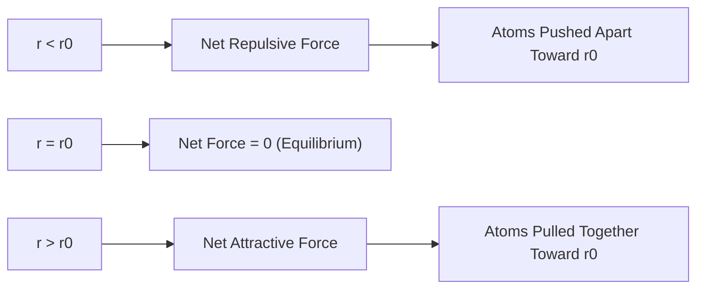
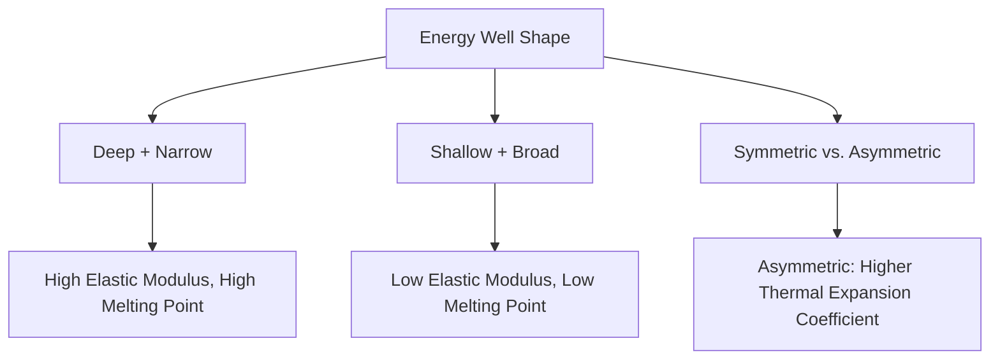

## Bonding Energy and Interatomic Spacing

### Overview

Bonding energy and interatomic spacing describe the quantitative relationship between the forces holding atoms together and the equilibrium distances at which those atoms settle. This framework unifies all bond types covered previously (ionic, covalent, metallic, and secondary bonding) and directly explains macroscopic material properties including melting point, elastic modulus, thermal expansion, and strength.

### Force-Distance Relationship

Two opposing forces act between any pair of bonded atoms:

- **Attractive force** ($F_A$): draws atoms together (Coulombic attraction, shared electron pairs, or electron sea attraction, depending on bond type)
- **Repulsive force** ($F_R$): pushes atoms apart, arising from overlapping electron clouds at short range (Pauli exclusion principle) and nuclear-nuclear repulsion

The **net force** is the sum of these two contributions:

$$F_N = F_A + F_R$$

At large interatomic separation, attractive forces dominate; at very short separation, repulsive forces dominate sharply due to their steep distance dependence.

### Equilibrium Interatomic Spacing

The **equilibrium spacing** ($r_0$) occurs where the net force is zero — the point at which attractive and repulsive forces exactly balance:

$$F_N(r_0) = F_A(r_0) + F_R(r_0) = 0$$

At separations smaller than $r_0$, the net force becomes repulsive (pushing atoms apart); at separations larger than $r_0$, the net force becomes attractive (pulling atoms together). This makes $r_0$ a **stable equilibrium** — any small displacement generates a restoring force back toward $r_0$.

### Bonding Energy and the Potential Energy Curve

The net potential energy ($E_N$) as a function of interatomic separation is the integral relationship corresponding to the net force, commonly expressed in generalized form:

$$E_N = -\frac{A}{r^m} + \frac{B}{r^n}$$

where:

- $A$, $B$ = material-specific constants related to attractive and repulsive interactions
- $m$ = exponent describing attractive force dependence on distance (bond-type specific)
- $n$ = exponent describing repulsive force dependence on distance (typically $n > m$, reflecting the much steeper, shorter-range nature of repulsion)

The **equilibrium spacing** $r_0$ corresponds to the **minimum** of the potential energy curve, since force is the negative derivative of energy with respect to distance:

$$F = -\frac{dE_N}{dr}$$

At $r_0$: $\dfrac{dE_N}{dr} = 0$

The **bonding energy** ($E_0$), also called the depth of the energy well, is the magnitude of energy at this minimum — physically representing the energy required to separate the two atoms to infinite distance (i.e., to break the bond):

$$E_0 = |E_N(r_0)|$$

### Illustration: Force and Energy vs. Interatomic Distance (svg_diagram)

<svg viewBox="0 0 550 420" xmlns="http://www.w3.org/2000/svg" font-family="sans-serif">
<text x="275" y="20" text-anchor="middle" font-size="14" font-weight="bold">Force and Energy vs. Interatomic Distance (svg_diagram)</text>
<line x1="60" y1="120" x2="500" y2="120" stroke="#ccc" stroke-width="1"/>
<text x="510" y="124" font-size="10">r</text>
<line x1="60" y1="60" x2="60" y2="180" stroke="black" stroke-width="1.5"/>
<text x="30" y="70" font-size="10">F</text>
<path d="M 100 70 Q 150 100 200 118 Q 260 122 320 118 Q 380 112 440 90" fill="none" stroke="#34a853" stroke-width="2"/>
<text x="440" y="80" font-size="10" fill="#34a853">Net Force F_N</text>
<circle cx="260" cy="120" r="4" fill="black"/>
<line x1="260" y1="120" x2="260" y2="180" stroke="black" stroke-dasharray="2,2"/>
<text x="252" y="195" font-size="10">r₀</text>

<text x="90" y="90" font-size="9" fill="`#ea4335`">Repulsive (r<r₀)</text>

<text x="380" y="105" font-size="9" fill="`#4285f4`">Attractive (r>r₀)</text>

<line x1="60" y1="230" x2="500" y2="230" stroke="#ccc" stroke-width="1"/>
<line x1="60" y1="230" x2="60" y2="380" stroke="black" stroke-width="1.5"/>
<text x="30" y="240" font-size="10">E</text>
<text x="510" y="234" font-size="10">r</text>
<path d="M 100 250 Q 160 340 220 355 Q 260 360 300 355 Q 360 340 440 250" fill="none" stroke="#a142f4" stroke-width="2.5"/>
<text x="420" y="250" font-size="10" fill="#a142f4">Net Energy E_N</text>
<circle cx="260" cy="358" r="4" fill="black"/>
<line x1="260" y1="358" x2="260" y2="230" stroke="black" stroke-dasharray="2,2"/>
<line x1="60" y1="358" x2="260" y2="358" stroke="black" stroke-dasharray="2,2"/>
<text x="252" y="400" font-size="10">r₀</text>
<text x="20" y="362" font-size="9">E₀</text>

<text x="275" y="410" text-anchor="middle" font-size="11" fill="#555">Force = 0 and Energy = minimum both occur at same r₀</text>

</svg>

### Relationship Between Curve Shape and Material Properties

The **shape** of the energy well — not just its depth — determines several key engineering properties:

#### Elastic Modulus (Stiffness)

The elastic (Young's) modulus relates directly to the **curvature** of the energy curve at $r_0$: a steep, narrow well (deep curvature) indicates strong resistance to interatomic displacement under load, corresponding to a high elastic modulus.

$$E \propto \left(\frac{d^2E_N}{dr^2}\right)_{r_0}$$

Materials with deep, narrow energy wells (e.g., covalently bonded diamond, or strongly ionic ceramics) tend to have high elastic moduli, while materials with shallow, broad wells (e.g., many polymers governed by secondary bonding) exhibit low elastic moduli.

#### Melting Point

Melting point correlates with the **depth** of the energy well ($E_0$): deeper wells require greater thermal energy to overcome atomic bonding and permit the disordered atomic mobility characteristic of the liquid state.

| Bond Type | Typical Well Depth | Typical Melting Point Behavior |
| --- | --- | --- |
| Ionic/Covalent (network) | Deep | High (often >1000°C) |
| Metallic | Moderate-deep | Moderate to high (varies widely) |
| Secondary (Van der Waals, H-bonding) | Shallow | Low (often <300°C) |

#### Coefficient of Thermal Expansion

Materials with a more **asymmetric** (anharmonic) energy well — where the repulsive side rises more steeply than the attractive side falls — exhibit greater thermal expansion. As temperature increases, atoms vibrate with greater amplitude around $r_0$, but because the well is asymmetric, the *average* interatomic spacing shifts to a larger value than $r_0$ as temperature rises.

[Inference] The degree of well asymmetry required to produce a given thermal expansion coefficient is material-specific and generally requires detailed interatomic potential modeling (or empirical measurement) rather than simple visual inspection of a generic energy curve.

### Bond Energy Comparison Across Bond Types

| Bond Type | Approximate Bond Energy (kJ/mol) | Representative Materials |
| --- | --- | --- |
| Ionic | 600 – 1500 | NaCl, MgO, CaO |
| Covalent | 200 – 1000 | Diamond, SiC, Si-O networks |
| Metallic | 100 – 800 | Fe, Al, Cu, W |
| Hydrogen bonding | 10 – 40 | H₂O, some polymers |
| Van der Waals | 0.1 – 10 | Graphite interlayer, nonpolar polymers |

[Unverified] — as with earlier bonding topics, these ranges are commonly cited approximations that vary by source and specific atomic pairing; they should be treated as order-of-magnitude guidance rather than precise design values.

### Example: Estimating Relative Stiffness from Bonding Behavior

**Scenario**: Explain why diamond (covalently bonded, network structure) has a dramatically higher elastic modulus (~1000+ GPa) than lead (metallically bonded, weak bonding, large atomic radius, ~16 GPa).

**Reasoning using the energy curve framework**:

1. Diamond's carbon-carbon covalent bonds produce an extremely deep, narrow, and steeply curved energy well due to strong, highly directional $sp^3$ orbital overlap
2. This steep curvature at $r_0$ corresponds to strong resistance to any interatomic displacement, translating directly to very high stiffness (elastic modulus) at the macroscopic scale
3. Lead's metallic bonding involves a comparatively weak electron sea attraction (large atomic radius, only 4 valence electrons spread over a large ion core), producing a shallow, broad energy well
4. The shallow curvature permits atoms to displace relatively easily under applied stress, corresponding to lead's characteristically low stiffness and softness

This example demonstrates how the abstract force-energy-distance framework directly predicts observable, design-relevant mechanical behavior without requiring separate empirical justification for each material.

### Relevance to Civil Engineering and Materials Science

#### Elastic Modulus Selection in Structural Design

The bonding energy curve framework explains *why* different structural materials (steel, ~200 GPa; concrete, ~20–40 GPa; timber, ~10–15 GPa parallel to grain) exhibit such different stiffness values — differences rooted in underlying bond type, bond energy, and curve curvature rather than arbitrary material classification.

#### Thermal Expansion Joint Design

Coefficient of thermal expansion, derived from energy curve asymmetry, directly informs expansion joint spacing in bridges, pavements, and long structural members — materials with more asymmetric bonding potentials (and correspondingly higher thermal expansion coefficients) require more frequent or larger expansion joints.

#### Melting Point and Fire Resistance

Bond energy directly correlates with melting/softening temperature, informing material selection and required fire protection measures — e.g., structural steel's moderate metallic bond energy explains why it loses significant strength around 500–600°C, necessitating fireproofing in many applications, while ceramic and refractory materials with deeper ionic/covalent bonding withstand much higher temperatures.

### Key Points

- Equilibrium interatomic spacing ($r_0$) occurs where attractive and repulsive forces balance (net force = 0), corresponding to the minimum of the potential energy curve
- Bonding energy ($E_0$) is the depth of this energy well, representing the energy required to separate bonded atoms
- Elastic modulus correlates with the curvature (steepness) of the energy well at $r_0$; melting point correlates with well depth; thermal expansion correlates with well asymmetry
- These relationships apply universally across ionic, covalent, metallic, and secondary bond types, explaining the vast range of stiffness, melting point, and thermal expansion behavior observed across engineering materials
- The bonding energy-interatomic spacing framework provides the fundamental atomic-scale explanation for macroscopic mechanical and thermal properties central to structural material selection

### Related Topics

- Elastic Modulus and Stress-Strain Behavior
- Thermal Expansion and Expansion Joint Design
- Melting Point and Fire Resistance of Structural Materials
- Crystal Structures and Atomic Packing Efficiency
- Comparison of Primary Bonding Types (Ionic, Covalent, Metallic)
- Secondary Bonding and Its Role in Polymer Stiffness