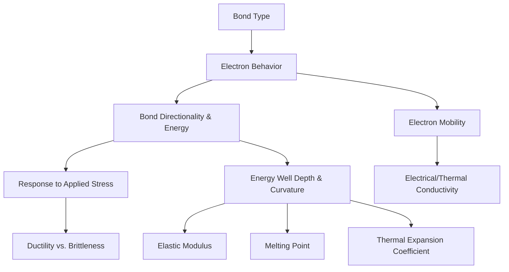
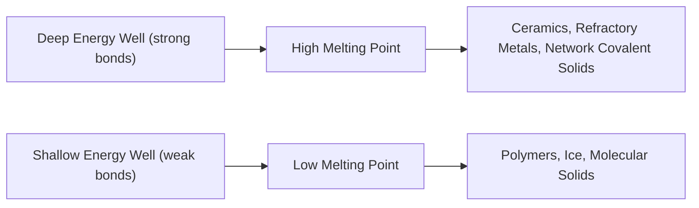

## Influence of Bonding Type on Material Properties

### Overview

This topic synthesizes the preceding bonding discussions — ionic, covalent, metallic, and secondary (Van der Waals/hydrogen) bonding — into a unified framework linking atomic-scale bonding mechanisms to macroscopic engineering properties. This bridge between atomic structure and bulk behavior underlies nearly all subsequent material selection decisions in civil engineering practice.

### Summary Comparison of Bond Types

| Property | Ionic | Covalent | Metallic | Secondary (Van der Waals/H-bond) |
| --- | --- | --- | --- | --- |
| Electron behavior | Transferred | Shared (localized pairs) | Delocalized ("sea") | Dipole interaction (no exchange) |
| Directionality | Non-directional | Highly directional | Non-directional | Weakly directional (H-bond more so) |
| Typical bond energy | 600–1500 kJ/mol | 200–1000 kJ/mol | 100–800 kJ/mol | 0.1–40 kJ/mol |
| Electrical conductivity (solid) | Low | Low (generally) | High | N/A (intermolecular force, not conductive medium) |
| Mechanical behavior | Hard, brittle | Very hard, brittle (network) | Ductile, malleable | Soft, flexible, low strength |
| Melting point | High | Very high (network solids) | Moderate–very high | Low |
| Representative materials | Cement clinker phases, ceramics | Diamond, silica, silicates | Steel, aluminum, copper | Polymers, clay interlayers, ice |

[Unverified] — bond energy ranges are commonly cited order-of-magnitude approximations; actual values vary by specific atomic pairing and measurement method.

### Bonding-Property Relationships: A Unified Framework

### Mechanical Behavior: Ductility vs. Brittleness

The single most consequential distinction for structural engineering is whether a material deforms plastically (ductile) or fractures suddenly (brittle) under stress — a direct consequence of bond directionality:

| Bond Type | Response to Shear | Mechanism |
| --- | --- | --- |
| Metallic | Ductile | Non-directional bonding + delocalized electrons allow ion planes to slide while bonding is maintained |
| Ionic | Brittle | Non-directional but charge-specific; plane displacement brings like-charged ions into repulsion, causing fracture |
| Covalent (network) | Brittle | Highly directional bonds resist displacement; once broken, no mechanism for plastic flow |
| Secondary-bonded (polymers) | Variable (often flexible, low strength) | Weak interchain forces allow chain slippage at low stress, but primary chain backbone bonds resist chain rupture |

This explains why structural steel (metallic) provides ductile warning behavior before failure, while unreinforced ceramics and cementitious materials (ionic/covalent) fail suddenly without significant plastic deformation — the foundational reasoning behind reinforcing brittle concrete with ductile steel in composite structural systems.

### Electrical and Thermal Conductivity

Conductivity depends on whether electrons are free to move throughout the material:

- **Metallic bonding**: delocalized electron sea provides high electrical and thermal conductivity
- **Ionic and covalent bonding**: electrons are localized (either transferred to specific ions or shared in specific bonds), resulting in low solid-state conductivity — ionic compounds become conductive only when molten or dissolved, as ions themselves become mobile charge carriers
- **Secondary bonding**: does not itself provide a conduction mechanism; conductivity in polymeric/molecular solids depends on the underlying covalent chain and any additives (e.g., conductive fillers)

This directly explains why reinforcing steel embedded in concrete can conduct stray electrical currents (relevant to cathodic protection design), while the surrounding cementitious matrix acts as an electrical insulator.

### Stiffness (Elastic Modulus)

As established in the bonding energy framework, elastic modulus correlates with the **curvature** of the interatomic potential energy well at equilibrium spacing:

$$E \propto \left(\frac{d^2E_N}{dr^2}\right)_{r_0}$$

| Bond Type | Typical Elastic Modulus Range | Representative Material |
| --- | --- | --- |
| Covalent (network) | Very high (100s–1000+ GPa) | Diamond (~1000+ GPa), SiC |
| Ionic/mixed ionic-covalent | High (moderate-high, material dependent) | Ceramics, cement clinker phases |
| Metallic | Moderate-high (varies with electron count) | Steel (~200 GPa), Aluminum (~70 GPa) |
| Secondary-bonded (polymers) | Low | Many thermoplastics (~1–4 GPa) |

### Melting Point and Thermal Behavior

Melting point correlates with **bond energy depth** — the thermal energy required to disrupt the equilibrium atomic arrangement sufficiently for atoms/molecules to move past one another:

### Illustration: Bonding Type vs. Key Property Radar Comparison (svg_diagram)

<svg xmlns="http://www.w3.org/2000/svg" viewBox="0 0 500 420" font-family="sans-serif">
<text x="250" y="20" text-anchor="middle" font-size="14" font-weight="bold">Relative Property Comparison by Bond Type (svg_diagram)</text>
<line x1="60" y1="350" x2="460" y2="350" stroke="black" stroke-width="1.5" />
<line x1="60" y1="60" x2="60" y2="350" stroke="black" stroke-width="1.5" />
<text x="20" y="200" font-size="10" transform="rotate(-90 20 200)">Relative Magnitude</text>

<text x="120" y="370" text-anchor="middle" font-size="10">Stiffness</text>

<rect x="100" y="90" width="40" height="260" fill="`#4285f4`" />

<text x="200" y="370" text-anchor="middle" font-size="10">Ductility</text>

<rect x="180" y="280" width="40" height="70" fill="`#34a853`" />

<text x="280" y="370" text-anchor="middle" font-size="10">Melt Pt.</text>

<rect x="260" y="80" width="40" height="270" fill="`#fbbc04`" />

<text x="360" y="370" text-anchor="middle" font-size="10">Conductivity</text>

<rect x="340" y="300" width="40" height="50" fill="`#ea4335`" />

<text x="120" y="400" text-anchor="middle" font-size="9" fill="#555">Covalent (network)</text>

<rect x="60" y="60" width="15" height="15" fill="#4285f4" />
<text x="80" y="72" font-size="9">High (covalent/ionic)</text>
<rect x="60" y="80" width="15" height="15" fill="#34a853" />
<text x="80" y="92" font-size="9">High (metallic)</text>
<rect x="180" y="60" width="15" height="15" fill="#fbbc04" />
<text x="200" y="72" font-size="9">High (covalent/ionic)</text>
<rect x="180" y="80" width="15" height="15" fill="#ea4335" />
<text x="200" y="92" font-size="9">High (metallic)</text>
</svg>

### Bond Type Combinations in Real Engineering Materials

Most engineering materials do not exhibit a single, pure bond type — they combine multiple bonding mechanisms, and understanding this mixture explains nuanced real-world behavior:

#### Reinforced Concrete (Composite System)

- **Concrete matrix**: mixed ionic-covalent bonding within hydrated cement phases (C-S-H, Ca(OH)₂) — brittle, high compressive strength, low tensile strength
- **Steel reinforcement**: metallic bonding — ductile, high tensile strength
- **System behavior**: combining brittle (ionic/covalent) and ductile (metallic) bonded materials produces a composite system exploiting concrete's compressive strength and steel's tensile ductility, with steel providing warning deformation before ultimate failure

#### Fiber-Reinforced Polymers (FRP)

- **Fibers** (carbon, glass): strong covalent bonding along fiber axis, providing high tensile strength and stiffness
- **Polymer matrix**: secondary bonding (Van der Waals) between polymer chains, providing flexibility and load transfer between fibers, but comparatively low stiffness/strength on its own

#### Timber

- **Cellulose microfibrils**: strong covalent bonding along the chain backbone, oriented along the grain, providing high tensile strength parallel to grain
- **Interfibril bonding**: hydrogen bonding between cellulose chains (and with hemicellulose/lignin), explaining timber's sensitivity to moisture content (water disrupts hydrogen bonds, reducing strength and stiffness) and its pronounced anisotropy (much lower strength perpendicular to grain, where only secondary bonding resists load)

### Example: Predicting Material Behavior from Bonding Composition

**Scenario**: Explain why timber exhibits significant strength loss when moisture content increases, while steel's strength is comparatively insensitive to moisture.

**Reasoning**:

1. Timber's strength along the grain relies substantially on hydrogen bonding between adjacent cellulose microfibrils, in addition to the covalent backbone bonds within each fibril
2. Water molecules, being highly polar and capable of hydrogen bonding, can insert between cellulose chains, displacing and disrupting the natural interfibril hydrogen bonds
3. This disruption reduces the effective load transfer between fibrils, lowering both stiffness and strength as moisture content increases (up to the fiber saturation point)
4. Steel's metallic bonding, by contrast, does not involve hydrogen bonding or any moisture-sensitive secondary bonding mechanism — its electron sea and ion core lattice are unaffected by ambient moisture, explaining steel's comparative insensitivity to moisture-driven strength loss (though moisture remains highly relevant to steel via a separate mechanism: electrochemical corrosion)

This example demonstrates how bonding-type analysis explains not only baseline material properties, but also *why* certain materials are sensitive to specific environmental conditions relevant to durability design.

### Relevance to Civil Engineering Material Selection

| Design Consideration | Governing Bond-Type Principle |
| --- | --- |
| Ductile seismic detailing | Requires metallic bonding (steel) for plastic hinge formation |
| Compressive structural elements | Ionic/covalent bonding (concrete, masonry) provides high compressive strength economically |
| Composite reinforcement | Combining brittle + ductile bonded materials balances tensile and compressive performance |
| Thermal/fire design | Bond energy depth determines strength retention at elevated temperature |
| Moisture-sensitive materials | Hydrogen-bonded materials (timber, some polymers) require moisture control detailing |
| Corrosion protection | Metallic-to-ionic bond transition (oxidation) underlies steel corrosion; cover/coating design mitigates this transition |

### Key Points

- Bonding type governs mechanical behavior (ductile vs. brittle), electrical/thermal conductivity, stiffness, and melting point through distinct atomic-scale mechanisms
- Metallic bonding's non-directional, delocalized electron structure uniquely enables ductility and conductivity simultaneously
- Ionic and covalent (network) bonding produce hard, stiff, brittle, and often high-melting-point materials, but with poor solid-state conductivity
- Secondary bonding (Van der Waals, hydrogen bonding) governs interchain/interlayer behavior in polymers, clays, and timber, explaining moisture sensitivity and low stiffness relative to primary-bonded materials
- Most real engineering materials — reinforced concrete, FRP composites, timber — combine multiple bond types, and understanding each component's dominant bonding mechanism explains composite system behavior and environmental sensitivities
- This bonding-property framework provides the conceptual foundation for subsequent chapters on crystal structure, microstructure, and mechanical behavior

### Related Topics

- Crystal Structures and Atomic Packing in Metals and Ceramics
- Mechanical Behavior: Stress-Strain Relationships and Failure Modes
- Composite Materials: Load Transfer Between Constituent Phases
- Corrosion Mechanisms: Metallic-to-Ionic Bond Transition
- Moisture Effects on Timber and Polymer Performance
- Material Selection Criteria in Structural Design