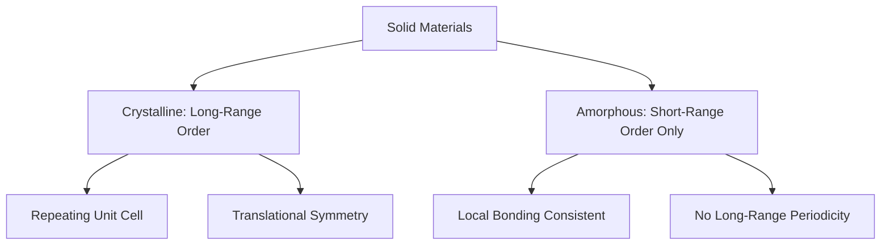
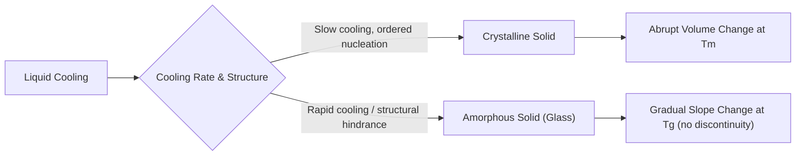

## Crystalline Versus Amorphous Solids

### Overview

The distinction between crystalline and amorphous solids describes whether a material's constituent atoms, ions, or molecules exhibit long-range periodic order or lack such order entirely. This fundamental structural classification directly influences mechanical, thermal, optical, and durability properties central to material selection in civil engineering, spanning metals, ceramics, glasses, and polymers.

### Defining Structural Order

#### Crystalline Solids

Crystalline solids exhibit **long-range order**: their constituent atoms are arranged in a repeating, three-dimensional periodic pattern extending throughout the material (in an ideal single crystal) or throughout individual grains (in polycrystalline materials).

- The repeating structural unit is called the **unit cell**
- Atomic positions can be described by translational symmetry — knowing one unit cell's arrangement allows prediction of atomic positions throughout the entire crystal
- Most metals, many ceramics, and mineral phases are crystalline

#### Amorphous (Non-Crystalline) Solids

Amorphous solids lack long-range periodic order, though they typically retain **short-range order** — the local arrangement and bonding of nearest-neighbor atoms remains fairly consistent, even though this order does not repeat predictably over longer distances.

- No definable unit cell or translational symmetry
- Often described as having a "frozen liquid" structure, since the atomic arrangement resembles the disordered structure of a liquid but is mechanically rigid
- Common examples: silicate glass, many polymers, some ceramics processed via rapid cooling

### Illustration: Crystalline vs. Amorphous Atomic Arrangement (svg_diagram)

<svg xmlns="http://www.w3.org/2000/svg" viewBox="0 0 600 320" font-family="sans-serif">
<text x="300" y="20" text-anchor="middle" font-size="14" font-weight="bold">Crystalline vs. Amorphous Structure (svg_diagram)</text>

<text x="150" y="45" text-anchor="middle" font-size="12" font-weight="bold">Crystalline (SiO2)</text>

<rect x="40" y="55" width="220" height="220" fill="`#f5f5f5`" stroke="#ccc" />

<g stroke="#333" stroke-width="1.5">

<line x1="70" y1="80" x2="110" y2="80" /><line x1="110" y1="80" x2="150" y2="80" /><line x1="150" y1="80" x2="190" y2="80" /><line x1="190" y1="80" x2="230" y2="80" />

<line x1="70" y1="130" x2="110" y2="130" /><line x1="110" y1="130" x2="150" y2="130" /><line x1="150" y1="130" x2="190" y2="130" /><line x1="190" y1="130" x2="230" y2="130" />

<line x1="70" y1="180" x2="110" y2="180" /><line x1="110" y1="180" x2="150" y2="180" /><line x1="150" y1="180" x2="190" y2="180" /><line x1="190" y1="180" x2="230" y2="180" />

<line x1="70" y1="230" x2="110" y2="230" /><line x1="110" y1="230" x2="150" y2="230" /><line x1="150" y1="230" x2="190" y2="230" /><line x1="190" y1="230" x2="230" y2="230" />

<line x1="70" y1="80" x2="70" y2="130" /><line x1="70" y1="130" x2="70" y2="180" /><line x1="70" y1="180" x2="70" y2="230" />

<line x1="110" y1="80" x2="110" y2="130" /><line x1="110" y1="130" x2="110" y2="180" /><line x1="110" y1="180" x2="110" y2="230" />

<line x1="150" y1="80" x2="150" y2="130" /><line x1="150" y1="130" x2="150" y2="180" /><line x1="150" y1="180" x2="150" y2="230" />

<line x1="190" y1="80" x2="190" y2="130" /><line x1="190" y1="130" x2="190" y2="180" /><line x1="190" y1="180" x2="190" y2="230" />

<line x1="230" y1="80" x2="230" y2="130" /><line x1="230" y1="130" x2="230" y2="180" /><line x1="230" y1="180" x2="230" y2="230" />

</g>

<circle cx="70" cy="80" r="6" fill="`#fbbc04`" /><circle cx="110" cy="80" r="6" fill="`#fbbc04`" /><circle cx="150" cy="80" r="6" fill="`#fbbc04`" /><circle cx="190" cy="80" r="6" fill="`#fbbc04`" /><circle cx="230" cy="80" r="6" fill="`#fbbc04`" />

<circle cx="70" cy="130" r="6" fill="`#fbbc04`" /><circle cx="110" cy="130" r="6" fill="`#fbbc04`" /><circle cx="150" cy="130" r="6" fill="`#fbbc04`" /><circle cx="190" cy="130" r="6" fill="`#fbbc04`" /><circle cx="230" cy="130" r="6" fill="`#fbbc04`" />

<circle cx="70" cy="180" r="6" fill="`#fbbc04`" /><circle cx="110" cy="180" r="6" fill="`#fbbc04`" /><circle cx="150" cy="180" r="6" fill="`#fbbc04`" /><circle cx="190" cy="180" r="6" fill="`#fbbc04`" /><circle cx="230" cy="180" r="6" fill="`#fbbc04`" />

<circle cx="70" cy="230" r="6" fill="`#fbbc04`" /><circle cx="110" cy="230" r="6" fill="`#fbbc04`" /><circle cx="150" cy="230" r="6" fill="`#fbbc04`" /><circle cx="190" cy="230" r="6" fill="`#fbbc04`" /><circle cx="230" cy="230" r="6" fill="`#fbbc04`" />

<text x="150" y="300" text-anchor="middle" font-size="10" fill="#555">Repeating, periodic lattice</text>

<text x="450" y="45" text-anchor="middle" font-size="12" font-weight="bold">Amorphous (Glass)</text>

<rect x="340" y="55" width="220" height="220" fill="`#f5f5f5`" stroke="#ccc" />

<g stroke="#333" stroke-width="1.5">

<line x1="370" y1="85" x2="400" y2="70" /><line x1="400" y1="70" x2="430" y2="95" /><line x1="430" y1="95" x2="460" y2="75" />

<line x1="460" y1="75" x2="500" y2="90" /><line x1="500" y1="90" x2="530" y2="65" />

<line x1="370" y1="85" x2="390" y2="120" /><line x1="430" y1="95" x2="420" y2="140" /><line x1="500" y1="90" x2="490" y2="130" />

<line x1="390" y1="120" x2="420" y2="140" /><line x1="420" y1="140" x2="460" y2="160" /><line x1="460" y1="160" x2="490" y2="130" />

<line x1="390" y1="120" x2="370" y2="160" /><line x1="460" y1="160" x2="470" y2="200" /><line x1="490" y1="130" x2="530" y2="150" />

<line x1="370" y1="160" x2="400" y2="195" /><line x1="400" y1="195" x2="440" y2="210" /><line x1="440" y1="210" x2="470" y2="200" />

<line x1="400" y1="195" x2="380" y2="235" /><line x1="440" y1="210" x2="450" y2="250" /><line x1="470" y1="200" x2="510" y2="220" />

<line x1="510" y1="220" x2="530" y2="150" /><line x1="450" y1="250" x2="490" y2="240" /><line x1="490" y1="240" x2="510" y2="220" />

</g>

<circle cx="370" cy="85" r="5" fill="`#4285f4`" /><circle cx="400" cy="70" r="5" fill="`#4285f4`" /><circle cx="430" cy="95" r="5" fill="`#4285f4`" /><circle cx="460" cy="75" r="5" fill="`#4285f4`" /><circle cx="500" cy="90" r="5" fill="`#4285f4`" /><circle cx="530" cy="65" r="5" fill="`#4285f4`" />

<circle cx="390" cy="120" r="5" fill="`#4285f4`" /><circle cx="420" cy="140" r="5" fill="`#4285f4`" /><circle cx="490" cy="130" r="5" fill="`#4285f4`" />

<circle cx="460" cy="160" r="5" fill="`#4285f4`" /><circle cx="370" cy="160" r="5" fill="`#4285f4`" /><circle cx="530" cy="150" r="5" fill="`#4285f4`" />

<circle cx="470" cy="200" r="5" fill="`#4285f4`" /><circle cx="400" cy="195" r="5" fill="`#4285f4`" /><circle cx="440" cy="210" r="5" fill="`#4285f4`" />

<circle cx="380" cy="235" r="5" fill="`#4285f4`" /><circle cx="450" cy="250" r="5" fill="`#4285f4`" /><circle cx="510" cy="220" r="5" fill="`#4285f4`" /><circle cx="490" cy="240" r="5" fill="`#4285f4`" />

<text x="450" y="300" text-anchor="middle" font-size="10" fill="#555">Irregular, non-repeating network</text>

</svg>

### Volume-Temperature Behavior During Cooling

A key experimental distinction between crystalline and amorphous solidification is observed in specific volume versus temperature behavior during cooling from the liquid state:

- **Crystalline solidification**: at the melting point ($T_m$), specific volume drops **abruptly** as atoms reorganize into an ordered lattice — a first-order phase transition with a discrete, discontinuous volume change
- **Amorphous solidification (glass formation)**: no abrupt volume change occurs at $T_m$; instead, the liquid progressively becomes more viscous upon cooling until it transitions gradually into a rigid solid at the **glass transition temperature** ($T_g$), where the slope of the volume-temperature curve changes but no discontinuity occurs

### Illustration: Specific Volume vs. Temperature (svg_diagram)

<svg xmlns="http://www.w3.org/2000/svg" viewBox="0 0 500 350" font-family="sans-serif">
<text x="250" y="20" text-anchor="middle" font-size="14" font-weight="bold">Specific Volume vs. Temperature (svg_diagram)</text>
<line x1="60" y1="300" x2="460" y2="300" stroke="black" stroke-width="1.5" />
<line x1="60" y1="40" x2="60" y2="300" stroke="black" stroke-width="1.5" />
<text x="460" y="320" font-size="10">Temperature</text>
<text x="20" y="40" font-size="10">Specific Volume</text>
<path d="M 380 60 L 260 180" stroke="#4285f4" stroke-width="2" />
<path d="M 260 180 L 260 230" stroke="#4285f4" stroke-width="2" stroke-dasharray="3,3" />
<path d="M 260 230 L 100 280" stroke="#4285f4" stroke-width="2" />
<text x="330" y="130" font-size="9" fill="#4285f4">Liquid</text>
<text x="150" y="290" font-size="9" fill="#4285f4">Crystalline solid</text>
<text x="265" y="205" font-size="9" fill="#4285f4">Abrupt drop at Tm</text>
<path d="M 380 60 L 310 130 L 180 220" stroke="#ea4335" stroke-width="2" />
<text x="200" y="235" font-size="9" fill="#ea4335">Amorphous (glass)</text>
<circle cx="310" cy="130" r="3" fill="#ea4335" />
<text x="315" y="120" font-size="9" fill="#ea4335">Tg (gradual slope change)</text>
<circle cx="260" cy="180" r="3" fill="black" />
<line x1="260" y1="300" x2="260" y2="180" stroke="black" stroke-dasharray="2,2" />
<text x="255" y="315" font-size="10">Tm</text>
<line x1="310" y1="300" x2="310" y2="130" stroke="black" stroke-dasharray="2,2" />
<text x="300" y="315" font-size="10">Tg</text>
</svg>

### Comparative Properties

| Property | Crystalline | Amorphous |
| --- | --- | --- |
| Structural order | Long-range periodic | Short-range only |
| Melting behavior | Sharp, discrete melting point | Gradual softening over a temperature range |
| Mechanical isotropy | Often anisotropic (single crystals); isotropic if polycrystalline with random grain orientation | Generally isotropic |
| Optical clarity | Often opaque or translucent (grain boundary scattering) unless single crystal | Often transparent (no grain boundaries to scatter light) |
| Density | Typically higher (efficient atomic packing) | Typically slightly lower (less efficient packing) |
| Fracture behavior | Cleavage along crystallographic planes | Conchoidal (curved) fracture, no preferred planes |
| Diffraction pattern | Sharp, discrete diffraction spots/peaks (X-ray diffraction) | Diffuse, broad diffraction halos |

### Factors Governing Crystalline vs. Amorphous Formation

Whether a material solidifies as crystalline or amorphous depends primarily on **cooling rate** relative to the material's ability to reorganize atoms into an ordered structure:

- **Slow cooling**: allows sufficient time for atoms/molecules to migrate into low-energy, ordered crystalline positions
- **Rapid cooling (quenching)**: atomic mobility is restricted before ordered nucleation can occur, "freezing" the disordered liquid-like structure into an amorphous solid
- **Molecular/structural complexity**: materials with large, complex, or highly branched molecular units (e.g., silicate networks with random cross-linking, or long polymer chains) are inherently more resistant to achieving ordered crystalline packing, favoring amorphous or partially amorphous structures even at moderate cooling rates

### Degree of Crystallinity in Real Materials

Many engineering materials are neither purely crystalline nor purely amorphous, but exhibit a **degree of crystallinity** — a proportion of ordered (crystalline) regions coexisting with disordered (amorphous) regions:

$$\% \text{Crystallinity} = \frac{\rho_c(\rho_s - \rho_a)}{\rho_s(\rho_c - \rho_a)} \times 100$$

where $\rho_c$, $\rho_a$, and $\rho_s$ represent the theoretical density of fully crystalline material, fully amorphous material, and the actual measured sample density, respectively.

[Inference] This density-based formula is a standard approach for estimating crystallinity in semi-crystalline polymers; other techniques (X-ray diffraction peak analysis, differential scanning calorimetry) are also commonly used and may yield somewhat different values depending on measurement assumptions.

**Semi-crystalline polymers** (e.g., high-density polyethylene, HDPE) contain both ordered crystalline lamellae and disordered amorphous regions, with the ratio significantly affecting stiffness, toughness, and permeability — directly relevant to polymer geomembranes and pipe materials used in civil infrastructure.

### Relevance to Civil Engineering and Materials Science

#### Glass in Construction

Silicate glass (window glazing, structural glass facades) is a quintessential amorphous solid, formed by rapidly cooling molten silica-based melts too quickly to permit crystalline $SiO_2$ (quartz) formation. This amorphous structure gives glass its characteristic optical transparency and isotropic mechanical behavior, but also its brittleness and lack of a defined yield point — glass fails catastrophically once its tensile strength is exceeded, since there is no crystalline slip mechanism to permit plastic deformation.

#### Metals: Crystalline by Default, With Rare Exceptions

Conventional structural metals (steel, aluminum) solidify as polycrystalline materials under standard cooling rates — grain structure, size, and orientation (covered in subsequent crystal structure/microstructure topics) directly govern strength, ductility, and toughness. [Inference] Amorphous metals ("metallic glasses") can be produced under extremely rapid cooling rates, but these remain specialized materials with limited use in mainstream structural civil engineering applications as of current common practice.

#### Polymers and Geomembranes

Semi-crystalline polymers used in geomembranes, pipes, and waterproofing systems (HDPE, PVC) rely on their crystalline fraction for strength and chemical resistance, while the amorphous fraction provides flexibility and impact resistance — the balance between the two is engineered through processing (cooling rate, molecular weight, additives) to achieve required performance.

#### Volcanic and Natural Amorphous Materials

Some natural pozzolans used as supplementary cementitious materials (e.g., volcanic glass, certain fly ash particles) derive their reactivity partly from their amorphous structure — amorphous silica is generally more chemically reactive than crystalline quartz due to its higher internal energy state and lack of a stable, low-energy lattice arrangement.

### Example: Explaining Why Glass Is Brittle While Metals Are Ductile

**Scenario**: Both glass (amorphous, largely covalent Si-O network) and steel (crystalline, metallic bonding) are solids, yet glass shatters while steel bends.

**Reasoning**:

1. Glass's amorphous silicate network has strong, highly directional covalent Si-O bonds with no regular slip planes or organized dislocation-glide mechanism available — any applied stress concentrates at random structural irregularities, and cracks propagate rapidly through the rigid, disordered covalent network
2. Steel's crystalline, metallic-bonded structure contains organized planes of atoms that can slip past one another (dislocation motion) under stress, dissipating energy through plastic deformation before fracture
3. Because glass lacks both the non-directional metallic bonding *and* any crystalline slip-plane structure, it has essentially no mechanism to accommodate plastic deformation — explaining its characteristic brittle, sudden failure mode compared to steel's ductile, warning-providing failure behavior

This reinforces that both **bond type** (from earlier topics) and **structural order** (crystalline vs. amorphous) jointly determine mechanical failure behavior — bonding alone is not a complete predictor without considering atomic arrangement.

### Key Points

- Crystalline solids exhibit long-range periodic atomic order describable by a repeating unit cell; amorphous solids retain only short-range order with no long-range periodicity
- Crystalline solidification produces an abrupt volume change at a sharp melting point; amorphous solidification shows a gradual slope change at the glass transition temperature ($T_g$) with no discontinuity
- Cooling rate is the primary factor determining whether a material forms a crystalline or amorphous structure, alongside molecular/structural complexity
- Many engineering materials (semi-crystalline polymers) contain a mixture of crystalline and amorphous regions, with the ratio directly tunable through processing
- Glass's amorphous, highly directional covalent network explains its brittleness, while crystalline metals' organized slip planes explain their characteristic ductility
- This crystalline/amorphous distinction sets up subsequent topics on unit cells, crystal systems, and defect structures central to understanding metal and ceramic microstructure

### Related Topics

- Unit Cells and Crystal Systems (Cubic, Hexagonal, Tetragonal)
- Atomic Packing Factor and Coordination Number
- Polymer Crystallinity and Semi-Crystalline Structure
- Glass Transition Temperature and Polymer Processing
- X-Ray Diffraction for Crystal Structure Determination
- Point, Line, and Planar Defects in Crystalline Materials