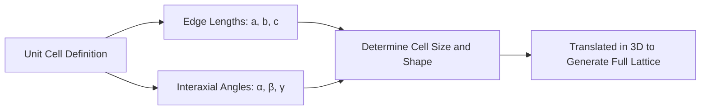
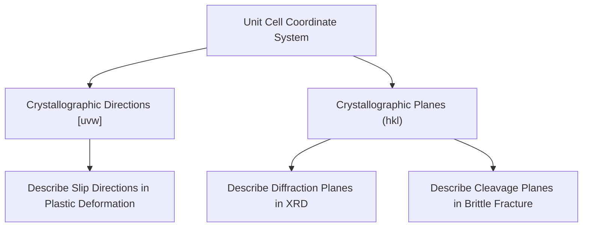

## Unit Cells and Bravais Lattices

### Overview

Unit cells and Bravais lattices provide the geometric framework for describing the long-range periodic order that defines crystalline solids. This topic establishes the vocabulary and mathematical description used throughout subsequent crystal structure analysis, directly underlying the atomic packing arrangements found in structural metals, ceramics, and mineral phases used in civil engineering.

### The Lattice Concept

A **crystal lattice** is an infinite, three-dimensional array of points, each representing an identical local atomic environment, arranged with perfect periodicity. The lattice itself is a mathematical abstraction — it describes the *geometric pattern* of repetition, independent of what atom or group of atoms actually occupies each lattice point (the **basis**).

$$\text{Crystal Structure} = \text{Lattice} + \text{Basis}$$

### The Unit Cell

The **unit cell** is the smallest repeating geometric unit that, when translated repeatedly in three dimensions, generates the entire crystal lattice. Unit cells are defined by six **lattice parameters**:

- Three edge lengths: $a$, $b$, $c$
- Three interaxial angles: $\alpha$ (between $b$ and $c$), $\beta$ (between $a$ and $c$), $\gamma$ (between $a$ and $b$)

#### Primitive vs. Non-Primitive Unit Cells

- **Primitive unit cell**: contains exactly one lattice point per cell (accounting for shared points at corners), representing the smallest possible repeating volume
- **Non-primitive (conventional) unit cell**: may contain additional lattice points at face centers or the body center, chosen for convenience because it better reflects the symmetry of the structure, even though it is not the geometrically smallest repeating unit

### The Seven Crystal Systems

All possible unit cell geometries are classified into **seven crystal systems**, distinguished by the relative lengths of their edges and the angles between them:

| Crystal System | Axial Lengths | Interaxial Angles |
| --- | --- | --- |
| Cubic | $a = b = c$ | $\alpha = \beta = \gamma = 90°$ |
| Tetragonal | $a = b \neq c$ | $\alpha = \beta = \gamma = 90°$ |
| Orthorhombic | $a \neq b \neq c$ | $\alpha = \beta = \gamma = 90°$ |
| Rhombohedral (Trigonal) | $a = b = c$ | $\alpha = \beta = \gamma \neq 90°$ |
| Hexagonal | $a = b \neq c$ | $\alpha = \beta = 90°, \gamma = 120°$ |
| Monoclinic | $a \neq b \neq c$ | $\alpha = \gamma = 90° \neq \beta$ |
| Triclinic | $a \neq b \neq c$ | $\alpha \neq \beta \neq \gamma \neq 90°$ |

### The Fourteen Bravais Lattices

Auguste Bravais demonstrated that only **14 distinct lattice types** exist when the seven crystal systems are combined with possible lattice centering arrangements. Centering types include:

- **P (Primitive)**: lattice points at cell corners only
- **I (Body-centered)**: additional lattice point at the cell's geometric center
- **F (Face-centered)**: additional lattice points at the center of each face
- **C (Base-centered)**: additional lattice points at the centers of one pair of opposite faces

| Crystal System | Bravais Lattices Present | Total Count |
| --- | --- | --- |
| Cubic | P, I, F | 3 |
| Tetragonal | P, I | 2 |
| Orthorhombic | P, I, F, C | 4 |
| Rhombohedral | P | 1 |
| Hexagonal | P | 1 |
| Monoclinic | P, C | 2 |
| Triclinic | P | 1 |
| **Total** |  | **14** |

[Inference] Not every crystal system permits every centering type — certain combinations are geometrically redundant with a simpler cell in a different system, which is why the total is exactly 14 rather than a larger combinatorial number; the specific allowed combinations are a mathematical result rather than an arbitrary convention.

### Illustration: Cubic Bravais Lattices (svg_diagram)

<svg xmlns="http://www.w3.org/2000/svg" viewBox="0 0 650 260" font-family="sans-serif">
<text x="325" y="20" text-anchor="middle" font-size="14" font-weight="bold">Cubic Bravais Lattices (svg_diagram)</text>

<text x="100" y="45" text-anchor="middle" font-size="11" font-weight="bold">Simple Cubic (P)</text>

<polygon points="60,90 140,90 160,70 80,70" fill="none" stroke="#333" />

<polygon points="60,90 60,170 140,170 140,90" fill="none" stroke="#333" />

<polygon points="80,70 160,70 160,150 80,150" fill="none" stroke="#333" />

<line x1="60" y1="90" x2="80" y2="70" stroke="#333" />

<line x1="140" y1="90" x2="160" y2="70" stroke="#333" />

<line x1="60" y1="170" x2="80" y2="150" stroke="#333" />

<line x1="140" y1="170" x2="160" y2="150" stroke="#333" />

<circle cx="60" cy="90" r="6" fill="`#4285f4`" /><circle cx="140" cy="90" r="6" fill="`#4285f4`" />

<circle cx="60" cy="170" r="6" fill="`#4285f4`" /><circle cx="140" cy="170" r="6" fill="`#4285f4`" />

<circle cx="80" cy="70" r="6" fill="`#4285f4`" /><circle cx="160" cy="70" r="6" fill="`#4285f4`" />

<circle cx="80" cy="150" r="6" fill="`#4285f4`" /><circle cx="160" cy="150" r="6" fill="`#4285f4`" />

<text x="100" y="210" text-anchor="middle" font-size="9" fill="#555">1 atom/cell</text>

<text x="325" y="45" text-anchor="middle" font-size="11" font-weight="bold">Body-Centered (BCC)</text>

<polygon points="285,90 365,90 385,70 305,70" fill="none" stroke="#333" />

<polygon points="285,90 285,170 365,170 365,90" fill="none" stroke="#333" />

<polygon points="305,70 385,70 385,150 305,150" fill="none" stroke="#333" />

<line x1="285" y1="90" x2="305" y2="70" stroke="#333" />

<line x1="365" y1="90" x2="385" y2="70" stroke="#333" />

<line x1="285" y1="170" x2="305" y2="150" stroke="#333" />

<line x1="365" y1="170" x2="385" y2="150" stroke="#333" />

<circle cx="285" cy="90" r="6" fill="`#4285f4`" /><circle cx="365" cy="90" r="6" fill="`#4285f4`" />

<circle cx="285" cy="170" r="6" fill="`#4285f4`" /><circle cx="365" cy="170" r="6" fill="`#4285f4`" />

<circle cx="305" cy="70" r="6" fill="`#4285f4`" /><circle cx="385" cy="70" r="6" fill="`#4285f4`" />

<circle cx="305" cy="150" r="6" fill="`#4285f4`" /><circle cx="385" cy="150" r="6" fill="`#4285f4`" />

<circle cx="325" cy="120" r="7" fill="`#ea4335`" />

<text x="325" y="210" text-anchor="middle" font-size="9" fill="#555">2 atoms/cell</text>

<text x="550" y="45" text-anchor="middle" font-size="11" font-weight="bold">Face-Centered (FCC)</text>

<polygon points="510,90 590,90 610,70 530,70" fill="none" stroke="#333" />

<polygon points="510,90 510,170 590,170 590,90" fill="none" stroke="#333" />

<polygon points="530,70 610,70 610,150 530,150" fill="none" stroke="#333" />

<line x1="510" y1="90" x2="530" y2="70" stroke="#333" />

<line x1="590" y1="90" x2="610" y2="70" stroke="#333" />

<line x1="510" y1="170" x2="530" y2="150" stroke="#333" />

<line x1="590" y1="170" x2="610" y2="150" stroke="#333" />

<circle cx="510" cy="90" r="6" fill="`#4285f4`" /><circle cx="590" cy="90" r="6" fill="`#4285f4`" />

<circle cx="510" cy="170" r="6" fill="`#4285f4`" /><circle cx="590" cy="170" r="6" fill="`#4285f4`" />

<circle cx="530" cy="70" r="6" fill="`#4285f4`" /><circle cx="610" cy="70" r="6" fill="`#4285f4`" />

<circle cx="530" cy="150" r="6" fill="`#4285f4`" /><circle cx="610" cy="150" r="6" fill="`#4285f4`" />

<circle cx="550" cy="80" r="6" fill="`#34a853`" /><circle cx="550" cy="160" r="6" fill="`#34a853`" />

<circle cx="510" cy="130" r="6" fill="`#34a853`" /><circle cx="590" cy="130" r="6" fill="`#34a853`" />

<circle cx="570" cy="110" r="6" fill="`#34a853`" /><circle cx="530" cy="110" r="6" fill="`#34a853`" />

<text x="550" y="210" text-anchor="middle" font-size="9" fill="#555">4 atoms/cell</text>

</svg>

### Counting Atoms per Unit Cell

Because lattice points at corners, faces, and edges are shared between adjacent unit cells, atoms are counted using **fractional contributions** based on position:

| Position | Fraction Belonging to Cell | Cells Sharing This Position |
| --- | --- | --- |
| Corner | 1/8 | 8 |
| Face center | 1/2 | 2 |
| Edge | 1/4 | 4 |
| Body center | 1 (full) | 1 (not shared) |

**Simple Cubic (SC)**: $8 \text{ corners} \times \frac{1}{8} = 1$ atom/cell

**Body-Centered Cubic (BCC)**: $8 \text{ corners} \times \frac{1}{8} + 1 \text{ body center} \times 1 = 1 + 1 = 2$ atoms/cell

**Face-Centered Cubic (FCC)**: $8 \text{ corners} \times \frac{1}{8} + 6 \text{ faces} \times \frac{1}{2} = 1 + 3 = 4$ atoms/cell

### Key Geometric Parameters Derived from Unit Cells

#### Atomic Packing Factor (APF)

$$APF = \frac{\text{Volume of atoms in unit cell}}{\text{Total volume of unit cell}} = \frac{n \cdot V_{atom}}{V_{cell}}$$

where $n$ is the number of atoms per unit cell.

| Structure | Atoms/Cell | Coordination Number | APF |
| --- | --- | --- | --- |
| Simple Cubic (SC) | 1 | 6 | 0.52 |
| Body-Centered Cubic (BCC) | 2 | 8 | 0.68 |
| Face-Centered Cubic (FCC) | 4 | 12 | 0.74 |
| Hexagonal Close-Packed (HCP) | 6 | 12 | 0.74 |

FCC and HCP share the same maximum APF (0.74), representing the densest possible packing of identical spheres — this is why both are termed **close-packed** structures, differing only in stacking sequence (covered in the crystal structures of metals topic).

#### Coordination Number

The **coordination number** is the number of nearest-neighbor atoms directly touching a given atom — directly related to packing efficiency, since higher coordination generally corresponds to denser packing.

### Example: Calculating Atomic Packing Factor for BCC Iron

**Given**: BCC iron (α-iron), lattice parameter $a = 0.287$ nm, atomic radius $R = 0.124$ nm

**Step 1 — Relate lattice parameter to atomic radius (BCC geometry):**

In BCC, atoms touch along the body diagonal:

$$\sqrt{3}\,a = 4R \quad \Rightarrow \quad a = \frac{4R}{\sqrt{3}}$$

Verification: $a = \frac{4(0.124)}{\sqrt{3}} = \frac{0.496}{1.732} \approx 0.286 \text{ nm}$ ✓ (consistent with given value)

**Step 2 — Calculate unit cell volume:**

$$V_{cell} = a^3 = (0.287)^3 \approx 0.02363 \text{ nm}^3$$

**Step 3 — Calculate volume occupied by atoms (2 atoms/cell for BCC):**

$$V_{atoms} = 2 \times \frac{4}{3}\pi R^3 = 2 \times \frac{4}{3}\pi (0.124)^3 \approx 0.01602 \text{ nm}^3$$

**Step 4 — Calculate APF:**

$$APF = \frac{0.01602}{0.02363} \approx 0.678$$

**Result**: APF ≈ 0.68, consistent with the theoretical BCC packing factor, confirming that approximately 68% of the unit cell volume is occupied by atoms, with the remainder being interstitial space.

### Crystallographic Directions and Planes (Miller Indices)

Unit cells also provide the coordinate framework for describing specific crystallographic directions and planes using **Miller indices** — a standardized notation critical for describing slip systems (relevant to plastic deformation) and diffraction planes (relevant to X-ray crystallography):

- **Directions**: denoted $[uvw]$, derived from vector components along the unit cell axes, reduced to smallest integers
- **Planes**: denoted $(hkl)$, derived from the reciprocals of axial intercepts, reduced to smallest integers

[Inference] Full derivation of Miller indices notation and worked examples are typically addressed in a dedicated subsequent topic, as this section focuses on establishing the unit cell and lattice framework that Miller indices build upon.

### Relevance to Civil Engineering and Materials Science

#### Steel Metallurgy

Iron exhibits **allotropy** — it adopts different crystal structures at different temperatures (BCC α-iron at room temperature, FCC γ-iron at elevated temperature). This transformation is fundamental to heat treatment processes (quenching, tempering, annealing) used to control the strength, hardness, and ductility of structural and reinforcing steel.

#### Aggregate Mineralogy

Common aggregate minerals (quartz, feldspar, calcite) each crystallize in specific Bravais lattice systems, directly influencing their cleavage behavior, hardness, and durability under freeze-thaw and abrasion — properties assessed in aggregate quality testing (e.g., ASTM C33, soundness testing).

#### Anisotropy in Engineering Materials

Because unit cells are generally not perfectly symmetric in all directions (except cubic systems with equal properties along principal axes), single-crystal materials exhibit **anisotropic** properties — differing strength, thermal expansion, or elastic modulus depending on measurement direction relative to the crystal lattice. Polycrystalline engineering materials (most structural metals) average out this anisotropy at the macroscopic scale due to random grain orientation, though texture (preferred grain orientation from processing, e.g., rolling) can reintroduce direction-dependent behavior relevant to plate and sheet steel design.

### Key Points

- A unit cell is the smallest repeating geometric unit describing a crystal lattice, defined by three edge lengths and three interaxial angles
- Seven crystal systems (cubic, tetragonal, orthorhombic, rhombohedral, hexagonal, monoclinic, triclinic) describe all possible unit cell geometries
- Combining crystal systems with lattice centering (primitive, body-centered, face-centered, base-centered) yields exactly 14 Bravais lattices
- Atomic Packing Factor (APF) quantifies how efficiently atoms fill a unit cell's volume, with FCC and HCP achieving the maximum possible packing efficiency (0.74) for identical spheres
- Iron's allotropic transformation between BCC and FCC crystal structures at different temperatures underlies the metallurgical basis for steel heat treatment
- Unit cell geometry provides the coordinate framework for Miller indices, used to describe crystallographic directions and planes relevant to slip systems and diffraction analysis

### Related Topics

- Crystal Structures of Metals: BCC, FCC, and HCP in Detail
- Miller Indices: Crystallographic Directions and Planes
- Allotropy and Polymorphism in Engineering Materials
- Slip Systems and Plastic Deformation Mechanisms
- X-Ray Diffraction for Crystal Structure Identification
- Anisotropy and Texture in Polycrystalline Metals