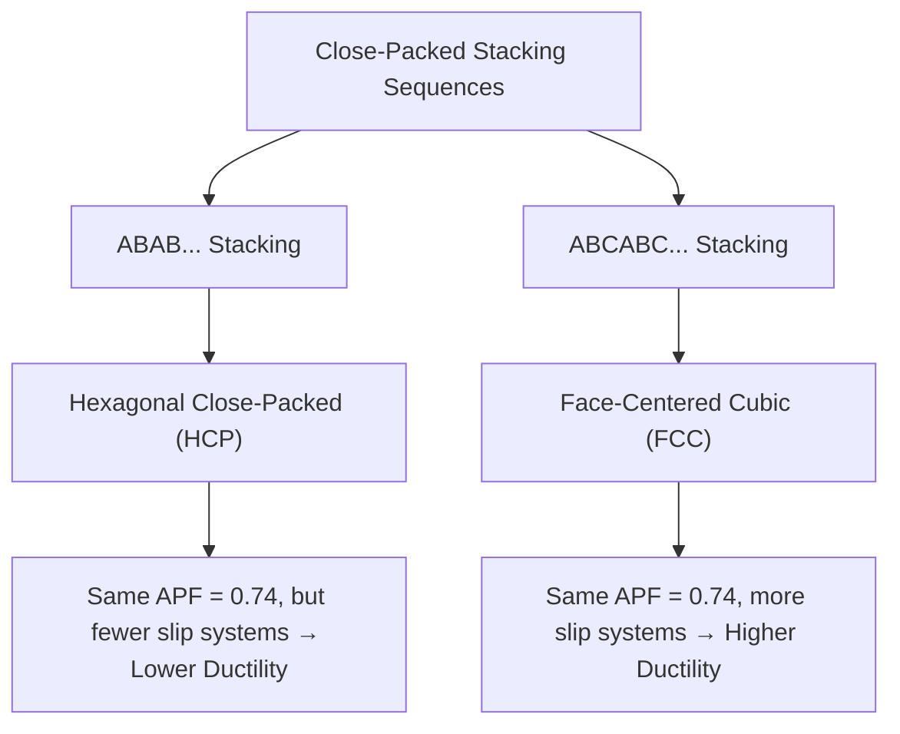
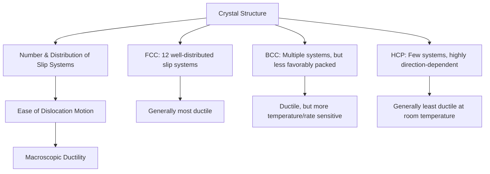

## Common Metallic Crystal Structures

### Overview

Most engineering metals crystallize into one of three characteristic structures: body-centered cubic (BCC), face-centered cubic (FCC), or hexagonal close-packed (HCP). Building directly on the unit cell and Bravais lattice framework, this topic examines these three structures in detail, since the specific structure a metal adopts fundamentally governs its ductility, strength, and deformation behavior — properties of direct consequence in structural steel, reinforcing bar, and aluminum design.

### Body-Centered Cubic (BCC)

In the BCC structure, atoms occupy each of the eight cube corners plus one atom at the body center. Atoms touch along the **body diagonal** of the cube.

**Key parameters:**

| Parameter | Value |
| --- | --- |
| Atoms per unit cell | 2 |
| Coordination number | 8 |
| Atomic Packing Factor (APF) | 0.68 |
| Lattice parameter relation | $a = \dfrac{4R}{\sqrt{3}}$ |

**Common BCC metals**: α-iron (ferrite, room temperature), chromium, tungsten, molybdenum, vanadium

BCC metals generally exhibit **moderate ductility** at room temperature but are prone to a **ductile-to-brittle transition** at low temperatures — a critical consideration in structural steel design for cold climates, since BCC's limited number of readily available slip systems (compared to FCC) makes dislocation motion more temperature-sensitive.

### Face-Centered Cubic (FCC)

In the FCC structure, atoms occupy each of the eight cube corners plus one atom centered on each of the six cube faces. Atoms touch along the **face diagonal** of the cube.

**Key parameters:**

| Parameter | Value |
| --- | --- |
| Atoms per unit cell | 4 |
| Coordination number | 12 |
| Atomic Packing Factor (APF) | 0.74 |
| Lattice parameter relation | $a = \dfrac{4R}{\sqrt{2}}$ |

**Common FCC metals**: aluminum, copper, nickel, γ-iron (austenite, high temperature), lead, gold, silver

FCC metals generally exhibit **excellent ductility** across a wide temperature range, including at low temperatures, since their close-packed structure provides multiple, easily activated slip systems — this is a key reason austenitic stainless steels (FCC) are often specified for cryogenic and low-temperature applications where BCC carbon steels would risk brittle fracture.

### Hexagonal Close-Packed (HCP)

The HCP structure consists of close-packed atomic planes stacked in an **ABAB** repeating sequence, achieving the same maximum packing density as FCC but through a different stacking arrangement.

**Key parameters:**

| Parameter | Value |
| --- | --- |
| Atoms per unit cell (conventional cell) | 6 |
| Coordination number | 12 |
| Atomic Packing Factor (APF) | 0.74 |
| Ideal $c/a$ ratio | 1.633 |

**Common HCP metals**: zinc, magnesium, titanium (α-titanium), cobalt

Despite sharing the same packing efficiency as FCC, HCP metals typically exhibit **lower ductility**, because their limited slip system geometry (fewer close-packed planes available for easy dislocation motion) restricts plastic deformation compared to the more isotropically distributed slip systems in FCC.

### Illustration: BCC, FCC, and HCP Unit Cells (svg_diagram)

<svg xmlns="http://www.w3.org/2000/svg" viewBox="0 0 650 300" font-family="sans-serif">
<text x="325" y="20" text-anchor="middle" font-size="14" font-weight="bold">BCC, FCC, and HCP Structures (svg_diagram)</text>

<text x="100" y="45" text-anchor="middle" font-size="11" font-weight="bold">BCC</text>

<polygon points="60,90 140,90 160,70 80,70" fill="none" stroke="#333" />

<polygon points="60,90 60,170 140,170 140,90" fill="none" stroke="#333" />

<polygon points="80,70 160,70 160,150 80,150" fill="none" stroke="#333" />

<line x1="60" y1="90" x2="80" y2="70" stroke="#333" /><line x1="140" y1="90" x2="160" y2="70" stroke="#333" />

<line x1="60" y1="170" x2="80" y2="150" stroke="#333" /><line x1="140" y1="170" x2="160" y2="150" stroke="#333" />

<circle cx="60" cy="90" r="6" fill="`#4285f4`" /><circle cx="140" cy="90" r="6" fill="`#4285f4`" />

<circle cx="60" cy="170" r="6" fill="`#4285f4`" /><circle cx="140" cy="170" r="6" fill="`#4285f4`" />

<circle cx="80" cy="70" r="6" fill="`#4285f4`" /><circle cx="160" cy="70" r="6" fill="`#4285f4`" />

<circle cx="80" cy="150" r="6" fill="`#4285f4`" /><circle cx="160" cy="150" r="6" fill="`#4285f4`" />

<circle cx="100" cy="120" r="7" fill="`#ea4335`" />

<text x="100" y="200" text-anchor="middle" font-size="9" fill="#555">α-Fe, Cr, W</text>

<text x="325" y="45" text-anchor="middle" font-size="11" font-weight="bold">FCC</text>

<polygon points="285,90 365,90 385,70 305,70" fill="none" stroke="#333" />

<polygon points="285,90 285,170 365,170 365,90" fill="none" stroke="#333" />

<polygon points="305,70 385,70 385,150 305,150" fill="none" stroke="#333" />

<line x1="285" y1="90" x2="305" y2="70" stroke="#333" /><line x1="365" y1="90" x2="385" y2="70" stroke="#333" />

<line x1="285" y1="170" x2="305" y2="150" stroke="#333" /><line x1="365" y1="170" x2="385" y2="150" stroke="#333" />

<circle cx="285" cy="90" r="6" fill="`#4285f4`" /><circle cx="365" cy="90" r="6" fill="`#4285f4`" />

<circle cx="285" cy="170" r="6" fill="`#4285f4`" /><circle cx="365" cy="170" r="6" fill="`#4285f4`" />

<circle cx="305" cy="70" r="6" fill="`#4285f4`" /><circle cx="385" cy="70" r="6" fill="`#4285f4`" />

<circle cx="305" cy="150" r="6" fill="`#4285f4`" /><circle cx="385" cy="150" r="6" fill="`#4285f4`" />

<circle cx="325" cy="80" r="6" fill="`#34a853`" /><circle cx="325" cy="160" r="6" fill="`#34a853`" />

<circle cx="285" cy="130" r="6" fill="`#34a853`" /><circle cx="365" cy="130" r="6" fill="`#34a853`" />

<circle cx="345" cy="110" r="6" fill="`#34a853`" /><circle cx="305" cy="110" r="6" fill="`#34a853`" />

<text x="325" y="200" text-anchor="middle" font-size="9" fill="#555">Al, Cu, γ-Fe</text>

<text x="550" y="45" text-anchor="middle" font-size="11" font-weight="bold">HCP</text>

<polygon points="520,150 540,160 580,160 600,150 580,140 540,140" fill="none" stroke="#333" />

<polygon points="520,90 540,100 580,100 600,90 580,80 540,80" fill="none" stroke="#333" />

<line x1="520" y1="90" x2="520" y2="150" stroke="#333" /><line x1="600" y1="90" x2="600" y2="150" stroke="#333" />

<line x1="540" y1="80" x2="540" y2="140" stroke="#333" /><line x1="580" y1="80" x2="580" y2="140" stroke="#333" />

<circle cx="520" cy="90" r="5" fill="`#4285f4`" /><circle cx="540" cy="100" r="5" fill="`#4285f4`" /><circle cx="580" cy="100" r="5" fill="`#4285f4`" /><circle cx="600" cy="90" r="5" fill="`#4285f4`" /><circle cx="580" cy="80" r="5" fill="`#4285f4`" /><circle cx="540" cy="80" r="5" fill="`#4285f4`" />

<circle cx="520" cy="150" r="5" fill="`#4285f4`" /><circle cx="540" cy="160" r="5" fill="`#4285f4`" /><circle cx="580" cy="160" r="5" fill="`#4285f4`" /><circle cx="600" cy="150" r="5" fill="`#4285f4`" /><circle cx="580" cy="140" r="5" fill="`#4285f4`" /><circle cx="540" cy="140" r="5" fill="`#4285f4`" />

<circle cx="560" cy="115" r="6" fill="`#fbbc04`" />

<text x="560" y="200" text-anchor="middle" font-size="9" fill="#555">Zn, Mg, Ti</text>

</svg>

### Comparative Summary

| Structure | Atoms/Cell | Coordination No. | APF | Slip Systems | Typical Ductility | Representative Metals |
| --- | --- | --- | --- | --- | --- | --- |
| BCC | 2 | 8 | 0.68 | Multiple, but less densely packed planes | Moderate, temperature-sensitive | α-Fe, Cr, W, Mo |
| FCC | 4 | 12 | 0.74 | 12 (4 close-packed planes × 3 directions) | High, across wide temperature range | Al, Cu, Ni, γ-Fe |
| HCP | 6 | 12 | 0.74 | Fewer easily activated systems | Generally low-moderate | Zn, Mg, Ti (α) |

### Slip Systems and Ductility Relationship

The number and geometric distribution of **slip systems** (combinations of close-packed crystallographic planes and directions along which dislocations move) directly determines a metal's capacity for plastic deformation:

[Inference] While this general ranking (FCC generally most ductile, HCP generally least, BCC intermediate with temperature sensitivity) reflects a widely taught structure-property principle, actual ductility in engineering practice is also strongly influenced by grain size, alloying, temperature, strain rate, and processing history — the crystal structure alone provides the underlying tendency, not a guaranteed outcome for every specific alloy.

### Allotropy: Iron's Temperature-Dependent Crystal Structure

Iron is a critical example of **allotropy** (also called polymorphism) — the same element adopting different crystal structures depending on temperature:

| Phase | Crystal Structure | Temperature Range |
| --- | --- | --- |
| α-iron (ferrite) | BCC | Room temperature up to 912°C |
| γ-iron (austenite) | FCC | 912°C to 1394°C |
| δ-iron | BCC | 1394°C to melting point (1538°C) |

This transformation is the metallurgical basis for heat treatment processes central to steel production:

- **Austenitizing**: heating steel into the FCC (γ) phase field, where carbon solubility is much higher than in BCC ferrite
- **Quenching**: rapid cooling from the austenite phase, trapping carbon in a supersaturated, distorted structure (martensite), producing high hardness
- **Tempering**: subsequent controlled reheating to relieve internal stresses and improve toughness while retaining substantial hardness

### Example: Explaining the Ductile-to-Brittle Transition in Structural Steel

**Scenario**: Structural (carbon) steel, which is BCC at service temperatures, can exhibit a sudden transition from ductile to brittle fracture behavior as temperature decreases — a critical consideration for steel structures in cold climates (e.g., the well-documented brittle fractures observed in some welded steel ships and structures during World War II under low-temperature conditions).

**Reasoning using crystal structure principles**:

1. BCC iron's slip systems, while numerous, are geometrically less favorable for dislocation motion compared to FCC's close-packed slip planes
2. At lower temperatures, thermal energy available to assist dislocation motion decreases, making it progressively harder for BCC iron's slip systems to accommodate plastic deformation
3. Below a critical temperature (the ductile-to-brittle transition temperature, DBTT), the material's ability to plastically deform via slip is overwhelmed by brittle fracture mechanisms (cleavage along crystallographic planes) before significant plastic deformation can occur
4. FCC metals (e.g., austenitic stainless steels, aluminum, copper) generally do not exhibit this same pronounced transition, since their more favorable slip system geometry continues to permit dislocation motion even at cryogenic temperatures

This directly explains why structural design codes for low-temperature or seismic applications often specify minimum Charpy V-notch impact toughness requirements for BCC structural steels, or specify FCC austenitic stainless steels for genuinely cryogenic service.

### Relevance to Civil Engineering and Materials Science

#### Structural Steel Selection

Understanding that common structural steel is BCC informs why low-temperature service (arctic pipelines, cold-region bridges) requires careful material selection, impact testing (Charpy), or alloy/microstructure control to mitigate brittle fracture risk.

#### Aluminum Structural Applications

Aluminum's FCC structure directly explains its excellent ductility and formability, supporting its use in applications requiring cold-forming, extrusion, or impact resistance (facades, formwork, temporary structures) even at low service temperatures.

#### Titanium and Zinc Applications

HCP titanium's more limited room-temperature ductility (compared to FCC metals) is a relevant consideration in specialized applications (marine hardware, architectural cladding), often requiring specific alloying or processing to achieve adequate formability. Zinc's HCP structure (and generally limited ductility at room temperature) is relevant to galvanized coating behavior on reinforcing steel and structural members.

### Key Points

- The three common metallic crystal structures — BCC, FCC, and HCP — are distinguished by atom count per cell, coordination number, packing factor, and available slip systems
- FCC and HCP share the same maximum atomic packing factor (0.74) but differ in stacking sequence (ABCABC vs. ABAB) and resulting slip system availability
- FCC metals generally exhibit the highest ductility across temperature ranges; BCC metals show good ductility but are prone to a ductile-to-brittle transition at low temperature; HCP metals generally show more limited room-temperature ductility
- Iron's allotropic transformation between BCC (α, δ) and FCC (γ) structures at different temperatures is the fundamental basis for steel heat treatment processes (austenitizing, quenching, tempering)
- Crystal structure-driven ductility differences directly inform structural steel selection for low-temperature service and explain historical brittle fracture failures in cold conditions

### Related Topics

- Unit Cells and Bravais Lattices (Geometric Foundation)
- Slip Systems and Dislocation Theory
- Heat Treatment of Steel: Austenitizing, Quenching, and Tempering
- Ductile-to-Brittle Transition Temperature and Charpy Impact Testing
- Miller Indices for Crystallographic Planes and Directions
- Polycrystalline Microstructure: Grain Boundaries and Grain Size Effects