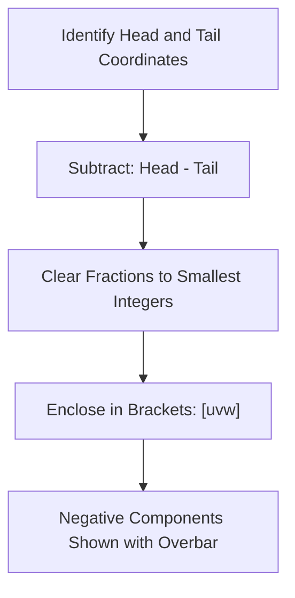
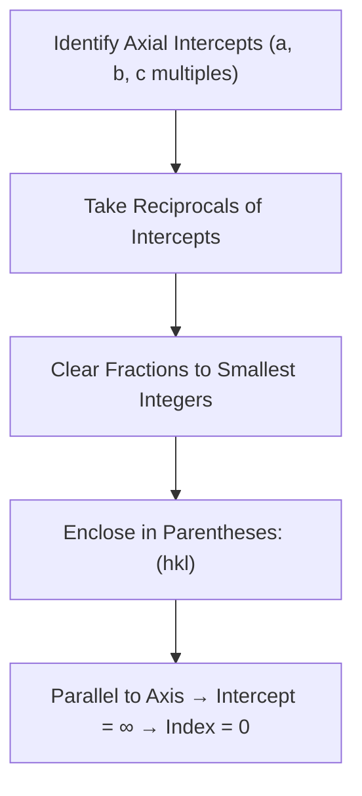
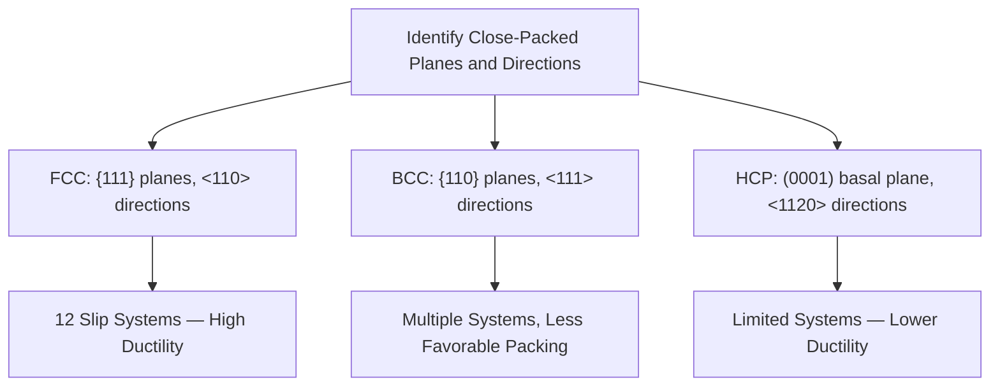

## Crystallographic Directions and Planes

### Overview

Crystallographic directions and planes provide the standardized notation system (Miller indices) used to describe specific orientations within a crystal lattice. Building on the unit cell framework established previously, this notation is essential for describing slip systems governing plastic deformation, diffraction planes used in structural analysis, and cleavage planes relevant to brittle fracture in engineering materials.

### Crystallographic Directions

A crystallographic direction is a vector connecting two lattice points, expressed relative to the unit cell's coordinate axes.

#### Procedure for Determining Direction Indices $[uvw]$

1. Determine the coordinates of two points along the direction (using the tail as the origin)
2. Subtract tail coordinates from head coordinates to obtain the vector components along $x$, $y$, $z$
3. Clear fractions by multiplying through by the smallest common factor, reducing to the smallest possible integers
4. Enclose the resulting integers in square brackets with no commas: $[uvw]$
5. Negative indices are denoted with a bar over the number (e.g., $[1\bar{1}0]$), representing a negative direction along that axis

#### Family of Directions

Directions that are crystallographically equivalent (related by the symmetry of the crystal system) are grouped into a **family**, denoted with angle brackets $\langle uvw \rangle$. For cubic systems, all permutations and sign changes of the indices belong to the same family:

$$\langle 100 \rangle = [100], [010], [001], [\bar{1}00], [0\bar{1}0], [00\bar{1}]$$

### Example: Determining a Direction Index

**Problem**: Determine the direction index for a vector with tail at the origin $(0,0,0)$ and head at $(1, \frac{1}{2}, 1)$ within a cubic unit cell.

**Solution**:

1. Vector components: $(1-0, \frac{1}{2}-0, 1-0) = (1, \frac{1}{2}, 1)$
2. Multiply by 2 to clear the fraction: $(2, 1, 2)$
3. Already in smallest integer form

**Result**: $[212]$

### Illustration: Common Cubic Directions (svg_diagram)

<svg xmlns="http://www.w3.org/2000/svg" viewBox="0 0 600 260" font-family="sans-serif">
<text x="300" y="20" text-anchor="middle" font-size="14" font-weight="bold">Common Cubic Crystallographic Directions (svg_diagram)</text>

<text x="100" y="45" text-anchor="middle" font-size="11" font-weight="bold">[100]</text>

<polygon points="60,90 140,90 160,70 80,70" fill="none" stroke="#333" />

<polygon points="60,90 60,170 140,170 140,90" fill="none" stroke="#333" />

<polygon points="80,70 160,70 160,150 80,150" fill="none" stroke="#333" />

<line x1="60" y1="90" x2="80" y2="70" stroke="#333" /><line x1="140" y1="90" x2="160" y2="70" stroke="#333" />

<line x1="60" y1="170" x2="80" y2="150" stroke="#333" /><line x1="140" y1="170" x2="160" y2="150" stroke="#333" />

<line x1="60" y1="170" x2="140" y2="170" stroke="`#ea4335`" stroke-width="3" marker-end="url(#ar)" />

<text x="100" y="200" text-anchor="middle" font-size="9" fill="#555">Along cube edge</text>

<text x="300" y="45" text-anchor="middle" font-size="11" font-weight="bold">[110]</text>

<polygon points="260,90 340,90 360,70 280,70" fill="none" stroke="#333" />

<polygon points="260,90 260,170 340,170 340,90" fill="none" stroke="#333" />

<polygon points="280,70 360,70 360,150 280,150" fill="none" stroke="#333" />

<line x1="260" y1="90" x2="280" y2="70" stroke="#333" /><line x1="340" y1="90" x2="360" y2="70" stroke="#333" />

<line x1="260" y1="170" x2="280" y2="150" stroke="#333" /><line x1="340" y1="170" x2="360" y2="150" stroke="#333" />

<line x1="260" y1="170" x2="340" y2="90" stroke="`#ea4335`" stroke-width="3" marker-end="url(#ar)" />

<text x="300" y="200" text-anchor="middle" font-size="9" fill="#555">Along face diagonal</text>

<text x="500" y="45" text-anchor="middle" font-size="11" font-weight="bold">[111]</text>

<polygon points="460,90 540,90 560,70 480,70" fill="none" stroke="#333" />

<polygon points="460,90 460,170 540,170 540,90" fill="none" stroke="#333" />

<polygon points="480,70 560,70 560,150 480,150" fill="none" stroke="#333" />

<line x1="460" y1="90" x2="480" y2="70" stroke="#333" /><line x1="540" y1="90" x2="560" y2="70" stroke="#333" />

<line x1="460" y1="170" x2="480" y2="150" stroke="#333" /><line x1="540" y1="170" x2="560" y2="150" stroke="#333" />

<line x1="460" y1="170" x2="560" y2="70" stroke="`#ea4335`" stroke-width="3" marker-end="url(#ar)" />

<text x="500" y="200" text-anchor="middle" font-size="9" fill="#555">Along body diagonal</text>

</svg>

### Crystallographic Planes

A crystallographic plane is described using **Miller indices** $(hkl)$, derived from the plane's intercepts with the unit cell axes.

#### Procedure for Determining Plane Indices $(hkl)$

1. Identify the plane's intercepts with the $x$, $y$, $z$ axes, expressed as multiples of the lattice parameters $a$, $b$, $c$
2. Take the **reciprocals** of these intercepts
3. Clear any fractions to obtain the smallest set of integers with the same ratio
4. Enclose the resulting integers in parentheses with no commas: $(hkl)$
5. If a plane is parallel to an axis, its intercept is taken as infinity, and its reciprocal is 0
6. Negative intercepts are denoted with an overbar, as with directions

#### Family of Planes

Analogous to direction families, crystallographically equivalent planes are grouped using curly braces: $\{hkl\}$. For cubic systems, $\{100\}$ represents all six faces of the cube: $(100), (010), (001), (\bar{1}00), (0\bar{1}0), (00\bar{1})$.

### Example: Determining a Plane's Miller Indices

**Problem**: Determine the Miller indices for a plane intersecting the $x$-axis at $a$, the $y$-axis at $2b$, and never intersecting the $z$-axis (parallel to $z$).

**Solution**:

1. Intercepts: $x = 1$, $y = 2$, $z = \infty$ (in units of $a$, $b$, $c$)
2. Reciprocals: $\frac{1}{1} = 1$, $\frac{1}{2} = 0.5$, $\frac{1}{\infty} = 0$
3. Clear fractions (multiply by 2): $2, 1, 0$

**Result**: $(210)$

### Illustration: Common Cubic Planes (svg_diagram)

<svg xmlns="http://www.w3.org/2000/svg" viewBox="0 0 600 280" font-family="sans-serif">
<text x="300" y="20" text-anchor="middle" font-size="14" font-weight="bold">Common Cubic Crystallographic Planes (svg_diagram)</text>

<text x="100" y="45" text-anchor="middle" font-size="11" font-weight="bold">(100)</text>

<polygon points="60,90 140,90 160,70 80,70" fill="none" stroke="#333" />

<polygon points="60,90 60,170 140,170 140,90" fill="none" stroke="#333" />

<polygon points="80,70 160,70 160,150 80,150" fill="none" stroke="#333" />

<line x1="60" y1="90" x2="80" y2="70" stroke="#333" /><line x1="140" y1="90" x2="160" y2="70" stroke="#333" />

<line x1="60" y1="170" x2="80" y2="150" stroke="#333" /><line x1="140" y1="170" x2="160" y2="150" stroke="#333" />

<polygon points="80,70 160,70 160,150 80,150" fill="`#4285f4`" fill-opacity="0.4" />

<text x="120" y="200" text-anchor="middle" font-size="9" fill="#555">Cube face (right)</text>

<text x="300" y="45" text-anchor="middle" font-size="11" font-weight="bold">(110)</text>

<polygon points="260,90 340,90 360,70 280,70" fill="none" stroke="#333" />

<polygon points="260,90 260,170 340,170 340,90" fill="none" stroke="#333" />

<polygon points="280,70 360,70 360,150 280,150" fill="none" stroke="#333" />

<line x1="260" y1="90" x2="280" y2="70" stroke="#333" /><line x1="340" y1="90" x2="360" y2="70" stroke="#333" />

<line x1="260" y1="170" x2="280" y2="150" stroke="#333" /><line x1="340" y1="170" x2="360" y2="150" stroke="#333" />

<polygon points="340,90 360,70 360,150 340,170" fill="`#34a853`" fill-opacity="0.4" />

<text x="320" y="200" text-anchor="middle" font-size="9" fill="#555">Diagonal plane</text>

<text x="500" y="45" text-anchor="middle" font-size="11" font-weight="bold">(111)</text>

<polygon points="460,90 540,90 560,70 480,70" fill="none" stroke="#333" />

<polygon points="460,90 460,170 540,170 540,90" fill="none" stroke="#333" />

<polygon points="480,70 560,70 560,150 480,150" fill="none" stroke="#333" />

<line x1="460" y1="90" x2="480" y2="70" stroke="#333" /><line x1="540" y1="90" x2="560" y2="70" stroke="#333" />

<line x1="460" y1="170" x2="480" y2="150" stroke="#333" /><line x1="540" y1="170" x2="560" y2="150" stroke="#333" />

<polygon points="480,70 560,70 460,170" fill="`#fbbc04`" fill-opacity="0.4" />

<text x="500" y="200" text-anchor="middle" font-size="9" fill="#555">Octahedral (close-packed) plane</text>

</svg>

### Relationship Between Directions and Planes

In cubic crystal systems only, a useful relationship exists: the direction $[hkl]$ is **perpendicular** to the plane $(hkl)$ sharing the same indices. This relationship does not generally hold for non-cubic crystal systems, where the differing axial lengths distort this simple perpendicularity.

### Linear and Planar Density

Miller indices also enable calculation of **linear density** (atoms per unit length along a direction) and **planar density** (atoms per unit area on a plane) — both directly relevant to identifying preferred slip directions and planes in plastic deformation.

$$\text{Linear Density} = \frac{\text{Number of atoms centered on direction vector}}{\text{Length of direction vector}}$$

$$\text{Planar Density} = \frac{\text{Number of atoms centered on plane}}{\text{Area of plane}}$$

Slip in metals preferentially occurs along the **most densely packed** directions, within the **most densely packed** planes, since these combinations require the least energy to shear atoms past one another.

| Structure | Close-Packed Plane | Close-Packed Direction |
| --- | --- | --- |
| FCC | $\{111\}$ | $\langle 110 \rangle$ |
| BCC | $\{110\}$ (most densely packed, though less so than FCC's $\{111\}$) | $\langle 111 \rangle$ |
| HCP | $(0001)$ basal plane | $\langle 11\bar{2}0 \rangle$ |

This directly connects Miller index notation to the ductility differences between BCC, FCC, and HCP metals discussed in the preceding topic — the number and density of available slip systems, described precisely via crystallographic planes and directions, is the underlying mechanistic explanation for those macroscopic ductility trends.

### Interplanar Spacing

For cubic crystal systems, the spacing between adjacent parallel planes $(hkl)$ is given by:

$$d_{hkl} = \frac{a}{\sqrt{h^2 + k^2 + l^2}}$$

where $a$ is the cubic lattice parameter. This relationship is foundational to **X-ray diffraction** analysis, since Bragg's Law relates diffraction angle directly to interplanar spacing:

$$n\lambda = 2d_{hkl}\sin\theta$$

where $n$ is the diffraction order, $\lambda$ is the X-ray wavelength, and $\theta$ is the diffraction angle.

### Example: Calculating Interplanar Spacing

**Problem**: Calculate the interplanar spacing $d_{110}$ for BCC iron, given lattice parameter $a = 0.287$ nm.

**Solution**:

$$d_{110} = \frac{a}{\sqrt{1^2 + 1^2 + 0^2}} = \frac{0.287}{\sqrt{2}} = \frac{0.287}{1.414} \approx 0.203 \text{ nm}$$

**Result**: The $(110)$ planes in BCC iron are spaced approximately 0.203 nm apart — this value would correspond to a specific diffraction angle in an X-ray diffraction pattern used to confirm the material's crystal structure and phase identity (e.g., verifying ferrite vs. austenite in a steel sample).

### Relevance to Civil Engineering and Materials Science

#### Slip System Identification and Ductility

Understanding which planes and directions are most densely packed directly explains why FCC metals (aluminum, austenitic steel) exhibit superior ductility compared to BCC or HCP metals — a principle carried forward from the previous topic and now grounded in precise crystallographic notation.

#### Cleavage Planes in Brittle Fracture

Certain crystallographic planes represent preferential **cleavage planes** — planes along which brittle fracture propagates most easily due to lower bonding density across that plane. This is directly relevant to understanding brittle fracture surfaces in ceramics, some minerals, and BCC steels below their ductile-to-brittle transition temperature.

#### X-Ray Diffraction for Material Identification

Interplanar spacing calculations underpin X-ray diffraction (XRD) techniques used in materials testing laboratories to identify mineral phases in aggregates, confirm cement hydration product composition, and verify steel microstructural phases.

#### Texture and Anisotropy in Rolled/Formed Steel

Manufacturing processes (rolling, extrusion) tend to align grains preferentially along certain crystallographic directions — a phenomenon called **texture**. This can reintroduce direction-dependent mechanical properties in nominally polycrystalline (and otherwise isotropic) structural steel plates and sheets, relevant to fabrication and design considerations for formed structural components.

### Key Points

- Crystallographic directions $[uvw]$ are determined from vector components along unit cell axes, reduced to smallest integers; planes $(hkl)$ are determined from the reciprocals of axial intercepts
- Families of equivalent directions $\langle uvw \rangle$ and planes $\{hkl\}$ group crystallographically identical orientations related by crystal symmetry
- In cubic systems, direction $[hkl]$ is perpendicular to plane $(hkl)$ sharing the same indices — a relationship that does not generally extend to non-cubic systems
- Linear and planar density calculations identify the most densely packed directions and planes, which correspond to preferred slip systems governing plastic deformation
- Interplanar spacing, calculated from Miller indices, underlies Bragg's Law and X-ray diffraction techniques used to identify crystal structures and phases in engineering materials
- This notation system provides the precise crystallographic basis for the ductility trends observed across BCC, FCC, and HCP metallic structures

### Related Topics

- Common Metallic Crystal Structures (BCC, FCC, HCP)
- Slip Systems and Dislocation Theory
- X-Ray Diffraction and Bragg's Law
- Cleavage Planes and Brittle Fracture Mechanisms
- Texture and Anisotropy in Rolled Steel Products
- Point, Line, and Planar Defects in Crystalline Materials