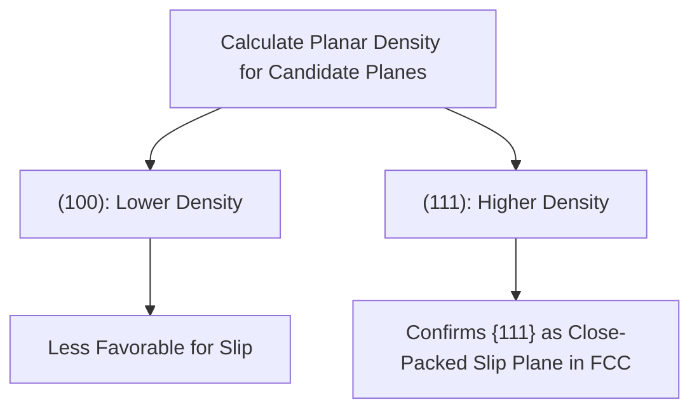

## Linear and Planar Atomic Density

### Overview

Linear and planar atomic density quantify how densely atoms are packed along specific crystallographic directions and within specific crystallographic planes. These calculations, building directly on the Miller index notation established previously, provide the precise quantitative basis for identifying preferred slip systems, predicting anisotropic properties, and understanding surface energy behavior in engineering materials.

### Linear Density

**Linear density (LD)** measures the number of atoms whose centers lie on a given direction vector, per unit length along that vector:

$$LD = \frac{\text{Number of atom centers on the direction vector}}{\text{Length of the direction vector}}$$

Only atoms whose **centers** intersect the direction line are counted, and only the **fraction** of each atom lying within the repeat length is included (analogous to the fractional counting used for unit cell atom totals).

#### Procedure

1. Select a repeat length along the direction of interest (typically one full unit cell edge or diagonal)
2. Count the number of atom diameters (or fractional atom contributions) whose centers fall exactly on that line within the selected length
3. Divide the atom count by the length

### Example: Linear Density Along $[100]$ in FCC

**Problem**: Calculate the linear density along the $[100]$ direction for FCC copper, with lattice parameter $a = 0.361$ nm.

**Solution**:

1. Along the cube edge ($[100]$ direction, length = $a$), atoms are located only at the corners
2. Each corner atom contributes $\frac{1}{2}$ to this length (since the direction line passes exactly through the center of the atom, and the atom is shared between the two adjacent unit cells along that edge)
3. Number of atoms along length $a$: $\frac{1}{2} + \frac{1}{2} = 1$ atom equivalent

$$LD_{[100]} = \frac{1 \text{ atom}}{a} = \frac{1}{0.361 \text{ nm}} \approx 2.77 \text{ atoms/nm}$$

### Example: Linear Density Along $[110]$ in FCC

**Problem**: Calculate the linear density along the $[110]$ direction (face diagonal) for the same FCC copper.

**Solution**:

1. The face diagonal length is $\sqrt{2}\,a$
2. Along this diagonal in FCC, atoms are located at both corners (each contributing $\frac{1}{2}$ to this line) and at the face-center position (contributing a full atom, since it lies entirely within this repeat length)
3. Number of atoms along the diagonal: $\frac{1}{2} + \frac{1}{2} + 1 = 2$ atoms

$$LD_{[110]} = \frac{2 \text{ atoms}}{\sqrt{2}\,a} = \frac{2}{\sqrt{2}(0.361)} \approx 3.92 \text{ atoms/nm}$$

**Result**: The $[110]$ direction has higher linear density than $[100]$ in FCC — confirming that $\langle 110 \rangle$ is the close-packed direction family in FCC, consistent with the slip direction identified in the previous topic.

### Illustration: Linear Density Comparison in FCC (svg_diagram)

<svg xmlns="http://www.w3.org/2000/svg" viewBox="0 0 550 260" font-family="sans-serif">
<text x="275" y="20" text-anchor="middle" font-size="14" font-weight="bold">Linear Density: [100] vs [110] in FCC (svg_diagram)</text>

<text x="140" y="45" text-anchor="middle" font-size="11" font-weight="bold">[100] direction</text>

<line x1="60" y1="120" x2="220" y2="120" stroke="#ccc" stroke-width="20" />

<circle cx="60" cy="120" r="14" fill="`#4285f4`" />

<circle cx="220" cy="120" r="14" fill="`#4285f4`" />

<line x1="60" y1="120" x2="220" y2="120" stroke="`#ea4335`" stroke-width="2" marker-end="url(#ar2)" />

<text x="140" y="160" text-anchor="middle" font-size="10">Length = a</text>

<text x="140" y="180" text-anchor="middle" font-size="10">1 atom-equivalent</text>

<text x="420" y="45" text-anchor="middle" font-size="11" font-weight="bold">[110] direction</text>

<line x1="330" y1="150" x2="510" y2="90" stroke="#ccc" stroke-width="20" />

<circle cx="330" cy="150" r="14" fill="`#4285f4`" />

<circle cx="420" cy="120" r="14" fill="`#34a853`" />

<circle cx="510" cy="90" r="14" fill="`#4285f4`" />

<line x1="330" y1="150" x2="510" y2="90" stroke="`#ea4335`" stroke-width="2" marker-end="url(#ar2)" />

<text x="420" y="180" text-anchor="middle" font-size="10">Length = √2 a</text>

<text x="420" y="200" text-anchor="middle" font-size="10">2 atoms — higher density</text>

</svg>

### Planar Density

**Planar density (PD)** measures the number of atoms whose centers lie on a given crystallographic plane, per unit area of that plane:

$$PD = \frac{\text{Number of atom centers on the plane}}{\text{Area of the plane}}$$

As with linear density, only the fractional portion of each atom's area lying within the selected plane section is counted.

#### Procedure

1. Select a representative section of the plane (typically bounded by unit cell edges intersecting the plane)
2. Count atom centers lying on the plane within that section, applying appropriate fractional counting for atoms shared at edges or corners of the section
3. Calculate the geometric area of the selected plane section
4. Divide the atom count by the area

### Example: Planar Density of $(100)$ in FCC

**Problem**: Calculate the planar density of the $(100)$ plane in FCC copper, $a = 0.361$ nm.

**Solution**:

1. The $(100)$ plane is a cube face — a square of side $a$
2. Atoms on this plane: 4 corner atoms (each contributing $\frac{1}{4}$, since each is shared among 4 squares meeting at that corner within the plane) plus 1 face-center atom (contributing fully, as it lies entirely within this plane section)
3. Atom count: $4 \times \frac{1}{4} + 1 = 2$ atoms
4. Plane area: $a^2 = (0.361)^2 = 0.1303 \text{ nm}^2$

$$PD_{(100)} = \frac{2}{0.1303} \approx 15.35 \text{ atoms/nm}^2$$

### Example: Planar Density of $(111)$ in FCC

**Problem**: Calculate the planar density of the $(111)$ plane in the same FCC copper.

**Solution**:

1. The $(111)$ plane forms an equilateral triangle when intersecting the unit cell, with side length equal to the face diagonal, $\sqrt{2}\,a$
2. Careful geometric analysis of the $(111)$ plane in FCC shows it contains atoms at each triangle corner (each contributing $\frac{1}{6}$ due to the hexagonal tiling of this plane across repeating unit cells) plus 3 edge-midpoint atoms (each contributing $\frac{1}{2}$)
3. Atom count: $3 \times \frac{1}{6} + 3 \times \frac{1}{2} = 0.5 + 1.5 = 2$ atoms
4. Triangle area: $\frac{\sqrt{3}}{4}(\sqrt{2}\,a)^2 = \frac{\sqrt{3}}{4}(2a^2) = \frac{\sqrt{3}}{2}a^2 = \frac{\sqrt{3}}{2}(0.1303) \approx 0.1128 \text{ nm}^2$

$$PD_{(111)} = \frac{2}{0.1128} \approx 17.73 \text{ atoms/nm}^2$$

**Result**: The $(111)$ plane has higher planar density than $(100)$ in FCC, confirming $\{111\}$ as the close-packed plane family — consistent with the slip plane identified in the preceding topic on crystallographic directions and planes.

[Inference] The precise atom-counting geometry for planar density calculations (particularly for diagonal planes like $(111)$) can be derived multiple ways depending on which repeating plane section is chosen; the atom-per-area ratio remains consistent regardless of the specific section chosen, but the intermediate fractional-counting logic shown here represents one standard derivation approach.

### Relationship to Slip System Selection

Linear and planar density calculations provide the quantitative confirmation for why specific plane-direction combinations are favored as slip systems:

| Structure | Highest Planar Density Plane | Highest Linear Density Direction | Resulting Slip System |
| --- | --- | --- | --- |
| FCC | $\{111\}$ | $\langle 110 \rangle$ | $\{111\}\langle110\rangle$ |
| BCC | $\{110\}$ | $\langle 111 \rangle$ | $\{110\}\langle111\rangle$ |
| HCP | $(0001)$ basal | $\langle11\bar{2}0\rangle$ | $(0001)\langle11\bar{2}0\rangle$ |

Slip occurs preferentially on the most densely packed planes, along the most densely packed directions within those planes, because these combinations require the **least interatomic bond disruption per unit of shear displacement** — directly minimizing the energy barrier for dislocation motion.

### Relevance to Civil Engineering and Materials Science

#### Quantitative Basis for Ductility Prediction

While the previous topic qualitatively linked crystal structure to ductility, linear and planar density calculations provide the quantitative mechanism: materials with more numerous, more densely packed slip systems (like FCC) require less energy to initiate widespread dislocation motion, directly translating to macroscopically observed ductility.

#### Anisotropic Mechanical and Physical Properties

Because planar density varies by crystallographic plane, single-crystal or textured (preferentially oriented) polycrystalline materials can exhibit direction-dependent mechanical strength, elastic modulus, and even surface energy — relevant to understanding rolled steel plate behavior, where texture developed during manufacturing can produce different strength properties parallel versus perpendicular to the rolling direction.

#### Surface Energy and Reactivity

Planes with lower planar density generally exhibit higher surface energy when exposed (more "dangling," unsatisfied bonds per unit area), influencing preferential crystal growth habits, dissolution rates, and reactivity — relevant to understanding differential weathering or dissolution behavior of specific mineral cleavage faces in aggregate durability assessment.

#### Corrosion and Etching Behavior

Metallurgical etching techniques used to reveal grain structure exploit the fact that different crystallographic planes etch (dissolve) at different rates due to their differing atomic density and bonding configuration — a principle used in metallographic sample preparation for steel quality inspection.

### Key Points

- Linear density (LD) quantifies atoms per unit length along a crystallographic direction; planar density (PD) quantifies atoms per unit area on a crystallographic plane
- Both calculations require careful fractional counting of atoms shared between adjacent repeat units, analogous to unit cell atom counting
- In FCC, the $\langle110\rangle$ direction family exhibits the highest linear density, and the $\{111\}$ plane family exhibits the highest planar density — together defining FCC's primary slip system
- Higher planar and linear density directly correlates with preferred slip system selection, since these combinations minimize the energy required for dislocation motion
- These density calculations provide the quantitative, mechanistic explanation underlying the qualitative ductility trends observed across BCC, FCC, and HCP crystal structures
- Anisotropic material behavior (direction-dependent strength, surface reactivity, etching rates) arises directly from the variation in atomic density across different crystallographic planes and directions

### Related Topics

- Crystallographic Directions and Planes (Miller Indices)
- Common Metallic Crystal Structures and Slip Systems
- Dislocation Theory and Plastic Deformation Mechanisms
- Texture and Anisotropy in Rolled Steel Products
- Metallographic Etching and Grain Structure Analysis
- Surface Energy and Crystal Growth Habits in Mineral Aggregates