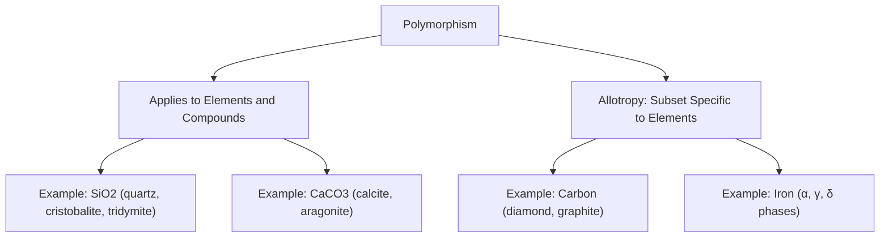
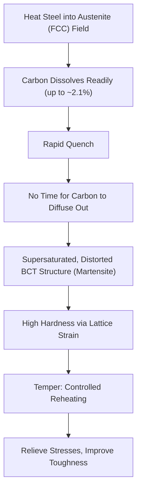
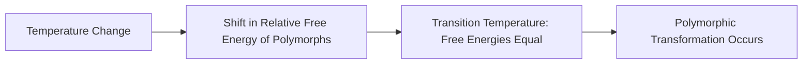

## Polymorphism and Allotropy

### Overview

Polymorphism and allotropy describe the ability of a material to exist in more than one crystal structure depending on temperature, pressure, or other environmental conditions. Building on the crystal structure and Miller index framework established previously, this topic examines how phase transformations between different crystal structures directly govern properties in structural steel, silica-based materials, and other construction-relevant substances.

### Definitions and Distinction

- **Polymorphism**: the general phenomenon in which a substance can exist in more than one crystal structure, applicable to both elements and compounds
- **Allotropy**: a specific term typically reserved for polymorphism occurring in **pure elements** (e.g., carbon, iron, tin)

$$\text{Allotropy} \subset \text{Polymorphism}$$

Different polymorphs (or allotropes) of the same substance can exhibit dramatically different physical, mechanical, and chemical properties despite having identical chemical composition, since these differences arise entirely from differences in atomic arrangement and bonding geometry rather than chemistry.

### Iron Allotropy: The Cornerstone of Steel Metallurgy

Iron exhibits three distinct allotropic forms across its solid temperature range, each with a different crystal structure:

| Phase | Common Name | Crystal Structure | Stable Temperature Range |
| --- | --- | --- | --- |
| α-iron | Ferrite | BCC | Up to 912°C |
| γ-iron | Austenite | FCC | 912°C to 1394°C |
| δ-iron | Delta ferrite | BCC | 1394°C to melting point (1538°C) |

The transformation between α-iron (BCC) and γ-iron (FCC) at 912°C is of paramount metallurgical importance because **carbon solubility differs dramatically** between the two structures:

- **BCC ferrite (α-iron)**: maximum carbon solubility of only about 0.02% at 727°C, due to the relatively small, tightly packed interstitial sites in the BCC structure
- **FCC austenite (γ-iron)**: maximum carbon solubility of about 2.1% at 1147°C, since FCC's larger octahedral interstitial sites can accommodate substantially more interstitial carbon atoms

This solubility difference is the foundational mechanism enabling **heat treatment** of steel:

### Illustration: Iron-Carbon Phase Transformation Overview (svg_diagram)

<svg xmlns="http://www.w3.org/2000/svg" viewBox="0 0 550 320" font-family="sans-serif">
<text x="275" y="20" text-anchor="middle" font-size="14" font-weight="bold">Iron Allotropy and Temperature (svg_diagram)</text>
<line x1="80" y1="280" x2="500" y2="280" stroke="black" stroke-width="1.5" />
<text x="500" y="300" font-size="10">Temperature (°C)</text>
<rect x="100" y="240" width="140" height="30" fill="#4285f4" fill-opacity="0.5" />
<text x="170" y="260" text-anchor="middle" font-size="11">α-iron (BCC)</text>
<text x="100" y="235" font-size="9">Room temp</text>
<text x="230" y="235" font-size="9">912°C</text>
<rect x="240" y="240" width="150" height="30" fill="#34a853" fill-opacity="0.5" />
<text x="315" y="260" text-anchor="middle" font-size="11">γ-iron (FCC)</text>
<text x="380" y="235" font-size="9">1394°C</text>
<rect x="390" y="240" width="90" height="30" fill="#4285f4" fill-opacity="0.5" />
<text x="435" y="260" text-anchor="middle" font-size="10">δ-iron (BCC)</text>
<text x="470" y="235" font-size="9">1538°C</text>

<text x="170" y="100" text-anchor="middle" font-size="10" fill="`#4285f4`">Low carbon solubility (~0.02%)</text>

<text x="315" y="100" text-anchor="middle" font-size="10" fill="`#34a853`">High carbon solubility (~2.1%)</text>

<line x1="170" y1="115" x2="170" y2="240" stroke="#4285f4" stroke-dasharray="3,3" />
<line x1="315" y1="115" x2="315" y2="240" stroke="#34a853" stroke-dasharray="3,3" />
</svg>

### Carbon Allotropy: Diamond and Graphite

Carbon provides one of the most striking illustrations of how allotropy alone (independent of chemical composition) can produce dramatically different material properties:

| Property | Diamond | Graphite |
| --- | --- | --- |
| Hybridization | $sp^3$ (tetrahedral) | $sp^2$ (trigonal planar, layered) |
| Bonding | Strong covalent network in 3D | Strong covalent within layers; weak Van der Waals between layers |
| Hardness | Hardest known natural material | Soft, flaky |
| Electrical conductivity | Insulator | Conductor (within layer planes) |
| Appearance | Transparent, high refractive index | Opaque, black, metallic luster |
| Typical use | Cutting/abrasive tools | Lubricant, electrodes |

This example reinforces the principle introduced in earlier bonding topics — that atomic arrangement and hybridization, not just chemical identity, determine bulk material behavior. Diamond's rigid, three-dimensional covalent network produces extreme hardness and electrical insulation, while graphite's weakly-bonded layered structure produces softness, lubricity, and in-plane electrical conductivity — despite both being pure carbon.

### Silica ($SiO_2$) Polymorphism

Silica, a primary constituent of many aggregates and a key raw material in cement and glass production, exhibits multiple polymorphs depending on temperature and pressure:

| Polymorph | Stability Range | Structural Note |
| --- | --- | --- |
| α-quartz | Room temperature up to 573°C | Most common form in natural aggregates |
| β-quartz | 573°C to 870°C | Slightly different symmetry from α-quartz |
| Tridymite | 870°C to 1470°C | Different silicate framework arrangement |
| Cristobalite | 1470°C to melting point | Higher-temperature framework arrangement |

[Inference] Exact transformation temperatures for silica polymorphs can vary somewhat depending on pressure conditions and impurity content; the values shown represent commonly cited reference points at standard atmospheric pressure.

**Engineering relevance**: The quartz-to-cristobalite (or related) transformations involve **volume changes** upon heating and cooling. This is directly relevant to concrete durability, since aggregates containing reactive silica polymorphs can participate in **alkali-silica reaction (ASR)**, and repeated thermal cycling of quartz-bearing aggregates (e.g., in fire exposure or extreme thermal cycling) can induce internal cracking due to differential volume change between polymorphic transformations.

### Calcium Carbonate Polymorphism

Calcium carbonate ($CaCO_3$), relevant to limestone aggregates and certain cementitious systems, exists in multiple polymorphs:

- **Calcite**: the thermodynamically stable form at surface conditions, rhombohedral crystal structure
- **Aragonite**: a metastable orthorhombic polymorph, often formed biogenically (e.g., in some shell/coral structures) or under specific formation conditions
- **Vaterite**: a rare, highly metastable polymorph

Aragonite is generally denser and can convert to the more stable calcite form over geological time or under certain processing conditions, a consideration in understanding the long-term stability of some limestone-derived materials.

### Thermodynamic Basis for Polymorphic Transformations

Polymorphic transformations occur because different crystal structures represent local or global minima in a material's free energy landscape at different temperature/pressure conditions:

$$G = H - TS$$

where $G$ is Gibbs free energy, $H$ is enthalpy, $T$ is absolute temperature, and $S$ is entropy. As temperature changes, the relative free energy of competing crystal structures shifts, causing the thermodynamically favored (lowest free energy) structure to change — driving the observed transformation at a characteristic transition temperature where the free energies of the two polymorphs are equal.

### Example: Explaining Volume Change During Steel Quenching

**Scenario**: Rapid quenching of austenitized steel produces martensite, often accompanied by measurable volume expansion and internal stress — relevant to distortion and potential cracking during heat treatment processes used for structural fasteners and specialty steel components.

**Reasoning**:

1. Austenite (FCC, APF = 0.74) is a relatively densely packed structure with substantial interstitial carbon dissolved within it
2. Upon rapid quenching, there is insufficient time for carbon to diffuse out of solution (as would occur during slow cooling, allowing formation of equilibrium ferrite + carbide phases)
3. Instead, the FCC structure transforms toward a body-centered tetragonal (BCT) martensitic structure — a distorted variant of BCC, elongated along one axis due to the trapped, supersaturated interstitial carbon
4. This transformation, combined with the lower packing efficiency of the distorted BCT structure compared to FCC austenite, results in a net **volume expansion**, generating internal stresses that can cause quench cracking or distortion if not properly controlled through tempering

This example illustrates how understanding the specific crystallographic nature of a polymorphic transformation (not just "iron changes structure") allows prediction of practically significant effects like dimensional change and internal stress generation.

### Relevance to Civil Engineering and Materials Science

#### Steel Heat Treatment and Structural Steel Production

Iron's allotropic transformation between BCC and FCC is the fundamental basis for essentially all steel heat treatment processes (annealing, normalizing, quenching, tempering) used to achieve required strength, hardness, and toughness combinations in structural and reinforcing steel products.

#### Aggregate Durability and Alkali-Silica Reaction

Silica polymorphism and its associated volume-change behavior is directly relevant to assessing aggregate reactivity and long-term concrete durability, particularly regarding alkali-silica reaction risk in aggregates containing reactive silica forms.

#### High-Temperature and Fire Exposure Behavior

Understanding polymorphic transformation temperatures in constituent minerals (quartz, calcite) informs predictions of concrete and masonry behavior during fire exposure, since transformation-associated volume changes can contribute to spalling or internal microcracking at elevated temperatures.

#### Limestone Aggregate Stability

Awareness of calcium carbonate polymorphism is relevant to understanding potential long-term stability differences between limestone aggregate sources of differing mineralogical origin (calcitic vs. aragonitic).

### Key Points

- Polymorphism describes a substance existing in multiple crystal structures; allotropy is the specific term for this phenomenon in pure elements
- Iron's BCC-to-FCC allotropic transformation at 912°C, and the resulting difference in carbon solubility between ferrite and austenite, is the fundamental basis for steel heat treatment metallurgy
- Carbon's diamond and graphite allotropes demonstrate that atomic arrangement alone, independent of chemical composition, can produce dramatically different material properties
- Silica and calcium carbonate polymorphism are directly relevant to aggregate reactivity, alkali-silica reaction risk, and thermal/fire durability behavior in concrete and masonry
- Polymorphic transformations are governed by relative Gibbs free energy of competing crystal structures, with transformation occurring at the temperature where free energies are equal
- Volume changes accompanying polymorphic transformations (e.g., martensitic transformation in quenched steel, silica polymorph transitions) can generate significant internal stresses relevant to material processing and durability

### Related Topics

- Heat Treatment of Steel: Austenitizing, Quenching, and Tempering
- Iron-Carbon Phase Diagram and Microstructural Development
- Alkali-Silica Reaction and Aggregate Reactivity Testing
- Fire Resistance and Spalling Mechanisms in Concrete
- Common Metallic Crystal Structures and Slip Systems
- Thermodynamics of Phase Transformations in Materials