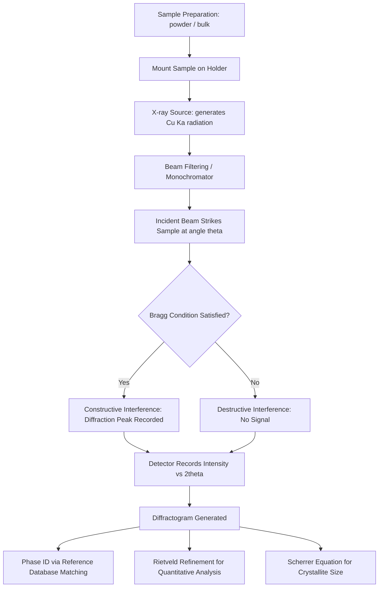

## X-Ray Diffraction Fundamentals

### Overview and Purpose

X-ray diffraction (XRD) is an analytical technique used to identify crystal structures, determine lattice parameters, characterize phase composition, and assess microstructural features such as grain size and internal stress in crystalline materials. In materials science and civil engineering, XRD is the primary tool for identifying mineral phases in cements, aggregates, soils, corrosion products, and metallic alloys used in structural applications.

The technique exploits the fact that X-ray wavelengths (typically 0.5–2.5 Å) are comparable to interatomic spacing in crystals, allowing crystal lattices to act as three-dimensional diffraction gratings.

### Physical Basis: Bragg's Law

When X-rays strike a crystalline material, atoms in periodic lattice planes scatter the incoming radiation. Constructive interference occurs only at specific angles, producing detectable diffraction peaks. This condition is described by Bragg's Law:

$$n\lambda = 2d\sin\theta$$

Where:

- $n$ = order of reflection (integer: 1, 2, 3...)
- $\lambda$ = wavelength of incident X-rays
- $d$ = interplanar spacing between atomic planes (the $d$-spacing)
- $\theta$ = angle of incidence (and reflection), measured from the plane, not the normal

**Key Points**

- Diffraction only occurs when the path difference between waves reflected from successive planes is an integer multiple of $\lambda$.
- Each set of crystallographic planes, denoted by Miller indices $(hkl)$, produces a diffraction peak at a characteristic $2\theta$ angle.
- The diffraction angle recorded experimentally is $2\theta$ (the angle between the incident and diffracted beam), not $\theta$ itself.

### Derivation Logic (Geometric Basis)

Consider two parallel atomic planes separated by distance $d$. An incident X-ray beam strikes both planes at angle $\theta$. The wave reflecting off the lower plane travels an extra path length compared to the wave reflecting off the upper plane. This extra path is:

$$\text{Path difference} = 2d\sin\theta$$

Constructive interference (a diffraction peak) occurs only when this path difference equals a whole number of wavelengths, giving Bragg's Law. If the path difference is a non-integer multiple of $\lambda$, destructive interference eliminates the signal.

### Relationship Between d-Spacing and Lattice Parameters

For a **cubic** crystal system, the $d$-spacing relates to Miller indices and the lattice parameter $a$ by:

$$\frac{1}{d^2} = \frac{h^2 + k^2 + l^2}{a^2}$$

For **tetragonal** systems (lattice parameters $a$ and $c$):

$$\frac{1}{d^2} = \frac{h^2 + k^2}{a^2} + \frac{l^2}{c^2}$$

For **orthorhombic** systems (parameters $a$, $b$, $c$):

$$\frac{1}{d^2} = \frac{h^2}{a^2} + \frac{k^2}{b^2} + \frac{l^2}{c^2}$$

Lower-symmetry systems (monoclinic, triclinic) require more complex expressions involving interaxial angles. These relations allow lattice parameters to be back-calculated once $d$-spacings are measured experimentally.

### X-Ray Generation and Instrumentation

**X-ray source.** Most laboratory diffractometers generate X-rays via a sealed tube: a tungsten filament emits electrons that are accelerated toward a metal target (commonly copper, Cu) under high voltage. Electron bombardment ejects inner-shell electrons from target atoms; when outer-shell electrons fall to fill the vacancy, characteristic X-rays are emitted.

- $\text{K}_\alpha$ radiation (from Cu, $\lambda \approx 1.5406$ Å) is the most commonly used wavelength for structural analysis.
- A monochromator or filter (e.g., nickel filter for Cu radiation) removes unwanted $\text{K}_\beta$ radiation and reduces background from continuous (Bremsstrahlung) radiation.

**Instrument geometry.** The most common laboratory configuration is the Bragg-Brentano ($\theta$–$2\theta$) geometry, in which the X-ray source and detector move symmetrically about the sample surface, maintaining focusing conditions across the scan range.

**Detector.** Modern instruments typically use position-sensitive or solid-state detectors that record diffracted intensity as a function of $2\theta$.

(svg_diagram) Bragg's Law Geometry (svg_diagram)

<svg xmlns="http://www.w3.org/2000/svg" viewBox="0 0 640 360" font-family="Helvetica, Arial, sans-serif">
<rect x="0" y="0" width="640" height="360" fill="#ffffff" />
<text x="320" y="24" text-anchor="middle" font-size="16" font-weight="bold" fill="#1a1a1a">Bragg's Law Geometry (svg_diagram)</text>

<line x1="60" y1="140" x2="580" y2="140" stroke="#333333" stroke-width="2" />
<line x1="60" y1="220" x2="580" y2="220" stroke="#333333" stroke-width="2" />

<circle cx="150" cy="140" r="6" fill="#2b6cb0" />
<circle cx="300" cy="140" r="6" fill="#2b6cb0" />
<circle cx="450" cy="140" r="6" fill="#2b6cb0" />
<circle cx="150" cy="220" r="6" fill="#2b6cb0" />
<circle cx="300" cy="220" r="6" fill="#2b6cb0" />
<circle cx="450" cy="220" r="6" fill="#2b6cb0" />

<line x1="500" y1="140" x2="500" y2="220" stroke="#c53030" stroke-width="1.5" stroke-dasharray="4,3" />
<text x="512" y="184" font-size="14" fill="#c53030">d</text>

<line x1="80" y1="60" x2="300" y2="140" stroke="#2f855a" stroke-width="2" />
<line x1="230" y1="60" x2="300" y2="140" stroke="#2f855a" stroke-width="2" />
<line x1="230" y1="60" x2="300" y2="220" stroke="#2f855a" stroke-width="2" />

<line x1="300" y1="140" x2="520" y2="60" stroke="#805ad5" stroke-width="2" />
<line x1="300" y1="220" x2="520" y2="140" stroke="#805ad5" stroke-width="2" />
<line x1="520" y1="140" x2="520" y2="60" stroke="#805ad5" stroke-width="2" stroke-dasharray="3,3" opacity="0.5" />

<path d="M 260 140 A 40 40 0 0 1 270 118" fill="none" stroke="#000000" stroke-width="1" />
<text x="255" y="112" font-size="13" fill="#000000">θ</text>
<path d="M 340 140 A 40 40 0 0 0 330 118" fill="none" stroke="#000000" stroke-width="1" />
<text x="345" y="112" font-size="13" fill="#000000">θ</text>

<line x1="300" y1="220" x2="330" y2="220" stroke="#c53030" stroke-width="2" />
<line x1="330" y1="220" x2="330" y2="140" stroke="#c53030" stroke-width="1" stroke-dasharray="2,2" />
<text x="336" y="185" font-size="12" fill="#c53030">extra path = 2d sinθ</text>

<text x="90" y="50" font-size="13" fill="`#2f855a`">Incident beam</text>

<text x="470" y="50" font-size="13" fill="`#805ad5`">Diffracted beam</text>

<text x="30" y="144" font-size="13" fill="`#333333`">Plane 1</text>

<text x="30" y="224" font-size="13" fill="`#333333`">Plane 2</text>

<text x="320" y="300" text-anchor="middle" font-size="14" fill="`#1a1a1a`" font-weight="bold">nλ = 2d sinθ</text>

<text x="320" y="325" text-anchor="middle" font-size="12" fill="`#4a5568`">Constructive interference occurs only when the path difference equals an integer number of wavelengths</text>

</svg>

### The Diffraction Pattern (Diffractogram)

An XRD pattern (diffractogram) plots diffracted intensity versus $2\theta$. Each peak corresponds to a specific $(hkl)$ plane family satisfying Bragg's condition.

**Key features of a diffraction pattern:**

- **Peak position ($2\theta$):** Determined by $d$-spacing, which reflects unit cell dimensions. Used for phase identification (matching against reference databases such as the ICDD/PDF database).
- **Peak intensity:** Depends on atomic scattering factors, structure factor, multiplicity, and preferred orientation. Used for quantitative phase analysis and texture assessment.
- **Peak width (FWHM — full width at half maximum):** Related to crystallite size, microstrain, and instrumental broadening. Narrow peaks indicate large, well-ordered crystallites; broad peaks suggest nanocrystalline material, lattice strain, or amorphous content.
- **Background:** Amorphous phases (e.g., glass content in fly ash, amorphous silica) produce a broad diffuse hump rather than sharp peaks.

### Scherrer Equation (Crystallite Size Estimation)

Peak broadening can be used to estimate average crystallite size using the Scherrer equation:

$$D = \frac{K\lambda}{\beta \cos\theta}$$

Where:

- $D$ = mean crystallite size
- $K$ = shape factor (commonly taken as 0.9, dimensionless)
- $\lambda$ = X-ray wavelength
- $\beta$ = line broadening at half maximum intensity (FWHM, in radians), corrected for instrumental broadening
- $\theta$ = Bragg angle

[Inference] The Scherrer equation provides a reasonable estimate for crystallite sizes below approximately 100–200 nm; above this range, peak broadening becomes dominated by instrumental resolution limits rather than crystallite size, and the method loses sensitivity.

### Structure Factor and Systematic Absences

The intensity of a diffracted beam depends on the structure factor $F_{hkl}$, which sums the scattering contributions of all atoms in the unit cell:

$$F_{hkl} = \sum_{j} f_j \, e^{2\pi i (hx_j + ky_j + lz_j)}$$

Where $f_j$ is the atomic scattering factor of atom $j$ located at fractional coordinates $(x_j, y_j, z_j)$.

Certain crystal structures produce **systematic absences** — reflections that are forbidden due to symmetry (e.g., body-centered cubic structures only show reflections where $h+k+l$ is even). These absences are diagnostic for identifying Bravais lattice type and space group.

### Applications in Civil Engineering and Materials Science

**Cement and concrete science**

- Identification of clinker phases: alite ($\text{C}_3\text{S}$), belite ($\text{C}_2\text{S}$), tricalcium aluminate ($\text{C}_3\text{A}$), and ferrite phase ($\text{C}_4\text{AF}$).
- Quantitative phase analysis using the Rietveld refinement method to determine relative proportions of clinker phases, which govern setting time and strength development.
- Detection of hydration products such as portlandite (Ca(OH)₂) and monitoring its consumption in pozzolanic reactions.
- Identification of deleterious phases like ettringite and gypsum, relevant to sulfate attack analysis.

**Aggregate and soil characterization**

- Mineralogical identification of aggregates to assess alkali-silica reaction (ASR) potential (e.g., detecting reactive silica polymorphs such as cristobalite, tridymite, or opal).
- Clay mineral identification in soils (kaolinite, illite, montmorillonite) for geotechnical classification and swelling potential assessment.

**Corrosion and durability studies**

- Identification of corrosion products on reinforcing steel (e.g., goethite, lepidocrocite, magnetite) to assess corrosion mechanisms in reinforced concrete.

**Metallurgy for structural steel**

- Phase identification (ferrite, austenite, martensite, cementite) in structural and prestressing steels.
- Residual stress measurement via peak shift analysis, relevant to welded structural connections.

### Example: Phase Identification Workflow

**Example**

A concrete durability lab receives a sample of degraded concrete showing surface expansion cracking. The workflow to investigate potential ASR using XRD:

1. Extract and pulverize a representative sample of the reactive aggregate and surrounding paste.
2. Prepare a flat, randomly oriented powder sample (particle size typically <10 μm to minimize preferred orientation).
3. Run a $\theta$–$2\theta$ scan, typically from $5°$ to $70°$ $2\theta$, using Cu $\text{K}_\alpha$ radiation.
4. Compare peak positions against ICDD reference patterns to identify reactive silica polymorphs (e.g., cristobalite peak near $2\theta \approx 21.9°$).
5. Cross-reference with SEM-EDS to confirm gel morphology and elemental composition, since XRD alone cannot detect the amorphous ASR gel (only crystalline reactant phases).

**Output**

Confirmed presence of cristobalite in the aggregate combined with morphological evidence of ASR gel supports a diagnosis of alkali-silica reaction as the expansion mechanism, informing repair and future mix-design specification decisions (e.g., use of low-alkali cement or supplementary cementitious materials).

### Sample Preparation Considerations

- **Particle size:** Fine, uniform powders reduce particle statistics error and preferred orientation effects.
- **Preferred orientation:** Platy or needle-like crystals (e.g., clays, gypsum) tend to align during sample mounting, distorting relative peak intensities. Back-loading or side-loading techniques minimize this artifact.
- **Sample height/displacement error:** Incorrect sample height relative to the goniometer axis introduces systematic peak position shifts, affecting lattice parameter accuracy.
- **Amorphous content:** Materials like fly ash, slag, or silica fume contain significant glassy phases that do not diffract sharply; the "amorphous hump" must be accounted for in quantitative analysis (e.g., using an internal standard method).

### Quantitative Analysis: Rietveld Refinement

Rietveld refinement is a whole-pattern fitting method that models the entire diffractogram (peak positions, intensities, and shapes) based on crystal structure models, rather than analyzing isolated peaks. It is the standard method for:

- Quantitative phase analysis of multi-phase mixtures (e.g., cement clinker composition per ASTM C1365).
- Refinement of lattice parameters and atomic positions.
- Estimating amorphous content when combined with an internal standard (e.g., known weight fraction of corundum or rutile added to the sample).

[Unverified] The precision of Rietveld-based quantitative phase analysis can vary considerably depending on operator expertise, reference structure quality, and instrument calibration; reported uncertainties in clinker phase quantification commonly range from roughly 1–3 wt% in well-controlled laboratory conditions, though this may vary by laboratory and sample complexity.

### Diffractometer Workflow (Process Diagram)

### Limitations of XRD

- Cannot directly detect amorphous phases with structural specificity (only reveals their presence as diffuse background).
- Requires a minimum detectable crystalline fraction, generally around 1–5 wt% depending on the phase's scattering power. [Inference] This detection limit is influenced by instrument sensitivity, counting time, and the atomic number of constituent elements, so it should be treated as an approximate guideline rather than a fixed threshold.
- Bulk-averaging technique: provides information representative of the sampled volume, not localized microstructural detail (complementary techniques like SEM or TEM are needed for spatial resolution).
- Sample must be crystalline and sufficiently pulverized/homogeneous for accurate powder diffraction results; single-crystal or highly textured samples require specialized geometries.

### Related Topics

- Miller Indices and Crystallographic Planes
- Bravais Lattices and the Seven Crystal Systems
- Rietveld Refinement Methodology
- Scanning Electron Microscopy (SEM) for Microstructural Analysis
- Alkali-Silica Reaction (ASR) Mechanisms in Concrete
- Cement Clinker Mineralogy (Bogue Calculation vs. XRD Quantification)
- Residual Stress Analysis via Diffraction Techniques
- Amorphous Phase Quantification Methods (Internal Standard Method)