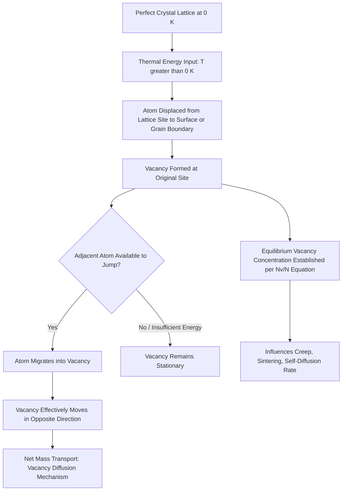

## Point Defects: Vacancies and Interstitials

### Overview and Significance

Point defects are zero-dimensional imperfections in a crystal lattice, localized to a single lattice site or a small cluster of atoms. Unlike line defects (dislocations) or planar defects (grain boundaries), point defects involve deviations at the scale of individual atomic positions. They are thermodynamically unavoidable — no real crystal is perfect at any temperature above absolute zero — and they exert outsized influence on diffusion, electrical conductivity, mechanical strength, and phase transformations.

In civil engineering materials, point defects govern processes such as diffusion-controlled corrosion, creep deformation in structural steel and concrete reinforcement, and solid-state diffusion in cementitious hydration products.

### Classification of Point Defects

**Vacancies**

A vacancy is a lattice site normally occupied by an atom that is instead empty. It is the simplest and most common point defect.

**Self-interstitials**

A self-interstitial occurs when an atom of the same species as the host lattice is lodged into a non-lattice (interstitial) position — a location not normally occupied in the ideal structure. Self-interstitials are energetically costly to form because they severely distort surrounding lattice planes.

**Interstitial impurities**

A foreign (solute) atom occupies an interstitial site rather than a substitutional lattice position. This is common when the solute atom is significantly smaller than the host atom (e.g., carbon in iron).

**Substitutional impurities**

A foreign atom replaces a host atom at a regular lattice site. (Technically a compositional point defect rather than a structural one, but grouped with point defects in most treatments since it is also a zero-dimensional imperfection.)

**Key Points**

- Vacancies and self-interstitials are intrinsic defects (native to the pure material).
- Substitutional and interstitial impurities are extrinsic defects (introduced by foreign species).
- Frenkel and Schottky defects (below) are specific paired-defect structures common in ionic crystals.

### Frenkel and Schottky Defects (Ionic Crystals)

In ionic compounds, charge neutrality constraints govern how point defects form:

- **Frenkel defect:** A cation (typically smaller) leaves its lattice site and lodges into an interstitial position, creating a vacancy-interstitial pair. Charge neutrality is preserved locally since the same ion type is displaced, not removed.
- **Schottky defect:** A stoichiometric set of vacancies forms — one cation vacancy paired with one anion vacancy (or ratios matching the compound stoichiometry) — maintaining overall charge neutrality without any atom being displaced to an interstitial site.

[Inference] Frenkel defects are generally more favorable in structures with large differences in ionic radii between cation and anion (allowing the smaller ion to fit interstitially with less lattice strain), while Schottky defects tend to dominate in more close-packed ionic structures with similar-sized ions, though the actual dominant defect type depends on the specific crystal's structure and bonding.

### Thermodynamics of Vacancy Formation

Vacancy formation is a thermally activated equilibrium process. Although creating a vacancy increases the internal energy of the crystal (energy is required to remove an atom from its site and place it at the surface or a grain boundary), it also increases the configurational entropy of the system. At any temperature above 0 K, the free energy minimum occurs at a nonzero equilibrium vacancy concentration.

The equilibrium concentration of vacancies is given by:

$$\frac{N_v}{N} = \exp\left(-\frac{Q_v}{k_B T}\right)$$

Where:

- $N_v$ = number of vacancies
- $N$ = total number of atomic (lattice) sites
- $Q_v$ = activation energy required to form one vacancy
- $k_B$ = Boltzmann constant ($8.62 \times 10^{-5}\ \text{eV/K}$)
- $T$ = absolute temperature (Kelvin)

**Key Points**

- Vacancy concentration increases exponentially with temperature.
- $Q_v$ is material-specific; for most metals it typically falls in the range of roughly 0.5–3 eV per vacancy, though exact values depend on the specific metal and bonding character.
- Even at equilibrium melting temperature, vacancy concentrations in most metals are on the order of $10^{-4}$ to $10^{-3}$ (i.e., about 1 vacancy per 1,000–10,000 atoms). [Unverified] Precise values depend strongly on the specific metal and the reliability of the experimentally measured $Q_v$.

### Example: Vacancy Concentration Calculation

**Example**

Calculate the equilibrium vacancy concentration in copper at 1000°C (1273 K), given $Q_v = 0.90\ \text{eV/atom}$.

Step 1 — Convert temperature: $T = 1273\ \text{K}$ (already absolute).

Step 2 — Apply the equation:

$$\frac{N_v}{N} = \exp\left(-\frac{0.90}{(8.62\times10^{-5})(1273)}\right)$$

Step 3 — Evaluate the exponent denominator:

$$(8.62\times10^{-5})(1273) \approx 0.1097\ \text{eV}$$

Step 4 — Compute the ratio:

$$\frac{N_v}{N} = \exp\left(-\frac{0.90}{0.1097}\right) = \exp(-8.20) \approx 2.7 \times 10^{-4}$$

**Output**

Approximately 2.7 vacancies per 10,000 lattice sites at 1000°C — illustrating the exponential sensitivity of vacancy concentration to temperature, which is central to understanding why high-temperature processes (annealing, sintering, creep) proceed far faster than room-temperature equivalents.

### Diffusion Mechanisms Enabled by Point Defects

Point defects are the physical mechanism by which solid-state diffusion occurs, since atoms cannot move through a perfect, fully-occupied lattice.

**Vacancy diffusion mechanism**

An atom adjacent to a vacancy can jump into the empty site, effectively moving the vacancy in the opposite direction. This is the dominant self-diffusion and substitutional-solute diffusion mechanism in metals.

**Interstitial diffusion mechanism**

Small interstitial solute atoms (e.g., carbon, nitrogen, hydrogen in iron) move directly from one interstitial site to a neighboring one, without requiring a vacancy. Because interstitial sites are more numerous than vacancies and the migration energy barrier is often lower, interstitial diffusion is typically significantly faster than vacancy diffusion for a given solute-host system. [Inference] The magnitude of this difference is system-dependent and should not be treated as a fixed ratio across all material systems.

Both mechanisms follow an Arrhenius-type temperature dependence for the diffusion coefficient:

$$D = D_0 \exp\left(-\frac{Q_d}{RT}\right)$$

Where $D_0$ is a pre-exponential (frequency) factor, $Q_d$ is the activation energy for diffusion, $R$ is the universal gas constant, and $T$ is absolute temperature.

### Effects of Point Defects on Material Properties

**Mechanical properties**

- Vacancies contribute to creep deformation at elevated temperature via vacancy diffusion-assisted dislocation climb (Nabarro-Herring and Coble creep mechanisms in structural metals operating near/above roughly 0.4–0.5 of the absolute melting temperature).
- Interstitial solutes (e.g., carbon in ferritic steel) cause solid-solution strengthening by impeding dislocation motion, directly relevant to the strength of reinforcing steel and structural steel sections.

**Electrical and physical properties**

- Vacancies increase electrical resistivity in metals by scattering conduction electrons.
- Point defect concentration affects density: a real crystal with vacancies has a measurably lower density than the theoretical density calculated from a defect-free unit cell.

**Corrosion and degradation relevance**

- Vacancy clusters can nucleate voids, contributing to embrittlement and fatigue crack initiation in structural steel components subjected to cyclic loading.
- Interstitial hydrogen (from corrosion reactions or electroplating processes) causes hydrogen embrittlement in high-strength prestressing steel and post-tensioning tendons, a critical durability concern in prestressed concrete structures.

### Point Defects vs. Density: Theoretical vs. Measured Density

The theoretical density of a defect-free crystal is calculated from the unit cell:

$$\rho_{\text{theoretical}} = \frac{n A}{V_c N_A}$$

Where $n$ = number of atoms per unit cell, $A$ = atomic weight, $V_c$ = unit cell volume, $N_A$ = Avogadro's number.

Because real materials contain vacancies, measured (experimental) density is always slightly lower than the theoretical value. The discrepancy between measured and theoretical density is, in fact, one classical experimental method used to estimate vacancy concentration in a material.

### Point Defect Interactions and Clustering

- **Divacancies:** Two vacancies can bind together, lowering total system energy compared to two isolated vacancies; divacancies have different (typically higher) mobility characteristics than single vacancies.
- **Vacancy condensation into dislocation loops or voids:** At high vacancy supersaturation (e.g., following rapid quenching or irradiation), vacancies can aggregate into voids or collapse into dislocation loops, altering local mechanical behavior.
- **Impurity-vacancy pairs:** Solute atoms with a size or charge mismatch relative to the host lattice can bind to vacancies, affecting diffusion kinetics and precipitation behavior — relevant in the aging and tempering of structural alloy steels.

### Structural Illustration

(svg_diagram) Point Defect Types in a Crystal Lattice (svg_diagram)

<svg xmlns="http://www.w3.org/2000/svg" viewBox="0 0 700 380" font-family="Helvetica, Arial, sans-serif">
<rect x="0" y="0" width="700" height="380" fill="#ffffff" />
<text x="350" y="24" text-anchor="middle" font-size="16" font-weight="bold" fill="#1a1a1a">Point Defect Types in a Crystal Lattice (svg_diagram)</text>

<g stroke="#cbd5e0" stroke-width="1">
<line x1="60" y1="70" x2="60" y2="330" />
<line x1="140" y1="70" x2="140" y2="330" />
<line x1="220" y1="70" x2="220" y2="330" />
<line x1="300" y1="70" x2="300" y2="330" />
<line x1="380" y1="70" x2="380" y2="330" />
<line x1="460" y1="70" x2="460" y2="330" />
<line x1="540" y1="70" x2="540" y2="330" />
<line x1="620" y1="70" x2="620" y2="330" />



```
<line x1="60" y1="70" x2="620" y2="70" />
<line x1="60" y1="150" x2="620" y2="150" />
<line x1="60" y1="230" x2="620" y2="230" />
<line x1="60" y1="310" x2="620" y2="310" />
```

</g>

<g fill="#2b6cb0">
<circle cx="60" cy="70" r="10" />
<circle cx="140" cy="70" r="10" />
<circle cx="220" cy="70" r="10" />
<circle cx="300" cy="70" r="10" />
<circle cx="380" cy="70" r="10" />
<circle cx="460" cy="70" r="10" />
<circle cx="540" cy="70" r="10" />
<circle cx="620" cy="70" r="10" />



```
<circle cx="60" cy="150" r="10" />
<circle cx="140" cy="150" r="10" />

<circle cx="300" cy="150" r="10" />
<circle cx="380" cy="150" r="10" />
<circle cx="460" cy="150" r="10" />
<circle cx="540" cy="150" r="10" />
<circle cx="620" cy="150" r="10" />

<circle cx="60" cy="230" r="10" />
<circle cx="140" cy="230" r="10" />
<circle cx="220" cy="230" r="10" />
<circle cx="300" cy="230" r="10" />

<circle cx="460" cy="230" r="10" />
<circle cx="540" cy="230" r="10" />
<circle cx="620" cy="230" r="10" />

<circle cx="60" cy="310" r="10" />
<circle cx="140" cy="310" r="10" />
<circle cx="220" cy="310" r="10" />
<circle cx="300" cy="310" r="10" />
<circle cx="380" cy="310" r="10" />

<circle cx="540" cy="310" r="10" />
<circle cx="620" cy="310" r="10" />
```

</g>

<circle cx="220" cy="150" r="10" fill="none" stroke="#c53030" stroke-width="2" stroke-dasharray="3,2" />
<text x="205" y="130" font-size="12" fill="#c53030">Vacancy</text>

<circle cx="380" cy="230" r="10" fill="#2b6cb0" />
<circle cx="400" cy="210" r="7" fill="#dd6b20" />
<text x="405" y="195" font-size="12" fill="#dd6b20">Self-interstitial</text>

<circle cx="180" cy="270" r="6" fill="#38a169" />
<text x="150" y="292" font-size="12" fill="#38a169">Interstitial impurity</text>

<circle cx="460" cy="310" r="12" fill="#805ad5" />
<text x="430" y="345" font-size="12" fill="#805ad5">Substitutional impurity</text>

<text x="60" y="55" font-size="12" fill="`#2b6cb0`">● Host atom</text>

</svg>

### Point Defects and Diffusion in Cementitious and Structural Systems

**Relevance to concrete durability**

- Ionic point defects in the calcium silicate hydrate (C-S-H) gel and in crystalline hydration products influence ionic diffusivity, which governs chloride ingress rates in reinforced concrete — a controlling factor in reinforcement corrosion initiation.
- Vacancy-mediated diffusion in passive oxide films on reinforcing steel affects the stability of the protective passive layer; breakdown of this layer (depassivation) via chloride-induced defect formation is a principal corrosion initiation mechanism.

**Relevance to structural steel**

- Interstitial carbon and nitrogen atoms in the body-centered cubic (BCC) ferrite structure are central to strain aging and the yield-point phenomenon observed in mild structural steels.
- Controlled interstitial diffusion underlies heat treatment processes (annealing, quenching, tempering) used to achieve specified mechanical properties in structural steel grades.

### Process Diagram: Vacancy Formation and Diffusion Pathway



### Comparative Summary

| Defect Type | Species Involved | Lattice Distortion | Typical Formation Energy | Primary Role |
| --- | --- | --- | --- | --- |
| Vacancy | Host atom removed | Moderate, localized relaxation inward | Moderate (~0.5–3 eV in metals) | Diffusion, creep, density reduction |
| Self-interstitial | Host atom in interstitial site | Severe, high local strain | High (often several eV) | Radiation damage, rare in equilibrium |
| Interstitial impurity | Small foreign atom | Localized strain field | Depends on solute/host size mismatch | Solid-solution strengthening, fast diffusion |
| Substitutional impurity | Foreign atom replacing host | Mild to moderate, depends on size mismatch | Depends on solubility limits | Alloying, solid-solution strengthening |
| Frenkel pair | Cation displaced to interstitial | Localized pair distortion | Compound-specific | Ionic conductivity in ceramics/ionic solids |
| Schottky pair | Stoichiometric vacancy pair | Distributed, charge-neutral | Compound-specific | Ionic conductivity, density reduction in ionic crystals |

### Related Topics

- Line Defects: Edge and Screw Dislocations
- Planar Defects: Grain Boundaries and Stacking Faults
- Diffusion Mechanisms and Fick's Laws
- Solid-Solution Strengthening Mechanisms
- Creep Deformation in Structural Metals
- Corrosion of Reinforcing Steel in Concrete
- Heat Treatment of Steel: Annealing, Quenching, and Tempering
- Radiation Damage and Defect Clustering in Materials