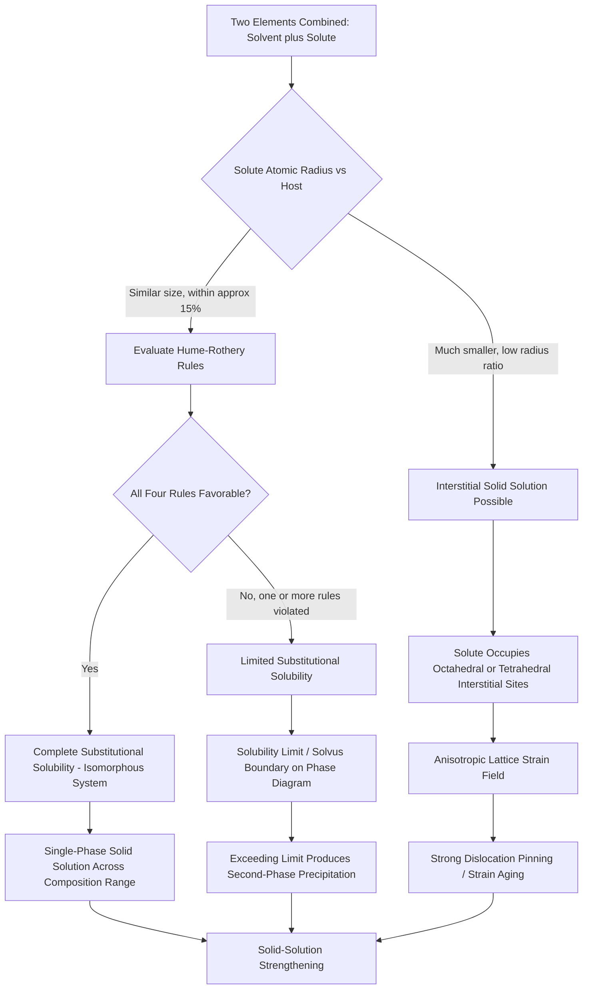

## Substitutional and Interstitial Solid Solutions

### Overview and Definition

A solid solution forms when solute atoms are incorporated into the crystal lattice of a solvent (host) material while the host retains a single, homogeneous crystalline phase. Unlike a mechanical mixture or a compound with a distinct new structure, a solid solution preserves the solvent's original crystal structure, with the solute atoms distributed at either substitutional or interstitial positions.

Solid solutions are the structural basis of nearly all engineering alloys, including the structural and reinforcing steels central to civil engineering applications. Understanding solid solution formation explains why alloying is one of the most effective and economical strengthening mechanisms available.

### Substitutional Solid Solutions

In a substitutional solid solution, solute atoms directly replace solvent atoms at regular lattice sites, without altering the underlying crystal structure type.

**Hume-Rothery Rules for Substitutional Solubility**

The extent to which two elements form a substitutional solid solution (particularly extensive or complete solubility) is governed by four empirical rules:

1. **Atomic size factor:** The atomic radii of solute and solvent should differ by no more than approximately 15%. Larger differences introduce excessive lattice strain, limiting solubility.
2. **Crystal structure factor:** For complete (unlimited) solid solubility, both elements must share the same crystal structure (e.g., both FCC, both BCC).
3. **Electronegativity factor:** The elements should have similar electronegativity. A large electronegativity difference favors compound formation (ordered intermetallic phases) over random solid solution.
4. **Valence factor:** Metals with the same valence are more likely to form extensive solid solutions; a metal of lower valence more readily dissolves a metal of higher valence than the reverse.

**Key Points**

- Satisfying all four Hume-Rothery rules favors complete solid solubility across the entire composition range (isomorphous systems), such as the copper-nickel system.
- Violating one or more rules restricts solubility to a limited range, often producing a solvus boundary beyond which a second phase precipitates.
- These rules are guidelines derived empirically, not absolute physical laws — [Inference] exceptions exist, and predicting solubility with confidence in complex or multi-component systems typically requires supplementing these rules with thermodynamic modeling (e.g., CALPHAD-based approaches) or experimental phase diagram data.

### Interstitial Solid Solutions

In an interstitial solid solution, solute atoms occupy the small voids (interstitial sites) between host atoms rather than replacing them at lattice positions. This mechanism is only feasible when the solute atom is significantly smaller than the host atom — typically solute-to-solvent atomic radius ratios below approximately 0.59 (per Hägg's rule for interstitial compound formation, though solid solution behavior can occur at somewhat different ratios than compound formation).

**Common interstitial solutes in metallic systems:**

- Carbon in iron (the basis of the iron-carbon system and all carbon/alloy steels)
- Nitrogen in iron and titanium
- Hydrogen in numerous metals (relevant to hydrogen embrittlement)
- Boron in iron and nickel-based alloys

**Interstitial sites in common metallic structures:**

- **FCC (face-centered cubic):** Octahedral interstitial sites are larger than tetrahedral sites; octahedral sites are the primary location for carbon in austenite ($\gamma$-iron).
- **BCC (body-centered cubic):** Both octahedral and tetrahedral sites exist but are smaller and more distorted than in FCC; this explains why carbon solubility in ferrite ($\alpha$-iron, BCC) is drastically lower than in austenite (FCC), since fitting a carbon atom into the smaller, more distorted BCC interstitial sites requires greater lattice strain energy.

Even though octahedral sites in BCC are geometrically smaller in an idealized sense than in FCC, the BCC structure allows the carbon atom to push apart only two nearest neighbor iron atoms (rather than more symmetric displacement in FCC), producing a highly anisotropic strain field. This is why the maximum solubility of carbon in ferrite is only about 0.02 wt% at 727°C, versus approximately 2.14 wt% in austenite at 1147°C, per the iron-iron carbide phase diagram.

### Structural Comparison Diagram

(svg_diagram) Substitutional vs Interstitial Solid Solution (svg_diagram)

<svg xmlns="http://www.w3.org/2000/svg" viewBox="0 0 700 380" font-family="Helvetica, Arial, sans-serif">
<rect x="0" y="0" width="700" height="380" fill="#ffffff" />
<text x="350" y="24" text-anchor="middle" font-size="16" font-weight="bold" fill="#1a1a1a">Substitutional vs Interstitial Solid Solution (svg_diagram)</text>

<text x="170" y="55" text-anchor="middle" font-size="14" font-weight="bold" fill="`#2d3748`">Substitutional</text>

<g stroke="`#cbd5e0`" stroke-width="1">

<line x1="70" y1="80" x2="70" y2="320" />

<line x1="150" y1="80" x2="150" y2="320" />

<line x1="230" y1="80" x2="230" y2="320" />

<line x1="310" y1="80" x2="310" y2="320" />

<line x1="70" y1="80" x2="310" y2="80" />

<line x1="70" y1="160" x2="310" y2="160" />

<line x1="70" y1="240" x2="310" y2="240" />

<line x1="70" y1="320" x2="310" y2="320" />

</g>

<g fill="`#2b6cb0`">

<circle cx="70" cy="80" r="11" /><circle cx="150" cy="80" r="11" /><circle cx="230" cy="80" r="11" /><circle cx="310" cy="80" r="11" />

<circle cx="70" cy="160" r="11" /><circle cx="230" cy="160" r="11" /><circle cx="310" cy="160" r="11" />

<circle cx="70" cy="240" r="11" /><circle cx="150" cy="240" r="11" /><circle cx="310" cy="240" r="11" />

<circle cx="70" cy="320" r="11" /><circle cx="150" cy="320" r="11" /><circle cx="230" cy="320" r="11" /><circle cx="310" cy="320" r="11" />

</g>

<circle cx="150" cy="160" r="13" fill="#dd6b20" />
<circle cx="230" cy="240" r="9" fill="#dd6b20" />
<text x="170" y="345" text-anchor="middle" font-size="11" fill="#dd6b20">Solute replaces host atom</text>

<text x="530" y="55" text-anchor="middle" font-size="14" font-weight="bold" fill="`#2d3748`">Interstitial</text>

<g stroke="`#cbd5e0`" stroke-width="1">

<line x1="430" y1="80" x2="430" y2="320" />

<line x1="510" y1="80" x2="510" y2="320" />

<line x1="590" y1="80" x2="590" y2="320" />

<line x1="670" y1="80" x2="670" y2="320" />

<line x1="430" y1="80" x2="670" y2="80" />

<line x1="430" y1="160" x2="670" y2="160" />

<line x1="430" y1="240" x2="670" y2="240" />

<line x1="430" y1="320" x2="670" y2="320" />

</g>

<g fill="`#2b6cb0`">

<circle cx="430" cy="80" r="11" /><circle cx="510" cy="80" r="11" /><circle cx="590" cy="80" r="11" /><circle cx="670" cy="80" r="11" />

<circle cx="430" cy="160" r="11" /><circle cx="510" cy="160" r="11" /><circle cx="590" cy="160" r="11" /><circle cx="670" cy="160" r="11" />

<circle cx="430" cy="240" r="11" /><circle cx="510" cy="240" r="11" /><circle cx="590" cy="240" r="11" /><circle cx="670" cy="240" r="11" />

<circle cx="430" cy="320" r="11" /><circle cx="510" cy="320" r="11" /><circle cx="590" cy="320" r="11" /><circle cx="670" cy="320" r="11" />

</g>

<circle cx="470" cy="120" r="5" fill="#38a169" />
<circle cx="550" cy="200" r="5" fill="#38a169" />
<circle cx="630" cy="280" r="5" fill="#38a169" />
<text x="550" y="345" text-anchor="middle" font-size="11" fill="#38a169">Small solute occupies gap between host atoms</text>
</svg>

### Effects on Mechanical and Physical Properties

**Solid-solution strengthening**

Both substitutional and interstitial solutes strengthen a metal by introducing local lattice strain fields that impede dislocation motion. A moving dislocation must do extra work to bypass the distorted region around each solute atom, raising the yield strength.

- **Substitutional solutes** produce a relatively symmetric (spherical) strain field, since size mismatch is distributed roughly equally in all directions.
- **Interstitial solutes**, particularly in BCC metals, produce a highly asymmetric (tetragonal) strain field. This asymmetric strain interacts more strongly with both edge and screw dislocations, which is why small interstitial solute additions (e.g., carbon or nitrogen in iron) often produce disproportionately large strengthening effects per atomic percent compared to substitutional solutes.

**Strain-aging and yield-point phenomena**

Interstitial carbon and nitrogen atoms in ferritic steel diffuse toward and pin dislocations at ambient or slightly elevated temperature (a process called strain aging). This pinning is directly responsible for the sharp upper and lower yield point behavior observed in the stress-strain curve of mild (low-carbon) structural steel — a phenomenon with direct relevance to structural design codes that specify yield strength for steel reinforcement and structural sections.

**Lattice parameter effects**

- Substitutional solutes generally cause a roughly proportional change in lattice parameter with composition, often approximated by Vegard's Law for solutions behaving near-ideally:

$$a_{\text{alloy}} \approx a_A(1-x) + a_B(x)$$

Where $a_A$ and $a_B$ are the lattice parameters of pure components A and B, and $x$ is the atomic fraction of B. [Inference] Vegard's Law is an approximation; real solid solutions often show measurable deviations due to bonding effects, and it should not be treated as an exact relationship for all alloy systems.

- Interstitial solutes typically cause anisotropic lattice distortion (e.g., carbon in martensite causes tetragonal distortion of the otherwise BCC ferrite structure, producing body-centered tetragonal, BCT, martensite).

### Solubility Limits and Phase Diagrams

Solid solutions are not necessarily unlimited. The maximum amount of solute that can dissolve in a solvent at a given temperature is the **solubility limit**, represented on a phase diagram as the **solvus line**.

- Below the solubility limit, the alloy exists as a single-phase solid solution.
- Above the solubility limit, excess solute precipitates as a second phase (e.g., a distinct compound or a solid solution of different composition), producing a two-phase microstructure.
- Solubility limits generally vary with temperature, most often increasing with increasing temperature (though exceptions exist, and behavior may vary depending on the specific phase diagram in question).

This principle underlies precipitation-hardening (age-hardening) treatments used in some structural aluminum alloys, where a supersaturated solid solution is intentionally formed by quenching from a high-temperature single-phase region, then allowed to precipitate a fine, strengthening second phase during controlled aging.

### Example: Interpreting Carbon Solubility in Iron

**Example**

Using the iron-iron carbide (Fe-Fe₃C) phase diagram, determine whether a steel with 0.35 wt% carbon will be a single-phase interstitial solid solution at 900°C.

Step 1 — Identify the relevant phase field at 900°C. At this temperature, iron is in the austenite (FCC, $\gamma$-iron) region, since 900°C lies above the eutectoid temperature of 727°C.

Step 2 — Compare the carbon content to the maximum solubility of carbon in austenite, which is approximately 2.14 wt% at 1147°C, decreasing at other temperatures per the austenite solvus boundary.

Step 3 — At 900°C, the maximum solubility of carbon in austenite (read from the $A_{cm}$/solvus boundary) is well above 0.35 wt%.

**Output**

Since 0.35 wt% carbon is below the solubility limit of carbon in austenite at 900°C, the steel exists as a single-phase interstitial solid solution (austenite) at this temperature. Upon slow cooling below 727°C, however, the solubility of carbon in the now-stable ferrite phase drops sharply to about 0.02 wt%, forcing the excess carbon to partition into cementite (Fe₃C), producing the characteristic pearlite microstructure (alternating ferrite and cementite lamellae).

### Comparative Summary

| Characteristic | Substitutional Solid Solution | Interstitial Solid Solution |
| --- | --- | --- |
| Solute location | Replaces host atom at lattice site | Occupies void/gap between host atoms |
| Size requirement | Solute radius similar to host (within ~15%) | Solute radius much smaller than host (commonly cited threshold: ratio below ~0.59) |
| Strain field | Roughly symmetric | Highly asymmetric/anisotropic |
| Typical solubility extent | Can range from limited to complete (isomorphous) | Generally very limited (low wt%) |
| Example system | Cu-Ni (complete solubility) | C in Fe (limited, temperature-dependent) |
| Strengthening effect per atom (typical) | Moderate | Often disproportionately high |
| Governing empirical guideline | Hume-Rothery rules | Relative atomic size / interstitial site geometry |

### Relevance to Structural and Civil Engineering Materials

- **Structural steel alloying:** Manganese, chromium, nickel, and molybdenum are common substitutional alloying additions in structural and weathering steels, improving strength, hardenability, and corrosion resistance while carbon and nitrogen act as the primary interstitial strengtheners.
- **Reinforcing steel (rebar):** Microalloying with substitutional elements (e.g., vanadium, niobium in small quantities) combined with controlled interstitial carbon content is used to achieve specified yield strength grades (e.g., Grade 60, Grade 75 per ASTM A615) without excessive loss of ductility or weldability.
- **Stainless steel for corrosion-critical structures:** Chromium (substitutional) in solid solution with iron is what confers passivation and corrosion resistance, relevant to stainless reinforcement in marine or de-icing-salt-exposed concrete structures.
- **Hydrogen embrittlement:** Interstitial hydrogen solid solution in high-strength steel (e.g., prestressing tendons) is a key durability failure mechanism, since even small interstitial hydrogen concentrations can drastically reduce fracture toughness in susceptible microstructures.

### Formation and Property Impact Pathway

### Related Topics

- Point Defects: Vacancies and Interstitials
- Iron-Iron Carbide (Fe-Fe3C) Phase Diagram
- Hume-Rothery Rules for Solid Solubility
- Solid-Solution Strengthening Mechanisms
- Precipitation (Age) Hardening in Aluminum Alloys
- Strain Aging and Yield-Point Phenomenon in Mild Steel
- Hydrogen Embrittlement in High-Strength Steel
- Phase Diagrams: Solvus, Solidus, and Liquidus Lines