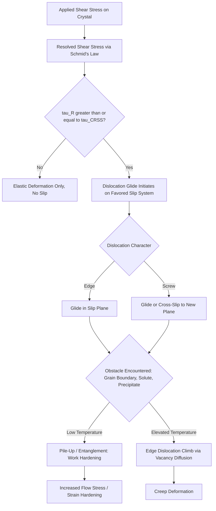

## Edge and Screw Dislocations

### Overview and Significance

Dislocations are one-dimensional (line) defects in a crystal lattice, representing a boundary between a region of the crystal that has slipped relative to another and a region that has not. Unlike point defects, which are localized to individual atomic sites, dislocations extend as lines through the crystal and are the primary carriers of plastic (permanent) deformation in crystalline materials.

The concept of dislocations resolves a fundamental discrepancy in materials science: the theoretical shear strength of a perfect crystal (calculated from interatomic bonding forces) is orders of magnitude higher than the shear stresses actually observed to cause yielding in real metals. Dislocations explain this discrepancy — plastic deformation occurs not by simultaneous slip of entire atomic planes, but by the sequential, localized motion of dislocations, which requires far less applied stress.

In civil engineering, dislocation theory underlies the ductility, yield strength, work hardening (strain hardening), and fatigue behavior of structural and reinforcing steel, as well as the deformation mechanisms in other crystalline construction materials.

### The Edge Dislocation

An edge dislocation is formed by inserting an extra half-plane of atoms into a crystal lattice. The dislocation line is defined as the terminus (edge) of this extra half-plane, running perpendicular to the direction of the applied slip.

**Structural characteristics:**

- Directly above the dislocation line, the lattice is in local compression (atoms pushed closer together).
- Directly below the dislocation line (on the side without the extra half-plane), the lattice is in local tension (atoms pulled apart).
- This asymmetric strain field is what allows edge dislocations to interact strongly with point defects, other dislocations, and solute atoms.

**Burgers vector for edge dislocations**

The Burgers vector, $\mathbf{b}$, quantifies the magnitude and direction of lattice distortion associated with a dislocation. For an edge dislocation, the Burgers vector is **perpendicular** to the dislocation line.

To determine the Burgers vector experimentally/graphically, a Burgers circuit is traced: an atom-to-atom closed loop is drawn around the dislocation in a perfect region of the lattice, then the same atom-to-atom step sequence is repeated around the actual dislocation. The closure failure of this loop — the vector needed to complete the circuit — is the Burgers vector.

**Key Points**

- Edge dislocation: Burgers vector $\perp$ dislocation line.
- Motion of an edge dislocation under shear stress occurs via **glide** (conservative motion within the slip plane containing both $\mathbf{b}$ and the dislocation line).
- Edge dislocations can also move via **climb**, a non-conservative process requiring vacancy diffusion to or from the dislocation line, which is thermally activated and becomes significant at elevated temperature (relevant to creep deformation).

### The Screw Dislocation

A screw dislocation is formed by applying a shear stress that displaces one region of the crystal relative to an adjacent region along a line, creating a spiral (helical) ramp-like distortion of the atomic planes around the dislocation line — analogous to a spiral parking garage ramp.

**Structural characteristics:**

- There is no extra half-plane of atoms in a screw dislocation; instead, the lattice planes are distorted into a continuous helical surface around the dislocation line.
- The strain field around a screw dislocation is primarily pure shear, without the compression/tension asymmetry seen in edge dislocations.

**Burgers vector for screw dislocations**

For a screw dislocation, the Burgers vector is **parallel** to the dislocation line.

**Key Points**

- Screw dislocation: Burgers vector $\parallel$ dislocation line.
- Screw dislocations move via **cross-slip** — the dislocation can glide from one slip plane to a different, intersecting slip plane that also contains the Burgers vector, since the Burgers vector's parallel alignment with the line does not uniquely define a single slip plane the way it does for edge dislocations.
- Screw dislocations cannot climb, since climb requires an extra half-plane to grow or shrink via vacancy exchange, which is a geometric feature only edge (or mixed) dislocations possess.

### Mixed Dislocations

Most dislocations observed in real crystals are **mixed dislocations** — combining edge and screw character along different portions of a curved dislocation line. At any point along a mixed dislocation, the Burgers vector can be resolved into edge and screw components relative to the local line direction. A single Burgers vector remains constant along the entire length of a dislocation line, even as the line curves and the local edge/screw character changes.

### Structural Comparison Diagram

(svg_diagram) Edge vs Screw Dislocation Geometry (svg_diagram)

<svg xmlns="http://www.w3.org/2000/svg" viewBox="0 0 720 420" font-family="Helvetica, Arial, sans-serif">
<rect x="0" y="0" width="720" height="420" fill="#ffffff" />
<text x="360" y="24" text-anchor="middle" font-size="16" font-weight="bold" fill="#1a1a1a">Edge vs Screw Dislocation Geometry (svg_diagram)</text>

<text x="180" y="55" text-anchor="middle" font-size="14" font-weight="bold" fill="`#2d3748`">Edge Dislocation</text>

<g stroke="#2b6cb0" stroke-width="1.5" fill="none">
<path d="M 60 90 L 300 90" />
<path d="M 60 110 L 300 110" />
<path d="M 60 190 L 180 190 L 180 230 L 300 230" />
<path d="M 60 270 L 300 270" />
<path d="M 60 290 L 300 290" />
</g>

<line x1="180" y1="90" x2="180" y2="190" stroke="#c53030" stroke-width="3" />
<text x="188" y="140" font-size="12" fill="#c53030">Extra half-plane</text>

<path d="M 170 190 L 190 190 M 180 190 L 180 210" stroke="#000000" stroke-width="2" />
<text x="196" y="205" font-size="13" font-weight="bold" fill="#000000">⊥ dislocation line</text>

<line x1="220" y1="330" x2="280" y2="330" stroke="#38a169" stroke-width="2" marker-end="url(#arrowGreen)" />
<text x="215" y="350" font-size="12" fill="#38a169">b (perpendicular to line)</text>

<text x="180" y="380" text-anchor="middle" font-size="11" fill="`#4a5568`">Compression above, tension below</text>

<text x="540" y="55" text-anchor="middle" font-size="14" font-weight="bold" fill="`#2d3748`">Screw Dislocation</text>

<g stroke="#805ad5" stroke-width="1.5" fill="none">
<path d="M 420 100 Q 480 120 540 100 Q 600 80 660 100" />
<path d="M 420 140 Q 480 160 540 140 Q 600 120 660 140" />
<path d="M 420 180 Q 480 200 540 180 Q 600 160 660 180" />
<path d="M 420 220 Q 480 240 540 220 Q 600 200 660 220" />
<path d="M 420 260 Q 480 280 540 260 Q 600 240 660 260" />
</g>

<line x1="540" y1="90" x2="540" y2="340" stroke="#000000" stroke-width="2" stroke-dasharray="5,3" />
<text x="548" y="100" font-size="13" font-weight="bold" fill="#000000">dislocation line</text>

<line x1="590" y1="300" x2="590" y2="340" stroke="#38a169" stroke-width="2" marker-end="url(#arrowGreen)" />
<text x="598" y="325" font-size="12" fill="#38a169">b (parallel to line)</text>

<text x="540" y="380" text-anchor="middle" font-size="11" fill="`#4a5568`">Helical/spiral ramp distortion, pure shear</text>

</svg>

### Dislocation Motion: Glide, Climb, and Cross-Slip

**Glide (conservative motion)**

Glide is the motion of a dislocation within its slip plane — the plane containing both the dislocation line and the Burgers vector. Glide requires only local, sequential bond breaking/reforming along the dislocation line and does not require long-range atomic diffusion, making it the dominant deformation mechanism at low-to-moderate homologous temperatures.

The **slip system** is the combination of a slip plane and a slip direction (aligned with $\mathbf{b}$) along which dislocation glide is most favorable, typically the closest-packed plane and closest-packed direction in the crystal structure:

- FCC metals: slip on $\{111\}$ planes in $\langle110\rangle$ directions — 12 slip systems, generally correlating with high ductility.
- BCC metals: slip commonly observed on $\{110\}$, $\{112\}$, and $\{123\}$ planes in $\langle111\rangle$ directions — more slip systems are geometrically available, but the lack of true close-packed planes in BCC generally raises the critical resolved shear stress required for slip relative to FCC metals. [Inference] The exact temperature-dependence and dominant slip system in BCC metals like ferritic steel can vary based on composition and testing conditions.
- HCP metals: typically fewer independent easy slip systems (limited primarily to the basal plane at room temperature), which is generally associated with more limited ductility unless additional slip or twinning systems are activated.

**Climb (non-conservative motion)**

Climb allows an edge dislocation to move perpendicular to its slip plane by absorbing or emitting vacancies at the edge of the extra half-plane, effectively adding or removing atomic material at the dislocation line. Because it requires vacancy diffusion, climb is thermally activated and becomes progressively more significant at higher homologous temperatures (commonly above roughly 0.4–0.5 of the absolute melting temperature), making it central to creep deformation in structural metals under sustained load at elevated temperature.

**Cross-slip**

Screw dislocations, lacking a uniquely defined slip plane, can switch from one slip plane to another intersecting plane that also contains the Burgers vector. Cross-slip allows screw dislocations to bypass obstacles that would otherwise block glide on the original slip plane, influencing work-hardening behavior and dislocation substructure development.

### Critical Resolved Shear Stress (CRSS) and Schmid's Law

Dislocation glide initiates when the shear stress resolved onto the slip plane, in the slip direction, reaches a critical value. This is described by Schmid's Law:

$$\tau_R = \sigma \cos\phi \cos\lambda$$

Where:

- $\tau_R$ = resolved shear stress on the slip plane, in the slip direction
- $\sigma$ = applied tensile (or compressive) stress
- $\phi$ = angle between the applied stress axis and the normal to the slip plane
- $\lambda$ = angle between the applied stress axis and the slip direction

The term $\cos\phi\cos\lambda$ is called the **Schmid factor**. Yielding by slip begins on the slip system with the highest Schmid factor once $\tau_R$ reaches the critical resolved shear stress, $\tau_{\text{CRSS}}$, a material property.

### Example: Resolved Shear Stress Calculation

**Example**

A single crystal is loaded in uniaxial tension along an axis oriented at $\phi = 45°$ from the slip plane normal and $\lambda = 45°$ from the slip direction. If the applied tensile stress is $\sigma = 20\ \text{MPa}$, calculate the resolved shear stress on this slip system.

Step 1 — Apply Schmid's Law:

$$\tau_R = \sigma \cos\phi \cos\lambda = 20 \times \cos(45°) \times \cos(45°)$$

Step 2 — Evaluate:

$$\tau_R = 20 \times 0.7071 \times 0.7071 = 20 \times 0.5 = 10\ \text{MPa}$$

**Output**

The resolved shear stress on this slip system is 10 MPa. Since $\phi = \lambda = 45°$ maximizes the Schmid factor (equal to 0.5, the theoretical maximum), this orientation represents the most favorable case for slip to initiate at the lowest applied tensile stress, for a given $\tau_{\text{CRSS}}$.

### Strengthening Mechanisms via Dislocation Interaction

Dislocation theory provides the mechanistic basis for the primary strengthening mechanisms used in structural metals:

**Strain (work) hardening**

As plastic deformation proceeds, dislocation density increases (dislocations multiply via mechanisms such as Frank-Read sources). The increasing density of dislocations impedes further dislocation motion through mutual interaction and entanglement, raising the flow stress required for continued deformation. This relationship is often expressed empirically as:

$$\tau_y = \tau_0 + \alpha G b \sqrt{\rho}$$

Where $\tau_0$ is a baseline friction stress, $\alpha$ is a material constant, $G$ is shear modulus, $b$ is the magnitude of the Burgers vector, and $\rho$ is dislocation density.

**Grain boundary strengthening (Hall-Petch relationship)**

Grain boundaries act as barriers to dislocation glide, since the slip plane orientation changes abruptly across a boundary. Dislocations pile up at grain boundaries, and the resulting stress concentration is what allows plastic deformation to propagate into the adjacent grain, per:

$$\sigma_y = \sigma_0 + \frac{k_y}{\sqrt{d}}$$

Where $\sigma_0$ and $k_y$ are material constants and $d$ is average grain diameter. This relationship is a key basis for grain refinement as a strengthening strategy in structural steel production (e.g., thermomechanically controlled processing, TMCP).

**Solid-solution strengthening**

As discussed under point defects and solid solutions, solute atoms create local strain fields that interact with and impede dislocation motion, requiring additional stress to continue dislocation glide.

**Precipitation/dispersion strengthening**

Fine second-phase particles act as obstacles that dislocations must either cut through or bypass (via the Orowan looping mechanism), both of which require additional applied stress.

### Relevance to Structural and Civil Engineering Materials

- **Ductility of structural steel:** The capacity of steel to undergo large plastic deformation before fracture — critical for structural ductility, seismic energy dissipation, and warning-before-failure behavior in design codes — arises directly from the availability of multiple slip systems and dislocation mobility in the BCC/FCC crystal structures of steel phases.
- **Yield-point phenomenon:** As discussed in interstitial solid solutions, the sharp yield drop in mild steel results from interstitial carbon/nitrogen atoms pinning dislocations (Cottrell atmospheres); breaking dislocations free of these pinning atmospheres requires a stress spike, producing the upper yield point.
- **Fatigue in steel structures:** Cyclic loading causes progressive dislocation substructure evolution (persistent slip bands), which nucleate fatigue cracks at free surfaces — a controlling mechanism in the fatigue life of steel bridge members and connections subjected to repeated traffic or wind loading.
- **Cold working of reinforcing steel:** Cold-drawing or cold-twisting of reinforcing bars intentionally increases dislocation density to raise yield strength via strain hardening, at the cost of reduced ductility — a trade-off directly reflected in reinforcing steel material specifications.
- **Weld heat-affected zones:** Thermal cycling during welding alters local dislocation density and grain size, affecting the strength and toughness of the heat-affected zone relative to base metal, a key consideration in structural steel welding procedure qualification.

### Comparative Summary

| Characteristic | Edge Dislocation | Screw Dislocation |
| --- | --- | --- |
| Structural origin | Extra half-plane of atoms inserted | Shear-induced helical distortion, no extra plane |
| Burgers vector orientation | Perpendicular to dislocation line | Parallel to dislocation line |
| Strain field | Compression above line, tension below | Pure shear, cylindrically symmetric |
| Primary motion mechanism | Glide (in slip plane); Climb (out of plane, thermally activated) | Glide; Cross-slip (onto intersecting plane) |
| Interaction with point defects | Strong (asymmetric field attracts/repels vacancies, solutes) | Weaker (symmetric shear field) |
| Slip plane uniqueness | Uniquely defined by line and b | Not uniquely defined (enables cross-slip) |

### Dislocation Behavior Under Applied Stress

### Related Topics

- Point Defects: Vacancies and Interstitials
- Slip Systems and Critical Resolved Shear Stress
- Hall-Petch Relationship and Grain Boundary Strengthening
- Strain Hardening and Cold Working of Steel
- Fatigue Failure Mechanisms in Structural Steel
- Creep Deformation in Structural Metals
- Planar Defects: Grain Boundaries and Stacking Faults
- Stress-Strain Behavior and Yield-Point Phenomenon in Mild Steel