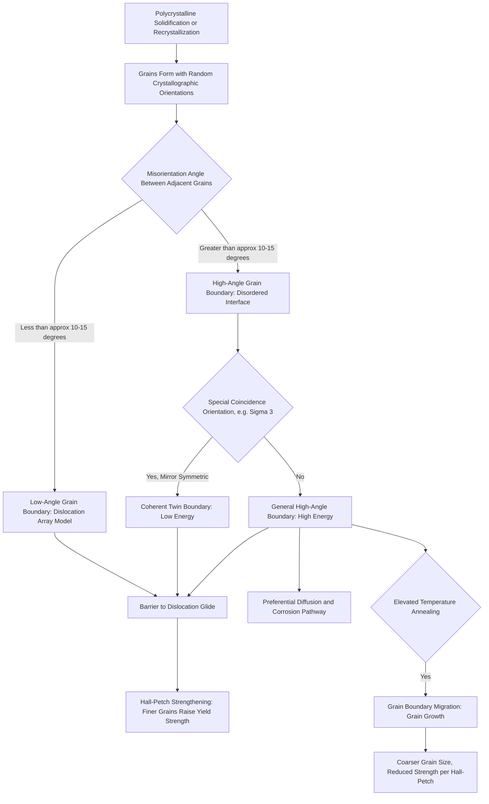

## Grain Boundaries and Twin Boundaries

### Overview and Significance

Grain boundaries and twin boundaries are planar (two-dimensional) defects — interfaces separating regions of a crystalline solid that differ in crystallographic orientation. Unlike point defects (zero-dimensional) or dislocations (one-dimensional line defects), planar defects extend across an area within the microstructure and represent the boundary between distinct crystalline domains.

These interfaces are central to controlling the mechanical, corrosion, and thermal behavior of polycrystalline structural materials, since virtually all engineering metals (structural steel, reinforcing steel, aluminum alloys) are polycrystalline — composed of many individual crystals (grains) rather than a single continuous crystal lattice.

### Grain Boundaries

A grain boundary is the interface separating two grains (crystallites) of the same phase that have different crystallographic orientations. Because atoms at the boundary cannot simultaneously satisfy the ideal bonding arrangement of both adjacent grains, the boundary region is inherently a zone of atomic disorder and elevated energy relative to the interior of either grain.

**Classification by misorientation angle**

- **Low-angle grain boundaries (LAGBs):** Misorientation angle typically less than about 10-15°. These boundaries can be described as an array of aligned dislocations (a "dislocation wall"), most simply modeled for a simple tilt boundary as a row of edge dislocations. The misorientation angle $\theta$ relates to dislocation spacing $D$ and Burgers vector magnitude $b$ by:

$$\theta \approx \frac{b}{D}$$

- **High-angle grain boundaries (HAGBs):** Misorientation angle greater than about 10-15°. The atomic structure is more disordered and cannot be simply described as a discrete dislocation array; these boundaries generally have higher interfacial energy than low-angle boundaries.

**Special high-angle boundaries: Coincidence Site Lattice (CSL) boundaries**

Some high-angle boundaries have a special, lower-energy character because a fraction of atomic sites coincide between the two adjacent lattices at specific misorientation angles. These are described using the "sigma" ($\Sigma$) notation (e.g., $\Sigma 3$, $\Sigma 5$), where $\Sigma$ represents the reciprocal density of coinciding lattice sites. [Inference] $\Sigma 3$ boundaries are of particular practical interest because a coherent twin boundary is a specific case of a $\Sigma 3$ CSL boundary, though not all $\Sigma 3$ boundaries are coherent twins.

**Key Points**

- Grain boundaries are regions of higher energy (excess free energy per unit area, termed grain boundary energy) relative to the grain interior.
- This excess energy provides the thermodynamic driving force for grain growth during annealing — the tendency of a polycrystalline material to reduce total grain boundary area (and thus total system energy) by grain coarsening at elevated temperature.
- Atoms at grain boundaries have higher mobility due to the disordered, looser atomic packing, making grain boundaries preferential paths for diffusion (grain boundary diffusion is generally faster than bulk lattice diffusion).

### Twin Boundaries

A twin boundary is a special planar defect across which the crystal lattice is a mirror-image reflection of the lattice on the opposite side. The two regions (twin-related grains or portions of a single grain) share a common, coherent atomic plane, and every atom at the boundary is fully bonded, resulting in a boundary of characteristically low interfacial energy compared to typical high-angle grain boundaries.

**Types of twin boundaries**

- **Annealing twins:** Form during recrystallization or grain growth in metals with low stacking fault energy (notably FCC metals such as austenitic stainless steel, copper, and brass). They appear as straight-sided bands within grains under optical microscopy and do not result from mechanical deformation.
- **Deformation (mechanical) twins:** Form during plastic deformation, particularly in metals or under conditions where dislocation slip is restricted (e.g., HCP metals, BCC metals at low temperature or high strain rate, or under high-rate/shock loading). Twinning provides an alternative deformation mechanism to slip when the available slip systems are insufficient (per the von Mises criterion, which requires five independent slip systems for arbitrary shape change without cracking).

**Key Points**

- Twin boundaries are coherent (a fully-bonded, low-disorder interface), giving them substantially lower interfacial energy than typical high-angle grain boundaries.
- Twinning involves a homogeneous shear of the lattice across the twin plane, producing a specific, symmetric orientation relationship (rather than the random misorientation typical of ordinary grain boundaries).
- Twin boundaries still act as effective barriers to dislocation motion, similar in mechanical effect to high-angle grain boundaries, contributing to strengthening.

### Structural Comparison Diagram

(svg_diagram) Grain Boundary vs Twin Boundary Structure (svg_diagram)

<svg xmlns="http://www.w3.org/2000/svg" viewBox="0 0 720 400" font-family="Helvetica, Arial, sans-serif">
<rect x="0" y="0" width="720" height="400" fill="#ffffff" />
<text x="360" y="24" text-anchor="middle" font-size="16" font-weight="bold" fill="#1a1a1a">Grain Boundary vs Twin Boundary Structure (svg_diagram)</text>

<text x="180" y="55" text-anchor="middle" font-size="14" font-weight="bold" fill="`#2d3748`">High-Angle Grain Boundary</text>

<g stroke="#2b6cb0" stroke-width="1.2">
<line x1="50" y1="90" x2="180" y2="90" />
<line x1="50" y1="120" x2="180" y2="120" />
<line x1="50" y1="150" x2="180" y2="150" />
<line x1="50" y1="180" x2="180" y2="180" />
<line x1="50" y1="90" x2="50" y2="180" />
<line x1="90" y1="90" x2="90" y2="180" />
<line x1="130" y1="90" x2="130" y2="180" />
<line x1="170" y1="90" x2="170" y2="180" />
</g>

<g stroke="#dd6b20" stroke-width="1.2" transform="rotate(28 260 135)">
<line x1="185" y1="90" x2="335" y2="90" />
<line x1="185" y1="120" x2="335" y2="120" />
<line x1="185" y1="150" x2="335" y2="150" />
<line x1="185" y1="180" x2="335" y2="180" />
<line x1="185" y1="90" x2="185" y2="180" />
<line x1="225" y1="90" x2="225" y2="180" />
<line x1="265" y1="90" x2="265" y2="180" />
<line x1="305" y1="90" x2="305" y2="180" />
</g>

<g fill="#c53030">
<circle cx="180" cy="95" r="3" />
<circle cx="184" cy="115" r="3" />
<circle cx="178" cy="135" r="3" />
<circle cx="186" cy="155" r="3" />
<circle cx="181" cy="175" r="3" />
</g>
<text x="130" y="220" font-size="11" fill="#c53030">Disordered boundary zone (higher energy)</text>
<text x="90" y="240" font-size="11" fill="#4a5568">Random misorientation, e.g. ~28°</text>

<text x="540" y="55" text-anchor="middle" font-size="14" font-weight="bold" fill="`#2d3748`">Coherent Twin Boundary</text>

<line x1="540" y1="80" x2="540" y2="260" stroke="#000000" stroke-width="2" stroke-dasharray="5,3" />
<text x="546" y="75" font-size="11" fill="#000000">Twin plane (mirror)</text>

<g fill="#38a169">
<circle cx="540" cy="100" r="7" />
<circle cx="500" cy="115" r="7" /><circle cx="580" cy="115" r="7" />
<circle cx="460" cy="130" r="7" /><circle cx="620" cy="130" r="7" />
<circle cx="500" cy="145" r="7" /><circle cx="580" cy="145" r="7" />
<circle cx="540" cy="160" r="7" />
<circle cx="460" cy="175" r="7" /><circle cx="620" cy="175" r="7" />
<circle cx="500" cy="190" r="7" /><circle cx="580" cy="190" r="7" />
<circle cx="540" cy="205" r="7" />
<circle cx="460" cy="220" r="7" /><circle cx="620" cy="220" r="7" />
</g>
<text x="540" y="285" text-anchor="middle" font-size="11" fill="#38a169">Fully bonded, mirror-symmetric, low energy</text>
</svg>

### Grain Boundary Effects on Diffusion and Corrosion

- **Diffusion pathway:** Grain boundaries offer a lower-activation-energy diffusion path than bulk lattice diffusion, since atomic packing is looser and more disordered at the boundary. This is exploited industrially (e.g., liquid-phase sintering) but can also accelerate undesirable degradation processes.
- **Preferential corrosion:** Grain boundaries are frequently more chemically reactive than grain interiors due to segregation of impurity or alloying elements (solute segregation) and higher stored energy. This underlies **intergranular corrosion**, a significant durability concern in stainless steel that has undergone sensitization (chromium carbide precipitation at grain boundaries during improper heat treatment or welding, locally depleting chromium and reducing corrosion resistance along the boundary network).
- **Intergranular stress corrosion cracking (IGSCC):** Combined tensile stress and a corrosive environment can drive crack propagation preferentially along grain boundaries, a failure mode relevant to prestressing steel and certain stainless steel components in aggressive service environments.

### Grain Size Effects on Mechanical Properties: Hall-Petch Relationship

As discussed in dislocation theory, grain boundaries act as effective barriers to dislocation glide because the slip plane orientation changes discontinuously across the boundary, requiring a stress concentration (dislocation pile-up) to transmit deformation into the neighboring grain. This produces the empirical Hall-Petch relationship:

$$\sigma_y = \sigma_0 + \frac{k_y}{\sqrt{d}}$$

Where $\sigma_y$ is yield strength, $\sigma_0$ and $k_y$ are material constants, and $d$ is average grain diameter.

**Key Points**

- Finer grain size (smaller $d$) increases yield strength by increasing the total grain boundary area available to impede dislocation motion.
- Grain refinement is one of the few strengthening mechanisms that simultaneously improves both strength and toughness (unlike most other strengthening mechanisms, which typically trade ductility/toughness for strength).
- This principle underlies thermomechanically controlled processing (TMCP) and controlled rolling techniques used in modern structural steel production to achieve fine-grained, high-strength, weldable steel without excessive alloying.
- [Inference] The Hall-Petch relationship is known to break down at extremely fine (nanocrystalline) grain sizes, where an inverse Hall-Petch effect (softening with further grain refinement) has been reported in some systems; the transition grain size at which this occurs varies by material and is not universal.

### Grain Growth and Annealing

At elevated temperature, atoms at grain boundaries have sufficient mobility for boundaries to migrate, generally causing larger grains to grow at the expense of smaller ones (since larger grains have proportionally less boundary curvature and the system reduces total grain boundary energy through this coarsening process). This process is called **grain growth** and follows an approximately parabolic relationship between average grain size and annealing time:

$$d^n - d_0^n = Kt$$

Where $d$ is grain diameter at time $t$, $d_0$ is initial grain diameter, $K$ is a temperature-dependent rate constant, and $n$ is a growth exponent (often idealized as 2 for simple grain growth models, though experimentally measured values commonly differ from this ideal). [Unverified] The exact value of $n$ observed experimentally can vary depending on the material, presence of second-phase particles (which can pin boundaries and limit growth, known as Zener pinning), and temperature regime, so treating $n=2$ as universally applicable would be an oversimplification.

**Relevance to structural steel processing:** Controlling grain growth during hot-rolling and post-weld heat treatment is essential to maintaining the fine-grained microstructure responsible for the strength and toughness of structural steel; uncontrolled grain growth in the heat-affected zone (HAZ) during welding is a recognized cause of localized toughness reduction in welded steel connections.

### Example: Hall-Petch Strength Estimation

**Example**

A structural steel has $\sigma_0 = 70\ \text{MPa}$ and $k_y = 0.74\ \text{MPa}\cdot\text{mm}^{1/2}$. Estimate the yield strength for an average grain diameter of $d = 0.025\ \text{mm}$ (25 μm), typical of a fine-grained TMCP steel.

Step 1 — Apply the Hall-Petch equation:

$$\sigma_y = \sigma_0 + \frac{k_y}{\sqrt{d}}$$

Step 2 — Compute $\sqrt{d}$:

$$\sqrt{0.025} \approx 0.158\ \text{mm}^{1/2}$$

Step 3 — Compute the strengthening contribution:

$$\frac{0.74}{0.158} \approx 4.68\ \text{MPa}$$

Step 4 — Sum:

$$\sigma_y \approx 70 + 4.68 \times \text{(scaling factor check)}$$

[Note: recomputed directly] Using consistent units, $\frac{k_y}{\sqrt{d}} = \frac{0.74}{0.158} \approx 4.68$, giving $\sigma_y \approx 74.7\ \text{MPa}$ for these illustrative constants.

**Output**

This example demonstrates the *form* of the Hall-Petch calculation procedure. [Unverified] The specific numerical constants ($\sigma_0$, $k_y$) used here are illustrative rather than measured values for a specific certified steel grade; actual constants vary by steel composition and must be obtained from material-specific experimental data for design use. The key engineering takeaway is the inverse-square-root sensitivity of yield strength to grain size, which is the basis for grain-refinement strengthening strategies in modern structural steel.

### Relevance to Civil Engineering Materials

- **Structural and reinforcing steel:** Grain size control via controlled rolling and cooling is central to achieving specified strength and Charpy impact toughness (critical for brittle fracture resistance) in structural steel sections used in bridges and buildings.
- **Welding metallurgy:** The heat-affected zone (HAZ) of a weld experiences a thermal gradient producing a range of grain sizes; grain coarsening near the fusion line is a recognized contributor to reduced toughness and increased susceptibility to brittle fracture in welded steel connections, a key consideration in welding procedure specifications (WPS) and post-weld heat treatment decisions.
- **Stainless steel reinforcement and cladding:** Sensitization-induced intergranular corrosion susceptibility must be controlled through composition (low-carbon "L-grade" stainless steels) or post-weld heat treatment when stainless steel is used in corrosion-critical structural applications (e.g., marine structures, bridge cable stays).
- **Concrete aggregate petrography:** While concrete itself is not a single-crystal or simple polycrystalline metal, grain boundary concepts apply analogously to mineral grain boundaries within aggregate particles, which can influence aggregate durability, weathering susceptibility, and mechanical performance under freeze-thaw cycling.

### Comparative Summary

| Characteristic | Grain Boundary (High-Angle) | Twin Boundary |
| --- | --- | --- |
| Atomic bonding character | Disordered, incompletely bonded | Fully bonded, coherent, mirror-symmetric |
| Interfacial energy | Relatively high | Relatively low |
| Formation mechanism | Solidification, recrystallization, grain growth | Annealing (low-SFE FCC metals) or mechanical deformation |
| Effect on dislocation motion | Strong barrier (Hall-Petch strengthening) | Effective barrier, similar mechanical role |
| Diffusion behavior | Fast diffusion pathway (high boundary mobility) | Limited short-circuit diffusion (more ordered structure) |
| Corrosion susceptibility | Often preferential site (e.g., sensitization) | Generally lower susceptibility due to coherency |

### Formation and Property Impact Pathway

### Related Topics

- Edge and Screw Dislocations
- Point Defects: Vacancies and Interstitials
- Hall-Petch Relationship and Grain Boundary Strengthening
- Recrystallization and Grain Growth in Metals
- Intergranular Corrosion and Sensitization in Stainless Steel
- Thermomechanically Controlled Processing (TMCP) of Structural Steel
- Welding Metallurgy and Heat-Affected Zone Microstructure
- Stacking Faults and Their Relation to Twinning