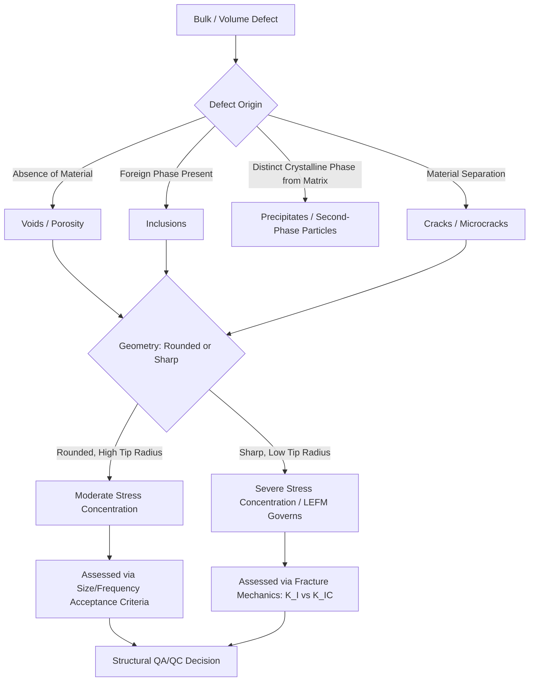

## Bulk and Volume Defects

### Overview and Classification

Bulk (volume) defects are three-dimensional imperfections in a crystalline solid, distinguished from point defects (0-D), line defects/dislocations (1-D), and planar defects (2-D) by the fact that they occupy a finite volume within the microstructure. These defects are typically larger in scale than the other defect categories and are often visible using conventional optical microscopy, whereas point and line defects generally require electron microscopy or diffraction-based techniques for direct observation.

Bulk defects are of major practical importance in civil engineering materials because they are frequently the dominant factor controlling macroscopic mechanical performance, fracture behavior, and durability — often exerting greater influence on structural reliability than the atomic-scale defects discussed in earlier topics.

### Categories of Bulk Defects

**Voids and porosity**

Voids are three-dimensional regions within a material lacking solid material — essentially macroscopic vacancy clusters or gas/shrinkage cavities.

- **Gas porosity:** Entrapped gas bubbles formed during solidification (common in castings) or during concrete placement (entrapped or intentionally entrained air).
- **Shrinkage porosity:** Voids formed due to volumetric contraction during solidification, when liquid feed metal cannot reach the last-to-solidify regions of a casting.
- **Sintering porosity:** Residual porosity remaining after powder metallurgy or ceramic sintering processes, when full densification is not achieved.

**Inclusions**

Inclusions are foreign, non-metallic (or otherwise distinct-phase) particles embedded within the bulk material, either intentionally introduced or an unavoidable byproduct of processing.

- **Exogenous inclusions:** Foreign material introduced from external sources during processing (e.g., refractory fragments, slag entrapped during steelmaking).
- **Endogenous inclusions:** Formed by chemical reactions within the melt itself during processing (e.g., oxide or sulfide inclusions formed from residual oxygen/sulfur reacting with alloying elements in molten steel).

**Precipitates and second-phase particles**

Precipitates are volumetric regions of a distinct crystalline phase that forms within a parent matrix, typically as a result of exceeding a solubility limit (as discussed under solid solutions) followed by nucleation and growth.

- Coherent, semi-coherent, or incoherent precipitates, depending on the degree of lattice matching with the surrounding matrix at the precipitate-matrix interface.
- Precipitates can be intentionally engineered (e.g., precipitation hardening in aluminum alloys) or can form as an undesirable consequence of thermal exposure (e.g., chromium carbide precipitation at grain boundaries during sensitization of stainless steel).

**Cracks and microcracks**

Cracks are volumetric discontinuities representing a physical separation of material, distinguished from voids in that they typically have a high aspect ratio (much longer/wider than they are thick) and are often associated with a stress concentration at the crack tip.

- Pre-existing microcracks may originate from processing (e.g., hydrogen-induced cracking in steel, drying shrinkage microcracking in concrete) or from prior service loading (fatigue microcracks).

**Foreign-phase regions and slag/inclusion clusters**

In welded and cast structural components, clusters of non-metallic inclusions or entrapped slag can form larger, irregular bulk defect regions, particularly at weld fusion boundaries or in incompletely fused weld passes.

**Key Points**

- Bulk defects generally act as stress concentrators, since the local geometry (particularly for cracks and irregular inclusions) produces localized stress amplification well above the nominal applied stress.
- The degree of detriment depends strongly on defect geometry (sharp/angular defects are far more damaging than smooth/spherical defects of similar size), size, location (surface versus interior), and orientation relative to the principal stress direction.
- Bulk defects are the primary subject of nondestructive testing (NDT) and fracture mechanics-based structural assessment in civil and structural engineering practice.

### Stress Concentration Around Bulk Defects

For an elliptical flaw (a simplified model for many void, inclusion, or crack-like defects) in an infinite plate under remote tensile stress, the maximum stress at the flaw tip is approximated by:

$$\sigma_{\max} = \sigma_0 \left(1 + 2\sqrt{\frac{a}{\rho_t}}\right)$$

Where:

- $\sigma_0$ = remotely applied (nominal) stress
- $a$ = half-length of the flaw (measured perpendicular to the loading direction for an internal flaw)
- $\rho_t$ = radius of curvature at the flaw tip

**Key Points**

- As the tip radius $\rho_t$ approaches zero (an idealized sharp crack), $\sigma_{\max}$ approaches infinity in this linear-elastic model — this is the mathematical basis for why fracture mechanics (rather than simple stress concentration factors) is required to analyze sharp cracks.
- Spherical or rounded voids (large $\rho_t$ relative to $a$) produce comparatively modest stress concentration, whereas elongated, sharp-tipped defects (e.g., slag inclusion stringers, microcracks) are disproportionately more damaging for a given defect volume.
- This relationship is the fundamental reason why weld defect acceptance criteria in structural codes (e.g., AWS D1.1) differentiate strictly between rounded porosity (generally more tolerable, subject to size/frequency limits) and planar/crack-like defects such as lack of fusion or slag inclusions with sharp geometry (generally subject to much stricter or zero-tolerance acceptance criteria).

### Structural Illustration

(svg_diagram) Bulk Defect Types and Stress Concentration (svg_diagram)

<svg xmlns="http://www.w3.org/2000/svg" viewBox="0 0 720 400" font-family="Helvetica, Arial, sans-serif">
<rect x="0" y="0" width="720" height="400" fill="#ffffff" />
<text x="360" y="24" text-anchor="middle" font-size="16" font-weight="bold" fill="#1a1a1a">Bulk Defect Types and Stress Concentration (svg_diagram)</text>

<text x="120" y="55" text-anchor="middle" font-size="13" font-weight="bold" fill="`#2d3748`">Rounded Void</text>

<rect x="40" y="70" width="160" height="140" fill="`#f7fafc`" stroke="`#cbd5e0`" stroke-width="1" />

<circle cx="120" cy="140" r="28" fill="`#ffffff`" stroke="`#2b6cb0`" stroke-width="2" />

<line x1="120" y1="70" x2="120" y2="55" stroke="`#c53030`" stroke-width="1.5" marker-end="url(#a1)" />

<line x1="120" y1="225" x2="120" y2="240" stroke="`#c53030`" stroke-width="1.5" />

<text x="120" y="240" font-size="10" fill="`#4a5568`" text-anchor="middle">Low stress concentration</text>

<text x="360" y="55" text-anchor="middle" font-size="13" font-weight="bold" fill="`#2d3748`">Angular Inclusion</text>

<rect x="280" y="70" width="160" height="140" fill="`#f7fafc`" stroke="`#cbd5e0`" stroke-width="1" />

<polygon points="360,120 385,140 375,165 345,165 335,140" fill="`#dd6b20`" stroke="`#9c4221`" stroke-width="1.5" />

<text x="360" y="240" font-size="10" fill="`#4a5568`" text-anchor="middle">Moderate stress concentration</text>

<text x="600" y="55" text-anchor="middle" font-size="13" font-weight="bold" fill="`#2d3748`">Sharp Crack</text>

<rect x="520" y="70" width="160" height="140" fill="`#f7fafc`" stroke="`#cbd5e0`" stroke-width="1" />

<line x1="560" y1="140" x2="640" y2="140" stroke="`#c53030`" stroke-width="3" />

<path d="M 636 136 L 645 140 L 636 144 Z" fill="`#c53030`" />

<text x="600" y="240" font-size="10" fill="`#4a5568`" text-anchor="middle">High stress concentration at tip</text>

<text x="360" y="290" text-anchor="middle" font-size="12" fill="`#1a1a1a`" font-weight="bold">σmax = σ0 (1 + 2√(a/ρt))</text>

<text x="360" y="312" text-anchor="middle" font-size="11" fill="`#4a5568`">Smaller tip radius ρt produces disproportionately higher local stress</text>

</svg>

### Bulk Defects in Metallic Structural Materials

**Weld defects**

Welding is a primary source of bulk defects in fabricated steel structures. Common weld bulk defects include:

- **Porosity:** Gas entrapment (often hydrogen, nitrogen, or shielding gas contamination) forming rounded voids within the weld metal.
- **Slag inclusions:** Non-metallic slag entrapped between weld passes, typically elongated and irregular.
- **Lack of fusion / incomplete penetration:** Planar, crack-like discontinuities where the weld metal fails to fully bond with the base metal or a preceding weld pass — among the most damaging weld defect types due to their sharp geometry and orientation, often perpendicular to the primary stress direction.
- **Hydrogen-induced cracking (cold cracking):** Delayed cracking in the heat-affected zone driven by diffusible hydrogen, residual stress, and susceptible (hard, brittle) microstructure — a critical concern in high-strength structural steel welding requiring preheat and controlled hydrogen practices.

**Casting defects**

Relevant to cast structural components (e.g., cast steel connectors, cast iron historically used in some structures):

- Shrinkage porosity, gas porosity, cold shuts (incomplete fusion of separately solidifying metal fronts), and inclusion entrapment from mold material or slag.

**Nonmetallic inclusions in wrought steel**

Rolled and forged structural steel products contain residual nonmetallic inclusions (oxides, sulfides, silicates) from the steelmaking process. Elongated inclusions (stretched during hot rolling) create anisotropic mechanical properties — notably reduced through-thickness ductility and toughness, a phenomenon termed **lamellar tearing** risk in thick welded steel connections subjected to through-thickness tensile strain during welding shrinkage.

### Bulk Defects in Concrete

Concrete, as a composite and inherently heterogeneous material, exhibits bulk defects that are often more consequential to performance than in metals, given concrete's brittle nature and comparatively low tensile strength.

- **Entrapped air voids:** Unintentional air pockets from inadequate consolidation (vibration) during placement, reducing strength and increasing permeability.
- **Entrained air voids:** Intentionally introduced spherical microscopic voids (via air-entraining admixtures) to provide relief space for freeze-thaw expansion of pore water — a deliberately engineered bulk "defect" that improves durability despite a modest strength reduction, illustrating that not all bulk defects are unintentional or purely detrimental.
- **Honeycombing:** Large-scale voids from inadequate consolidation around congested reinforcement or at formwork boundaries, a significant durability and structural concern since it exposes reinforcement to a direct ingress path for moisture and chlorides.
- **Microcracking:** Pre-existing microcracks from drying shrinkage, thermal gradients, or aggregate-paste interfacial transition zone (ITZ) weakness, which is understood to be a primary reason why concrete's measured tensile strength is far below the theoretical cohesive strength of the hydrated cement paste.
- **Aggregate-related inclusions:** Deleterious aggregate particles (e.g., clay lumps, friable particles, or reactive silica minerals) act as localized volumetric weak points or reaction sites (relevant to alkali-silica reaction, discussed under XRD applications).

### Detection and Characterization Methods

**Key Points**

- **Nondestructive testing (NDT):** Radiography (X-ray/gamma-ray), ultrasonic testing (UT), magnetic particle testing (MT, for surface/near-surface defects in ferromagnetic materials), and dye penetrant testing (PT, for surface-breaking defects) are standard methods for detecting bulk defects in fabricated steel structures and welds.
- **Optical and electron microscopy:** Metallographic sectioning combined with optical or scanning electron microscopy (SEM) allows direct visual characterization of inclusion morphology, porosity distribution, and precipitate structure.
- **Density and porosity measurement:** Comparison of bulk (measured) density against theoretical density provides a quantitative estimate of overall porosity content, analogous to the vacancy-concentration-via-density method discussed for point defects, but operating at a much coarser volumetric scale.
- **Ground-penetrating radar and impact-echo:** Used specifically in concrete structural assessment to detect internal voids, delamination, and honeycombing without destructive coring.

### Fracture Mechanics Perspective

For sharp, crack-like bulk defects, linear elastic fracture mechanics (LEFM) provides the governing framework rather than simple stress concentration factors, since the stress concentration approach becomes mathematically singular (and physically inapplicable) as tip radius approaches zero. The stress intensity factor is:

$$K_I = Y\sigma\sqrt{\pi a}$$

Where $K_I$ is the mode-I stress intensity factor, $Y$ is a geometry-dependent dimensionless factor, $\sigma$ is applied stress, and $a$ is crack half-length (or full length for an edge crack, depending on convention). Fracture occurs when $K_I$ reaches the material's fracture toughness, $K_{IC}$.

**Key Points**

- This framework governs brittle fracture assessment of structural steel containing crack-like weld defects, a central concern in fracture-critical structural design (e.g., AASHTO fracture control plans for bridge steel).
- [Inference] The applicability of LEFM assumes predominantly elastic behavior at the crack tip (small-scale yielding); for highly ductile structural steels at typical service temperatures, elastic-plastic fracture mechanics approaches (e.g., J-integral or CTOD methods) may be more appropriate than strict LEFM, depending on the specific toughness and loading conditions involved.

### Example: Comparing Defect Severity

**Example**

A structural steel plate contains two internal defects of similar cross-sectional area: (1) a spherical gas pore with radius of curvature $\rho_t \approx 0.5\ \text{mm}$ and half-length $a = 0.5\ \text{mm}$, and (2) a planar slag inclusion behaving as a sharp crack with the same half-length $a = 0.5\ \text{mm}$ but effective tip radius $\rho_t \approx 0.01\ \text{mm}$. Compare relative stress concentration.

Step 1 — Spherical pore (approximately circular, so $a \approx \rho_t$):

$$\sigma_{\max} = \sigma_0\left(1 + 2\sqrt{\frac{0.5}{0.5}}\right) = \sigma_0(1+2) = 3\sigma_0$$

Step 2 — Sharp slag inclusion:

$$\sigma_{\max} = \sigma_0\left(1 + 2\sqrt{\frac{0.5}{0.01}}\right) = \sigma_0(1 + 2\sqrt{50}) \approx \sigma_0(1 + 14.14) \approx 15.1\sigma_0$$

**Output**

For the same nominal defect size, the sharp planar inclusion produces roughly five times greater local stress concentration than the rounded pore (approximately $15.1\sigma_0$ versus $3\sigma_0$). This quantitatively illustrates why weld inspection acceptance criteria treat rounded porosity far more leniently than planar, crack-like discontinuities of similar nominal size — the geometry, not just the volume, of a bulk defect governs its structural severity.

### Relevance to Civil Engineering Practice

- **Structural steel fabrication QA/QC:** Weld inspection acceptance criteria (AWS D1.1, ASME codes) are directly informed by the differential severity of rounded versus planar bulk defects.
- **Fracture-critical member design:** Bridges and other structures with fracture-critical members require enhanced NDT inspection and material toughness specifications (e.g., Charpy V-notch requirements) specifically to manage the risk posed by undetected bulk defects.
- **Concrete durability and service life:** Honeycombing, inadequate consolidation, and microcracking are leading causes of premature reinforcement corrosion and reduced service life in reinforced concrete structures, making proper placement and consolidation practice a critical quality control issue on-site.
- **Precast and prestressed concrete quality control:** Void and porosity limits in grout used for post-tensioning ducts are a specific durability concern, since voids can create direct pathways for moisture and chloride ingress to prestressing steel, risking localized corrosion and loss of prestress force.

### Bulk Defect Classification Pathway

### Related Topics

- Point Defects: Vacancies and Interstitials
- Grain Boundaries and Twin Boundaries
- Fracture Mechanics: Stress Intensity Factor and Fracture Toughness
- Weld Defects and Nondestructive Testing Methods
- Alkali-Silica Reaction Mechanisms in Concrete
- Air Entrainment and Freeze-Thaw Durability of Concrete
- Lamellar Tearing in Welded Steel Connections
- Precipitation Hardening and Second-Phase Particle Strengthening