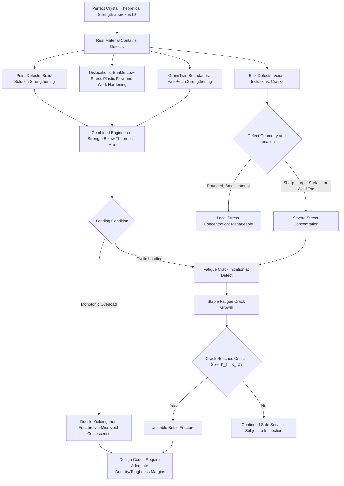

## Role of Defects in Strength and Failure

### Overview and Unifying Principle

This topic synthesizes the preceding defect categories — point defects, dislocations, grain/twin boundaries, and bulk/volume defects — into a unified framework explaining how crystalline imperfections govern both the strengthening and the failure of engineering materials. The central paradox of defect engineering is that defects are simultaneously the **mechanism of strengthening** (via controlled introduction and management of defects) and the **origin of failure** (via uncontrolled defects acting as stress concentrators or crack initiation sites). Materials engineering is, in large part, the deliberate manipulation of defect populations to maximize the former while minimizing the latter.

This duality is directly relevant to civil engineering practice, where structural material specifications, fabrication quality control, and design codes are fundamentally exercises in defect management.

### The Theoretical vs. Actual Strength Gap

The theoretical cohesive strength of a crystalline solid, estimated from interatomic bonding energy and lattice spacing, is approximately:

$$\sigma_{\text{theoretical}} \approx \frac{E}{10}$$

Where $E$ is the material's elastic (Young's) modulus. This approximation arises from modeling interatomic bonds as springs and calculating the stress required to simultaneously break all bonds across a crystallographic plane.

**Key Points**

- Real engineering materials typically fail or yield at stresses that are one to three orders of magnitude below this theoretical estimate.
- This discrepancy is resolved entirely by the presence of defects: dislocations dramatically lower the stress needed for plastic deformation (as discussed under Edge and Screw Dislocations), while pre-existing flaws (cracks, inclusions, voids) dramatically lower the stress needed for fracture, particularly in brittle materials.
- [Inference] The specific numerical gap between theoretical and actual strength varies substantially by material class — ductile metals typically fail via dislocation-mediated yielding at stresses far below theoretical, while brittle materials (ceramics, glass, unreinforced concrete) fail via flaw-driven fracture, often at an even larger fractional gap from theoretical strength, particularly in tension.

### Defects as the Mechanism of Strengthening

Each defect category discussed previously contributes to a specific strengthening mechanism, all sharing the common principle that defects impede dislocation motion, thereby raising the stress required for continued plastic deformation:

| Defect Type | Strengthening Mechanism | Governing Relationship |
| --- | --- | --- |
| Point defects (solutes) | Solid-solution strengthening | Strain field interaction with dislocations |
| Dislocations (increased density) | Strain (work) hardening | $\tau_y = \tau_0 + \alpha G b \sqrt{\rho}$ |
| Grain boundaries | Grain boundary (Hall-Petch) strengthening | $\sigma_y = \sigma_0 + k_y/\sqrt{d}$ |
| Precipitates/second-phase particles | Precipitation (dispersion) strengthening | Orowan looping / particle cutting mechanisms |

**Key Points**

- These mechanisms are generally additive to a first approximation (though interaction effects and diminishing returns occur at high combined defect densities), meaning real structural alloys typically achieve strength through simultaneous, deliberately engineered contributions from multiple defect categories.
- A critical engineering trade-off exists: most strengthening mechanisms that operate by impeding dislocation motion also tend to reduce ductility and fracture toughness, since restricting dislocation mobility limits the material's capacity to blunt crack tips via local plastic deformation. Grain refinement is a notable exception, generally improving both strength and toughness simultaneously (as discussed under Grain Boundaries).
- This strength-ductility-toughness trade-off is a central consideration in structural steel grade selection, since structural design codes require adequate ductility and toughness (not just strength) to ensure ductile, warning-before-failure behavior and resistance to brittle fracture.

### Defects as the Mechanism of Failure

**Ductile failure (dislocation-dominated)**

In ductile materials, failure typically proceeds through progressive dislocation activity leading to microvoid nucleation (often at inclusions or second-phase particles acting as internal stress concentrators), microvoid growth and coalescence, and eventual ductile fracture — characterized macroscopically by necking and a fibrous, "cup-and-cone" fracture surface. Bulk defects (inclusions) are frequently the actual nucleation sites for these microvoids, linking bulk defects directly to the micromechanics of ductile fracture even in otherwise defect-tolerant ductile metals.

**Brittle failure (flaw-dominated)**

In brittle or brittle-behaving materials (ceramics, glass, unreinforced concrete, and steel under conditions promoting brittle behavior such as low temperature, high strain rate, or triaxial stress states), failure is governed by rapid, unstable propagation of a pre-existing flaw once the applied stress intensity reaches the material's fracture toughness, per the Griffith/LEFM framework discussed under Bulk and Volume Defects:

$$K_I = Y\sigma\sqrt{\pi a} \geq K_{IC}$$

**Key Points**

- Brittle fracture is fundamentally flaw-size-controlled: since flaw populations in real materials are statistically distributed rather than uniform, brittle material strength exhibits significant statistical scatter, commonly described using Weibull statistics rather than a single deterministic strength value.
- This is a primary reason unreinforced concrete has a design tensile strength far below its compressive strength and is generally not relied upon to resist significant tensile stress in structural design — its brittle, flaw-dominated tensile failure mode is unreliable and provides little to no warning before failure.
- Fatigue failure represents an important intermediate case: cyclic loading causes progressive, stable crack growth from an initiating defect (often a bulk defect, weld toe stress concentration, or surface flaw) over many load cycles, eventually reaching a critical crack size at which unstable (brittle-like) fracture occurs, even in materials that are otherwise ductile under monotonic loading.

### Ductile-to-Brittle Transition

Body-centered cubic (BCC) metals, including most structural carbon and low-alloy steels, exhibit a **ductile-to-brittle transition temperature (DBTT)** — a temperature range across which fracture behavior shifts from predominantly ductile (high energy absorption, shear fracture) at higher temperature to predominantly brittle (low energy absorption, cleavage fracture) at lower temperature. This behavior is closely tied to the temperature-dependent mobility of dislocations in BCC crystal structures (unlike FCC metals, which generally do not exhibit a pronounced DBTT and remain ductile to very low temperatures).

**Key Points**

- The DBTT is typically characterized experimentally using Charpy V-notch impact testing, which measures absorbed energy across a range of test temperatures, producing a characteristic S-shaped transition curve.
- DBTT is directly influenced by grain size (finer grain size generally lowers/improves the DBTT, consistent with the dual strength-and-toughness benefit of grain refinement noted above), alloying composition, and the presence of stress concentrators (notches, welds, bulk defects).
- Structural steel specifications for applications involving low-temperature service or high consequence of failure (e.g., bridges in cold climates, fracture-critical members) commonly include minimum Charpy impact energy requirements at specified test temperatures specifically to manage DBTT-related brittle fracture risk.
- [Inference] The specific DBTT value for a given steel depends on composition, grain size, and prior thermomechanical processing, so it cannot be assumed to be identical across different steel grades even within the same general structural steel classification.

### Structural Illustration: Strength vs. Toughness Trade-off

(svg_diagram) Defect Density vs Strength and Toughness Trade-off (svg_diagram)

<svg xmlns="http://www.w3.org/2000/svg" viewBox="0 0 680 400" font-family="Helvetica, Arial, sans-serif">
<rect x="0" y="0" width="680" height="400" fill="#ffffff" />
<text x="340" y="24" text-anchor="middle" font-size="16" font-weight="bold" fill="#1a1a1a">Defect Density vs Strength and Toughness Trade-off (svg_diagram)</text>

<line x1="80" y1="340" x2="620" y2="340" stroke="#2d3748" stroke-width="1.5" />
<line x1="80" y1="340" x2="80" y2="60" stroke="#2d3748" stroke-width="1.5" />
<text x="350" y="375" text-anchor="middle" font-size="12" fill="#2d3748">Increasing Dislocation-Impeding Defect Density (solutes, precipitates, cold work)</text>
<text x="35" y="200" font-size="12" fill="#2d3748" transform="rotate(-90 35 200)">Property Magnitude</text>

<path d="M 90 320 Q 300 220 610 90" fill="none" stroke="#c53030" stroke-width="2.5" />
<text x="500" y="105" font-size="12" fill="#c53030" font-weight="bold">Strength</text>

<path d="M 90 100 Q 300 200 610 320" fill="none" stroke="#2b6cb0" stroke-width="2.5" />
<text x="500" y="335" font-size="12" fill="#2b6cb0" font-weight="bold">Toughness / Ductility</text>

<circle cx="200" cy="240" r="6" fill="#38a169" />
<line x1="200" y1="240" x2="200" y2="160" stroke="#38a169" stroke-width="1" stroke-dasharray="3,2" />
<circle cx="200" cy="160" r="6" fill="#38a169" />
<text x="210" y="150" font-size="11" fill="#38a169">Grain refinement: exception,</text>
<text x="210" y="165" font-size="11" fill="#38a169">raises both simultaneously</text>
</svg>

### Example: Comparing Failure Modes Under a Common Load Case

**Example**

A steel bridge girder flange contains a small, undetected slag inclusion at a weld toe. Under repeated traffic loading, describe the likely progression of defect-driven failure.

Step 1 — Initial state: The slag inclusion acts as a stress concentrator (per the elliptical flaw model discussed under Bulk and Volume Defects), locally elevating stress above the nominal applied stress even though the nominal stress remains well below the material's static yield strength.

Step 2 — Fatigue crack initiation: Under cyclic traffic loading, localized plastic strain accumulates at the inclusion tip over repeated cycles, nucleating a fatigue crack — a process governed by fatigue crack initiation mechanisms related to persistent slip band formation (dislocation substructure evolution) at the defect site.

Step 3 — Stable fatigue crack growth: The crack propagates incrementally with each load cycle, often following a Paris' Law type relationship between crack growth rate and the stress intensity factor range, $\Delta K$.

Step 4 — Critical crack size and unstable fracture: Once the growing crack reaches a size at which $K_I$ reaches $K_{IC}$ (or the material's toughness at the ambient service temperature, especially relevant if service temperature is near the DBTT), rapid, unstable brittle-like fracture occurs — potentially with little advance warning despite the underlying material being nominally ductile under static loading.

**Output**

This progression illustrates why fracture-critical structural design and inspection protocols emphasize (a) minimizing initial bulk defects via weld quality control, (b) periodic inspection to detect fatigue cracks before they reach critical size, and (c) specifying adequate material toughness (via Charpy testing) to ensure that even if a crack is present, the critical crack size at service temperature remains large enough to be reliably detected before catastrophic failure — a design philosophy often termed "fail-safe" or "damage-tolerant" design.

### Design and Code Implications in Civil Engineering

**Key Points**

- **Material specification:** Structural steel specifications (e.g., ASTM A709 for bridge steel) specify not only strength but also minimum elongation (ductility) and, for fracture-critical applications, minimum Charpy V-notch toughness at specified test temperatures — a direct application of managing the strength-toughness-defect relationship.
- **Fabrication quality control:** Weld inspection criteria (AWS D1.1, discussed under Bulk and Volume Defects) exist specifically to limit the size and severity of bulk defects introduced during fabrication, since these defects serve as the initiation sites for both immediate brittle fracture risk and long-term fatigue failure.
- **Fatigue design categories:** Design codes (e.g., AASHTO, AISC) classify structural details into fatigue categories based on the severity of inherent stress concentrations (geometric and defect-related) at that detail, directly reflecting the role of defects (including weld toe geometry, itself a stress-concentrating "defect" in the broad sense) in fatigue life.
- **Concrete reinforcement design philosophy:** Reinforced concrete design deliberately avoids relying on concrete's unreliable, flaw-dominated tensile strength, instead using steel reinforcement (a ductile, dislocation-mediated material) to carry tensile stresses, converting an inherently brittle failure mode (unreinforced concrete cracking) into a ductile, warning-before-failure system (yielding reinforcement) at the structural level.
- **Nondestructive testing and inspection intervals:** Because fatigue crack growth from an initiating defect is a time/cycle-dependent, statistically variable process, inspection intervals for fracture-critical members are set based on calculated or assumed crack growth rates to ensure detection before a crack reaches critical size.

### Comparative Summary: Defect Roles Across Failure Modes

| Failure Mode | Dominant Defect Type Involved | Governing Framework | Typical Warning Behavior |
| --- | --- | --- | --- |
| Ductile overload (yielding) | Dislocations, solutes, grain boundaries | Yield criteria, Hall-Petch, work hardening | Significant plastic deformation before failure (good warning) |
| Ductile fracture (necking/void coalescence) | Inclusions, second-phase particles | Microvoid nucleation and growth | Visible necking/deformation (moderate warning) |
| Brittle fracture | Cracks, sharp inclusions, weld defects | Linear elastic fracture mechanics ($K_I$ vs $K_{IC}$) | Little to no warning (sudden failure) |
| Fatigue failure | Surface flaws, weld toes, bulk defects (initiation); crack (propagation) | Paris' Law, S-N curves, fracture mechanics | Often little visible warning until near-final failure |
| Brittle tensile failure of plain concrete | Microcracks, ITZ flaws, aggregate defects | Statistical (Weibull-type) flaw distribution | Little warning (addressed via reinforcement design philosophy) |

### Synthesis Pathway: From Atomic Defects to Structural Failure

### Related Topics

- Point Defects: Vacancies and Interstitials
- Edge and Screw Dislocations
- Grain Boundaries and Twin Boundaries
- Bulk and Volume Defects
- Fracture Mechanics: Stress Intensity Factor and Fracture Toughness
- Ductile-to-Brittle Transition and Charpy Impact Testing
- Fatigue Failure Mechanisms and S-N Curves
- Weibull Statistics for Brittle Material Strength