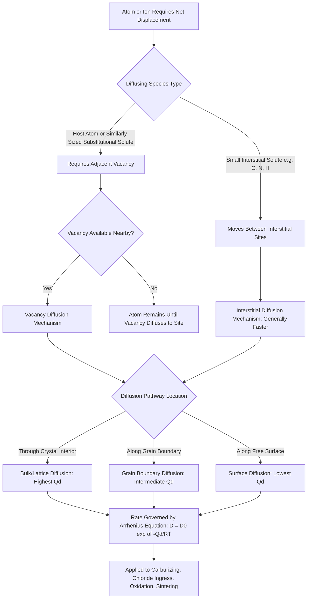

## Diffusion Mechanisms

### Overview and Definition

Diffusion is the process by which atoms, ions, or molecules migrate within a material due to random thermally activated motion, generally resulting in net mass transport from regions of higher concentration to regions of lower concentration (down a concentration gradient). Diffusion is a thermally activated process — its rate increases exponentially with temperature — and it is the fundamental mechanism underlying a wide range of materials processes: heat treatment of steel, sintering, oxidation, creep deformation, and many corrosion and degradation processes relevant to civil infrastructure.

Diffusion requires atomic-scale defects (primarily vacancies and interstitial sites, as discussed under Point Defects) to occur, since atoms cannot move through a perfect, fully-occupied lattice without an available site to move into.

### Types of Diffusion by Path

**Bulk (volume/lattice) diffusion**

Atomic movement through the interior of the crystal lattice, via the point-defect-mediated mechanisms described below. This is generally the slowest diffusion pathway because it requires the highest activation energy, since atoms must squeeze past neighboring atoms in a well-ordered, densely packed lattice.

**Grain boundary diffusion**

Atomic movement along the more open, disordered atomic structure of grain boundaries (as discussed under Grain Boundaries and Twin Boundaries). Because grain boundary atoms are less densely packed and more loosely bonded, the activation energy for grain boundary diffusion is generally lower than for bulk diffusion, making it a faster diffusion pathway at a given temperature.

**Surface diffusion**

Atomic movement along a free surface of the material. Surface diffusion generally has the lowest activation energy of the three pathways (fewest bonding constraints), making it the fastest diffusion mechanism, though it is only relevant to mass transport occurring at or very near an exposed surface (e.g., sintering of powder particles, surface oxidation processes).

**Key Points**

- The general ranking of diffusion rate at a common temperature is: surface diffusion > grain boundary diffusion > bulk (lattice) diffusion, corresponding to increasing activation energy in that order.
- [Inference] The magnitude of the difference between these pathways is material- and temperature-dependent; at very high homologous temperatures, bulk diffusion can become the dominant total mass-transport contributor for some processes simply because it operates over a much larger material volume, even if the boundary/surface pathways remain locally faster.
- In fine-grained materials, grain boundary diffusion can dominate total measured mass transport due to the greater total grain boundary area available, relevant to sintering and creep behavior in fine-grained versus coarse-grained microstructures.

### Atomic Mechanisms of Diffusion

**Vacancy diffusion mechanism**

An atom migrates by jumping into an adjacent vacant lattice site. From the perspective of the vacancy, this is equivalent to the vacancy itself migrating in the opposite direction. This is the dominant mechanism for:

- Self-diffusion (diffusion of a species within its own pure crystal, e.g., iron atoms diffusing within iron)
- Substitutional solute diffusion (as discussed under Substitutional and Interstitial Solid Solutions)

Because vacancy diffusion requires both an adjacent vacancy to be present and sufficient thermal energy for the atom to overcome the migration energy barrier, its rate depends on both the equilibrium vacancy concentration (per the point-defect thermodynamics discussed previously) and the atomic migration energy.

**Interstitial diffusion mechanism**

A small solute atom occupying an interstitial site moves directly to a neighboring interstitial site, without requiring an adjacent vacancy. This mechanism applies to interstitial solid solutions (e.g., carbon, nitrogen, hydrogen in iron, as discussed under Substitutional and Interstitial Solid Solutions).

Interstitial diffusion is generally significantly faster than vacancy (substitutional) diffusion in the same host material, for two combined reasons: interstitial sites are typically far more numerous than vacancies at any given temperature, and the migration energy barrier for small interstitial atoms moving between interstitial sites is often lower than that for a substitutional atom jumping into a vacancy. [Inference] The specific magnitude of this speed difference is system-dependent and should not be assumed to follow a universal ratio across all host-solute combinations.

**Other mechanisms (less common in typical structural metal systems)**

- **Interstitialcy mechanism:** A self-interstitial atom displaces a neighboring lattice atom into an interstitial position, which in turn displaces the next atom, propagating displacement through the lattice — more relevant to radiation damage scenarios than to typical thermal diffusion.
- **Ring mechanism:** A cooperative, simultaneous rotation of a small ring of atoms (typically 3-4 atoms) without requiring a vacancy — a mechanism of largely theoretical interest with limited direct experimental confirmation as a dominant pathway in most engineering metals.

### Structural Illustration

(svg_diagram) Vacancy vs Interstitial Diffusion Mechanisms (svg_diagram)

<svg xmlns="http://www.w3.org/2000/svg" viewBox="0 0 720 380" font-family="Helvetica, Arial, sans-serif">
<rect x="0" y="0" width="720" height="380" fill="#ffffff" />
<text x="360" y="24" text-anchor="middle" font-size="16" font-weight="bold" fill="#1a1a1a">Vacancy vs Interstitial Diffusion Mechanisms (svg_diagram)</text>

<text x="180" y="55" text-anchor="middle" font-size="14" font-weight="bold" fill="`#2d3748`">Vacancy Mechanism</text>

<g stroke="`#cbd5e0`" stroke-width="1">

<line x1="70" y1="90" x2="70" y2="270" />

<line x1="150" y1="90" x2="150" y2="270" />

<line x1="230" y1="90" x2="230" y2="270" />

<line x1="310" y1="90" x2="310" y2="270" />

<line x1="70" y1="90" x2="310" y2="90" />

<line x1="70" y1="180" x2="310" y2="180" />

<line x1="70" y1="270" x2="310" y2="270" />

</g>

<g fill="`#2b6cb0`">

<circle cx="70" cy="90" r="11" /><circle cx="150" cy="90" r="11" /><circle cx="230" cy="90" r="11" /><circle cx="310" cy="90" r="11" />

<circle cx="70" cy="180" r="11" /><circle cx="150" cy="180" r="11" /><circle cx="310" cy="180" r="11" />

<circle cx="70" cy="270" r="11" /><circle cx="150" cy="270" r="11" /><circle cx="230" cy="270" r="11" /><circle cx="310" cy="270" r="11" />

</g>

<circle cx="230" cy="180" r="11" fill="none" stroke="#c53030" stroke-width="2" stroke-dasharray="3,2" />

<path d="M 155 180 A 40 20 0 0 1 225 180" fill="none" stroke="#38a169" stroke-width="2" marker-end="url(#av)" />
<text x="150" y="150" font-size="11" fill="#38a169">Atom jumps into vacancy</text>
<text x="180" y="310" text-anchor="middle" font-size="11" fill="#4a5568">Requires adjacent vacant site</text>

<text x="540" y="55" text-anchor="middle" font-size="14" font-weight="bold" fill="`#2d3748`">Interstitial Mechanism</text>

<g stroke="`#cbd5e0`" stroke-width="1">

<line x1="430" y1="90" x2="430" y2="270" />

<line x1="510" y1="90" x2="510" y2="270" />

<line x1="590" y1="90" x2="590" y2="270" />

<line x1="670" y1="90" x2="670" y2="270" />

<line x1="430" y1="90" x2="670" y2="90" />

<line x1="430" y1="180" x2="670" y2="180" />

<line x1="430" y1="270" x2="670" y2="270" />

</g>

<g fill="`#2b6cb0`">

<circle cx="430" cy="90" r="11" /><circle cx="510" cy="90" r="11" /><circle cx="590" cy="90" r="11" /><circle cx="670" cy="90" r="11" />

<circle cx="430" cy="180" r="11" /><circle cx="510" cy="180" r="11" /><circle cx="590" cy="180" r="11" /><circle cx="670" cy="180" r="11" />

<circle cx="430" cy="270" r="11" /><circle cx="510" cy="270" r="11" /><circle cx="590" cy="270" r="11" /><circle cx="670" cy="270" r="11" />

</g>

<circle cx="470" cy="135" r="6" fill="#38a169" />
<path d="M 470 135 Q 510 150 550 135" fill="none" stroke="#38a169" stroke-width="2" stroke-dasharray="2,2" marker-end="url(#av)" />
<circle cx="550" cy="135" r="6" fill="#38a169" opacity="0.4" />
<text x="470" y="115" font-size="11" fill="#38a169">Interstitial jumps to adjacent gap</text>
<text x="550" y="310" text-anchor="middle" font-size="11" fill="#4a5568">No vacancy required</text>
</svg>

### Driving Force and Directionality

Diffusion is fundamentally driven by the thermodynamic tendency of a system to minimize its total free energy. While diffusion is most commonly described in terms of concentration gradients (Fick's Laws, covered in detail as a related topic), the more rigorous driving force is a gradient in chemical potential. In most practical engineering situations, concentration gradient and chemical potential gradient point in the same direction (down-gradient diffusion, from high to low concentration), but exceptions exist:

- **Uphill diffusion:** In some systems (e.g., certain multi-component alloys, or systems near a spinodal decomposition region), diffusion can occur up a concentration gradient because the chemical potential gradient, not the concentration gradient itself, is the true driving force. [Inference] Uphill diffusion is a comparatively specialized phenomenon and is not the general case in typical structural engineering diffusion problems (e.g., carburizing, decarburization), where standard down-gradient Fickian behavior is the appropriate default assumption.

### Temperature Dependence: The Arrhenius Relationship

All diffusion mechanisms are thermally activated, meaning the diffusion coefficient $D$ (a quantitative measure of the rate of atomic mixing) follows an Arrhenius-type temperature dependence:

$$D = D_0 \exp\left(-\frac{Q_d}{RT}\right)$$

Where:

- $D$ = diffusion coefficient at temperature $T$ (commonly in $\text{m}^2/\text{s}$ or $\text{cm}^2/\text{s}$)
- $D_0$ = pre-exponential (frequency) factor, related to atomic vibration frequency and lattice geometry
- $Q_d$ = activation energy for diffusion (specific to the diffusing species, host material, and diffusion mechanism)
- $R$ = universal gas constant ($8.314\ \text{J/(mol·K)}$)
- $T$ = absolute temperature (Kelvin)

**Key Points**

- $Q_d$ is generally higher for substitutional (vacancy-mediated) diffusion than for interstitial diffusion in the same host material, consistent with interstitial diffusion's typically higher rate at a given temperature.
- $Q_d$ is generally higher for bulk (lattice) diffusion than for grain boundary or surface diffusion, consistent with the pathway ranking discussed above.
- Because $Q_d$ appears in an exponential term, diffusion rate is extremely sensitive to temperature — a modest increase in temperature can produce an order-of-magnitude (or greater) increase in diffusion coefficient, which is why heat treatment processes (carburizing, annealing, homogenization) are conducted at elevated temperature to achieve practical processing times.

### Example: Diffusion Coefficient Comparison

**Example**

Using representative Arrhenius parameters for carbon diffusing in FCC iron (austenite), $D_0 = 2.3 \times 10^{-5}\ \text{m}^2/\text{s}$ and $Q_d = 148\ \text{kJ/mol}$, estimate the diffusion coefficient at 900°C (1173 K) and at 1000°C (1273 K), and compare.

Step 1 — Convert temperatures to Kelvin: $T_1 = 1173\ \text{K}$, $T_2 = 1273\ \text{K}$.

Step 2 — Compute the exponent at 900°C:

$$\frac{Q_d}{RT_1} = \frac{148{,}000}{8.314 \times 1173} \approx \frac{148{,}000}{9752} \approx 15.18$$

Step 3 — Compute $D$ at 900°C:

$$D_1 = 2.3\times10^{-5} \times \exp(-15.18) \approx 2.3\times10^{-5} \times 2.56\times10^{-7} \approx 5.9\times10^{-12}\ \text{m}^2/\text{s}$$

Step 4 — Compute the exponent at 1000°C:

$$\frac{Q_d}{RT_2} = \frac{148{,}000}{8.314\times1273} \approx \frac{148{,}000}{10{,}584} \approx 13.98$$

Step 5 — Compute $D$ at 1000°C:

$$D_2 = 2.3\times10^{-5}\times\exp(-13.98) \approx 2.3\times10^{-5}\times8.5\times10^{-7} \approx 1.96\times10^{-11}\ \text{m}^2/\text{s}$$

**Output**

Increasing the temperature by only 100°C (from 900°C to 1000°C) increases the diffusion coefficient by roughly a factor of 3.3 (from approximately $5.9\times10^{-12}$ to $1.96\times10^{-11}\ \text{m}^2/\text{s}$), quantitatively demonstrating the strong exponential sensitivity of diffusion rate to temperature. [Unverified] The specific Arrhenius parameters used here are representative textbook-type values for illustrative purposes; actual carbon diffusion parameters in austenite reported in the literature can vary somewhat depending on carbon concentration and the specific data source, so design or process calculations should reference validated data for the specific system in question.

### Steady-State vs. Non-Steady-State Diffusion

- **Steady-state diffusion:** The concentration profile at every point in the material does not change with time (concentration gradient is constant), governed by Fick's First Law. This condition is relatively rare in practical transient processes but applies to certain idealized or long-duration diffusion problems (e.g., diffusion of a gas through a membrane at constant upstream/downstream concentration).
- **Non-steady-state (transient) diffusion:** The concentration profile changes with time, governed by Fick's Second Law. This is the far more common and practically relevant case for most engineering diffusion problems, including carburizing heat treatment and, notably, **chloride ion ingress into reinforced concrete**, which is generally modeled as a transient (non-steady-state) diffusion process for service-life prediction purposes.

(Fick's Laws are treated in full mathematical detail as a related, dedicated topic; this section establishes only the mechanistic distinction relevant to diffusion mechanism classification.)

### Relevance to Civil Engineering Materials and Processes

**Heat treatment of structural and reinforcing steel**

- Carburizing (surface hardening) relies on interstitial carbon diffusion into a low-carbon steel surface at elevated temperature to increase surface hardness and wear resistance.
- Decarburization (undesirable loss of surface carbon, e.g., during hot rolling) proceeds via the same interstitial diffusion mechanism operating in reverse (carbon diffusing out of the steel surface into a low-carbon-potential atmosphere).
- Homogenization annealing relies on substitutional (vacancy-mediated) diffusion to reduce compositional segregation from casting.

**Concrete durability: chloride ingress**

- Chloride ions diffuse through the pore solution and hydration product network of concrete via mechanisms analogous in principle to solid-state diffusion (though occurring through a more complex, partially liquid-saturated porous medium rather than a simple crystal lattice), driven by a concentration gradient between the exposed surface (e.g., exposed to de-icing salts or marine chloride) and the interior.
- The rate of chloride diffusion, combined with a critical threshold chloride concentration at the reinforcement depth, is the basis for service-life prediction models used to estimate time-to-corrosion-initiation in reinforced concrete structures exposed to chloride environments.

**Corrosion and oxidation**

- High-temperature oxidation of structural steel involves diffusion of oxygen inward and/or metal cations outward through a growing oxide scale, with the relative diffusion rates of each species determining oxide scale growth mechanism and morphology (relevant to fire-exposed steel behavior and long-term atmospheric corrosion film formation).

**Sintering and cementitious material processing**

- Sintering of cement clinker during manufacture involves solid-state and grain-boundary diffusion mechanisms to achieve densification and phase formation at the elevated temperatures used in cement kiln processing.

### Comparative Summary

| Mechanism | Defect Required | Relative Activation Energy | Relative Rate | Typical Example |
| --- | --- | --- | --- | --- |
| Vacancy (substitutional) | Vacancy | Higher | Slower | Self-diffusion, substitutional solute diffusion |
| Interstitial | Interstitial site | Lower | Faster | Carbon/nitrogen/hydrogen diffusion in iron |
| Grain boundary | Grain boundary (planar defect) | Lower than bulk | Faster than bulk | Sintering, fine-grained material creep |
| Surface | Free surface | Lowest | Fastest | Powder sintering, surface oxidation |

### Diffusion Mechanism Selection Pathway

### Related Topics

- Point Defects: Vacancies and Interstitials
- Substitutional and Interstitial Solid Solutions
- Grain Boundaries and Twin Boundaries
- Fick's First and Second Laws of Diffusion
- Carburizing and Case Hardening of Steel
- Chloride Ingress and Corrosion Initiation in Reinforced Concrete
- Creep Deformation Mechanisms in Structural Metals
- High-Temperature Oxidation of Structural Steel