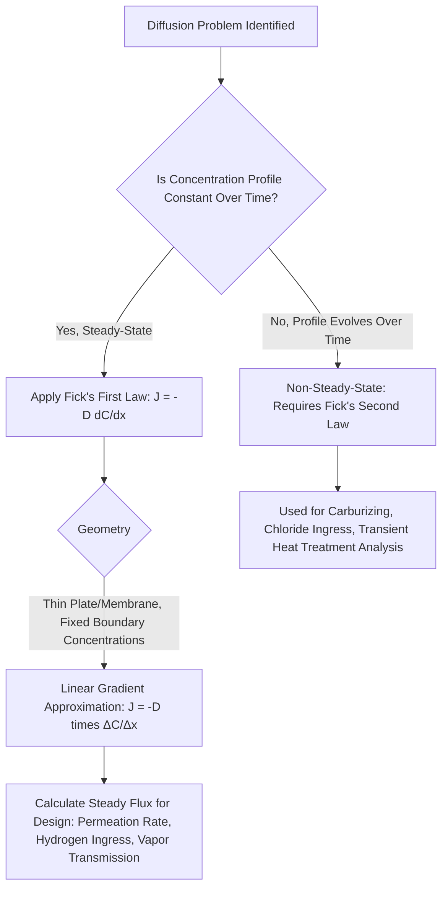

## Fick's First Law and Steady-State Diffusion

### Overview and Definition

Fick's First Law is the fundamental constitutive relationship describing mass transport by diffusion under **steady-state** conditions — meaning the concentration at every point within the diffusion field remains constant with respect to time, even though a concentration gradient exists in space. Fick's First Law quantifies the diffusive flux (the rate of mass transport per unit area) as directly proportional to the local concentration gradient, forming the diffusion analog of other well-known transport laws in engineering (Fourier's Law for heat conduction, Ohm's Law for electrical current).

### Mathematical Formulation

For one-dimensional diffusion, Fick's First Law is stated as:

$$J = -D\frac{dC}{dx}$$

Where:

- $J$ = diffusion flux (mass or number of atoms diffusing per unit area per unit time, commonly $\text{kg/(m}^2\cdot\text{s)}$ or $\text{atoms/(m}^2\cdot\text{s)}$)
- $D$ = diffusion coefficient (diffusivity), a material- and temperature-dependent property (commonly $\text{m}^2/\text{s}$), governed by the Arrhenius relationship discussed under Diffusion Mechanisms
- $\frac{dC}{dx}$ = concentration gradient (rate of change of concentration $C$ with position $x$)

**Key Points**

- The negative sign indicates that diffusive flux occurs in the direction of *decreasing* concentration — i.e., down the concentration gradient, from high concentration toward low concentration, consistent with the second law of thermodynamics driving a system toward a more uniform (higher entropy) state.
- Fick's First Law strictly applies only under steady-state conditions, where $\frac{\partial C}{\partial t} = 0$ at every position — the concentration profile is fixed in time even though mass is continuously flowing through the system.
- $D$ is generally treated as constant for a given temperature and material system in the simplest applications of this law, though in reality $D$ can vary with composition in some systems. [Inference] The assumption of a concentration-independent $D$ is a simplification that holds reasonably well over limited composition ranges for many engineering diffusion problems, but should be verified against experimental data for systems with strong composition dependence.

### Physical Interpretation and Analogy

Fick's First Law is mathematically and conceptually analogous to other steady-state transport laws widely used in civil and structural engineering:

| Transport Phenomenon | Governing Law | Driving Force | Flux Quantity |
| --- | --- | --- | --- |
| Mass diffusion | Fick's First Law | Concentration gradient, $dC/dx$ | Mass flux, $J$ |
| Heat conduction | Fourier's Law | Temperature gradient, $dT/dx$ | Heat flux, $q$ |
| Fluid flow through porous media | Darcy's Law | Hydraulic head gradient, $dh/dx$ | Seepage flux, $v$ |
| Electrical conduction | Ohm's Law (differential form) | Voltage gradient, $dV/dx$ | Current density, $i$ |

**Key Points**

- Recognizing this shared mathematical structure (a flux proportional to a potential gradient, mediated by a material transport coefficient) allows engineers already familiar with Darcy's Law (seepage analysis) or Fourier's Law (thermal analysis) to apply the same conceptual and mathematical toolkit to steady-state diffusion problems.
- All four laws share the same general limitation: they describe steady-state (time-invariant) transport; each has a corresponding time-dependent (transient) counterpart for non-steady-state analysis (for diffusion, this is Fick's Second Law, covered as a related, dedicated topic).

### Conditions Required for Steady-State Diffusion

Steady-state diffusion requires that the concentration at every fixed point in the diffusion field remains constant over time. This condition is typically achieved (or closely approximated) in one of two practical scenarios:

1. **Fixed boundary concentrations maintained indefinitely:** Both the high-concentration (source) and low-concentration (sink) boundaries of the diffusion couple are held at constant concentration, and sufficient time has elapsed for the intermediate concentration profile to stabilize into a fixed, linear (for simple 1-D geometry with constant $D$) gradient.
2. **Thin-membrane / plate diffusion problems:** A common idealized engineering case is diffusion through a thin plate or membrane of thickness $\Delta x$ separating two reservoirs of constant, different concentration ($C_1$ on one face, $C_2$ on the opposite face). For this geometry, assuming a linear concentration profile through the thickness, Fick's First Law simplifies to:

$$J = -D\frac{C_2 - C_1}{x_2 - x_1} = -D\frac{\Delta C}{\Delta x}$$

**Key Points**

- Steady-state conditions are comparatively rare as a complete description of most transient, real-world engineering diffusion problems (e.g., carburizing, chloride ingress), but the thin-membrane approximation is widely used in gas permeation and separation membrane design, and serves as a valuable simplified starting point before introducing the mathematically more complex non-steady-state case.
- A true steady-state can only be sustained indefinitely if there is a continuous, external replenishment of the source concentration and continuous removal at the sink side (otherwise the source would eventually deplete and the system would drift toward non-steady-state, and ultimately equilibrium, behavior).

### Structural Illustration

(svg_diagram) Steady-State Diffusion Through a Plate (svg_diagram)

<svg xmlns="http://www.w3.org/2000/svg" viewBox="0 0 680 380" font-family="Helvetica, Arial, sans-serif">
<rect x="0" y="0" width="680" height="380" fill="#ffffff" />
<text x="340" y="24" text-anchor="middle" font-size="16" font-weight="bold" fill="#1a1a1a">Steady-State Diffusion Through a Plate (svg_diagram)</text>

<rect x="280" y="70" width="120" height="230" fill="#f0f4f8" stroke="#2d3748" stroke-width="1.5" />
<text x="340" y="330" text-anchor="middle" font-size="12" fill="#2d3748">Plate, thickness Δx</text>

<rect x="100" y="70" width="180" height="230" fill="#feebc8" stroke="#dd6b20" stroke-width="1" />
<text x="190" y="60" text-anchor="middle" font-size="12" fill="#dd6b20" font-weight="bold">High Concentration, C1</text>

<rect x="400" y="70" width="180" height="230" fill="#e6fffa" stroke="#2b6cb0" stroke-width="1" />
<text x="490" y="60" text-anchor="middle" font-size="12" fill="#2b6cb0" font-weight="bold">Low Concentration, C2</text>

<line x1="300" y1="150" x2="380" y2="150" stroke="#38a169" stroke-width="2.5" marker-end="url(#af)" />
<line x1="300" y1="185" x2="380" y2="185" stroke="#38a169" stroke-width="2.5" marker-end="url(#af)" />
<line x1="300" y1="220" x2="380" y2="220" stroke="#38a169" stroke-width="2.5" marker-end="url(#af)" />
<text x="340" y="140" text-anchor="middle" font-size="12" fill="#38a169" font-weight="bold">Flux J</text>
<line x1="100" y1="345" x2="580" y2="345" stroke="#2d3748" stroke-width="1" />
<text x="340" y="365" text-anchor="middle" font-size="11" fill="#2d3748">Position, x</text>
<path d="M 130 320 L 280 320 L 400 335 L 550 335" fill="none" stroke="#c53030" stroke-width="2" />
<text x="130" y="315" font-size="10" fill="#c53030">C1</text>
<text x="550" y="330" font-size="10" fill="#c53030">C2</text>
<text x="340" y="330" text-anchor="middle" font-size="10" fill="#c53030">Linear gradient across plate</text>
</svg>

### Example: Steady-State Flux Through a Membrane

**Example**

A thin steel membrane, 2 mm thick, separates a hydrogen-charging environment (surface concentration $C_1 = 1.2\ \text{kg/m}^3$) from a low-hydrogen-concentration environment on the opposite face ($C_2 = 0.2\ \text{kg/m}^3$). The hydrogen diffusion coefficient in this steel at the operating temperature is $D = 1.0\times10^{-9}\ \text{m}^2/\text{s}$. Determine the steady-state diffusive flux through the membrane.

Step 1 — Convert thickness to consistent SI units: $\Delta x = 2\ \text{mm} = 2\times10^{-3}\ \text{m}$.

Step 2 — Apply the steady-state (linear-gradient) form of Fick's First Law:

$$J = -D\frac{C_2 - C_1}{\Delta x} = -(1.0\times10^{-9})\frac{0.2 - 1.2}{2\times10^{-3}}$$

Step 3 — Evaluate the concentration difference: $C_2 - C_1 = -1.0\ \text{kg/m}^3$.

Step 4 — Compute flux:

$$J = -(1.0\times10^{-9})\left(\frac{-1.0}{2\times10^{-3}}\right) = -(1.0\times10^{-9})(-500) = 5.0\times10^{-7}\ \text{kg/(m}^2\cdot\text{s)}$$

**Output**

The steady-state hydrogen flux through the membrane is $5.0\times10^{-7}\ \text{kg/(m}^2\cdot\text{s)}$, directed from the high-concentration face toward the low-concentration face (the positive result confirms flux in the direction of decreasing concentration, consistent with the governing physics). This type of calculation is directly relevant to assessing hydrogen permeation risk through steel components in hydrogen-charging service environments, a consideration in evaluating susceptibility to hydrogen embrittlement in high-strength structural and prestressing steel.

### Assumptions and Limitations

**Key Points**

- Fick's First Law in its basic form assumes isotropic diffusion (diffusivity is the same in all directions) and a diffusion coefficient that does not vary with concentration — both assumptions that may not strictly hold in all real material systems, particularly at high solute concentrations or in strongly anisotropic crystal structures.
- The law describes only the *rate* of mass transport at steady state; it provides no direct information about how the concentration profile evolves over time to reach that steady state, or how long that transient period takes — that information requires Fick's Second Law.
- In heterogeneous, porous, or multi-phase materials such as concrete, applying Fick's First Law requires using an **effective diffusion coefficient** that lumps together the combined effects of pore structure, tortuosity, and any chemical binding/reaction occurring during transport (e.g., chloride binding by cement hydration products), rather than a true single-phase lattice diffusivity. [Inference] This effective diffusivity is an empirical simplification useful for engineering-scale prediction, and it does not fully capture the underlying complexity of coupled diffusion-reaction transport occurring at the pore scale.

### Relevance to Civil Engineering Practice

**Gas and vapor permeation through building materials**

- Steady-state Fick's Law forms the basis for calculating water vapor transmission rates through building envelope materials (vapor retarders, membranes), relevant to moisture control and condensation risk assessment in building science.

**Hydrogen permeation and embrittlement assessment**

- As illustrated in the worked example, steady-state diffusion calculations are used to estimate hydrogen flux through steel components exposed to hydrogen-rich environments (e.g., certain industrial processes, cathodic protection systems that can inadvertently generate hydrogen), informing embrittlement risk assessment for high-strength steel elements such as prestressing tendons and anchor bolts.

**Gas diffusion through geosynthetic liners and barriers**

- Landfill liner systems and geomembrane barriers are evaluated in part using steady-state diffusion principles to estimate long-term contaminant or gas migration rates through barrier layers, informing environmental containment design.

**Conceptual foundation for concrete durability modeling**

- While actual chloride ingress into concrete is a non-steady-state process (covered under Fick's Second Law), the steady-state form remains conceptually useful for laboratory diffusion cell tests (e.g., certain rapid chloride permeability or migration test configurations) where a quasi-steady-state condition is established across a thin concrete specimen to back-calculate an effective diffusion coefficient for use in subsequent non-steady-state service-life models.

### Comparative Summary: Steady-State vs Non-Steady-State

| Characteristic | Steady-State (Fick's First Law) | Non-Steady-State (Fick's Second Law) |
| --- | --- | --- |
| Time dependence of concentration profile | Constant with time ($\partial C/\partial t = 0$) | Changes with time |
| Governing equation | $J = -D\,dC/dx$ | $\partial C/\partial t = D\,\partial^2C/\partial x^2$ |
| Typical application | Thin-membrane permeation, idealized diffusion couples | Carburizing, chloride ingress, most real transient processes |
| Mathematical complexity | Relatively simple (algebraic for linear profile) | Requires solving a partial differential equation (often via error function solutions) |
| Civil engineering relevance | Vapor barrier design, hydrogen permeation, lab diffusion cells | Chloride-induced corrosion service-life prediction, carburizing |

### Application Pathway

### Related Topics

- Diffusion Mechanisms
- Fick's Second Law and Non-Steady-State Diffusion
- Chloride Ingress and Corrosion Initiation in Reinforced Concrete
- Hydrogen Embrittlement in High-Strength Steel
- Carburizing and Case Hardening of Steel
- Darcy's Law and Seepage Through Porous Media
- Building Envelope Moisture and Vapor Transmission
- Effective Diffusion Coefficients in Porous and Composite Materials