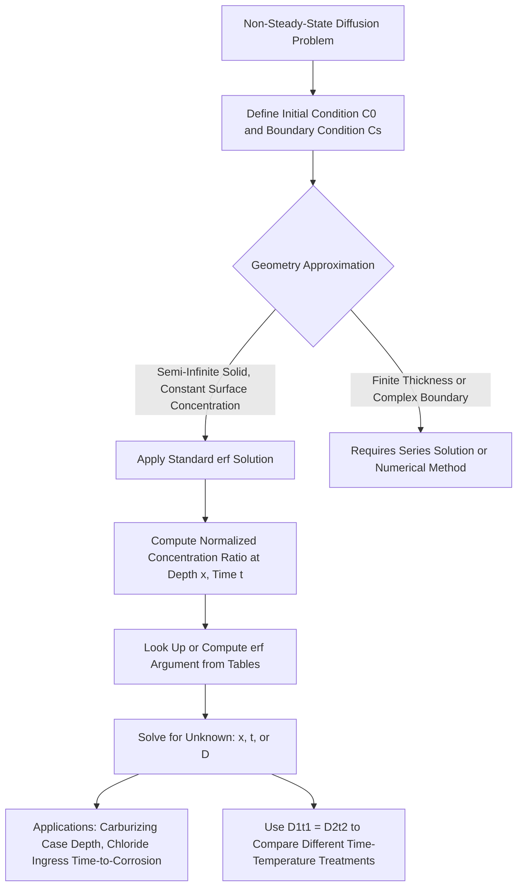

## Fick's Second Law and Non-Steady-State Diffusion

### Overview and Definition

Fick's Second Law describes diffusion under **non-steady-state (transient)** conditions, where the concentration at a given position within the material changes with time as diffusion progresses. This is the far more common and practically important case for most real engineering diffusion problems, since achieving a true, time-invariant steady-state concentration profile (as required by Fick's First Law) requires idealized, sustained boundary conditions that are rarely met exactly in practice.

Fick's Second Law is derived from Fick's First Law combined with the principle of conservation of mass (a continuity equation), and it governs processes such as carburizing heat treatment of steel and, critically for civil engineering durability, the transient ingress of chloride ions into reinforced concrete.

### Mathematical Formulation

For one-dimensional diffusion with a constant (concentration-independent) diffusion coefficient $D$, Fick's Second Law is:

$$\frac{\partial C}{\partial t} = D\frac{\partial^2 C}{\partial x^2}$$

Where:

- $C = C(x,t)$ = concentration as a function of both position $x$ and time $t$
- $D$ = diffusion coefficient, assumed constant for this simplified form
- $\frac{\partial C}{\partial t}$ = rate of change of concentration at a fixed position over time
- $\frac{\partial^2 C}{\partial x^2}$ = curvature (second spatial derivative) of the concentration profile

**Key Points**

- This is a second-order partial differential equation (PDE), reflecting the fact that non-steady-state diffusion is inherently a function of both space and time simultaneously, unlike the purely spatial (algebraic, for constant $D$) treatment possible under steady-state conditions.
- Physically, the equation states that the local rate of concentration change is proportional to the local curvature of the concentration profile: concentration increases fastest where the profile is concave up (a local minimum or "trough" in concentration) and decreases fastest where the profile is concave down (a local maximum or "peak").
- Solving this PDE for a specific engineering problem requires specifying appropriate initial and boundary conditions matched to the physical scenario being modeled.

### The Standard Solution: Semi-Infinite Solid with Constant Surface Concentration

The most widely used engineering solution to Fick's Second Law applies to a semi-infinite solid (a solid thick enough, relative to the diffusion depth of interest, that the far boundary can be treated as effectively infinitely distant) with the following conditions:

- **Initial condition:** Uniform initial concentration $C_0$ throughout the solid before diffusion begins.
- **Boundary condition:** The surface concentration is instantaneously raised to and held constant at a value $C_s$ for all time $t > 0$.

Under these conditions, the solution to Fick's Second Law is:

$$\frac{C_x - C_0}{C_s - C_0} = 1 - \text{erf}\left(\frac{x}{2\sqrt{Dt}}\right)$$

Where:

- $C_x$ = concentration at position $x$ (measured from the surface) at time $t$
- $C_0$ = initial (bulk) concentration in the material before diffusion
- $C_s$ = constant surface concentration maintained at $x=0$
- $\text{erf}(z)$ = the Gaussian error function, a standard tabulated mathematical function
- $D$ = diffusion coefficient (Arrhenius temperature-dependent, per Diffusion Mechanisms)
- $t$ = elapsed diffusion time

**Key Points**

- The term $\frac{x}{2\sqrt{Dt}}$ is dimensionless and serves as the argument to the error function; its value directly determines the fractional degree of concentration change at that position and time relative to the total possible change ($C_s - C_0$).
- The error function is a monotonically increasing function ranging from $\text{erf}(0) = 0$ to $\text{erf}(\infty) \approx 1$; values are typically obtained from standard error function tables or computed numerically, since it is not expressible in simple closed form.
- This solution assumes $D$ is constant (does not vary with concentration or position) — a simplifying assumption that holds reasonably well for many practical cases but should be verified for systems with strong composition-dependent diffusivity.

### The Diffusion Depth Parameter and Comparative Diffusion Times

A particularly useful engineering application of this solution arises when comparing two diffusion treatments that are intended to achieve the *same* concentration at the *same* depth, but at different temperatures (and therefore different diffusion coefficients) and/or different times. Since achieving the same relative concentration $\frac{C_x-C_0}{C_s-C_0}$ at the same depth $x$ requires the error function argument to be identical, this leads to the relationship:

$$\frac{x^2}{Dt} = \text{constant}$$

Or, comparing two different processing conditions (1 and 2) intended to produce an equivalent diffusion result at the same depth:

$$D_1 t_1 = D_2 t_2$$

**Key Points**

- This relationship is widely used in heat treatment process design to determine, for example, how much longer a carburizing treatment must run at a lower temperature to achieve the same case depth (carbon penetration depth) as a shorter treatment at a higher temperature, since $D$ increases exponentially with temperature per the Arrhenius relationship.
- The relationship also underlies accelerated durability testing concepts (though with important caveats): if diffusion coefficients at elevated (test) and service temperatures are both known, in principle an equivalent diffusion time at service temperature can be estimated from a shorter accelerated test at higher temperature. [Inference] In practice, this extrapolation for complex, multi-phase, or reactive systems such as concrete (where chloride binding and pore structure evolution complicate simple $Dt$ scaling) requires caution and is generally supplemented with empirical calibration rather than relied upon as a purely theoretical scaling law.

### Structural Illustration

(svg_diagram) Non-Steady-State Concentration Profile Evolution (svg_diagram)

<svg xmlns="http://www.w3.org/2000/svg" viewBox="0 0 680 400" font-family="Helvetica, Arial, sans-serif">
<rect x="0" y="0" width="680" height="400" fill="#ffffff" />
<text x="340" y="24" text-anchor="middle" font-size="16" font-weight="bold" fill="#1a1a1a">Non-Steady-State Concentration Profile Evolution (svg_diagram)</text>

<line x1="90" y1="330" x2="600" y2="330" stroke="#2d3748" stroke-width="1.5" />
<line x1="90" y1="330" x2="90" y2="60" stroke="#2d3748" stroke-width="1.5" />
<text x="345" y="365" text-anchor="middle" font-size="12" fill="#2d3748">Position from surface, x</text>
<text x="45" y="200" font-size="12" fill="#2d3748" transform="rotate(-90 45 200)">Concentration, C</text>

<line x1="90" y1="80" x2="600" y2="80" stroke="#c53030" stroke-width="1" stroke-dasharray="4,3" />
<text x="605" y="84" font-size="11" fill="#c53030">Cs</text>

<line x1="90" y1="300" x2="600" y2="300" stroke="#4a5568" stroke-width="1" stroke-dasharray="4,3" />
<text x="605" y="304" font-size="11" fill="#4a5568">C0</text>

<path d="M 90 80 Q 150 90 220 250 Q 280 300 600 300" fill="none" stroke="#38a169" stroke-width="2.5" />
<text x="230" y="150" font-size="11" fill="#38a169" font-weight="bold">t1 (short time)</text>

<path d="M 90 80 Q 250 100 350 220 Q 450 280 600 300" fill="none" stroke="#2b6cb0" stroke-width="2.5" />
<text x="380" y="180" font-size="11" fill="#2b6cb0" font-weight="bold">t2 greater than t1</text>

<path d="M 90 80 Q 350 110 480 200 Q 550 250 600 280" fill="none" stroke="#805ad5" stroke-width="2.5" />
<text x="470" y="170" font-size="11" fill="#805ad5" font-weight="bold">t3 greater than t2</text>

<text x="345" y="30" text-anchor="middle" font-size="11" fill="`#4a5568`">Constant surface concentration, penetration depth increases with time</text>

</svg>

### Example: Carburizing Case Depth Calculation

**Example**

A low-carbon steel gear (initial uniform carbon content $C_0 = 0.20\ \text{wt\%}$) is carburized at 927°C, where the diffusion coefficient of carbon in austenite is $D = 1.6\times10^{-11}\ \text{m}^2/\text{s}$. The furnace atmosphere maintains a constant surface carbon concentration of $C_s = 1.00\ \text{wt\%}$. Determine the carburizing time required to achieve a carbon content of $C_x = 0.45\ \text{wt\%}$ at a depth of $x = 0.6\ \text{mm}$ below the surface.

Step 1 — Set up the normalized concentration ratio:

$$\frac{C_x - C_0}{C_s - C_0} = \frac{0.45 - 0.20}{1.00 - 0.20} = \frac{0.25}{0.80} = 0.3125$$

Step 2 — Relate to the error function:

$$1 - \text{erf}\left(\frac{x}{2\sqrt{Dt}}\right) = 0.3125 \quad\Rightarrow\quad \text{erf}\left(\frac{x}{2\sqrt{Dt}}\right) = 0.6875$$

Step 3 — Determine the error function argument from standard error function tables. A value of $\text{erf}(z) = 0.6875$ corresponds to approximately $z \approx 0.71$ (interpolated from standard tabulated erf values).

Step 4 — Set up the equation for $t$:

$$\frac{x}{2\sqrt{Dt}} = 0.71 \quad\Rightarrow\quad \sqrt{Dt} = \frac{x}{2 \times 0.71} = \frac{0.6\times10^{-3}}{1.42} \approx 4.23\times10^{-4}\ \text{m}$$

Step 5 — Solve for $Dt$, then $t$:

$$Dt \approx (4.23\times10^{-4})^2 \approx 1.79\times10^{-7}\ \text{m}^2$$

$$t = \frac{1.79\times10^{-7}}{1.6\times10^{-11}} \approx 1.12\times10^{4}\ \text{s}$$

Step 6 — Convert to hours: $t \approx \frac{11{,}200}{3600} \approx 3.1\ \text{hours}$.

**Output**

A carburizing time of approximately 3.1 hours at 927°C is required to achieve 0.45 wt% carbon at a depth of 0.6 mm. [Unverified] The erf table interpolation and Arrhenius parameters used here are illustrative of the standard solution procedure; precise results in practice depend on accurate diffusion coefficient data for the specific steel composition and furnace conditions, which should be obtained from validated process data.

### Application to Chloride Ingress in Reinforced Concrete

The same mathematical framework (semi-infinite solid, constant surface concentration solution) is widely adopted, with important caveats, as the basis for predicting chloride ion penetration into reinforced concrete exposed to marine or de-icing salt environments:

$$C(x,t) = C_s\left[1 - \text{erf}\left(\frac{x}{2\sqrt{D_{\text{app}}t}}\right)\right]$$

Where $D_{\text{app}}$ is an **apparent (effective) chloride diffusion coefficient** for concrete, and $C_s$ is typically an assumed or measured surface chloride concentration (with $C_0$, the initial concentration, often taken as zero or a small background value for new concrete).

**Key Points**

- Corrosion initiation is generally assumed to occur once the chloride concentration at the depth of the reinforcing steel, $C(x_{\text{cover}}, t)$, reaches a critical threshold chloride concentration, $C_{\text{crit}}$, allowing this equation to be used (in principle) to estimate time-to-corrosion-initiation as a function of concrete cover depth and the apparent diffusion coefficient.
- [Inference] This application of Fick's Second Law to concrete is a widely used engineering approximation rather than an exact physical description, since concrete's porous, partially saturated, and chemically reactive nature (chloride binding by hydration products, time-dependent reduction in $D_{\text{app}}$ due to continued hydration, and non-constant surface concentration in real exposure conditions) all represent departures from the idealized assumptions underlying the standard erf solution. More refined service-life models incorporate time-dependent diffusion coefficients and chloride binding isotherms to address these departures.
- Despite these simplifications, the erf-based chloride ingress model remains a standard and widely referenced tool (e.g., as a basis within several international durability design guidance documents) for comparative service-life estimation and specifying concrete cover and mix design (e.g., water-cement ratio, supplementary cementitious material content, both of which reduce $D_{\text{app}}$) in chloride-exposed reinforced concrete structures.

### Additional Standard Solution Geometries

Beyond the semi-infinite constant-surface-concentration case, other standard solutions to Fick's Second Law address different boundary/initial condition combinations relevant to specific engineering problems:

- **Decarburization (loss of solute from a finite or semi-infinite body into a zero-concentration environment):** Mathematically similar in form but with surface concentration decreasing rather than increasing, relevant to surface carbon loss during hot working of steel.
- **Diffusion couple between two semi-infinite solids of different initial uniform concentration:** Relevant to interdiffusion studies and certain welding/joining diffusion bonding analyses, using a related error-function-based solution with the boundary condition at the interface between the two bodies rather than a fixed external surface concentration.
- **Finite-thickness bodies with symmetric or asymmetric boundary conditions:** Require more complex series solutions (e.g., Fourier series-based solutions) rather than the simple erf form, relevant when the diffusion depth of interest becomes a significant fraction of the total material thickness (violating the semi-infinite assumption).

### Relevance to Civil Engineering Practice

**Concrete durability and service-life design**

- As detailed above, the erf-based transient diffusion solution underlies widely used chloride ingress service-life prediction approaches, directly informing specified concrete cover depth and mix design requirements in durability-critical structures (bridges, marine structures, parking structures exposed to de-icing salts).

**Steel heat treatment specification**

- Carburizing and nitriding process specifications for wear-resistant or fatigue-resistant steel components (e.g., certain machinery parts, though less commonly primary structural members) rely directly on this framework to specify time-temperature combinations achieving a required case depth and surface hardness profile.

**Fire engineering and thermal diffusion analogy**

- While governed by Fourier's Law (the thermal analog) rather than Fick's Law directly, the same mathematical erf-based solution form is used to estimate transient temperature penetration into structural members during fire exposure, illustrating the shared mathematical structure between transient mass diffusion and transient heat conduction problems.

**Environmental and geotechnical contaminant transport**

- Transient contaminant diffusion through soil or engineered barrier layers (e.g., landfill liners, containment barriers) is frequently modeled using the same non-steady-state diffusion framework, often combined with advective transport terms for a more complete contaminant transport model.

### Comparative Summary

| Aspect | Fick's First Law (Steady-State) | Fick's Second Law (Non-Steady-State) |
| --- | --- | --- |
| Governing equation | $J = -D\,dC/dx$ | $\partial C/\partial t = D\,\partial^2C/\partial x^2$ |
| Concentration vs. time | Constant at every position | Varies with time at every position |
| Mathematical type | Algebraic (for linear profile) | Partial differential equation |
| Standard engineering solution | Linear gradient across thin plate | Error function (erf) solution for semi-infinite solid |
| Representative civil engineering application | Vapor/gas permeation, lab diffusion cells | Chloride ingress service-life prediction, carburizing |
| Key comparative tool | Direct flux calculation | $D_1t_1 = D_2t_2$ equivalence for matching penetration depth |

### Application Pathway

### Related Topics

- Diffusion Mechanisms
- Fick's First Law and Steady-State Diffusion
- Chloride Ingress and Corrosion Initiation in Reinforced Concrete
- Carburizing and Case Hardening of Steel
- Fire Resistance and Transient Heat Conduction in Structural Members
- Concrete Mix Design for Durability (Water-Cement Ratio, Supplementary Cementitious Materials)
- Service-Life Prediction Models for Reinforced Concrete
- Contaminant Transport Through Soil and Engineered Barriers