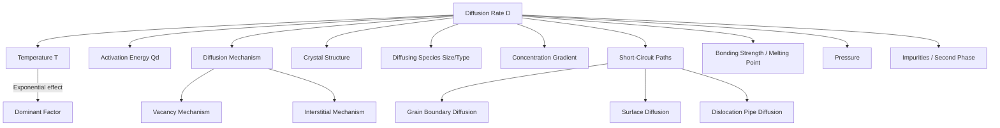

## Factors Influencing Diffusion Rate

### Overview

Diffusion is the thermally activated migration of atoms or ions through a crystalline or amorphous solid, driven by a gradient in chemical potential (commonly approximated by a concentration gradient). The rate at which this mass transport occurs is not constant — it depends on several interacting physical and structural variables. Quantifying and controlling these factors is essential in civil and materials engineering contexts such as carburizing steel, chloride ingress into reinforced concrete, corrosion protection, and heat-treatment design.

### Governing Equation: The Arrhenius-Type Diffusion Coefficient

The dominant mathematical expression tying together the major factors is the temperature dependence of the diffusion coefficient $D$:

$$D = D_0 \exp\left(-\dfrac{Q_d}{RT}\right)$$

Where:

- $D$ = diffusion coefficient ($m^2/s$)
- $D_0$ = pre-exponential (frequency) factor, material- and mechanism-dependent constant ($m^2/s$)
- $Q_d$ = activation energy for diffusion ($J/mol$)
- $R$ = universal gas constant ($8.314\ J/(mol \cdot K)$)
- $T$ = absolute temperature ($K$)

This single equation encodes two of the most important factors — temperature and activation energy — and is the starting point for analyzing nearly every other influence on diffusion rate.

### Factor 1: Temperature

**Key Points**

- Temperature is the single most influential variable. Because $T$ appears in the exponent, even modest increases produce large increases in $D$.
- Higher temperature increases the fraction of atoms with vibrational energy exceeding the activation energy barrier, per the Boltzmann distribution.
- A rise in temperature also increases the vibrational frequency of atoms attempting to jump into adjacent vacant sites, increasing the pre-exponential attempt rate.

**Example**

For iron self-diffusion, doubling the absolute temperature from 500 K to 1000 K (holding $Q_d$ constant) can increase $D$ by several orders of magnitude, since the exponential term dominates the linear temperature dependence.

A linearized form is obtained by taking the natural log:

$$\ln D = \ln D_0 - \dfrac{Q_d}{R}\left(\dfrac{1}{T}\right)$$

Plotting $\ln D$ against $1/T$ yields a straight line (an Arrhenius plot) with slope $-Q_d/R$, a standard technique for experimentally extracting activation energy.

### Factor 2: Activation Energy ($Q_d$)

**Key Points**

- $Q_d$ represents the energy barrier an atom must overcome to move from one lattice/interstitial site to an adjacent one.
- Lower $Q_d$ corresponds to easier atomic movement and a faster diffusion rate at a given temperature.
- $Q_d$ depends on the diffusion mechanism, the bonding strength of the host lattice, and the size/type of the diffusing species.
- Interstitial diffusion (e.g., carbon in iron) generally has lower $Q_d$ than vacancy/substitutional diffusion (e.g., self-diffusion of iron atoms), because interstitial atoms are typically smaller and do not require a vacancy to move.

### Factor 3: Diffusion Mechanism

**Key Points**

- **Vacancy (substitutional) diffusion**: atoms move into adjacent vacant lattice sites. Rate depends on both vacancy concentration and atomic mobility. Dominant for self-diffusion and diffusion of substitutional solute atoms of comparable atomic size to the host.
- **Interstitial diffusion**: small solute atoms (C, N, H, O) move through interstitial spaces between host atoms without needing a vacancy. This mechanism is faster than vacancy diffusion because interstitial sites are more numerous and the associated $Q_d$ is lower.
- Since vacancy concentration itself increases exponentially with temperature, vacancy-mediated diffusion is doubly sensitive to $T$.

### Factor 4: Crystal Structure and Packing

**Key Points**

- More densely packed structures (e.g., FCC) generally have lower diffusion rates than more open structures (e.g., BCC) for a given element, because atoms have less free volume through which to migrate.
- This explains why carbon diffuses faster in BCC (ferrite) iron than in FCC (austenite) iron at comparable temperatures relative to their respective stability ranges — although the direct comparison must also account for differing interstitial site sizes and coordination.
- [Inference] Precise quantitative comparisons between crystal structures require matched experimental conditions, since $D_0$ and $Q_d$ both vary with structure and are typically determined empirically.

### Factor 5: Diffusing Species (Size and Type)

**Key Points**

- Smaller atoms/ions diffuse more readily through a given host lattice than larger ones, all else equal, because smaller species distort the surrounding lattice less as they move.
- The relative size of the diffusing species to the host lattice's interstitial or vacancy sites directly affects $Q_d$.
- Ionic charge and valence matter significantly in ceramic and ionic solids, since diffusion must often be charge-compensated (coupled diffusion of cations and anions, or coupled with electron/hole transport) to maintain local electroneutrality.

### Factor 6: Concentration Gradient

**Key Points**

- Fick's First Law states that flux is proportional to the concentration gradient:

$$J = -D\dfrac{dC}{dx}$$

- A steeper gradient produces a higher instantaneous flux $J$ of diffusing species, though $D$ itself is generally treated as independent of concentration in the ideal (dilute solution) case.
- [Unverified] In concentrated or non-ideal solid solutions, $D$ can itself become a function of composition, a complication addressed by Darken's equations and interdiffusion coefficient formulations — this is a more advanced, system-specific behavior.

### Factor 7: Grain Boundaries, Dislocations, and Surfaces (Short-Circuit Diffusion Paths)

**Key Points**

- Atomic diffusion is not limited to bulk lattice ("volume diffusion"). Diffusion also occurs along high-diffusivity paths:
  - **Grain boundary diffusion** — faster than bulk/volume diffusion because atoms at grain boundaries are less tightly bound.
  - **Surface diffusion** — typically the fastest pathway, since surface atoms have the fewest neighboring bonds restraining movement.
  - **Dislocation (pipe) diffusion** — enhanced diffusion along dislocation cores.
- The relative contribution of these short-circuit paths versus bulk diffusion depends on temperature: at lower temperatures, grain boundary and surface diffusion can dominate total mass transport because their activation energies are lower than that of volume diffusion; at high temperatures, bulk diffusion (which scales with a much larger volume fraction of atoms) tends to dominate the overall flux.
- **Grain size** is therefore an important microstructural variable: finer-grained materials have a higher density of grain boundary area and generally exhibit greater diffusion-affected transport at lower temperatures compared to coarse-grained materials of the same composition.

### Factor 8: Bonding Type and Melting Point

**Key Points**

- Materials with higher melting points generally have stronger interatomic/interionic bonding and correspondingly higher activation energies for diffusion.
- This is why refractory metals and ceramics with high melting points typically exhibit much lower self-diffusion coefficients at a given absolute temperature compared to low-melting-point metals.
- [Inference] A useful engineering heuristic is that diffusion rates at homologous temperature ($T/T_m$, where $T_m$ is the absolute melting temperature) tend to be more comparable across different materials than diffusion rates compared at the same absolute temperature.

### Factor 9: Pressure

**Key Points**

- Pressure affects diffusion primarily through its influence on the activation volume associated with vacancy formation and migration.
- Increased pressure generally suppresses vacancy formation (since vacancy formation involves a small local volume expansion), which can modestly reduce vacancy-mediated diffusion rates.
- [Inference] Under typical civil and materials engineering conditions (atmospheric to moderately elevated pressure), this effect is small relative to the influence of temperature and is usually neglected in standard design calculations; it becomes more significant in geological or extreme high-pressure processing contexts.

### Factor 10: Presence of a Second Phase or Impurities

**Key Points**

- Solute atoms, precipitates, and second-phase particles can act as either traps (retarding diffusion by binding the diffusing species) or as accelerated pathways (if the second phase itself has a higher diffusivity or provides interphase boundary short-circuits).
- Impurity or alloying content can shift the effective activation energy and pre-exponential factor for diffusion of a given species in a real (non-pure) matrix.

### Civil Engineering Relevance: Chloride Diffusion in Concrete

**Example**

The ingress of chloride ions into reinforced concrete, which drives reinforcement corrosion, is commonly modeled using a Fickian approach analogous to solid-state diffusion:

$$C(x,t) = C_s\left[1 - \operatorname{erf}\left(\dfrac{x}{2\sqrt{D_c t}}\right)\right]$$

Where $C(x,t)$ is chloride concentration at depth $x$ and time $t$, $C_s$ is the surface chloride concentration, and $D_c$ is the apparent chloride diffusion coefficient. Here, the "microstructure" analog to grain boundaries is the concrete's pore network and interfacial transition zone; factors such as water-to-cement ratio, degree of hydration, curing conditions, and the presence of supplementary cementitious materials (fly ash, slag) strongly affect $D_c$ by altering pore connectivity and tortuosity — directly paralleling how crystal structure and grain boundaries affect metallic diffusion. [Inference] This is a widely used engineering approximation rather than a first-principles atomistic model, since concrete is a heterogeneous, non-crystalline, multi-phase medium.

### Summary Diagram: Interacting Factors

### Comparative Summary Table

| Factor | Effect of Increase | Relative Sensitivity |
| --- | --- | --- |
| Temperature | Sharply increases $D$ (exponential) | Very High |
| Activation Energy $Q_d$ | Higher $Q_d$ decreases $D$ (exponential) | Very High |
| Interstitial vs. vacancy mechanism | Interstitial diffusion generally faster | High |
| Grain size (finer) | Increases grain-boundary-mediated transport | Moderate (temp-dependent) |
| Diffusing species size | Smaller species diffuse faster | Moderate–High |
| Concentration gradient | Higher gradient increases flux $J$ (not $D$ itself, in ideal case) | Direct/linear |
| Pressure | Typically modest suppression of $D$ | Low (under normal engineering conditions) |
| Melting point/bonding strength | Higher $T_m$ generally means lower $D$ at fixed $T$ | High |

**Next Steps**

- Fick's First and Second Laws of Diffusion
- Steady-State vs. Non-Steady-State Diffusion
- Carburizing and Case Hardening of Steel
- Vacancy Formation and Point Defect Thermodynamics
- Grain Boundary and Surface Diffusion Mechanisms
- Chloride-Induced Corrosion of Reinforced Concrete
- Kirkendall Effect and Interdiffusion
- Arrhenius Plots and Experimental Determination of $Q_d$