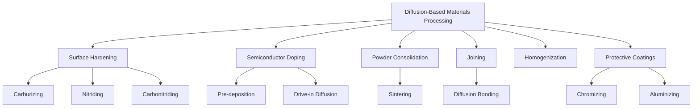

## Diffusion in Materials Processing

### Overview

Diffusion is not merely a theoretical transport phenomenon — it is a controlling mechanism deliberately harnessed in numerous industrial materials processing operations. Engineers manipulate temperature, time, concentration gradients, and atmosphere to achieve desired compositional or microstructural changes via solid-state diffusion. This item surveys the major processing techniques that rely on diffusion as their working principle.

### Governing Framework

Most diffusion-based processing techniques are analyzed using Fick's Second Law for non-steady-state (transient) diffusion, since concentration profiles evolve with time during processing:

$$\dfrac{\partial C}{\partial t} = D\dfrac{\partial^2 C}{\partial x^2}$$

For the common boundary condition of a constant surface concentration diffusing into a semi-infinite solid with a uniform initial concentration, the solution is:

$$\dfrac{C_x - C_0}{C_s - C_0} = 1 - \operatorname{erf}\left(\dfrac{x}{2\sqrt{Dt}}\right)$$

Where:

- $C_x$ = concentration at depth $x$ at time $t$
- $C_0$ = initial uniform concentration in the solid
- $C_s$ = constant surface concentration
- $\operatorname{erf}$ = Gaussian error function
- $D$ = diffusion coefficient at the process temperature

This equation is the practical design tool behind most surface-hardening and doping processes described below.

### Process 1: Carburizing (Case Hardening of Steel)

**Key Points**

- Low-carbon steel components are exposed to a carbon-rich atmosphere (historically solid carbon packs; in modern practice, gas carburizing with hydrocarbon gases, or liquid salt-bath carburizing) at elevated temperature, typically 850–950 °C, within the austenite (FCC) phase field.
- Carbon diffuses inward via the interstitial mechanism, increasing surface carbon content while leaving the core relatively low-carbon.
- After carburizing, the part is quenched, transforming the high-carbon surface layer into hard martensite while the low-carbon core remains tougher and more ductile — producing a wear-resistant surface with a fatigue-resistant, impact-tolerant core.

**Example**

Given a required case depth, engineers solve the transient diffusion equation for treatment time at a fixed furnace temperature, or conversely determine the temperature needed for a target case depth within a fixed processing time, using $D$ values obtained from an Arrhenius relationship for carbon in austenite.

### Process 2: Nitriding and Carbonitriding

**Key Points**

- Nitriding introduces nitrogen into the steel surface at lower temperatures (typically 500–590 °C) than carburizing, often via ammonia gas dissociation, forming hard iron nitride compounds without requiring subsequent quenching.
- Because nitriding occurs below the austenitizing temperature, it produces less distortion than carburizing — a significant advantage for precision components.
- Carbonitriding introduces both carbon and nitrogen simultaneously, typically in a gas furnace, combining aspects of both processes.

### Process 3: Doping of Semiconductors

**Key Points**

- Solid-state diffusion is used to introduce controlled concentrations of dopant atoms (e.g., boron, phosphorus) into a silicon substrate to create p-type or n-type regions for transistor and integrated circuit fabrication.
- Two common approaches: a **pre-deposition** step at fixed surface concentration (constant-source diffusion), followed by a **drive-in** step where the total dopant quantity is fixed and diffuses further into the substrate (limited-source diffusion), producing a Gaussian-like concentration profile.
- Precise control of $D$, temperature, and time is critical because dopant profile depth directly determines device electrical characteristics.

### Process 4: Sintering (Powder Metallurgy and Ceramics)

**Key Points**

- Sintering consolidates a compacted powder into a dense solid by heating below the melting point, relying on diffusion (volume, grain boundary, and surface diffusion) to drive neck growth between particles and pore elimination.
- Diffusion mechanisms responsible for densification include: surface diffusion (redistributes material without densification), grain boundary diffusion (contributes to densification), and volume/lattice diffusion (contributes to densification and grain growth).
- [Inference] Because multiple diffusion mechanisms compete during sintering, controlling heating rate and hold temperature is used industrially to favor densification mechanisms over surface-diffusion-dominated coarsening, though the precise mechanism balance is composition- and geometry-dependent.

### Process 5: Diffusion Bonding (Solid-State Welding)

**Key Points**

- Two clean, flat surfaces are pressed together at elevated temperature (typically 50–80% of the absolute melting point) for an extended time, allowing atomic diffusion across the interface to create a metallurgical bond without melting.
- Commonly used for joining dissimilar metals, honeycomb structures in aerospace, and cladding applications where melting-based welding would be unsuitable or would damage a bonded assembly.
- Bond quality depends on surface cleanliness/flatness, applied pressure, temperature, and time — all of which affect the extent of interfacial atomic diffusion and void closure.

### Process 6: Homogenization Annealing

**Key Points**

- As-cast alloys often exhibit compositional non-uniformity (coring/microsegregation) due to non-equilibrium solidification.
- Homogenization annealing holds the cast material at an elevated temperature for an extended period, allowing diffusion to even out the composition gradient across dendritic structures, improving subsequent mechanical processing and property uniformity.

### Process 7: Diffusion Coatings and Surface Alloying

**Key Points**

- Techniques such as **chromizing** (chromium diffusion for corrosion/oxidation resistance) and **aluminizing** (aluminum diffusion for high-temperature oxidation resistance, e.g., turbine blade coatings) rely on the same pack-cementation or gas-phase diffusion principles as carburizing but with different diffusing species.
- These coatings form a compositionally graded surface layer rather than a distinct mechanically bonded coating, generally improving adhesion and resistance to spalling compared to overlay coatings.

### Civil Engineering Relevance: Curing and Protective Treatments

**Example**

While civil engineering does not typically involve carburizing or semiconductor doping, the same transient diffusion mathematics underlies:

- **Concrete curing and moisture/ion ingress modeling** — chloride and sulfate ion diffusion into concrete, used for service-life prediction of reinforced concrete structures in marine or de-icing-salt environments.
- **Surface treatments and sealers** — silane/siloxane penetrating sealers rely on diffusion into the pore structure of concrete to reduce subsequent water and chloride ingress.
- [Inference] The same $\operatorname{erf}$-based solution used for carburizing case-depth calculations is commonly adapted (with an apparent diffusion coefficient $D_c$) for predicting the time to reinforcement corrosion initiation, though real concrete introduces non-Fickian effects (binding, cracking, variable saturation) that are not present in idealized metallurgical diffusion.

### Process Selection Overview

### Comparative Summary Table

| Process | Diffusing Species | Typical Temp. Range | Primary Objective |
| --- | --- | --- | --- |
| Carburizing | Carbon | ~850–950 °C | Hard, wear-resistant surface with tough core |
| Nitriding | Nitrogen | ~500–590 °C | Surface hardness with minimal distortion |
| Semiconductor doping | B, P, other dopants | Process-specific (high temp, controlled atmosphere) | Controlled electrical junction profile |
| Sintering | Base material atoms (self-diffusion) | Below melting point | Densification of powder compact |
| Diffusion bonding | Atoms across interface | ~50–80% of $T_m$ | Solid-state metallurgical joint |
| Homogenization annealing | Alloying elements | Below solidus temperature | Elimination of cast microsegregation |
| Chromizing/Aluminizing | Cr, Al | Elevated (process-specific) | Oxidation/corrosion-resistant surface layer |

**Next Steps**

- Fick's First and Second Laws of Diffusion
- Factors Influencing Diffusion Rate
- Case Depth Calculation Using the Error Function Solution
- Steel Heat Treatment and the Iron-Carbon Phase Diagram
- Powder Metallurgy Fundamentals
- Solid-State Welding Processes
- Service Life Prediction Models for Reinforced Concrete