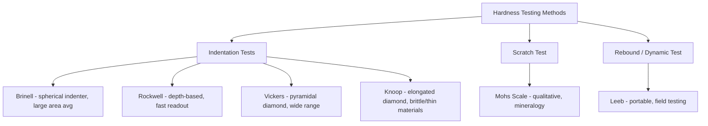

## Hardness Testing Methods

### Overview

Hardness testing measures a material's resistance to localized plastic deformation, typically via indentation, scratching, or rebound. It is among the most widely used mechanical tests in materials engineering and quality control because it is fast, relatively non-destructive, and correlates reasonably well with other mechanical properties such as tensile strength and wear resistance. Multiple hardness scales exist, each suited to different material types, hardness ranges, and specimen geometries.

### Concept of Hardness

**Key Points**

- Hardness is not a single fundamental physical property but rather an empirically defined measure of a material's resistance to localized plastic deformation, typically quantified through the size, depth, or rebound of an indentation or impact.
- Because different hardness tests use different indenter geometries, loads, and measurement principles, hardness values are generally only comparable within the same scale; conversion between scales relies on empirical correlation tables rather than a fundamental physical relationship.
- Hardness testing is popular industrially because it is fast, generally non-destructive (or minimally destructive) compared to a full tensile test, and can be performed directly on finished parts or in the field.

### Brinell Hardness Test

**Key Points**

- Uses a hardened steel or tungsten carbide spherical indenter (commonly 10 mm diameter) pressed into the material surface under a specified load (commonly 3000 kgf for steels, lower for softer materials), held for a specified dwell time.
- Hardness is calculated from the diameter of the resulting indentation, using the surface area of the spherical impression:

$$HB = \dfrac{2P}{\pi D\left(D - \sqrt{D^2 - d^2}\right)}$$

Where $P$ is the applied load, $D$ is the indenter diameter, and $d$ is the measured indentation diameter.

- Because the indentation is relatively large, Brinell testing averages out local microstructural heterogeneities, making it well-suited to materials with coarse or non-uniform microstructures (e.g., cast irons, castings) where a small, localized indentation might not be representative.
- The relatively large indentation size makes Brinell testing less suitable for thin specimens or finished/coated parts where a large, visible indentation is undesirable.

### Rockwell Hardness Test

**Key Points**

- The most widely used hardness test in industrial practice, valued for its speed and simplicity, since the hardness value is read directly from the testing machine without requiring separate measurement of the indentation.
- Applies a minor (preliminary) load followed by a major load, using either a diamond cone (Brale) indenter or a hardened steel ball, depending on the scale.
- Hardness is determined from the *depth* of penetration resulting from the major load (relative to the depth from the minor load), rather than from the diameter or area of the indentation.
- Multiple Rockwell scales exist (A, B, C, and others), each defined by a specific combination of indenter type and load, selected according to the expected hardness range and material type of the specimen. For example, the **Rockwell C** scale (diamond cone indenter, 150 kgf major load) is commonly used for hardened steels, while the **Rockwell B** scale (steel ball indenter, 100 kgf major load) is used for softer metals such as annealed steels, aluminum, and brass.
- [Unverified] Selection of the appropriate Rockwell scale for a given material and expected hardness range should be confirmed against the applicable testing standard, since using an inappropriate scale (e.g., too soft a material for a diamond cone/heavy load combination) can produce inaccurate or invalid readings.

### Vickers Hardness Test

**Key Points**

- Uses a square-based pyramidal diamond indenter with a specified face angle, applied under a chosen load.
- Hardness is calculated from the diagonal length of the resulting square indentation:

$$HV = \dfrac{1.854 P}{d^2}$$

Where $P$ is the applied load and $d$ is the mean diagonal length of the indentation.

- Because the same indenter geometry is used across a very wide range of loads, the Vickers scale provides a continuous hardness scale applicable to nearly all materials, from very soft to very hard, unlike Rockwell, which requires switching scales.
- Well-suited to microhardness testing (using very light loads) for measuring hardness of small features, thin coatings, individual microstructural phases/grains, or case-hardened surface layers with a hardness gradient.

### Knoop Hardness Test

**Key Points**

- Similar in principle to Vickers testing but uses an elongated, rhombic-shaped diamond indenter, producing a shallower and narrower indentation for a given load.
- Particularly well-suited to microhardness testing of brittle materials (ceramics, glasses) and very thin sections/coatings, since the shallow indentation reduces the risk of cracking around the indent compared to the more symmetric Vickers indenter.

### Scratch Hardness (Mohs Scale)

**Key Points**

- The Mohs scale is a qualitative, ordinal scratch-hardness scale (1–10) historically used primarily in mineralogy and geology, where a material's hardness is ranked by its ability to scratch, or be scratched by, reference minerals of known Mohs hardness.
- [Inference] Because the Mohs scale is ordinal rather than based on a physically proportional measurement, it is not suitable for precise engineering quantification of hardness differences and is rarely used for structural materials selection; it remains relevant primarily for mineral identification and qualitative comparisons (e.g., aggregate hardness assessment in geotechnical/materials contexts).

### Rebound (Dynamic) Hardness Testing

**Key Points**

- **Leeb rebound hardness testing** (a common portable hardness testing method) measures the rebound velocity of an impact body after striking the test surface; higher rebound velocity generally corresponds to higher hardness.
- Widely used for field/portable hardness testing of large components, installed equipment, or heavy structural members where bringing the part to a bench-mounted hardness tester is impractical.
- [Unverified] Rebound hardness values are generally converted to standard scales (e.g., approximate Rockwell or Brinell equivalents) via instrument-specific calibration curves, which can be sensitive to surface preparation, specimen mass, and coupling of the specimen to a rigid support — so users should consult the specific instrument's guidance for valid use conditions.

### Relationship Between Hardness and Tensile Strength

**Key Points**

- For many steels, an approximately linear empirical correlation exists between Brinell hardness number (HB) and ultimate tensile strength, of the general form:

$$\sigma_{UTS}\,(\text{MPa}) \approx 3.45 \times HB$$

- [Unverified] This correlation coefficient is an approximation specific to certain steel types and conditions; it should not be applied indiscriminately across all alloy systems, heat-treatment conditions, or non-ferrous metals without verification against material-specific data, since the hardness-strength relationship can vary meaningfully with microstructure.
- This correlation makes hardness testing a convenient, minimally destructive proxy for estimating tensile strength in quality control settings, without requiring a full destructive tensile test on every part.

### Hardness Test Comparison

### Civil Engineering Relevance: Field and Quality Control Applications

**Example**

Hardness testing appears in civil/structural engineering practice primarily as a quality control and condition assessment tool:

- **Rockwell/Brinell testing of structural steel and fasteners** during fabrication quality control, verifying that heat-treated components (e.g., high-strength bolts) meet specified hardness ranges as an indirect indicator of strength and, for some bolt grades, a screen against excessive hardness associated with hydrogen embrittlement susceptibility.
- **Portable/rebound hardness testing** of large installed steel structures, bridges, or storage tanks, where cutting a coupon for tensile testing is impractical, allowing an approximate estimate of material strength or verification of material grade in the field.
- **Rebound hammer testing of concrete** (Schmidt hammer test) operates on a broadly analogous rebound principle, though applied to concrete surface hardness rather than metals, and is used as a rapid, non-destructive (though approximate) indicator of in-place concrete compressive strength — correlated to strength through calibration curves specific to the concrete mix and testing conditions, similar in spirit to metallic hardness-to-strength correlations.

### Comparative Summary Table

| Test | Indenter | Measurement Basis | Typical Application |
| --- | --- | --- | --- |
| Brinell | Hardened steel/carbide sphere | Indentation diameter/area | Castings, coarse-microstructure materials |
| Rockwell | Diamond cone or steel ball | Indentation depth | General-purpose, fast industrial QC |
| Vickers | Square pyramidal diamond | Indentation diagonal | Wide hardness range, microhardness |
| Knoop | Elongated rhombic diamond | Indentation diagonal (shallow) | Brittle materials, thin coatings |
| Mohs | Reference mineral scratch | Qualitative scratch ranking | Mineralogy, qualitative comparison |
| Leeb (rebound) | Impact body | Rebound velocity | Portable/field testing of large components |

**Next Steps**

- The Tensile Test and Stress-Strain Curve
- Yielding, Ductility, and Toughness
- Nondestructive Testing Methods for Structural Materials
- Fatigue Behavior of Materials
- Quality Control of High-Strength Bolts and Fasteners
- Non-Destructive Concrete Strength Assessment (Rebound Hammer, Ultrasonic Pulse Velocity)