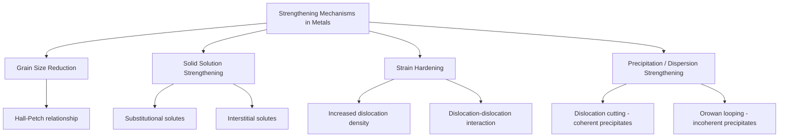

## Strengthening Mechanisms in Metals

### Overview

Strengthening mechanisms in metals are microstructural strategies used to increase resistance to plastic deformation, primarily by impeding dislocation motion. Since plastic deformation in crystalline metals occurs predominantly through dislocation glide, any obstacle that restricts dislocation movement raises the stress required to continue deformation — that is, it increases yield and tensile strength. Four principal mechanisms are recognized: grain size reduction, solid solution strengthening, strain hardening, and precipitation/dispersion strengthening.

### Fundamental Principle: Dislocations and Strengthening

**Key Points**

- Plastic deformation in metals occurs primarily via the motion of dislocations (line defects) through the crystal lattice, allowing atomic planes to slip past one another at stresses far below the theoretical shear strength of a perfect crystal.
- All major strengthening mechanisms operate by introducing obstacles — grain boundaries, solute atoms, other dislocations, or second-phase particles — that impede dislocation motion, thereby increasing the stress required for continued plastic deformation.
- [Inference] Because these mechanisms generally work by restricting dislocation mobility rather than eliminating dislocations entirely, most strengthening methods increase yield/tensile strength at some cost to ductility, since restricted dislocation motion also limits the material's capacity to redistribute strain uniformly before fracture.

### Grain Size Reduction (Grain Boundary Strengthening)

**Key Points**

- Grain boundaries act as barriers to dislocation motion because the change in crystallographic orientation across a boundary disrupts slip plane continuity, forcing dislocations to either stop or change direction/mechanism to cross into the adjacent grain.
- Finer grain size means a greater total grain boundary area per unit volume, which correspondingly increases the density of these obstacles, increasing strength.
- The relationship between yield strength and grain size is described by the **Hall-Petch equation**:

$$\sigma_y = \sigma_0 + k_y d^{-1/2}$$

Where $\sigma_y$ is yield strength, $\sigma_0$ is a friction stress term (representing the intrinsic lattice resistance to dislocation motion), $k_y$ is a material-specific strengthening coefficient, and $d$ is the average grain diameter.

**Example**

Grain refinement is unusual among strengthening mechanisms in that it generally improves both strength *and* toughness/ductility simultaneously, unlike most other mechanisms, which typically trade ductility for strength. This makes grain refinement a particularly favorable strengthening strategy where both properties matter, and it is a key motivation behind thermomechanical processing techniques (e.g., controlled rolling of steel) aimed at producing fine-grained microstructures.

### Solid Solution Strengthening

**Key Points**

- Dissolving solute atoms (either substitutionally or interstitially) into a host metal's crystal lattice creates localized lattice strain fields around each solute atom, due to atomic size and/or bonding differences between solute and solvent.
- These strain fields interact with the strain fields surrounding dislocations, impeding dislocation motion and increasing the stress required for slip.
- Strengthening effectiveness generally increases with:
  - Greater atomic size mismatch between solute and solvent
  - Higher solute concentration (up to solubility limits)
  - Interstitial solutes (e.g., carbon in iron) often producing a stronger strengthening effect per atom than substitutional solutes of similar concentration, due to the more localized and often asymmetric strain field they produce.
- [Inference] Because solid solution strengthening relies on solute atoms remaining dissolved in the lattice, its effectiveness is limited by the solid solubility limit of the solute in the given solvent at the relevant temperature; exceeding this limit generally leads to precipitation of a second phase, transitioning the strengthening mechanism toward precipitation strengthening instead.

### Strain Hardening (Work Hardening / Cold Working)

**Key Points**

- Plastic deformation increases the density of dislocations within the material (since dislocations multiply during slip, notably via mechanisms such as Frank-Read sources).
- As dislocation density increases, dislocations increasingly interact with and obstruct one another's motion, raising the stress required for further plastic deformation.
- The relationship between flow stress and dislocation density is often expressed as:

$$\tau_y \propto G b \sqrt{\rho}$$

Where $G$ is the shear modulus, $b$ is the Burgers vector magnitude, and $\rho$ is dislocation density.

- Strain hardening is captured macroscopically by the strain-hardening exponent $n$ in the Hollomon power-law relationship ($\sigma_T = K\epsilon_T^n$), with higher $n$ indicating a greater strengthening response to a given amount of plastic strain.
- Cold-worked metals show increased strength and hardness but reduced ductility compared to their annealed (unworked) state, consistent with the general strength-ductility trade-off common to dislocation-obstruction-based strengthening mechanisms.
- Recovery, recrystallization, and grain growth during subsequent annealing can reverse strain hardening effects by reducing dislocation density and forming new, strain-free grains — a process exploited industrially to restore ductility to heavily cold-worked material for further forming operations.

### Precipitation (Age) Hardening and Dispersion Strengthening

**Key Points**

- Fine, uniformly distributed second-phase particles (precipitates) within the metal matrix act as obstacles to dislocation motion.
- Dislocations must either **cut through** coherent, smaller precipitates or **bow around** them (the **Orowan looping mechanism**) for larger or incoherent precipitates, both of which require additional stress compared to unobstructed slip.
- **Precipitation hardening (age hardening)** is achieved through a specific heat treatment sequence: solution treatment (dissolving the alloying element into solid solution at elevated temperature), quenching (retaining a supersaturated solid solution at room temperature), and aging (controlled heating to precipitate fine second-phase particles) — classically demonstrated in aluminum-copper alloys.
- **Dispersion strengthening** refers to a related strategy using insoluble second-phase particles (e.g., oxide dispersions) deliberately introduced (often via powder metallurgy routes) rather than precipitated from solid solution; such dispersoids can remain stable and effective at higher temperatures than many precipitation-hardened microstructures, since they do not rely on a metastable supersaturated solution that could coarsen or dissolve upon reheating.
- [Inference] Because precipitation hardening depends on a metastable microstructural state, precipitation-hardened alloys can lose strength if subjected to elevated service or subsequent processing temperatures that cause precipitate coarsening ("overaging") — a consideration relevant to welding or elevated-temperature service of age-hardenable alloys such as certain aluminum alloys.

### Comparative Diagram: Strengthening Mechanisms

### Combined and Competing Effects

**Key Points**

- In practice, multiple strengthening mechanisms often operate simultaneously in a given alloy (e.g., a cold-worked, fine-grained, solid-solution-strengthened steel), and their combined strengthening contributions are sometimes approximated as additive, though the actual interaction between mechanisms can be more complex than simple superposition.
- [Inference] Because most strengthening mechanisms other than grain refinement tend to reduce ductility as they increase strength, alloy and process design typically involves balancing multiple mechanisms to achieve a target combination of strength and ductility appropriate to the application, rather than maximizing strength alone.

### Civil Engineering Application: Structural and Reinforcing Steel

**Example**

Strengthening mechanisms are directly reflected in the classification and specification of structural and reinforcing steels:

- **Microalloyed (HSLA) structural steels** achieve increased strength primarily through grain refinement (via controlled rolling and microalloying additions such as niobium, vanadium, or titanium that pin grain boundaries and promote fine grain size) combined with some precipitation strengthening from fine carbonitride precipitates, allowing higher strength without the ductility and toughness penalties associated with heavy cold working or alloying alone.
- **Cold-worked (strain-hardened) reinforcing bar or wire mesh** relies on strain hardening from the cold-drawing process to achieve higher yield strength than hot-rolled bar of the same base composition, at some cost to ductility — a trade-off that must be considered in ductility-sensitive design applications such as seismic detailing.
- **Quenched and tempered high-strength bolts** rely on a martensitic microstructure (a very fine-scale, highly dislocated, solid-solution-strengthened structure formed via rapid quenching) followed by tempering, which introduces fine carbide precipitates — combining several strengthening mechanisms to achieve very high strength while restoring some toughness lost in the as-quenched condition.

### Comparative Summary Table

| Mechanism | Primary Obstacle to Dislocations | Effect on Ductility | Key Relationship |
| --- | --- | --- | --- |
| Grain size reduction | Grain boundaries | Generally improves or maintains ductility | Hall-Petch: $\sigma_y = \sigma_0 + k_yd^{-1/2}$ |
| Solid solution strengthening | Solute atom strain fields | Moderately reduces ductility | Strengthening ∝ solute size mismatch, concentration |
| Strain hardening | Other dislocations | Reduces ductility | $\tau_y \propto Gb\sqrt{\rho}$ |
| Precipitation/dispersion strengthening | Second-phase particles | Reduces ductility (can cause embrittlement if overaged/coarse) | Cutting vs. Orowan looping, particle size/spacing dependent |

**Next Steps**

- Yielding, Ductility, and Toughness
- True Stress and True Strain
- Dislocation Theory and Crystal Defects
- Recovery, Recrystallization, and Grain Growth
- Heat Treatment of Steel (Quenching and Tempering)
- Age (Precipitation) Hardening of Aluminum Alloys
- High-Strength Low-Alloy (HSLA) Structural Steels